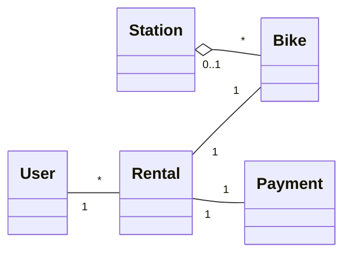

# W4 Demo Runbook — Bike-Sharing Class Diagram

Calibrated September 2026 with Claude Sonnet 5 (low effort), one run per prompt — live output varies; walk the defects that actually appear.

> Procedural script for the W4 lecture's live demo. **Not** a slidy deck — pandoc skips `*-demo.md` (filter installed during W1). Read end-to-end before running. Estimated runtime: 12-14 minutes inside the lecture's "Demo" segment.
>
> Spec reference: `docs/superpowers/specs/2026-05-29-amss-2026-w4-design.md` §4.
>
> This demo's artifact is a **rendered diagram**. The "aha" beat is *reading the structure against the domain* — classes that aren't domain concepts, meaningless associations, ids standing in for associations, missing whole-part.

## 0. Setup (pre-class, ~1 min)

- VS Code open on a repository containing the course settings from `tooling/template/` (see `class/amss-2026/tooling/SETUP.md`); demo runs in the **Claude Code panel** with those settings (Sonnet 5, low effort). Check with `/model` before class.
- A **Mermaid preview** open in VS Code (the built-in Markdown preview with the "Markdown Preview Mermaid Support" extension) — students must SEE the rendered diagram to critique multiplicity and associations; raw Mermaid text is not enough.
- Browser tab pre-opened to the fallback deck `class/amss-2026/curs/fallback/04-class-diagrams-fallback.html` (see §8) in case the live AI fails.
- The deck's "Demo" trigger slide is on screen.

## 1. Architect prompt #1 — verbatim

Paste this into the Claude Code panel (do **not** improvise):

> *"Generate a UML class diagram (as Mermaid) for the city bike-sharing app: users rent and return bicycles at stations across a city; payment is by app; staff rebalance bikes between stations."*

Render the result in the preview pane. **Time:** ~1 min to type, ~2-3 min for AI to generate + render.

## 2. Defect catalogue — pick 2-3 from the menu

Walk the rendered diagram aloud. Pick the **2-3 defects that actually appear**. The calibration draft was large (12 classes) and over-modelled: invented/implementation classes (#1) and ids standing in for associations (#3) are the most visible — anchor on whichever shows. Rental–Bike and User–Rental multiplicities came out *correct*; don't promise a many-to-many.

Dry run (September 2026), two fresh runs of prompt #1, both rendered: one reproduced the calibration picture (`MobileApp` with `User "1" --> "1" MobileApp : uses`, a `GeoLocation` class, `Dock` beside `Station` with *both* holding bikes, `Account` with `topUp()`, `Transfer "1" --> "2" Station`, and `Rental.startStation`/`endStation` attributes next to a `start/end at` line). The other was cleaner — 20 classes but no app class, only each class's *own* `id`, statuses as enums, `Dock "0..1" o-- "0..1" Bicycle` correct — so #1/#3/#5 barely showed and the visible defects were #6 (unrequested `PricingPlan`, a `PaymentMethod` hierarchy, `batteryLevel`) and the two rows marked "also seen in dry run" below.

| # | Defect | What to point at | Critique question |
|---|---|---|---|
| 1 | Implementation / invented class | `App` (the client software, not a domain concept), `GeoLocation` (a value type), `Dock` holding bikes *alongside* `Station` hosting them (two paths to the same fact) | *"Is this a domain concept or an implementation detail? Walk it back to the prompt. Where does a bike 'live' — in a Dock or a Station?"* |
| 2 | Fake / decorative association | `User "1" --> "1" App : uses`, `App --> Station : displays` | *"What domain fact does this line record? Does the business care that a user 'uses' an app?"* |
| 3 | Id attribute duplicating an association | `Bicycle.currentStationId` next to the Station–Bicycle line; `Rental.startStationId` next to "starts at"; `Rental.endStationId` with no line at all; `RebalancingTask.sourceStationId` / `destinationStationId` next to "between" | *"The diagram already says which station — why is the id stored again? Which one is true if they disagree?"* |
| 4 | Missing aggregation | `Station "1" --> "0..*" Bicycle : hosts` as a plain association | *"A station holds bikes — is that a plain link, or a whole-part? Why isn't it an aggregation?"* |
| 5 | Subtle multiplicity / role slip | Station end of Station–Bicycle is `"1"` — but a bike being ridden is at no station (should be `0..1`); `RebalancingTask --> "2" Station` loses which is source and which is destination | *"Read it aloud: 'every bike is at exactly one station.' Is that true mid-ride? Which of the two stations is the source?"* |
| 6 | Unrequested scope / weak types | `Account` with `balance` and `topUp()` (prompt says only "payment is by app"), `MaintenanceRecord`, `batteryLevel`; every `status`/`type` a `String` | *"Which requirement asked for this? And what values can `status` take — why isn't it an enum?"* |
| 7 | Same fact recorded twice (also seen in dry run) | Enumerations drawn as classes *and* linked by an association while also being attribute types (`Bicycle.type : BikeType` plus `Bicycle --> BikeType`; likewise `StaffRole`, `DockStatus`); `RebalanceTask.bikeCount` next to `moves "1..*" Bicycle`; `Station.capacity` next to its composed `Dock`s | *"Two places on the diagram say the same thing — which one is true when they disagree?"* |
| 8 | Questionable whole-part (also seen in dry run) | `City "1" *-- "many" Station` as a composition; `Member o-- PaymentMethod` | *"The filled diamond says the stations die with the city record. Is that the domain?"* |

Older/weaker models classically drew `Rental "*" -- "*" Bike` or a god class with a `DatabaseManager`; the deck keeps those as teaching examples, but this setting did not produce them.

If the diagram is suspiciously clean → jump to §7 "Make-it-fail reserve".

## 3. Critique walkthrough (~5 min)

Walk the chosen 2-3 defects against the rendered diagram. Ask the room first ("does anything look wrong with this structure?") before delivering the critique. Name the move explicitly the first time:

> *"That's the **critic** half — reading the diagram AI drew and asking 'does this structure match the domain?' Next is the **architect** half — I re-prompt with the domain constraints it missed."*

Slow down here — this is the F1 skill in action.

## 4. Architect prompt #2 — constructed live (constraint scaffold)

Type this into the Claude Code panel:

> *"Revise the class diagram. Drop any class that's an implementation detail rather than a domain concept — keep only domain classes. Make the Station–Bike relationship an aggregation (a station holds bikes); a bike being ridden is at no station, so fix that multiplicity. Replace every attribute that stores another object's id with an association."*

Naming the domain rules is the pivot. Re-render. **Time:** ~1 min to type, ~2-3 min for AI to revise + render.

**Critique beat — re-check the revision, don't trust the summary.** Read the model's change list against the new render, item by item. In calibration (an earlier wording of this prompt that also asked to "fix the multiplicities" of Rental) the follow-up **claimed a multiplicity fix it never made**, drew the station end as `"1"` instead of `0..1`, kept `Station.availableDocks` after deleting `Dock`, and left `sourceStationId`/`destinationStationId` on `RebalancingTask`.

Dry run (September 2026) of this wording: it did what was asked — `Dock`/`DockStatus` gone, `Station "0..1" o-- "*" Bicycle` exactly as the §5 reference, rendered cleanly in ~15 s — and made no false claim, though "no attribute now holds another object's id" was vacuous (that draft had only each class's own `id`, which it deleted anyway). The re-check is then about **what it changed without being asked, or without saying**:

- It deleted `PaymentMethod`/`CreditCard`/`DigitalWallet` as "a payment-gateway concern" — "payment is by app" is no longer in the model. *"Does the business care how a rider pays? Domain or implementation?"*
- The enum classes vanished from the drawing but `BikeType`, `BikeStatus`, `StaffRole`, `PaymentStatus`, `TaskStatus` are still used as attribute types — while `RentalStatus` disappeared together with `Rental.status`, not in its change list.
- A new `Member "1" --> "*" Payment : pays` duplicates the path Member → Rental → Payment (defect #7 again, freshly introduced).
- `bikeCount` still sits next to `moves "1..*" Bicycle`; `City` composition silently became aggregation.

Ask the room: *"It says it did X — show me where. What did it change that it didn't mention?"* If the live run instead repeats the calibration's false claim, use that. Use the leftovers as the lead-in to §5. (Keep it inside the revise + render window — it does not extend the demo.)

## 5. Reference solution (instructor's verified render target)

The live AI output varies. This is the **dry-run-verified** reference the instructor confirms renders before delivery (spec gate §6.5) — the tightened domain model the critique converges toward:

Correct multiplicities (a rental is one bike, one user, one payment; a bike is at most at one station, none while ridden), Station–Bike as an aggregation, only domain classes, no id attributes. If the live output reaches something like this after prompt #2, the loop worked.

## 6. Recap (~1 min)

> *"One architect-critic cycle on a class diagram. The first pass drew everything plausible-looking; the critic half read the structure against the domain and found classes that aren't domain concepts, ids duplicating associations and a missing aggregation; the architect half re-prompted with the domain constraints — the second pass tightened, and we re-checked it instead of believing its change list. Reading a diagram against its domain is exactly the F1 skill the oral defense checks, and the loop is what Lab 2 asks you to do this week."*

Point back to the F1 anchor slide.

## 7. Make-it-fail reserve — AI produces a clean diagram

If AI's first diagram is suspiciously clean (low probability — in calibration the first draft over-modelled at 12 classes, and both dry-run drafts at 12 and 20), restore the critique surface:

> *"Now expand this into a complete enterprise architecture with all supporting subsystems — keep it a single Mermaid class diagram, no namespaces."*

(Revised after dry run; the revised wording was re-run once: ~38 s, a single class diagram of ~67 classes with no namespaces, renders — dense, so zoom and walk one area at a time.) Dry run (September 2026) of the original wording, which ended at "subsystems": the model left the class diagram behind. In ~26 s it answered with a layered `flowchart` (client channels, API gateway, Kafka event bus, Redis, machine-learning demand forecasting, IoT gateway, external providers — rendered fine) plus a 35-class `classDiagram` grouped in `namespace` blocks. That second diagram **did not render** — not a syntax error but a Mermaid layout crash ("Could not find a suitable point for the given distance") caused by multiplicity labels on edges between namespaces; dropping either the namespaces or the multiplicities makes it render. In the preview that is an error box where the class diagram should be, which loses the class-level critique on a class-diagram lecture — hence the added clause. Its content was worth critiquing: every class carries its own `…Id`, attributes are untyped, `Transfer "*" --> "2" Station` again loses source vs destination, `User "*" --> "*" Role`, `Admin --|> Staff`, and whole subsystems (`FraudAlert`, `DemandForecast`, `Promotion`, `Subscription`, `Vehicle`) no requirement asks for.

Expect more invented infrastructure and over-modelling; a god class is less likely with current models, so don't promise one. If the live reply still uses namespaces and the preview errors, don't debug on stage — walk the invented subsystems from the text, or fall back to the fallback deck's slides "AI's answer — the enterprise diagram" and "Zoom — lines from its Mermaid source" (§8). If even that is clean, walk the captured deck.

## 8. Fallback path — live AI fails

If the live AI fails (no response after 20s, network down, garbage output), switch to the fallback deck `curs/fallback/04-class-diagrams-fallback.html` (present it in the browser: diagrams at full width; `.pdf` alongside, vector — zoom in). Captured September 2026 with the course setting (Claude Code, Sonnet 5, low effort, fresh session); the slide notes say what to point at, by catalogue number:

- "AI's answer — the diagram" — cycle-1 diagram (first attempt): `Dock` beside `Station` (#1), status enums both as attribute types and as linked classes (#7), `PricingPlan`/`PaymentMethod` hierarchy/`batteryLevel` (#6).
- (walk the same defect catalogue against it; "AI's answer — what it said" has its prose)
- "AI's answer — the revised diagram" and "AI's answer — its change list" — after prompt #2 in the same session (first attempt): the aggregation and `0..1` done; for the re-check, `Member.plan` silently swapped for `PricingPlan`, enum types left undefined, `Staff.role` regressed to `String`.
- "AI's answer — the enterprise diagram" + "Zoom — lines from its Mermaid source" — the §7 reserve after a fresh prompt #1 (first attempt): 61 classes, renders.

Acknowledge briefly ("the model is having a moment — here's the dry-run capture") and continue. The pedagogical content is identical.

## 9. Time budget reconciliation

| Beat | Duration |
|---|---|
| Prompt #1 typed | ~1 min |
| AI generates + render | ~2-3 min |
| Critique walkthrough | ~5 min |
| Prompt #2 typed | ~1 min |
| AI revises + render | ~2-3 min |
| Recap | ~1 min |
| **Total** | **12-14 min** |

If ahead of schedule, do not pad — use generation/render pauses to predict aloud what the diagram should show before it appears, then take 1-2 questions.

## 10. Lab 2 synergy & fallback assets

This demo is the forerunner of Lab 2's drill (this week's lab): drive AI to a class diagram from a 1-page spec, iterate at least twice, keep a critique log (1 page max). The runbook's prompt #2 (domain-constraint scaffold) is the move Lab 2's critique log documents, and §2's defect catalogue is the vocabulary it uses.

Fallback assets: the instructor-only deck `curs/fallback/04-class-diagrams-fallback.md` (built with `make -C curs/fallback` into `.html` and `.pdf` next to the source, never published), captured September 2026 with the course setting — each capture on the first attempt:

- "AI's answer — the diagram" — cycle-1 diagram with ≥2 defects.
- "AI's answer — the revised diagram" — revised diagram after prompt #2, same session.
- "AI's answer — the enterprise diagram" — over-modelled "enterprise architecture" output (reserve).

When the course settings pinned in `tooling/template/` (model, effort) change, the dry-run reruns and the fallback deck is recaptured.
