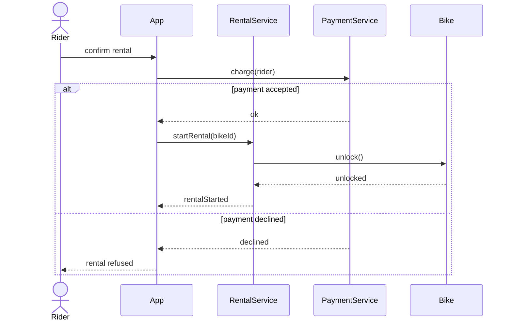

# W6 Demo Runbook — Bike-Sharing "Rent a Bike" Sequence

Calibrated September 2026 with Claude Sonnet 5 (low effort), one run per prompt — live output varies; walk the defects that actually appear.

> Procedural script for the W6 lecture's live demo. **Not** a slidy deck — pandoc skips `*-demo.md`. Read end-to-end before running. Estimated runtime: 12-14 minutes inside the lecture's "Demo" segment.
>
> Design reference: the master spec's W6 row (`docs/superpowers/specs/2026-05-01-amss-ai-redesign-design.md` §2) — "AI-generated sequences and where they fabricate messages."
>
> This demo's artifact is a **rendered sequence diagram**. The "aha" beat is *reading the messages against the responsibilities* — the absent failure path, and responsibilities hidden inside one opaque lifeline instead of the objects the class diagram names.

## 0. Setup (pre-class, ~1 min)

- VS Code open on a repository containing the course settings from `tooling/template/` (see `class/amss-2026/tooling/SETUP.md`); demo runs in the **Claude Code panel** with those settings (Sonnet 5, low effort). Check with `/model` before class.
- A **Mermaid preview** open in VS Code (the built-in Markdown preview with the "Markdown Preview Mermaid Support" extension) — students must SEE the rendered diagram to read message order and returns; raw Mermaid text is not enough.
- The W4 bike-sharing class diagram recallable (this sequence realises a use case over *those* objects — the cross-link in defect #3 needs it).
- Browser tab pre-opened to the fallback deck `class/amss-2026/curs/fallback/06-behavioral-i-fallback.html` (see §8) in case the live AI fails.
- The deck's "Demo" trigger slide is on screen.

## 1. Architect prompt #1 — verbatim

Paste this into the Claude Code panel (do **not** improvise):

> *"Generate a UML sequence diagram (as Mermaid) for renting a bike in the city bike-sharing app: a rider unlocks a bike at a station and is charged by app."*

Render the result in the preview pane. **Time:** ~1 min to type, ~2-3 min for AI to generate + render.

## 2. Defect catalogue — pick 2-3 from the menu

Walk the rendered diagram aloud. Pick the **2-3 defects that actually appear**. #1 (only the happy path) appeared in calibration. The calibration draft was otherwise tidy: returns present, order causal, no fabricated fraud/logging step — so the second critique target is *where the work went* (#2/#3), not invented messages.

Dry run (September 2026), two fresh runs of prompt #1 (~10 s each, both rendered): **#1 did not recur in its full form** — both drafts already had an `alt` for a declined payment authorisation (one also had invalid-account, bike-unavailable and failed-final-charge branches), but neither modelled the bike failing to unlock (one again only *offered* it in prose). #2, #3 and #5 recurred in both: `Backend->>Backend` self-calls for validation, "Create rental" and fare computation, no `Rental` lifeline, and the ride plus the return drawn although only renting was asked. So **anchor on #2/#3**, add #5, and use #1 in its partial form — *"which failures did it pick, and which did it leave out?"*

| # | Defect | What to point at | Critique question |
|---|---|---|---|
| 1 | Only the happy path | No `alt` anywhere — payment never declined, unlock never fails, bike never already taken; the closing prose even *offers* "a variant showing failure paths". Partial form (dry run): a payment-declined `alt` is present, but no branch for the bike failing to unlock — and the prose offers "a bike that fails to unlock" | *"What happens when the unlock fails? AI knows failure paths exist — it said so — so why aren't they on the diagram?"* |
| 2 | Opaque self-call hiding responsibilities | `Backend->>Backend: Validate rider account & payment method`, `Backend->>Backend: Calculate ride duration & fare` | *"Which object actually validates, and which computes the fare? A self-call on 'Backend' tells the reader nothing."* |
| 3 | Lifelines don't trace to the class diagram | `Backend Service`, `Payment Gateway` — but no `Rental` lifeline; no rental is ever created | *"Our class diagram has Rental and Payment. Where is the Rental created in this interaction? If it isn't, what did the ride update?"* |
| 4 | Unhandled charge after the ride | `Backend->>Payment: Charge rider (amount)` only at the end, answered only by `Payment confirmed`; before unlock the payment method is "validated" by a self-call. Dry run: a deposit is now pre-authorised before the unlock, but in one of two runs the final `charge` at return still had no failure branch | *"The ride is over and the bike docked — what if this charge is declined now? Should payment be authorised before the unlock?"* |
| 5 | Scope drift | The prompt asked for renting (unlock + charge); the diagram also models the ride and the return, and puts the charge there | *"Is 'return a bike' part of this use case, or a separate one? Which slice did we ask for?"* |

Older/weaker models classically added a fabricated `FraudDetector`/`Logger` call, an impossible order, a missing return or a `DatabaseManager` lifeline; the deck keeps those as teaching examples, but this setting did not produce them unprompted.

If the diagram is suspiciously complete → jump to §7 "Make-it-fail reserve".

## 3. Critique walkthrough (~5 min)

Walk the chosen 2-3 defects against the rendered diagram. Ask the room first ("does anything look wrong with this interaction?") before delivering the critique. Name the move explicitly the first time:

> *"That's the **critic** half — reading the conversation AI drew and asking 'does each message really happen?' Next is the **architect** half — I re-prompt with the responsibilities and the failure case it missed."*

Slow down here — this is the F1 skill in action, on behaviour.

## 4. Architect prompt #2 — constructed live (constraint scaffold)

Type this into the Claude Code panel:

> *"Revise the sequence. Model only renting — stop once the ride has started. Replace the Backend's self-calls with the domain objects from our class diagram: show which object creates the Rental and which one handles the Payment. Authorise payment before the unlock, and add alt fragments for payment declined and for the bike failing to unlock. Every call that returns a result must show its dashed return."*

Dry run (September 2026): it did everything asked, rendered cleanly in ~14 s, and its bullet claims held up on re-check — stops at `rentalStarted`; no self-calls; `Payment` authorises before the unlock; nested `alt`s for payment declined and bike fails to unlock (with an unrequested but sensible `cancelAuthorization` when the unlock fails); `RentalController` creates the `Rental` only after the unlock succeeds; a dashed return for every call. Still re-check each claim live — are both `alt` branches really there, does a `Rental` lifeline actually appear? Note its opener: *"I don't have your class diagram, so I guessed the domain objects"* — a fresh session has no "our class diagram" (the Week 5 missing-context point again). What to point at:

- `RentalController` is a controller, not a domain object, and `Account` isn't in our Week 4 diagram (we had `User`/`Member`) — the lifelines still don't trace to the structure (#3, weakened but alive).
- `canRent()` always answers `eligible` — no branch for an ineligible rider, so the failure paths are only the two we named.
- `Rental` is drawn as a lifeline from the top although it only comes into existence at the end (Mermaid's `create participant` would show the creation).

Naming the responsibilities and demanding the failure path is the pivot. Re-render. **Time:** ~1 min to type, ~2-3 min for AI to revise + render.

## 5. Reference solution (instructor's verified render target)

The live AI output varies. This is the **dry-run-verified** reference the instructor confirms renders before delivery — the corrected interaction the critique converges toward:

Real messages, correct order, returns present, the declined-payment branch modelled, the rental started by a named service rather than an opaque "Backend". (A live revision that also shows the unlock-failed branch goes beyond this reference — good.) If the live output reaches something like this after prompt #2, the loop worked.

## 6. Recap (~1 min)

> *"One architect-critic cycle on a sequence. The first pass drew a smooth-looking conversation; the critic half read it message by message and found no failure path and the real work hidden in one opaque 'Backend'; the architect half re-prompted with the responsibilities and the failure cases — and the second pass tightened. Reading an interaction against its responsibilities is exactly the F1 skill the oral defense checks, and it's the read-order Lab 4 will hand you in W8."*

Point back to the F1 anchor slide.

## 7. Make-it-fail reserve — AI produces a clean sequence

If AI's first sequence is suspiciously complete (the calibration draft had no failure path at all, but one of the two dry-run drafts had four failure branches — this reserve may well fire), restore the critique surface:

> *"Make this enterprise-grade with full observability, fraud checks, and audit logging."*

This invites messages no rental requirement justifies (fraud scoring, analytics, audit writes) and extra infrastructure lifelines — the deck's fabricated-message defect, produced on request. Ask the room which of them a requirement actually justifies.

Dry run (September 2026): the richest critique surface of the demo — ~25 s, rendered, 13 lifelines (API gateway, fraud service, payment provider, IoT gateway, event bus, audit log, observability) and ~110 lines with ALLOW/CHALLENGE/DENY fraud branches, retries and idempotency keys. It is tall: zoom and pick two or three tells rather than reading it all:

- **Messages no rental requirement justifies** — `RISK_DECISION` audit writes, bike telemetry streamed to fraud detection, `Obs-->>Obs: Evaluate SLOs`.
- **Notation misuse** — dashed return arrows for fire-and-forget telemetry (`GW-->>Obs: span api.unlock…`, `Fraud-->>Obs`) that answer no call.
- **A message from nowhere** — in the capture-failed branch `App-->>Rider: Payment pending`, although nothing ever told the App.
- **A branch that trails off** — CHALLENGE ends in a Note ("re-evaluated after step-up") and `verifyStepUp` never returns.
- **Scope drift again** — the ride and the return are back.

If even that is clean, fall back to the fallback deck's slides "AI's answer — the enterprise sequence", "Zoom — the fraud decision" and "Zoom — messages no requirement asked for" (§8) and walk the capture.

## 8. Fallback path — live AI fails

If the live AI fails (no response after 20s, network down, garbage output), switch to the fallback deck `curs/fallback/06-behavioral-i-fallback.html` (present it in the browser: diagrams at full width, scroll the tall ones; `.pdf` alongside, vector — zoom in). Captured September 2026 with the course setting (Claude Code, Sonnet 5, low effort, fresh session); the slide notes say what to point at, by catalogue number:

- "AI's answer — the sequence" — cycle-1 sequence (first attempt): `Backend->>Backend` self-calls and no `Rental` lifeline (#2/#3), ride and return drawn (#5), failure paths for ineligibility, declined authorisation and failed final charge but none for the unlock failing (#1, partial form). "AI's answer — what it said" has its prose.
- (walk the same defect catalogue against it)
- "AI's answer — the revised sequence" and "AI's answer — its change list" — after prompt #2 in the same session (first attempt): both requested `alt`s, authorise before unlock, `Station` creates the `Rental`; for the re-check, the ineligible-rider branch silently dropped, the `Rental` created before payment and drawn from the top, the "I couldn't see your class diagram" opener.
- "AI's answer — the enterprise sequence" + the two "Zoom" slides — the §7 reserve after a fresh prompt #1 (first attempt): 13 participants, renders; the DENY branch falls through to the payment, no ALLOW branch.

Acknowledge briefly ("the model is having a moment — here's the dry-run capture") and continue. The pedagogical content is identical.

## 9. Time budget reconciliation

| Beat | Duration |
|---|---|
| Prompt #1 typed | ~1 min |
| AI generates + render | ~2-3 min |
| Critique walkthrough | ~5 min |
| Prompt #2 typed | ~1 min |
| AI revises + render | ~2-3 min |
| Recap | ~1 min |
| **Total** | **12-14 min** |

If ahead of schedule, do not pad — use generation/render pauses to predict aloud what the next message should be before it appears, then take 1-2 questions.

## 10. Lab 4 synergy & fallback assets

This demo is the forerunner of Lab 4's behavioural defect hunt (W8): teams receive flawed behavioural artifacts (sequence, state, activity) and compete to spot the most defects with severity ratings. The §2 defect catalogue is the vocabulary; the deck's sequence read-order is the rubric. (This week's lab, Lab 3, is the *structural* hunt — W4-W5 content.)

Fallback assets: the instructor-only deck `curs/fallback/06-behavioral-i-fallback.md` (built with `make -C curs/fallback` into `.html` and `.pdf` next to the source, never published), captured September 2026 with the course setting — each capture on the first attempt:

- "AI's answer — the sequence" — cycle-1 sequence with responsibilities hidden in an opaque lifeline and no unlock-failure path.
- "AI's answer — the revised sequence" — revised sequence with both `alt` fragments, after prompt #2 in the same session.
- "AI's answer — the enterprise sequence" — over-instrumented "enterprise-grade" output (reserve).

When the course settings pinned in `tooling/template/` (model, effort) change, the dry-run reruns and the fallback deck is recaptured.
