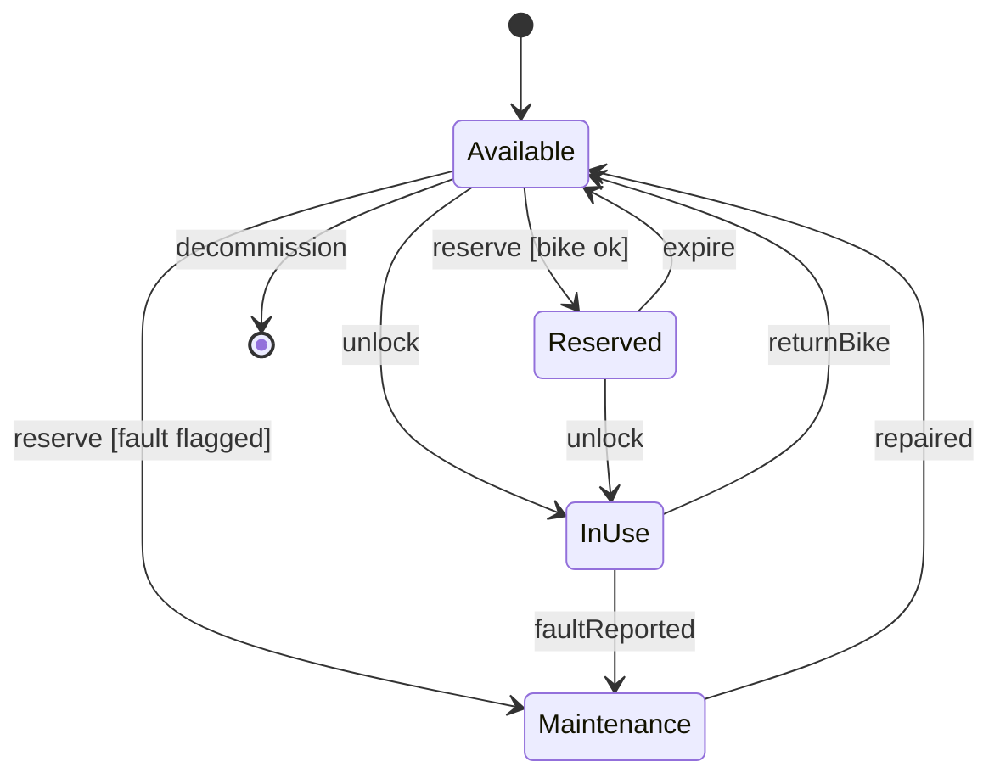

# W7 Demo Runbook — Bike State Machine

Calibrated September 2026 with Claude Sonnet 5 (low effort), one run per prompt — live output varies; walk the defects that actually appear.

> Procedural script for the W7 lecture's live opener. **Not** a slidy deck — pandoc skips `*-demo.md`. Read end-to-end before running. Estimated runtime: **~8 minutes** inside the lecture's "Demo" segment (an opener that seeds the gallery, not the whole payload).
>
> Design reference: the master spec's W7 row (`docs/superpowers/specs/2026-05-01-amss-ai-redesign-design.md` §2) — "AI failure modes (orphan states, unreachable transitions, missed guards)."
>
> This demo's artifact is a **rendered state machine**. The "aha" beat is *tracing the lifecycle against the domain* — the spec's classic failures (orphan states, dead ends, missed guards) plus the ones current models actually make: a transition the domain needs that nobody drew, a guard nobody can evaluate, a label that misuses the notation. It hands directly into the deck's defect gallery.
>
> **Calibration note:** at the course setting the first draft is near-reference on the classic defects — all four states reachable, initial and final present, the `returnBike` branch guarded. No orphan state appeared. The critique surface is subtler (see §2); §6's reserve is strengthened for a fully clean draft. Prompt #2 and the §6 reserve were dry-run in September 2026 (notes in §2, §4, §6); in those runs prompt #1 already drew the walk-up transition.

## 0. Setup (pre-class, ~1 min)

- VS Code open on a repository containing the course settings from `tooling/template/` (see `class/amss-2026/tooling/SETUP.md`); demo runs in the **Claude Code panel** with those settings (Sonnet 5, low effort). Check with `/model` before class.
- A **Mermaid preview** open in VS Code (the built-in Markdown preview with the "Markdown Preview Mermaid Support" extension) — students must SEE the rendered diagram to trace reachability; raw Mermaid text is not enough.
- The fallback deck `curs/fallback/07-behavioral-ii-fallback.pdf` open in the background in case the live AI fails (§7).
- The deck's "Demo" trigger slide is on screen.

## 1. Architect prompt #1 — verbatim

Paste this into the Claude Code panel (do **not** improvise):

> *"Generate a UML state machine diagram (as Mermaid) for a bike in the city bike-sharing app: it can be available, reserved, in use, and under maintenance."*

Render the result in the preview pane. **Time:** ~1 min to type, ~2 min for AI to generate + render.

## 2. Defect catalogue — pick the ones that appear

Trace the rendered diagram from the initial state. Pick the **2-3 defects that actually appear**. Run the classic reachability check first — at the calibrated setting it came out clean, and saying so ("every state is reachable and escapable — good") is itself the lesson: a clean structural check is where the critique *starts*, not ends. Then trace real rider journeys; anchor on the missing walk-up transition (#1).

Observed in calibration (Sonnet 5, low effort):

| # | Defect | What to point at | Critique question |
|---|---|---|---|
| 1 | Missing domain transition | No `Available --> InUse` — the only way into `InUse` is via `Reserved` | *"I walk up to a free bike and unlock it without reserving. Which transition is that? Trace it."* |
| 2 | Vague guard | `returnBike() [OK condition]` vs `[reported issue]` | *"Who evaluates 'OK condition'? Name the condition so a tester could check it."* |
| 3 | Notation misuse | `reservationExpired() / cancelReservation()` on one transition | *"In UML, `event / action` means 'on this event, do that action'. Did it mean two alternative events? Then it needs two transitions."* |
| 4 | Missing mid-ride fault | Faults only reported on return (or when idle); nothing leaves `InUse` for a fault during the ride | *"The chain snaps mid-ride. What state is the bike in, and how does the ride end?"* |
| 5 | Partial fault coverage | `flagForMaintenance()` only from `Available` — a reserved bike cannot be flagged | *"A reserved bike is found broken before pickup. Where does it go?"* |

Also seen in dry run (September 2026, two fresh runs of prompt #1): **both runs already drew the walk-up transition** (`Available --> InUse : unlock() [walk-up rental]` / `[no reservation]`) and a `Reserved --> UnderMaintenance` path, so #1 and #5 may not appear. What recurred: #3 (`cancel() / reservation expires`, `cancelReservation() / timeout`), #4 (faults only on `return()` / `dockBike()`), vague guards (`[OK]`). New in the dry run:

| # | Defect | What to point at | Critique question |
|---|---|---|---|
| 6 | Overlapping guards | `return() [docked at station]` and `return() [fault reported or damaged]` from `InUse` — a damaged bike that is docked satisfies both | *"The bike is docked *and* damaged. Which arrow fires? A state machine must not have to guess."* |
| 7 | Guard/action order and dead guards | `reportIssue() / dockBike() [fault detected]` (UML order is `event [guard] / action`); `unlock() [no reservation]` on `Available`, where no reservation can exist | *"Read the label in UML order. And can that guard ever be false in this state?"* |
| 8 | Missing final state | One run had no `[*]` end at all — no way to retire a bike | *"How does a bike ever leave the fleet?"* |

If #1 is absent, anchor on #4 (the mid-ride fault) instead, and credit the walk-up arrow aloud.

Classic defects older/weaker models produce (not observed here — check anyway, it takes ten seconds): orphan state with no transition in; dead-end non-final state; two transitions on one event with no guards; no `[*]` start or end.

If the diagram is clean on all of the above → jump to §6 "Make-it-fail reserve".

## 3. Critique walkthrough (~3 min)

Trace the chosen 2-3 defects from the initial state. Ask the room first ("can a bike reach every state here? — now: can a rider do everything a rider really does?") before delivering the critique. Name the move explicitly:

> *"That's the **critic** half — tracing the lifecycle AI drew, first for reachability, then against real journeys: walk-up rental, a fault mid-ride. Next is the **architect** half — I re-prompt with the missing transitions and concrete guards."*

This is the F1 skill on lifecycles — the same thing Lab 4 grades next week.

## 4. Architect prompt #2 — constructed live (constraint scaffold)

Type this into the Claude Code panel:

> *"Revise the state machine. A rider can also unlock an available bike without reserving it. A fault can be reported during a ride, and a reserved bike can be flagged as faulty before pickup. Replace vague guards with conditions a tester could check, and use one transition per event — `event / action` means an action, not an alternative event. Keep an initial and a final state."*

Naming the missing journeys is the pivot. Re-render. **Time:** ~1 min to type, ~2 min for AI to revise + render.

**Critique beat — re-check the revision, don't trust the summary.** Dry run (September 2026, this prompt, ~17 s, rendered): every request was applied and the "What changed" summary was accurate — no false fix claims. `cancel()` and `reservationTimeout()` split into two transitions, guards became checkable (`faultFlag == false`, `now < reservation.expiresAt`), walk-up and reserved-bike faults wired, initial and final kept. What it newly got wrong, and what to point at:

- **Mid-ride fault as a self-transition.** `InUse --> InUse : reportFault() / setFaultFlag()` — the bike stays in use until docked, then `return()` splits on `faultFlag`. Ask: *"The chain snaps. Can the rider even reach a dock? Where does the rental end if they can't?"*
- **Trigger on the initial transition.** `[*] --> Available : register() / dockAtStation()` — in UML the transition out of the initial pseudostate takes no trigger (at most an action). The summary even calls `[*]` "the initial state".
- **Dead and redundant guards.** `faultFlag == false` on `Available`'s exits can never be false (a faulty bike is already in `UnderMaintenance`); `reservationTimeout() [now >= reservation.expiresAt]` repeats its event.
- **Non-UML action lists.** `setFaultFlag() and createWorkOrder()` — UML sequences actions with `;`.

Across settings, follow-ups sometimes claim fixes that were not made. Tick each request against the new render, aloud: *"It says walk-up is added — show me the arrow."* Then ask the chain-snaps question. The revised diagram is dense (13 transitions with long labels) — zoom the preview before tracing.

## 5. Reference solution (instructor's verified render target)

The live AI output varies. This is the **dry-run-verified** reference the instructor confirms renders before delivery — the corrected lifecycle the critique converges toward:

Every state reachable and escapable, walk-up rental and a mid-ride fault covered, the reserve branch guarded, initial and final present. If the live output reaches something like this after prompt #2, the loop worked. Pivot straight into the deck's defect gallery — the live defects map to gallery defect #6 (missing domain transition — or the mid-ride fault, if walk-up was already drawn) and the guard discussion of defect #3; the classic orphan/dead-end entries (#1, #2) are what the structural check you just ran would have caught.

## 6. Make-it-fail reserve — AI produces a clean state machine

The calibrated first draft was near-reference on structure, so a fully clean draft (walk-up present, mid-ride fault present, concrete guards) is a real possibility. Restore the critique surface by growing the state space — wiring errors scale with the number of states:

> *"Add all the edge-case states: lost, stolen, reserved-but-expired, charging, low-battery. Model 'in use' as a composite state with Riding and Paused substates."*

Dry run (September 2026, ~12 s, rendered): a rich surface — 10 states, ~35 transitions, a render dense enough that you must zoom and trace one question at a time (a capture is in the fallback deck, slide "Reserve — the diagram"). What it yielded, in order of teaching value:

- **Low battery overlapping `InUse`.** `InUse --> LowBattery : batteryLevel < critical` — the rental silently ends mid-ride. *"The battery dips on the way home. Is the rider still renting?"*
- **Lost exit paths.** `Decommissioned` is reachable only from `Lost` / `Stolen`; the turn-1 `UnderMaintenance` had no retire path and still has none. *"An unrepairable bike — how does it leave the fleet?"*
- **Partial coverage.** `tamperAlert` leaves `Available`, `Reserved`, `InUse` but not `LowBattery`, `Charging`, `UnderMaintenance`; nothing takes a `Reserved` bike to `LowBattery`.
- **Notation.** `tamperAlert / geofenceBreach [unauthorized movement]` repeats the `/`-as-alternative misuse with the guard after the action; change events written as bare conditions (`batteryLevel < threshold`, UML: `when(...)`); overlapping `dockBike()` guards (`[battery low]` vs `[fault reported]`).
- **Redundancy the model admits.** `Paused --> Lost` duplicates `InUse --> Lost` — a good "does the boundary transition cover substates?" check.

Pick 2-3; the low-battery overlap is the anchor. If a reserve run is clean, praise it briefly and walk the reserve capture in the §7 fallback deck — the gallery carries the classic defects.

## 7. Fallback path — live AI fails

If the live AI fails (no response after 20s, network down, garbage output), switch to the fallback deck `curs/fallback/07-behavioral-ii-fallback.pdf` (or `.html`) — real runs of this runbook's prompts, captured September 2026 with the course setting (Claude Code, Sonnet 5, low effort); each chain was good on the first attempt. Speaker notes carry the catalogue numbers to point at.

- Slide "AI's answer — the diagram" — cycle-1 state machine. In this capture walk-up is already drawn; it shows #4 (fault only on return — the AI even says so), #6 (overlapping `return()` guards), #3 (`cancel() / reservation timeout`) and a vague guard.
- (walk the same defect catalogue against it)
- Slide "AI's revision — the diagram" — the revision after prompt #2 (mid-ride fault as a self-transition, trigger on the initial transition, comma action lists).
- Slide "Reserve — the diagram" — the §6 edge-case reserve (slash-as-alternative, bare change events, overlapping guards, partial `theftReported()` coverage).

Acknowledge briefly ("the model is having a moment — here's the dry-run capture") and continue. The pedagogical content is identical.

## 8. Time budget reconciliation

| Beat | Duration |
|---|---|
| Prompt #1 typed | ~1 min |
| AI generates + render | ~2 min |
| Critique walkthrough | ~2.5 min |
| Prompt #2 typed + AI revises + render | ~2 min |
| Re-check the revision against the requests | ~0.5 min |
| **Total** | **~8 min** |

This is an opener, not the whole demo — keep it tight and hand into the gallery. If ahead of schedule, do not pad; ask the room to name a real rider journey before tracing it.

## 9. Lab 4 synergy & fallback assets

This demo is a forerunner of Lab 4 (next week, W8): a team defect hunt on flawed behavioural artifacts (sequence, state, activity). The §2 defect catalogue (observed plus classic) is the vocabulary; the deck's behaviour read-order is the rubric.

Fallback assets — the deck `curs/fallback/07-behavioral-ii-fallback.md` (built to `.pdf` / `.html` next to it by `make -C curs/fallback`; never published), captured September 2026 with the course setting, one attempt per chain:

- "AI's answer — the diagram" / "— what it said" — prompt #1 (same session as the revision).
- "AI's revision — the diagram" / "— what it said" — after prompt #2.
- "Reserve — the diagram" / "— what it said" — the §6 reserve, in a fresh session after its own prompt #1.

When the course model setting changes (`tooling/template/`), rerun the captures and rebuild the deck.
