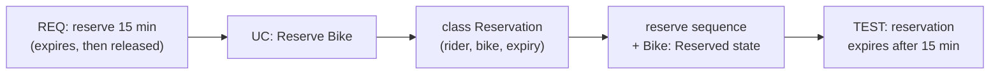

# W10 Demo Runbook — Trace a New Feature

Calibrated September 2026 with Claude Sonnet 5 (low effort), one run per prompt — live output varies; walk the defects that actually appear.

> Procedural script for the W10 lecture's live opener. **Not** a slidy deck — pandoc skips `*-demo.md`. Read end-to-end before running. Estimated runtime: **~8 minutes** inside the lecture's "Demo" segment (an opener that seeds the gallery, not the whole payload).
>
> Design reference: the master spec's W10 row (`docs/superpowers/specs/2026-05-01-amss-ai-redesign-design.md` §2) — "critique exercises (find broken links)."
>
> This demo's artifact is **AI's full trace for one feature** (requirement, use case, class, sequence, test). The "aha" beat is *walking the chain* — does every layer agree, does the test check exactly what the requirement states, does anything appear that no requirement asked for?

## 0. Setup (pre-class, ~1 min)

- VS Code open on a repository containing the course settings (`tooling/template/` copied in — see `class/amss-2026/tooling/SETUP.md`), the **Claude Code panel** open and signed in; `/model` shows **Sonnet 5, low effort**.
- The Claude Code panel visible — the artifact is a multi-layer text answer; a Mermaid preview (VS Code's Markdown preview with the "Markdown Preview Mermaid Support" extension) helps for the sequence/class but is not essential.
- The fallback deck `curs/fallback/10-traceability-fallback.html` (or `.pdf`) open in a browser tab in case the live AI fails (§7).
- The deck's "Demo" trigger slide is on screen.

## 1. Architect prompt #1 — verbatim

Paste this into the Claude Code panel (do **not** improvise):

> *"For a new feature — a rider can reserve a bike for 15 minutes before pickup — give me the requirement, the use case, the class changes, the sequence, and a test."*

Read the five layers aloud. **Time:** ~1 min to type, ~2 min for AI to respond.

## 2. Defect catalogue — pick the ones that appear

Walk the chain requirement-to-test, then test-to-requirement. Pick the **2-3 defects that actually appear**. In calibration the 15-minute value was consistent in every layer (no drift) — the breaks were **dangling links** (#1 below) and **requirement clauses with no test** (#2). Anchor on those. The September 2026 dry run (two fresh runs of this prompt) reproduced #1, #2 and #5 both times; #3, #4 and #6 appeared in one run only.

| # | Defect | What to point at | Critique question |
|---|---|---|---|
| 1 | Dangling link (observed; also seen in dry run) | the sequence calls `Bike.setStatus(...)` / `checkStatus()`, the test calls `service.setClock(...)`, `new ReservationService(clock)`, `ReservationExpiredException` — none declared in the class changes; `Rider` is used everywhere but never introduced. Dry run: `Rider`, `Clock`, `repo.save(...)`, `InMemoryReservationRepository`, the exceptions `BikeUnavailable` / `AlreadyReserved`, and a sequence step "bike -> IN_USE" with no operation behind it | *"This message points at an operation that doesn't exist. Add it to the class, or fix the message."* |
| 2 | Orphan requirement clause (observed; also seen in dry run) | the requirement says "unavailable to other riders" and the use case has a cancel flow — the single test covers only expiry. Dry run: cancel and "a non-holder cannot unlock" appear only under "further tests to add" | *"Walk each clause forward — where's the test for 'unavailable to other riders'? For cancel?"* |
| 3 | Requirement not realised in the behaviour (observed; in one of the two dry runs — the other declared a holder check in `RentalService.unlock`) | `fulfillReservation(reservationId)` takes no rider — nothing in the sequence checks the unlocker is the rider who reserved; `Bike.unlock(rider)` is declared but never called | *"Show me the link that enforces 'unavailable to other riders'. Which message does it?"* |
| 4 | Duplicated responsibility (observed) | `Bike.reserve(rider)` and `ReservationService.createReservation(...)` both claim the same job; the sequence uses only the service | *"Two classes own 'reserve'. Which one does the sequence use — and why does the other exist?"* |
| 5 | Orphan artifact / gold-plating (observed; also seen in dry run) | `ReservationExpiryScheduler`, the "notify rider" message on expiry, the countdown — no requirement asked for them. Dry run added "at most one reservation per rider" as a requirement of its own | *"Walk this back — which requirement needs it? If none, why is it here?"* |
| 6 | Test mismatch (mild, observed; in one of the two dry runs — the other tested 14:59 and exactly 15:00) | the test asserts an exception on fulfil-after-expiry (the requirement says "returns to the pool"); it tests 15 min **+1 s** but not the boundary at exactly 15:00 | *"Does this test verify exactly what the requirement says — no more, no less? What happens at 15:00 sharp?"* |
| 7 | Message to the wrong lifeline (also seen in dry run) | the ASCII sequence draws "create Reservation" and "reservation.fulfill()" as arrows ending on the `ExpiryScheduler` lifeline | *"Who receives this message? Is that object the one that owns the operation?"* |

Also note: in calibration and in the dry run (no repository instruction files) the class and sequence came as pseudo-code / ASCII art, not diagrams. With the course `AGENTS.md` present, expect Mermaid; if you still get pseudo-code, that is itself a critique point (*"is this a UML sequence diagram?"*).

Drift of the 15-minute value between layers is the classic trace failure (older/weaker models produce it) — the deck's gallery covers it; do not promise it live. If the trace is suspiciously consistent → jump to §6 "Make-it-fail reserve".

## 3. Critique walkthrough (~3 min)

Walk the chosen 2-3 defects along the chain. Ask the room first ("every message in the sequence — is its operation in the class changes?"; "which clause of the requirement does the test check?") before delivering the critique. If they check the 15 minutes first, confirm it is consistent — a trace can agree on the headline number and still break at the joins. Name the move explicitly:

> *"That's the **critic** half — walking the trace AI built and checking the links hold, not the artifacts in isolation. Next is the **architect** half — I re-prompt to make the layers consistent."*

This is the F4 skill: the chain, not the node.

## 4. Architect prompt #2 — constructed live (constraint scaffold)

Type this into the Claude Code panel:

> *"Make the layers consistent: every operation the sequence or the test calls must be declared in the class changes, including Rider; every clause of the requirement — expiry, 'unavailable to other riders', cancel — must have a test; only the rider who reserved may unlock; drop anything no requirement asked for. Then list the trace links: requirement -> use case -> class -> sequence -> test."*

Demanding the explicit links is the pivot. Re-walk the revision rather than trusting its link list: check that each newly declared operation is actually the one the sequence calls, and that the new tests really exercise the clauses they claim. Re-read. **Time:** ~1 min to type, ~2 min for AI to revise.

**Dry run (September 2026):** prompt #2 did what it asked. It declared `Rider`, `Clock`, the constructors and both exceptions ("every operation used in section 4 or 5 is declared here" — nearly true); wrote one test per clause (reserve, other rider cannot reserve, other rider cannot unlock, holder unlock completes, cancel frees, expiry at 14:59 vs exactly 15:00); enforced holder-only unlock; dropped the scheduler, the repository, the one-per-rider rule and the `RESERVED` bike state; and produced a requirement -> use case -> class -> sequence -> test table. It also honestly flagged two open gaps (any rider may unlock an unreserved bike; nobody checks who cancels). The answer is long (~50 s to generate) — do not read it all: read the trace table and spot-check two rows. What to point at in the re-check:

- **Over-pruning (the teachable regression).** "Drop anything no requirement asked for" also removed the availability check and the `RESERVED` state. `reserve` now checks only for an active reservation, so a rider can reserve a bike that is **in use** by someone else; and a reserved bike still reports `status == AVAILABLE` — its own test asserts that. *"Did the fix respect the requirement, or just the letter of my prompt?"*
- **Hidden state, not a declared link.** The reserve sequence creates the `Reservation` but never stores it; `activeFor(bike)` then reads "the stored reservation". No attribute or operation holds it — a dangling link the "everything is declared" claim hides.
- **Vacuous trace link.** Expiry's "sequence D" is "no messages: time passes". Is a sequence with no messages a realisation of the requirement, or a gap with a label?
- Smaller: `ReservationStatus` is used by the tests but never declared as a type; tests say `is_active` / `expires_at` while the class says `isActive` / `expiresAt`; `cancel` has no guard, so cancelling a completed reservation mid-ride is allowed; it rewrote the requirement into R1-R5 (promoting "only the holder may unlock" into R3) — ask who approved the new requirement.
- Still pseudo-code, not UML — same point as §2.

## 5. Reference solution (instructor's verified target)

The live AI output varies. This is the **dry-run-verified** reference the instructor confirms before delivery — the consistent trace the critique converges toward:

Every layer encodes the 15-minute expiry; the test checks exactly that; nothing extra appears. If the live output reaches a consistent chain like this after prompt #2, the loop worked. Pivot into the deck's gallery — the dangling links you saw are defect #3 of that gallery, the untested clauses are defect #1.

## 6. Make-it-fail reserve — AI produces a consistent trace first try

If AI's first trace is fully consistent (unlikely — the calibration run had four broken-link defects, though no value drift), restore the critique surface:

> *"Now add loyalty points, surge pricing, and fraud detection to this feature."*

**Dry run (September 2026):** it works — a rich critique surface in ~25 s (turn 1 of that run was itself already broken, with defects #1, #2, #5, #6 and #7). It wrote new requirements, a revised use case, five new service/value classes, a sequence and five Java tests, and broke the chain in exactly the ways the lecture names:

- **Orphan concept:** loyalty redemption is "against the reservation fee" — no requirement ever said reservations cost anything.
- **Layers disagree:** the use case says the fee is still charged on expiry, while its own open questions ask *whether* it should be.
- **Test checks something else:** surge pricing locks "the reservation fee and trip rate", but the test asserts the trip rate equals the *reservation quote* total — fee and trip rate conflated.
- **Assumptions baked into tests:** the 3.0x surge cap and "3 expiries -> block" are listed as "to confirm" / open questions, yet hard-coded in the tests.
- **Orphan requirement clause:** the fraud "medium score requires extra verification" path has no operation, no sequence step and no test.
- **Dangling links:** tests call `demand.setSurge`, `tripRepo`, `loyalty.seed` / `balance`, `RiderBlockedException`; the sequence still calls `Bike.checkStatus`, which no class declares.
- The original 15-minute tests are silently dropped from the new test list.

Pick two (the fee and the fraud-review path are the quickest to show). If even that is clean, fall back to the §7 fallback deck's "Reserve —" slides and walk the capture.

## 7. Fallback path — live AI fails

If the live AI fails (no response after 20s, network down, garbage output), switch to the fallback deck `curs/fallback/10-traceability-fallback.html` (present it in the browser; `.pdf` alongside, vector — zoom into the sequences). Captured September 2026 with the course setting (Claude Code, Sonnet 5, low effort, fresh session); the slide notes say what to point at, by catalogue number:

- "AI's answer — requirements and use case", "— class changes", "— the sequence", "— the tests" — the cycle-1 trace (prompt #1 + #2 chain took 2 attempts: the first drew the class changes and the sequence only as ASCII art, no Mermaid). Dangling links (#1: `reserve(riderId, bikeId)` called with objects, `tripService`, the exceptions and `repo.save` never declared), the untested cancel clause the AI claims is covered (#2), gold-plating — one-per-rider rule, countdown, expiry job (#5), "convert reservation" sent to the service instead of `Reservation` (#7). Credit: the 15:00 boundary is tested.
- (walk the same defect catalogue along the chain)
- "Revised — requirements and class changes", "Revised — the sequence", "Revised — the trace links" — after prompt #2 in the same session. For the re-check: constructors still undeclared behind an "every operation is declared" claim, the expiry branch has no trigger, the holder check is a note rather than a guard, `isDue` listed but never called, R2 rewritten; credit its honest open question (late unlock before `expireDue()` runs).
- "Make-it-fail reserve" and the "Reserve —" slides — §6 reserve after a fresh prompt #1 (first attempt): the fee nobody asked for, untested fraud rules, hard-coded thresholds, the holder check silently dropped from unlock, a test named for "expired and cancelled" that never cancels.

Acknowledge briefly ("the model is having a moment — here's the dry-run capture") and continue. The pedagogical content is identical.

## 8. Time budget reconciliation

| Beat | Duration |
|---|---|
| Prompt #1 typed | ~1 min |
| AI responds | ~2 min |
| Critique walkthrough | ~3 min |
| Prompt #2 typed + AI revises | ~2 min |
| **Total** | **~8 min** |

This is an opener, not the whole demo — keep it tight and hand into the gallery. If ahead of schedule, do not pad; have the room walk the trace backward (test to requirement) and predict where it breaks.

## 9. Checkpoint synergy & fallback assets

This demo is the rehearsal for **Lab 5** this week — the project checkpoint defense, where each student walks **their own** project's trace. The §2 defect catalogue is exactly what examiners probe; the deck's audit order is the rubric. Tell students: run this audit on their own trace before the checkpoint.

Fallback assets: the instructor-only deck `curs/fallback/10-traceability-fallback.md` (built with `make -C curs/fallback` into `.html` and `.pdf` next to the source, never published), captured September 2026 with the course setting:

- "AI's answer — …" slides — cycle-1 trace with dangling links + untested clause (2 attempts: the first had no Mermaid).
- "Revised — …" slides — the repaired trace after prompt #2, same session (same chain).
- "Make-it-fail reserve" + "Reserve — …" slides — the gold-plated trace from the reserve prompt (first attempt).

When the course settings change (model or effort in `tooling/template/`), the dry-run reruns and the fallback deck is recaptured.
