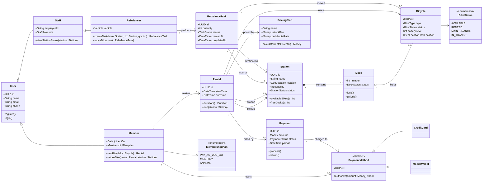
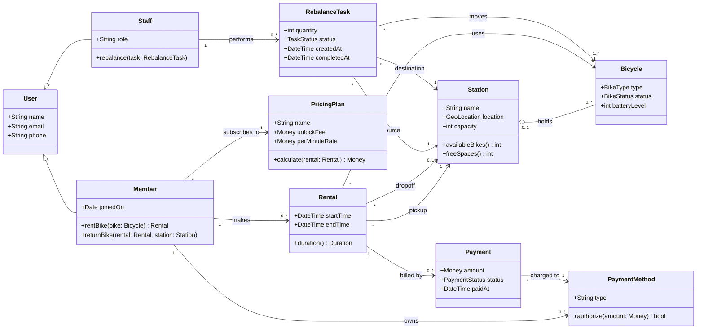

```mermaid
classDiagram
    direction TB

    %% ===== Identity and access =====
    class Account {
        <<abstract>>
        +String accountId
        +String email
        +String phone
        +String passwordHash
        +AccountStatus status
        +DateTime createdAt
        +authenticate(credentials) Session
        +deactivate()
    }
    class User {
        +String name
        +String locale
        +bool kycVerified
        +register()
        +rentBike(bike: Bicycle) Rental
        +returnBike(rental: Rental, dock: Dock)
    }
    class Staff {
        +String employeeId
        +String name
        +startShift(shift: Shift)
    }
    class Role {
        +String roleId
        +String name
    }
    class Permission {
        +String code
        +String description
    }
    class Session {
        +String token
        +DateTime expiresAt
        +String deviceId
        +isValid() bool
    }
    class AuditLog {
        +String entryId
        +String action
        +String entityRef
        +DateTime timestamp
    }

    %% ===== Geography =====
    class Location {
        +double latitude
        +double longitude
    }
    class City {
        +String cityId
        +String name
        +String timezone
        +String currency
    }
    class Zone {
        +String zoneId
        +String name
        +ZoneType type
        +Polygon boundary
        +contains(loc: Location) bool
    }

    %% ===== Fleet and stations =====
    class Station {
        +String stationId
        +String name
        +int capacity
        +StationStatus status
        +availableBikes() int
        +freeDocks() int
    }
    class Dock {
        +String dockId
        +DockStatus status
        +lock()
        +unlock()
    }
    class Bicycle {
        +String bikeId
        +BikeType type
        +BikeStatus status
        +int batteryLevel
        +DateTime lastServiceAt
    }
    class BikeModel {
        +String modelId
        +String manufacturer
        +bool electric
        +int batteryCapacityWh
    }
    class IoTDevice {
        +String deviceId
        +String firmwareVersion
        +DateTime lastSeen
        +sendCommand(cmd: String)
    }
    class TelemetryReading {
        +DateTime timestamp
        +Location position
        +int batteryLevel
        +double speedKmh
    }
    class Reservation {
        +String reservationId
        +DateTime expiresAt
        +ReservationStatus status
        +cancel()
    }

    %% ===== Rentals =====
    class Rental {
        +String rentalId
        +DateTime startTime
        +DateTime endTime
        +double distanceKm
        +RentalStatus status
        +start()
        +end()
        +calculateCost() Money
    }
    class Trip {
        +List~Location~ route
        +double avgSpeedKmh
    }

    %% ===== Pricing and billing =====
    class PricingPlan {
        +String planId
        +Money unlockFee
        +Money perMinuteRate
        +price(rental: Rental) Money
    }
    class Subscription {
        +String subscriptionId
        +DateTime validFrom
        +DateTime validTo
        +int freeMinutesPerRide
        +bool autoRenew
    }
    class Promotion {
        +String code
        +double discountPercent
        +DateTime validTo
        +apply(amount: Money) Money
    }
    class Invoice {
        +String invoiceId
        +Money total
        +Money tax
        +DateTime issuedAt
        +InvoiceStatus status
    }
    class InvoiceLine {
        +String description
        +Money amount
    }

    %% ===== Payments =====
    class Payment {
        +String paymentId
        +Money amount
        +DateTime timestamp
        +PaymentStatus status
        +process()
        +refund()
    }
    class PaymentMethod {
        <<abstract>>
        +String methodId
        +authorize(amount: Money) bool
    }
    class CreditCard {
        +String tokenizedPan
        +String expiry
    }
    class DigitalWallet {
        +String provider
        +String walletToken
    }
    class PaymentGateway {
        <<interface>>
        +charge(method: PaymentMethod, amount: Money) Transaction
        +refund(tx: Transaction)
    }
    class Transaction {
        +String externalRef
        +TransactionStatus status
        +DateTime processedAt
    }
    class Wallet {
        +Money balance
        +topUp(amount: Money)
        +deduct(amount: Money)
    }

    %% ===== Operations and rebalancing =====
    class RebalanceTask {
        +String taskId
        +int bikeCount
        +Priority priority
        +TaskStatus status
        +complete()
    }
    class RebalanceRecommendation {
        +DateTime generatedAt
        +int suggestedBikes
        +double confidence
    }
    class DemandForecast {
        +DateTime forHour
        +int expectedRentals
        +int expectedReturns
    }
    class ForecastingService {
        <<service>>
        +forecast(station: Station, horizon: int) DemandForecast
        +recommend() List~RebalanceRecommendation~
    }
    class OpsVehicle {
        +String plate
        +int bikeCapacity
        +VehicleStatus status
    }
    class Shift {
        +DateTime start
        +DateTime end
    }
    class MaintenanceOrder {
        +String orderId
        +String issue
        +MaintenanceStatus status
        +DateTime openedAt
        +close()
    }
    class Depot {
        +String depotId
        +String name
    }

    %% ===== Support and incidents =====
    class SupportTicket {
        +String ticketId
        +TicketCategory category
        +TicketStatus status
        +String description
        +resolve()
    }
    class Incident {
        +String incidentId
        +IncidentType type
        +Severity severity
        +DateTime reportedAt
    }
    class DamageReport {
        +String description
        +List~String~ photoUrls
    }

    %% ===== Notifications =====
    class Notification {
        +String notificationId
        +String message
        +DateTime sentAt
        +NotificationStatus status
    }
    class NotificationChannel {
        <<interface>>
        +send(n: Notification)
    }
    class PushChannel
    class SmsChannel
    class EmailChannel

    %% ===== Analytics and integration =====
    class Report {
        +String reportId
        +ReportType type
        +DateTime generatedAt
        +export(format: String) File
    }
    class Metric {
        +String name
        +double value
        +DateTime capturedAt
    }
    class MapService {
        <<interface>>
        +route(a: Location, b: Location) List~Location~
    }
    class CityOpenDataFeed {
        <<interface>>
        +publishStationStatus()
    }

    %% ===== Enumerations =====
    class AccountStatus { <<enumeration>> Active Suspended Closed }
    class BikeStatus { <<enumeration>> Available InUse Reserved Maintenance Rebalancing Lost }
    class BikeType { <<enumeration>> Classic Electric Cargo }
    class DockStatus { <<enumeration>> Free Occupied Faulty }
    class StationStatus { <<enumeration>> Open Closed Full Empty }
    class RentalStatus { <<enumeration>> Active Completed Cancelled Disputed }
    class PaymentStatus { <<enumeration>> Pending Paid Failed Refunded }
    class TaskStatus { <<enumeration>> Created Assigned InProgress Done Cancelled }
    class ReservationStatus { <<enumeration>> Active Fulfilled Expired Cancelled }
    class TicketStatus { <<enumeration>> Open InProgress Resolved Closed }

    %% ===== Identity relationships =====
    Account <|-- User
    Account <|-- Staff
    Account "*" --> "1..*" Role : has
    Role "*" o-- "*" Permission : grants
    Account "1" --> "0..*" Session : opens
    Account "1" --> "0..*" AuditLog : performs
    Account --> AccountStatus

    %% ===== Geography relationships =====
    City "1" *-- "1..*" Zone : divides into
    City "1" *-- "1..*" Station : contains
    Station --> Location
    Depot --> Location
    Zone "1" o-- "*" Station : covers

    %% ===== Fleet relationships =====
    Station "1" *-- "1..*" Dock : has
    Dock "1" o-- "0..1" Bicycle : holds
    Bicycle "*" --> "1" BikeModel : instanceOf
    Bicycle "1" --> "1" IoTDevice : equippedWith
    IoTDevice "1" --> "0..*" TelemetryReading : emits
    Bicycle --> BikeStatus
    Bicycle --> BikeType
    Dock --> DockStatus
    Station --> StationStatus
    Bicycle "*" --> "0..1" Depot : storedAt

    %% ===== Rental relationships =====
    User "1" --> "0..*" Reservation : places
    Reservation "*" --> "1" Bicycle : holds
    Reservation "0..1" --> "0..1" Rental : convertsTo
    User "1" --> "0..*" Rental : makes
    Rental "*" --> "1" Bicycle : uses
    Rental "*" --> "1" Dock : pickedUpAt
    Rental "*" --> "0..1" Dock : returnedTo
    Rental "1" *-- "0..1" Trip : records
    Rental "*" --> "1" PricingPlan : billedBy
    Rental --> RentalStatus
    Reservation --> ReservationStatus

    %% ===== Billing relationships =====
    User "1" --> "0..*" Subscription : holds
    Subscription "*" --> "1" PricingPlan : follows
    Rental "*" --> "0..1" Promotion : discountedBy
    Rental "1" --> "0..1" Invoice : generates
    Invoice "1" *-- "1..*" InvoiceLine : contains
    Invoice "1" --> "0..*" Payment : settledBy
    Zone "*" --> "0..1" PricingPlan : overrides

    %% ===== Payment relationships =====
    User "1" o-- "1..*" PaymentMethod : registers
    User "1" --> "0..1" Wallet : owns
    Payment "*" --> "1" PaymentMethod : chargedTo
    Payment "1" --> "0..*" Transaction : recordedAs
    PaymentMethod <|-- CreditCard
    PaymentMethod <|-- DigitalWallet
    PaymentGateway ..> Transaction : creates
    Payment ..> PaymentGateway : uses
    Payment --> PaymentStatus

    %% ===== Operations relationships =====
    Staff "*" --> "*" Shift : works
    Shift "*" --> "0..1" OpsVehicle : drives
    Staff "1" --> "0..*" RebalanceTask : assigned
    RebalanceTask "*" --> "1" Station : source
    RebalanceTask "*" --> "1" Station : destination
    RebalanceTask "*" --> "1..*" Bicycle : moves
    RebalanceTask "*" --> "0..1" OpsVehicle : uses
    RebalanceTask "0..1" --> "0..1" RebalanceRecommendation : originatesFrom
    ForecastingService ..> DemandForecast : produces
    ForecastingService ..> RebalanceRecommendation : produces
    DemandForecast "*" --> "1" Station : predictsFor
    RebalanceRecommendation "*" --> "1" Station : targets
    Staff "1" --> "0..*" MaintenanceOrder : performs
    MaintenanceOrder "*" --> "1" Bicycle : repairs
    RebalanceTask --> TaskStatus

    %% ===== Support relationships =====
    User "1" --> "0..*" SupportTicket : raises
    SupportTicket "*" --> "0..1" Rental : concerns
    SupportTicket "*" --> "0..1" Staff : handledBy
    Incident <|-- DamageReport
    Incident "*" --> "0..1" Bicycle : involves
    Incident "*" --> "0..1" Station : occursAt
    Incident "0..1" --> "0..1" MaintenanceOrder : triggers
    SupportTicket --> TicketStatus

    %% ===== Notification relationships =====
    Notification "*" --> "1" Account : sentTo
    Notification ..> NotificationChannel : deliveredVia
    NotificationChannel <|.. PushChannel
    NotificationChannel <|.. SmsChannel
    NotificationChannel <|.. EmailChannel

    %% ===== Analytics and integration relationships =====
    Report "1" o-- "*" Metric : aggregates
    Metric "*" --> "0..1" Station : measures
    ForecastingService ..> TelemetryReading : consumes
    Rental ..> MapService : routesWith
    Station ..> CityOpenDataFeed : publishedBy
```

# When to use this deck

Switch here if the live AI fails. These are real answers to the demo's own prompts; walk the same defect catalogue against them.

::: notes
Present the HTML version in the browser: diagrams show at full width (scroll the tall ones); in the PDF they are vector images — zoom in. Captured September 2026 with the course setting (Claude Code, Sonnet 5, low effort, fresh session, no tools). Prompt #1 and prompt #2 ran in one session (first attempt, met the bar); the reserve ran after a fresh prompt #1 in a separate session (first attempt). Runbook: `curs/04-class-diagrams-demo.md`.
:::

# Prompt #1

> "Generate a UML class diagram (as Mermaid) for the city bike-sharing app: users rent and return bicycles at stations across a city; payment is by app; staff rebalance bikes between stations."

# AI's answer — the diagram

```{=latex}
\renewcommand*\pandocbounded[1]{\sbox0{#1}\ifdim\dimexpr\ht0*\number\linewidth/\number\wd0\relax>0.84\textheight\resizebox{!}{0.84\textheight}{\usebox0}\else\resizebox{\linewidth}{!}{\usebox0}\fi}
```



::: notes
Runbook catalogue, in walkthrough order:

- #1 invented class / two paths: `Station *-- Dock`, `Dock o-- Bicycle` — where does a bike live, in a Dock or a Station? `Station.capacity` next to its composed Docks (#7). `GeoLocation` and `Vehicle` used as types but never defined.
- #7 same fact twice: `Bicycle.status : BikeStatus` plus `Bicycle --> BikeStatus`; `Member.plan : MembershipPlan` plus `Member --> MembershipPlan`; `RebalanceTask.quantity` next to `moves "1..*" Bicycle`.
- #6 unrequested scope: `PricingPlan`, a `PaymentMethod` hierarchy (`CreditCard`, `MobileWallet`), `batteryLevel`, `MembershipPlan`; `BikeType`, `StationStatus`, `DockStatus`, `StaffRole`, `TaskStatus` used but not drawn.
- Correct in this capture (don't promise otherwise): no app class, no foreign-key ids (only each class's own `id`), source/destination are named roles, Rental multiplicities fine.
:::

# AI's answer — what it said

> **Notes**
>
> - **Users**: `Member` (riders) and `Staff` specialize `User`. `Rebalancer` is the staff role that moves bikes between stations.
> - **Rental flow**: A `Rental` links a member, a bicycle, a pickup station and a dropoff station. [...]
> - **Payment**: Payments happen in the app. Each `Payment` is charged to a `PaymentMethod`, either `CreditCard` or `MobileWallet`. `PricingPlan` computes the cost.
> - **Rebalancing**: A `RebalanceTask` moves one or more bicycles from a source station to a destination station.
>
> I can add other classes if you want them, such as maintenance, reservations or a notification service.

::: notes
"Payment is by app" became a pricing model plus a card/wallet hierarchy — ask which requirement asked for `PricingPlan`.
:::

# Prompt #2 (same session)

> "Revise the class diagram. Drop any class that's an implementation detail rather than a domain concept — keep only domain classes. Make the Station–Bike relationship an aggregation (a station holds bikes); a bike being ridden is at no station, so fix that multiplicity. Replace every attribute that stores another object's id with an association."

# AI's answer — the revised diagram

```{=latex}
\renewcommand*\pandocbounded[1]{\sbox0{#1}\ifdim\dimexpr\ht0*\number\linewidth/\number\wd0\relax>0.84\textheight\resizebox{!}{0.84\textheight}{\usebox0}\else\resizebox{\linewidth}{!}{\usebox0}\fi}
```



::: notes
Requested fixes applied: `Dock` gone, `Station "0..1" o-- "0..*" Bicycle` (the reference solution's aggregation and multiplicity).

Re-check beat — what it changed without being asked, or claims to check:

- `Member.plan : MembershipPlan` (pay-as-you-go / monthly / annual) became `Member --> PricingPlan : subscribes to` — a different concept silently swapped in, reported as "replaced by the association".
- Enum classes deleted, but `BikeType`, `BikeStatus`, `PaymentStatus`, `TaskStatus` are still attribute types, now defined nowhere; `Staff.role` regressed from `StaffRole` to `String`; `PaymentMethod` gained `type : String` (weak types, #6).
- `CreditCard`/`MobileWallet` dropped as "implementation detail" — are they?
- Leftovers: `Station.capacity`, `RebalanceTask.quantity` next to `moves`, `PricingPlan`, `batteryLevel`, undefined `GeoLocation`.
- "No attribute stores another object's id" is vacuous: there were no foreign-key ids to begin with.
:::

# AI's answer — its change list

> **What changed**
>
> - **Dropped implementation-detail classes:**
>     - `Dock` is gone. A station now holds bikes directly.
>     - The `CreditCard` and `MobileWallet` subclasses are gone. `PaymentMethod` keeps a `type` attribute instead.
>     - The `Rebalancer` subclass is gone. Rebalancing is now a `Staff` responsibility.
>     - The enumeration classes (`MembershipPlan`, `BikeStatus`) are gone. Status values are plain attribute types.
>     - The `id` attributes are gone, since they are persistence details.
> - **Station–Bicycle:** This is now an aggregation, `Station "0..1" o-- "0..*" Bicycle`. [...]
> - **Object references:**
>     - `Member.plan` is replaced by the association `Member --> PricingPlan`.
>     - The old `Rebalancer.vehicle` attribute is removed.
>     - No attribute stores another object's id. Every link between classes is an association.

::: notes
"It says it did X — show me where. What did it change that it didn't mention?" Read each bullet against the render.
:::

# Reserve prompt (fresh session, after prompt #1)

> "Now expand this into a complete enterprise architecture with all supporting subsystems — keep it a single Mermaid class diagram, no namespaces."

# AI's answer — the enterprise diagram

```{=latex}
\renewcommand*\pandocbounded[1]{\sbox0{#1}\ifdim\dimexpr\ht0*\number\linewidth/\number\wd0\relax>0.84\textheight\resizebox{!}{0.84\textheight}{\usebox0}\else\resizebox{\linewidth}{!}{\usebox0}\fi}
```



::: notes
61 classes, about 420 lines, renders. The image is vector: zoom in the PDF viewer or the browser and walk one area at a time; the next slide quotes the tells.

- Invented subsystems no requirement asks for: `IoTDevice`/`TelemetryReading`, `DemandForecast`/`ForecastingService`, `Promotion`, `Subscription`, `Invoice`, `Wallet`, `SupportTicket`, `Incident`, `Notification` channels, `Report`/`Metric`, `AuditLog`, `Role`/`Permission`.
- Every class carries its own `…Id` string; `ForecastingService` is a `<<service>>`, `PaymentGateway`/`MapService` are interfaces — implementation, not domain (#1).
- Same fact twice again (#7): `Bicycle.status : BikeStatus` plus `Bicycle --> BikeStatus` (likewise Dock, Station, Rental, Payment, Account); `RebalanceTask.bikeCount` next to `moves "1..*" Bicycle`; `Station.capacity` next to `*-- Dock`.
- Whole-part (#8): `City "1" *-- "1..*" Station` while `Zone "1" o-- "*" Station` — a station is part of the city and aggregated by a zone.
- Types referenced but never drawn (`ZoneType`, `Severity`, `InvoiceStatus`, `Polygon`, `Money`) — its own prose admits it.
:::

# Zoom — lines from its Mermaid source

:::: columns
::: {.column width="33%"}
```text
class Station {
    +String stationId
    +String name
    +int capacity
    +StationStatus status
[...]
class Bicycle {
    +String bikeId
    +BikeType type
    +BikeStatus status
    +int batteryLevel
[...]
class RebalanceTask {
    +String taskId
    +int bikeCount
```
:::
::: {.column width="67%"}
```text
City "1" *-- "1..*" Station : contains
Zone "1" o-- "*" Station : covers
Station "1" *-- "1..*" Dock : has
IoTDevice "1" --> "0..*" TelemetryReading : emits
Bicycle --> BikeStatus
Station --> StationStatus
RebalanceTask "*" --> "1..*" Bicycle : moves
```
:::
::::

::: notes
Verbatim lines from the diagram above, for the room to read when the full render is too dense: each class's own id string, `status` typed by an enum *and* linked to it, `bikeCount` next to `moves`, `capacity` next to the composed Docks, a station composed by the city and aggregated by a zone, invented IoT telemetry.
:::

# AI's answer — what it said (reserve)

> **How the diagram is organized**
>
> - **Sections:** With no namespaces, I used `%%` comment banners to group classes and relationships by subsystem. The subsystems are identity, geography, fleet, rentals, billing, payments, operations, support, notifications, and analytics/integration.
> - **Identity:** `User` and `Staff` now share an abstract `Account`. Role-based access goes through `Role` and `Permission`. `AuditLog` covers accountability.
> - **Fleet and IoT:** Each bike has an `IoTDevice` that emits `TelemetryReading`s. [...]
> - [...]
> - **Enumerations:** I included only the main enums to keep the diagram readable. Others (`ZoneType`, `Severity`, `InvoiceStatus`, and so on) are referenced as attribute types but not drawn.
>
> If the diagram is too dense to render well, I can split it into per-subsystem diagrams. [...]

::: notes
Ask the room: which of these ten subsystems does any requirement justify?
:::
