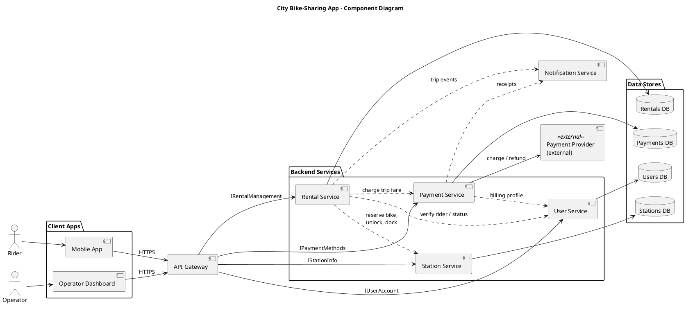
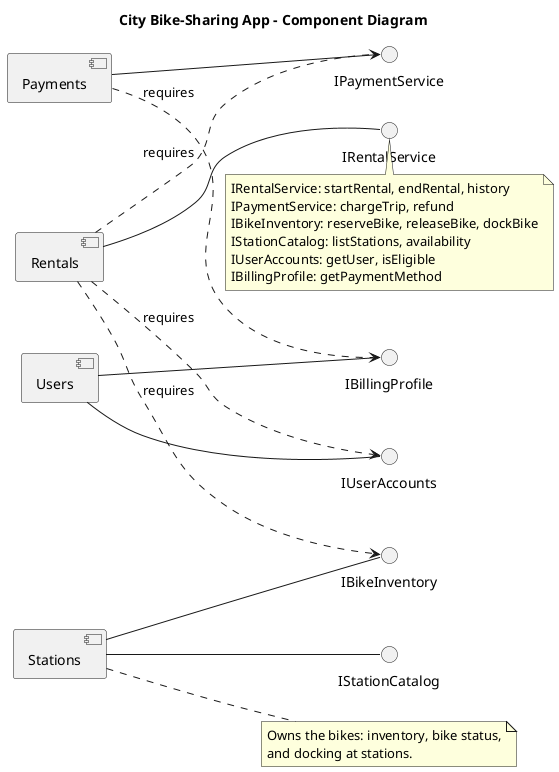
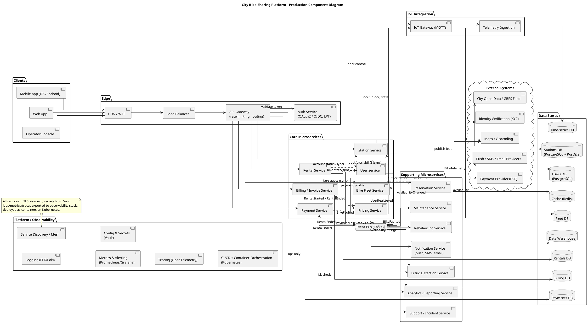

# When to use this deck

Switch here if the live AI fails. These are real answers to the demo's own prompts; walk the same defect catalogue against them.

::: notes
Present the HTML version in the browser: diagrams show at full width (scroll the tall ones); in the PDF they are vector images — zoom in. Captured September 2026 with the course setting (Claude Code, Sonnet 5, low effort, fresh session, no tools). Prompt #1 and prompt #2 ran in one session, first attempt; both PlantUML diagrams render with local PlantUML. The make-it-fail reserve was captured separately (fresh session: prompt #1 then the reserve), first attempt. Runbook: `curs/05-other-structural-demo.md`.
:::

# Prompt #1

> "Generate a UML component diagram (as PlantUML) for the city bike-sharing app from last week: rentals, stations, payments, and users."

# AI's answer — the diagram

```{=latex}
\renewcommand*\pandocbounded[1]{\sbox0{#1}\ifdim\dimexpr\ht0*\number\linewidth/\number\wd0\relax>0.84\textheight\resizebox{!}{0.84\textheight}{\usebox0}\else\resizebox{\linewidth}{!}{\usebox0}\fi}
```



::: notes
Runbook catalogue, in walkthrough order:

- #1 invented infrastructure (anchor): `API Gateway`, `Mobile App` and `Operator Dashboard`, `Notification Service`, one database per service, an external payment provider — none in the four areas the prompt named.
- #3 no interfaces (variant): `IUserAccount`, `IStationInfo`, `IRentalManagement`, `IPaymentMethods` appear only as labels on gateway arrows; the service-to-service arrows are bare dashed lines labelled with verbs.
- #4 missing domain part: no bike/fleet component, no rebalancing.
- #5 missing context: its opening line (next slide).
- #2 did not appear: services are flat, as in the dry run.
:::

# AI's answer — what it said

> I don't have last week's session or any code for that app, so this diagram is built only from the four areas you named. Component names and interfaces are my assumptions. If you paste the actual design, I'll align it.
>
> [...]
>
> **Assumptions:**
>
> - The services are split by domain, and each service owns its own database.
> - The payment provider is an external system.
> - I added an API gateway and a notification service. Remove them if your app doesn't have them.

::: notes
Two beats: "what should we have handed it — and whose job was that?" (#5), and "does labelling an assumption make the box justified?" (#1).
:::

# Prompt #2 (same session)

> "Revise it. Drop any infrastructure the prompt didn't mention — no API gateway, web portal, notification service, or per-service databases. Group by domain capability without nested sub-components — aim for a handful of parts, and say which part owns the bikes. Each component must declare the interfaces it provides and requires. Dependencies must point one way, with no cycles."

# AI's answer — the revised diagram

```{=latex}
\renewcommand*\pandocbounded[1]{\sbox0{#1}\ifdim\dimexpr\ht0*\number\linewidth/\number\wd0\relax>0.84\textheight\resizebox{!}{0.84\textheight}{\usebox0}\else\resizebox{\linewidth}{!}{\usebox0}\fi}
```



::: notes
Requested fixes applied: gateway, clients, notification service, databases and payment provider gone; four flat components; each provides interfaces (lollipops) and requires others through dashed `requires` arrows; dependencies one way; a note says Stations owns the bikes.

Re-check beat — what the constraints didn't cover:

- "Stations owns the bikes" — yet a bike being ridden or rebalanced is at no station (last week's `0..1`); rebalancing is still nowhere (#4 survives).
- Payment methods sit in `Users`' `IBillingProfile`, which is why `Payments` depends on `Users` — whose responsibility is a payment method?
- `IRentalService` and `IStationCatalog` have no consumer — the model says so itself; that's the cost of deleting the client apps with the infrastructure.
- Claim to verify: "Rentals → Payments → Users, with Rentals also → Stations and → Users" — trace each dashed arrow on the render.
:::

# AI's answer — its design notes

> **Design:**
>
> - **Stations owns the bikes.** It holds their inventory, status, and docking. Rentals must call `IBikeInventory` to reserve, release, or dock a bike.
> - **Four components, no nesting.**
> - [...]
> - **No cycles.** The dependencies run in one direction: Rentals → Payments → Users, with Rentals also → Stations and → Users. Stations and Users are leaves.
> - **Rider-facing interfaces have no consumer.** `IRentalService` and `IStationCatalog` aren't required by any component in the diagram. That's intentional, since I left out clients like a web portal or gateway.

::: notes
"It says it did X — show me where." Then hand into the deck's defect gallery.
:::

# Make-it-fail reserve (fresh session, after prompt #1)

> "Make this production-ready with all the supporting infrastructure and microservices."

# AI's answer — the "production-ready" diagram {.fragile}

```{=latex}
\renewcommand*\pandocbounded[1]{\sbox0{#1}\ifdim\dimexpr\ht0*\number\linewidth/\number\wd0\relax>0.84\textheight\resizebox{!}{0.84\textheight}{\usebox0}\else\resizebox{\linewidth}{!}{\usebox0}\fi}
```



::: notes
Captured September 2026, first attempt (prompt #1 then this reserve, one session). Renders with local PlantUML, but it is dense: present the HTML and zoom, walking one package at a time.

What to point at:

- Invented infrastructure, all unrequested: CDN/WAF, load balancer, API gateway, auth service, Kafka event bus, Redis, time-series DB, warehouse, MQTT gateway, service mesh, Vault, Kubernetes.
- Scope creep into whole business areas: Pricing, Billing/Invoice, Fraud Detection, KYC, Support, Analytics.
- Wrong kind of diagram: platform and deployment concerns (Kubernetes, mesh, Vault) drawn as components.
- Its own caveat — the technology choices "are reasonable defaults I picked, not requirements": if it picked them, who decided the architecture?
:::

# AI's answer — what it said

> - **Edge:** a CDN/WAF, load balancer, API gateway and a dedicated auth service.
> - **Supporting services:** Reservation, Notification, Maintenance, Rebalancing, Analytics, Fraud Detection and Support.
> - **Communication:** […] Everything else goes through a Kafka event bus […]
> - **Platform:** service mesh with mTLS, Vault, centralized logs, metrics and tracing, and Kubernetes.
>
> **Caveats:**
>
> - The technology choices (Kafka, PostgreSQL, Vault, Kubernetes and so on) are reasonable defaults I picked, not requirements. Swap in whatever your stack uses.
> - […] I haven't rendered it, so `linetype ortho` with this many edges may look cluttered.

::: notes
The punchline: every box is individually plausible; together they answer a question nobody asked. Back to the grain question — "which three of these would you keep for a bike-sharing app, and why?"
:::
