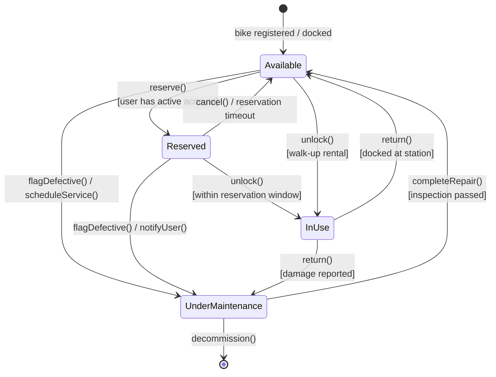
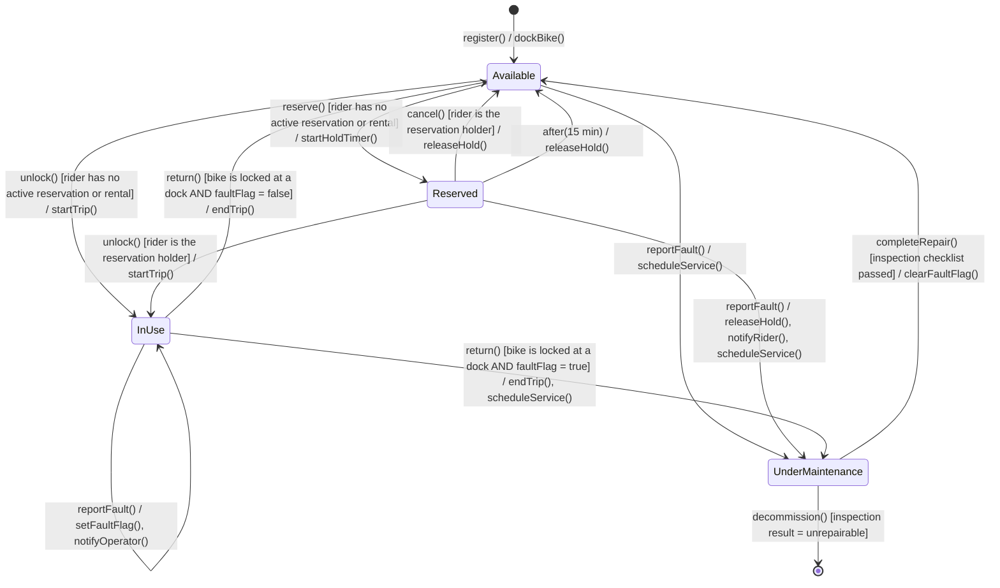
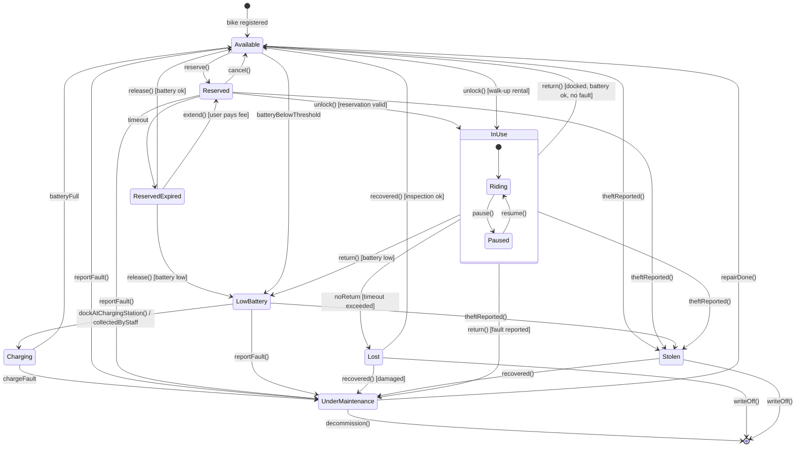

# When to use this deck

Switch here if the live AI fails (no answer after 20 seconds, network down, garbage output). Walk the same defect catalogue against these captures: prompt #1, the revision after prompt #2, and the edge-case reserve.

::: notes
All three captures come from real runs of the runbook's own prompts at the course setting, September 2026; each chain was good on the first attempt. Prompt #1 and prompt #2 ran in one session; the reserve ran in a separate session after its own prompt #1 (not shown — it was near-identical to the one here).
:::

# Prompt #1

> "Generate a UML state machine diagram (as Mermaid) for a bike in the city bike-sharing app: it can be available, reserved, in use, and under maintenance."

# AI's answer — the diagram

::: notes
Reachability check first: every state reachable and escapable, initial and final present — say so. Walk-up rental (catalogue #1) and the reserved-bike fault (#5) are both drawn here — credit them aloud. Then anchor on:

- #4 mid-ride fault: nothing leaves InUse during the ride; the fault only counts on return() — and the AI says so in its notes (next slide). Ask the chain-snaps question.
- #6 overlapping guards: return() [docked at station] vs return() [damage reported] — a docked, damaged bike satisfies both.
- #3 notation misuse: "cancel() / reservation timeout" — two alternative events written as event / action.
- Also: a trigger-like label on the initial transition ("bike registered / docked"); "[user has active account]" is a vague guard (#2).
:::

# AI's answer — what it said

**Notes**

- **Available**: docked and rentable.
- **Reserved**: held for one user for a limited time. It returns to Available on cancel or timeout.
- **InUse**: rented and unlocked. It can only leave through a return at a station.
- **UnderMaintenance**: out of service. It can be entered from any state when a defect is found, and it is left only after repair and inspection (or decommissioning).

I chose to send a bike whose defect is reported mid-ride to maintenance on return, not mid-trip. If you want a different rule, such as a "Lost/Stolen" state, tell me and I'll add it.

::: notes
Two claims to check against the render: "entered from any state when a defect is found" — from InUse only via return(); and the explicit mid-ride choice, which is the defect #4 hook: "The chain snaps. Can the rider even reach a station?"
:::

# Prompt #2

> "Revise the state machine. A rider can also unlock an available bike without reserving it. A fault can be reported during a ride, and a reserved bike can be flagged as faulty before pickup. Replace vague guards with conditions a tester could check, and use one transition per event — `event / action` means an action, not an alternative event. Keep an initial and a final state."

# AI's revision — the diagram

::: notes
Tick each request against the render, aloud: walk-up (Available -> InUse, yes), reserved-bike fault (yes), cancel / timeout split into two transitions (yes, with a UML time event after(15 min)), checkable guards, initial and final kept. The summary matches the diagram — no false fix claims.

What to point at:

- Mid-ride fault as a self-transition: InUse --> InUse : reportFault() — the bike stays in use until docked. Ask the chain-snaps question again.
- Trigger on the initial transition: [*] --> Available : register() / dockBike() — the transition out of the initial pseudostate takes no trigger.
- Action lists with commas (releaseHold(), notifyRider(), ...) — UML sequences actions with ";".
- after(15 min): an invented value, which the AI discloses.
- Dense render: zoom before tracing.
:::

# AI's revision — what it said {.allowframebreaks}

**What changed**

- **Walk-up rental:** `Available → InUse` on `unlock()` is now explicit. It is a separate transition from the reserved unlock, and each has its own guard.
- **Fault during a ride:** `reportFault()` in `InUse` is a self-transition that sets `faultFlag`. The rider is not stranded mid-trip. The two `return()` transitions are mutually exclusive on `faultFlag`, so the bike goes to maintenance only once it is docked.
- **Fault on a reserved bike:** `Reserved → UnderMaintenance` on `reportFault()` releases the hold and notifies the rider.
- **One event per transition:** the old `cancel() / reservation timeout` is now two transitions. `cancel()` is the rider's action, and `after(15 min)` is a time event. The text after `/` lists only actions.
- **Testable guards:** each guard can be checked from system data, such as the rider's active bookings, the reservation holder, dock lock status, `faultFlag`, or the inspection result. The 15-minute hold is an assumed value, so adjust it to your policy.
- **Initial and final states:** the initial transition is `register()`, and the final one is `decommission()`.

::: notes
"The rider is not stranded mid-trip" is the claim to test: with a snapped chain the rider cannot reach a dock, so return() never fires and the rental never ends.
:::

# Reserve prompt — grow the state space

> "Add all the edge-case states: lost, stolen, reserved-but-expired, charging, low-battery. Model 'in use' as a composite state with Riding and Paused substates."

::: notes
Captured in a fresh session: prompt #1 (near-identical draft: walk-up present, cancel() / reservation expires, fault only on return) followed by this prompt.
:::

# Reserve — the diagram

::: notes
Dense — trace one question at a time. This run differs from the runbook's dry run (low battery is handled on return, not mid-ride); walk what is here:

- Notation: "dockAtChargingStation() / collectedByStaff" repeats the slash-as-alternative misuse; change events written as bare names or conditions (timeout, batteryBelowThreshold, batteryFull, noReturn) — UML writes when(...) / after(...).
- Overlapping guards: return() [battery low] vs return() [fault reported] from InUse — a docked bike with a low battery and a fault.
- Partial coverage: theftReported() leaves Available, Reserved, InUse, LowBattery but not Charging, ReservedExpired or UnderMaintenance; reportFault() never leaves Charging or ReservedExpired.
- A holding state nobody leaves on its own: ReservedExpired waits for release() — who calls it? Why is "reserved-but-expired" not simply Available?
- A claim to check: "Mermaid can't draw a transition from a substate to an outer state cleanly" — it can; the real question is whether return() from Paused should be allowed.
:::

# Reserve — what it said {.allowframebreaks}

Design decisions:

- **InUse** is a composite state: entering starts in **Riding**, and **Paused** is a temporary stop, such as a lock during a shop visit. Transitions on the outer `InUse` (return, lost, stolen, low battery, fault) apply from either substate.
- **ReservedExpired** is a holding state. The reservation timed out, and the bike is released to Available or LowBattery depending on its charge. The user can also pay to extend.
- **LowBattery** blocks rental. The bike goes to Charging after a dock or staff pickup.
- **Lost** means a ride was never ended. **Stolen** means an external theft report. Both can be recovered, after inspection or repair, or written off.
- Recovered stolen bikes always go to maintenance, since their condition is unknown.

Assumptions you may want to change:

- Mermaid can't draw a transition from a substate to an outer state cleanly, so `return()` leaves from the composite boundary.
- I omitted `Available → Charging` for opportunistic top-ups. It's easy to add.

::: notes
"Transitions on the outer InUse (... low battery, fault) apply from either substate" — but low battery and fault only fire on return(); ask what happens when the battery dies while Riding.
:::
