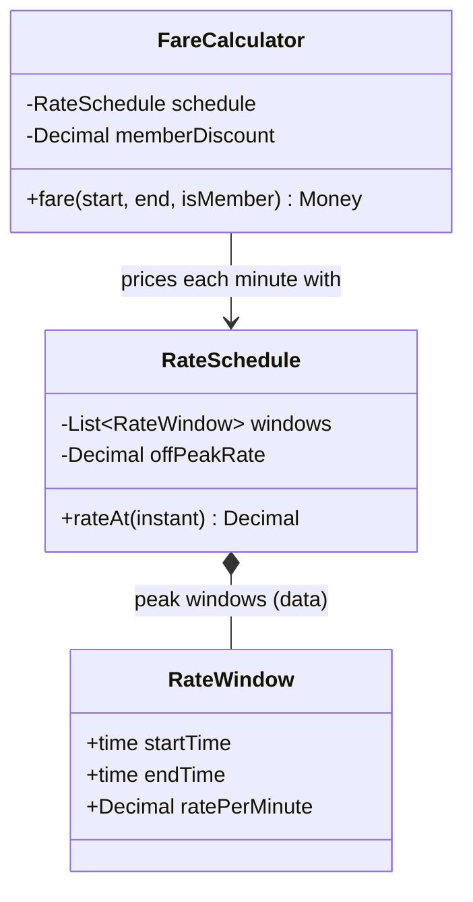

# When to use this deck

Switch here if the live AI fails (no answer after 20 seconds, network down, garbage output). Walk the same defect catalogue against these captures: prompt #1, the revision after prompt #2, and the "enterprise-grade" reserve.

::: notes
All three captures come from real runs of the runbook's own prompts at the course setting, September 2026; each chain was good on the first attempt. Prompt #1 and prompt #2 ran in one session; the reserve ran in a separate session after its own prompt #1 (Java flavour: Strategy, a Decorator/pipeline for discounts, a Facade — not shown).
:::

# Prompt #1

> "What design patterns should I use to implement fare calculation in the bike-sharing app? Rides are charged per minute, with peak / off-peak rates and a member discount."

# AI's answer — the patterns

```{=latex}
\small
```

Use a small combination of patterns. Don't reach for all of them.

**1. Strategy: rate selection (the core pattern)**
Define a `RateStrategy` (or `PricingPolicy`) interface with `ratePerMinute(time)`. Implement `PeakRate` and `OffPeakRate`, or a single `TimeOfDayRate` that reads a schedule. Keeping the schedule as data (config or DB) lets you change peak hours without a deploy.

**2. Decorator (or a pipeline of adjustments): member discount**
Discounts are modifiers on a computed fare. Wrap the base calculator: `MemberDiscount(BaseFareCalculator)`. This lets you stack promos, caps and free-unlock credits later without touching the base logic. If the order of adjustments matters, use an explicit ordered list of `FareAdjustment` steps instead of nested decorators. This is easier to test and reason about.

**3. Factory: wiring**
A `FareCalculatorFactory` picks the strategy and decorators from the user's plan (member or casual) and the city or region. This keeps the `if member` checks in one place.

::: notes
Count first: three patterns for two problems (a time-varying rate, one discount). Then:

- #3 speculative justification: the Decorator is justified by "stack promos, caps and free-unlock credits later".
- #2 premature abstraction: the Factory absorbs "city or region" — not in the problem.
- #5 hedging: "RateStrategy (or PricingPolicy)", "PeakRate and OffPeakRate, or a single TimeOfDayRate", "Decorator (or a pipeline)" — every choice is handed back.
- The deeper question: "keeping the schedule as data" — so is Strategy warranted at all?
:::

# AI's answer — the sketch

```{=latex}
\tiny
```

```python
class RateSchedule:            # Strategy
    def rate_at(self, t: datetime) -> Decimal: ...

class FareCalculator:
    def __init__(self, schedule, adjustments=()):
        self.schedule, self.adjustments = schedule, adjustments

    def fare(self, start, end) -> Money:
        total = Decimal(0)
        for minute in minutes_between(start, end):   # splits rides across peak boundaries
            total += self.schedule.rate_at(minute)
        for adj in self.adjustments:                 # e.g. MemberDiscount(0.15)
            total = adj.apply(total)
        return round_money(total)
```

::: notes
Credit the boundary aloud: the loop prices every minute at its own rate, so catalogue #1 (one rate for the whole ride) did not appear — the 16:50-to-17:40 ride is priced correctly.

Then #4 prose and code disagree: the prose names `RateStrategy` with `PeakRate` / `OffPeakRate` and a Decorator that wraps the calculator; the code has one concrete `RateSchedule` labelled "# Strategy" (no interface, no second implementation) and a plain list of adjustments — no decorator anywhere. "Which one is the design?"
:::

# AI's answer — what else it said

**Design points that matter more than the pattern names**

- **Rides that cross a peak boundary.** Charge each minute (or segment) at the rate in force then, not the start-time rate. Decide this rule up front and test it.
- **Money.** Use `Decimal` or integer cents, never floats. Fix the rounding rule (per segment or once at the end).
- **Time.** Use the station's time zone. Test DST changes and rides that cross midnight.
- **Partial minutes.** Decide whether to round up, round down or prorate.

[…]

**What to skip:** Chain of Responsibility, State and Visitor are overkill here. Add a Specification or Rule pattern only if promo eligibility gets complex.

::: notes
"Design points that matter more than the pattern names" is the model half-admitting the pattern list is not the design. Keep the time-zone and partial-minute points in mind: check whether they survive prompt #2.
:::

# Prompt #2

> "A ride can start off-peak and end in peak; it is charged per minute at the rate in force for each minute. Show how your design prices it. For each pattern and class you suggested, name the variation it absorbs today — drop any that only absorbs a variation we might have later. Show the remaining structure as a Mermaid class diagram."

# AI's revision — pricing a boundary ride

```{=latex}
\small
```

These numbers are assumptions of mine: off-peak is 0.10/min, peak is 0.20/min and starts at 07:00, and the member discount is 15%.

A ride runs 06:50 to 07:10, which is 20 minutes. Each minute is priced by the rate in force at its start.

| Minutes | Rate | Subtotal |
|---|---|---|
| 06:50–06:59 (10 min) | 0.10 | 1.00 |
| 07:00–07:09 (10 min) | 0.20 | 2.00 |
| **Base fare** | | **3.00** |

- **Casual rider:** 3.00.
- **Member:** 3.00 × (1 − 0.15) = **2.55**.

::: notes
Check the arithmetic aloud with the room (it is right). Then the hidden assumptions: rates, the 07:00 start and 15% are invented — disclosed; when does peak end? Partial minutes, rounding and the time zone from the first answer are no longer mentioned anywhere.
:::

# AI's revision — what each piece absorbs today

```{=latex}
\tiny
```

| Piece | Variation it absorbs today | Verdict |
|---|---|---|
| `RateSchedule` (`rate_at(t)`, backed by peak windows as data) | Rate changes with time of day (peak vs off-peak), including mid-ride | **Keep** |
| `FareCalculator` | Per-minute summing and applying the discount. It is the one place the boundary-crossing rule lives | **Keep** |
| Member discount, as a plain fraction passed to the calculator | Member vs casual | **Keep** as a parameter, not a class hierarchy |
| `Strategy` interface with `PeakRate` and `OffPeakRate` classes | Peak vs off-peak is a difference in *data* (a rate per time window), not in behavior. One `RateSchedule` covers it | **Drop** the interface and the two classes |
| `Decorator` or an ordered `FareAdjustment` list | Only stacking promos, caps and unlock credits, which don't exist yet | **Drop** |
| `FareCalculatorFactory` | Only per-city or per-region wiring. With one discount check, `if member` lives in one line | **Drop** |

I'm changing my earlier suggestion here. Strategy, Decorator and Factory were all sized for variation you don't have. What you have today is a time-varying rate and one optional discount.

::: notes
The retraction is honest: Strategy, Decorator and Factory all dropped — tick the table against the diagram on the next slide; no leftover pattern classes. If a student defends Strategy against the rate table, that is the reference-solution debate: when would Strategy earn its place? (Rates that differ in rule, not just in number.)
:::

# AI's revision — the remaining structure



::: notes
Where does the per-minute split live? Only in the association label and the code on the next slide — ask what test would prove it. `RateWindow` holds wall-clock times with no time zone: "Is a time zone a variation we might have later, or a bug we have now?" The first answer said "use the station's time zone"; the revision silently lost it.
:::

# AI's revision — the code

```{=latex}
\tiny
```

```python
class FareCalculator:
    def __init__(self, schedule, member_discount=Decimal("0.15")):
        self.schedule, self.member_discount = schedule, member_discount

    def fare(self, start, end, is_member) -> Decimal:
        total = sum(self.schedule.rate_at(m) for m in minutes_between(start, end))
        if is_member:
            total *= (1 - self.member_discount)
        return round_money(total)
```

If a second discount or a per-city schedule arrives, add the abstraction then. `FareCalculator` is the only place that would change.

::: notes
Small details to check: the diagram says `fare(...) Money`, the code returns `Decimal`; `rateAt` vs `rate_at`. "The only place that would change" is a claim — a per-city schedule would also change whoever builds the RateSchedule.
:::

# Reserve prompt

> "Make this enterprise-grade and future-proof with the full set of design patterns a senior architect would use."

::: notes
Captured in a fresh session: prompt #1 (Strategy `RatePolicy`, a Decorator or pipeline of `FareRule`s for the discount, a `FareCalculator` Facade, boundary split handled), then this prompt.
:::

# Reserve — "patterns that earn their place" {.allowframebreaks}

```{=latex}
\scriptsize
```

"Enterprise-grade" comes from correctness, auditability, and change safety, not from pattern count. Below is the fuller architecture I'd use, with a reason for each pattern. I've left out the ones that would only add ceremony.

| Concern | Pattern | Why |
|---|---|---|
| Rate by time band | **Strategy** | This is the main variation point. |
| Discounts, caps, unlock fee, promos | **Pipeline of `FareRule`s** (Decorator/Chain, ordered list) | Rules stay isolated, and adding one doesn't touch existing code. |
| Splitting a ride across bands | **Iterator or Stream over `TimeSegment`s** | Each segment is priced at its own rate. |
| Rules that change over time | **Specification** | Predicates like `isPeak`, `isMember` and `isHoliday` are composable and testable. |
| Rate and rule lookup | **Repository** plus **effective-dated `PricingPlan`** | A ride is priced under the plan that was active when it started. This is the key to future-proofing. |
| Entry point | **Facade** (`FareService`) | Callers see one API. |
| Result | **Value Object** (`Money`, `FareBreakdown`) | The result is immutable and carries line items. |
| Construction | **Builder** for `PricingPlan` and `Ride` | These are objects with many optional fields. |
| Cross-cutting | **Decorator** around `FareService` | Logging, metrics, and caching go here without polluting the domain. |
| Testing | **Dependency Injection** and **Null Object** (`NoDiscount`) | Removes null checks and makes the clock injectable. |

::: notes
Pushes back in the first sentence, complies in the table: count them — eleven patterns (Strategy, Decorator/Chain pipeline, Iterator, Specification, Repository, Facade, Value Object, Builder, Decorator, Dependency Injection, Null Object).

- Which problems exist today? `isHoliday`, promos, caps, unlock fees, caching — none are in the requirements.
- Mislabel: "Decorator/Chain, ordered list" — the same stretch as catalogue #6: in a list where every rule runs, who stops the request?
- The boundary bug one level up: "priced under the plan that was active when it started" — a ride that crosses a price change.
:::

# Reserve — the rest of the answer

```{=latex}
\scriptsize
```

## Skip these (for now)

- **Abstract Factory, Visitor, Interpreter or a rules-engine DSL.** These are justified only if non-engineers must author pricing rules. Adopt one when that requirement is real, not before.

[…]

## Structure

```
pricing/
  domain/   Ride, Money, TimeSegment, FareBreakdown, PricingPlan
  rules/    FareRule, BaseFareRule, MemberDiscountRule, DailyCapRule
  spi/      PricingPlanRepository, Clock
  app/      FareService (facade)
  infra/    JdbcPlanRepository, MetricsFareService (decorator)
```

Dependencies point inward, so the domain has no framework imports.

::: notes
Named, not applied: there is no code at all — Specification, Iterator, Builder, Null Object appear only in the table; the folder tree shows no specification or builder classes, and a `DailyCapRule` for a cap nobody asked for. It also lists eight "architecture choices that matter more than patterns" (versioning, idempotency, golden-file tests…), trimmed here. Close on: "It says pattern count is not enterprise-grade — and then lists eleven. Which part is the design?"
:::
