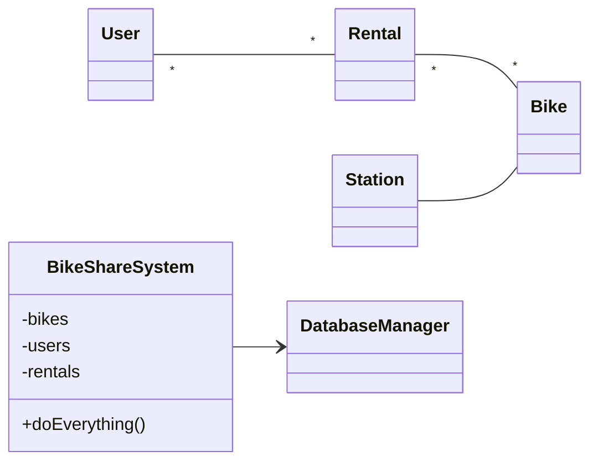
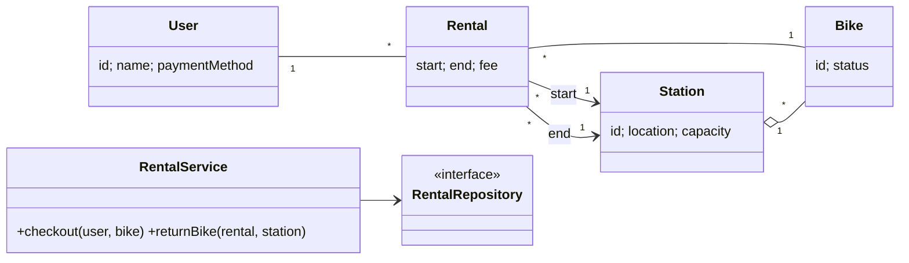

# When to use this deck

Switch here if the live AI fails. These are real answers to the demo's own prompts; walk the same failure catalogue against them, then run the read-order live on the diagram.

::: notes
Captured September 2026 with the course setting (Claude Code, Sonnet 5, low effort, fresh session, no tools). Prompts #1, #2 and #3 ran in one session; the "I designed this myself" prompt ran alone in a fresh session. The #1–#3 chain was run twice: both attempts flagged both `*--*` multiplicities, so the calibration-style omission (catalogue #1) could not be captured — this deck uses attempt 1 (its fixes and reasons carry the gap instead: #2, #3, #4, #7). The flattery prompt: first attempt. Runbook: `curs/11-evaluation-demo.md`.
:::

# The diagram under evaluation



::: notes
Known defects (Week 4 / Lab 2): god class + `doEverything`; `User *--* Rental` and `Rental *--* Bike`; `Station -- Bike` should be an aggregation with `0..1` at the station end; invented `DatabaseManager`.
:::

# Prompt #1

> "Here is a UML class diagram for a bike-sharing app. Is this a good design? Rate it out of 10. [flawed diagram pasted]"

# AI's verdict {.allowframebreaks}

```{=latex}
\small
```

**Rating: 3/10.** It's not a good design.

1. **`BikeShareSystem` is a god class.** `doEverything()` is the giveaway. [...] Split it into focused services such as `RentalService`, `BikeInventory` and `UserService`.
2. **The relationships are wrong or unclear.**
    - `User "*" -- "*" Rental` is probably wrong. A rental belongs to exactly one user, so this should be `User "1" -- "*" Rental`.
    - `Rental "*" -- "*" Bike` is questionable. A rental usually involves one bike, so `Rental "*" -- "1" Bike`. If multi-bike rentals are intended, say so.
    - `Station -- Bike` has no multiplicities, and there is no role or direction. Is the bike docked at a station, or is that just its last known location? Model it as `Station "1" o-- "*" Bike`, with a nullable link for bikes in use.
    - `Rental` doesn't reference `Station` at all, so start and end stations can't be recorded.
3. **The classes have no attributes or methods.** [...] It also omits things a real app needs: start and end times, status, payment, and bike state such as available, rented or maintenance.
4. **`DatabaseManager` couples the persistence layer to the system.** Only the top-level class touches it, and it isn't abstracted. Use repository interfaces (`BikeRepository`, `RentalRepository`) that the services depend on. This keeps the domain testable.
5. **The names are vague.** `DatabaseManager` and `BikeShareSystem` say little about their roles.
6. **Payment and pricing are missing.** They're central to a bike-sharing app. Add `Payment` and a `PricingPolicy`, which could be a strategy.

The domain entities are the right starting set, which is why this scores 3 and not lower. The structure around them (the god class, the wrong multiplicities and the missing detail) needs rework.

::: notes
Credit first: god class, both `*--*` (this capture found them — catalogue #1 does not apply), the missing multiplicity on `Station -- Bike`. Then the gaps:

- #2 plausible but wrong fix: `Station "1" o-- "*" Bike` "with a nullable link for bikes in use" — a `1` end cannot be nullable; the station end is `0..1`. The fix contradicts its own reason.
- #3 shallow reason: `DatabaseManager` flagged only as coupling / "use repository interfaces" — it still keeps persistence in the domain model.
- #7 scope creep: payment, pricing, "a strategy" — requirements nobody stated, listed as defects.
- #4: ask what a 6 would have meant.
:::

# AI's verdict — its "better shape"



::: notes
An evaluator's fix is an artifact too — run the read-order on it: `Station "1" o-- "*" Bike` again (a bike being ridden is at no station); `Rental --> "1" Station : end` means a rental in progress must already have an end station. `paymentMethod` and `fee` — scope it added itself.
:::

# Prompt #2 (same session)

> "Go through every association in this diagram and say in plain English what its multiplicities claim. Then say whether each claim is true for a bike-sharing app."

# Its reading of the multiplicities {.allowframebreaks}

```{=latex}
\small
```

*3. `Station -- Bike`*

**Claim:** There are no multiplicities, so the diagram doesn't say. UML tools and readers often treat the missing marks as unspecified. Some read it as `1` on each end [...]

**True for a bike-sharing app?** [...] A bike is at one station at most, and at zero while it's out on a rental or in maintenance. The right form is `Station "0..1" -- "*" Bike`, or `Station "1" o-- "*" Bike` if every bike must have a home station.

*4. `BikeShareSystem --> DatabaseManager`*

**Claim:** This is a directed association (an arrow), so `BikeShareSystem` knows about and uses `DatabaseManager`, but not the reverse. The multiplicities are unstated, and the usual reading is one to one.

**True for a bike-sharing app?** Yes, as far as it goes. One system using one database manager is plausible, and the direction is sensible because the database layer shouldn't depend on the system. [...]

| Association | Verdict |
|---|---|
| User–Rental | Wrong on the Rental side (should be exactly one user) |
| Rental–Bike | Wrong on the Rental side (should be one bike, or at least one) |
| Station–Bike | Unspecified, and wrong under the "1 to 1" reading |
| System→DatabaseManager | Fine |

::: notes
Asked to read the multiplicities as sentences, it now gets `0..1` right — the fix it proposed on the previous slide was wrong, and it never says so; its "or `1 o--`" keeps the wrong option alive. Slip: "the usual reading is one to one" — an unspecified multiplicity means undecided, not 1. And `System→DatabaseManager` is judged "Fine": the invented persistence class survives the correctness check.
:::

# Prompt #3 (same session) — a narrow, checkable question

```{=latex}
\footnotesize
```

> "List every class that has no association, and every association with no multiplicity."

Every class in the diagram appears in at least one association, so **none** are isolated: [...]

One thing is worth flagging. `BikeShareSystem` declares private fields `bikes`, `users` and `rentals`, but it has **no association** to `Bike`, `User` or `Rental`. [...]

So two associations have no multiplicity: `Station -- Bike` and `BikeShareSystem --> DatabaseManager`.

This corrects my earlier answer. [...] I also said `BikeShareSystem --> DatabaseManager` had "unstated" ones and then treated one to one as fine. That is a reasonable default reading, but the diagram itself states nothing there.

::: notes
Correct, and fast (8 s) — this is where AI helps: conformance, not "is this good?". It volunteered the hidden associations behind `-bikes/-users/-rentals`, and corrected its own "one to one" reading from prompt #2 — only when the question was narrow enough to check.
:::

# Same diagram, framed as mine — side by side

```{=latex}
\footnotesize
```

::: columns
:::: column
**Neutral** ("Is this a good design? Rate it out of 10.")

**Rating: 3/10.** It's not a good design.

[...]

The domain entities are the right starting set, which is why this scores 3 and not lower.
::::
:::: column
**Fresh session:** "I designed this myself and I'm quite proud of it — what do you think? Rate it out of 10."

**Rating: 4/10.** The domain is sensible and the core entities are all there. But there are some real problems.

**What works**

- The nouns are right: User, Bike, Station, Rental.
- `direction LR` keeps the diagram readable.
- `DatabaseManager` is separated from the domain objects, which is the right instinct.

[...]

You got the entities right, which is the hard part to start. Fixing the multiplicities and removing `doEverything()` would move this to about a 7.
::::
:::

::: notes
Let the room predict first (higher / same / lower?). The framing moved the score one point (3 -> 4) and wrapped the critique in praise at both ends. One run each — a one-point move could be noise; say so. The telling line: `DatabaseManager` "is separated from the domain objects, which is the right instinct" — the invented infrastructure, a known defect, is now praised. The defect list itself did not soften (next slide).
:::

# The flattered verdict — its problem list (excerpt)

```{=latex}
\small
```

1. **`BikeShareSystem` is a god class.** `doEverything()` is the biggest red flag. [...]
2. **Wrong multiplicities.**
    - `User "*" -- "*" Rental` says a rental has many users. It should be `User "1" -- "*" Rental`.
    - `Rental "*" -- "*" Bike` says a bike is in many rentals at once and a rental has many bikes. Over time a bike has many rentals, but each rental normally covers one bike, so use `Bike "1" -- "*" Rental`.
    - `Station -- Bike` has no multiplicity at all. It should be `Station "0..1" -- "*" Bike`, since a bike in use isn't docked.
3. **Empty classes.** [...]
4. **Missing concepts.** There is no payment, pricing or bike status (available, rented, maintenance). [...]
5. **Weak dependency direction.** `DatabaseManager` is a vague name. A repository per aggregate (`BikeRepository`, `RentalRepository`) behind interfaces would be cleaner. [...]

::: notes
Same substance as the neutral verdict: god class first, both `*--*`, missing concepts. Point 5 now calls the `DatabaseManager` dependency "weak" — the same answer praised it as "the right instinct" under "What works". "The number moved, the defect list didn't — read the list, not the score." Fresh slip to point at: "a bike is in many rentals *at once*" — a multiplicity says nothing about "at once". Here it even got the station end right (`0..1`), which the neutral run did not — two runs, two different fixes.
:::
