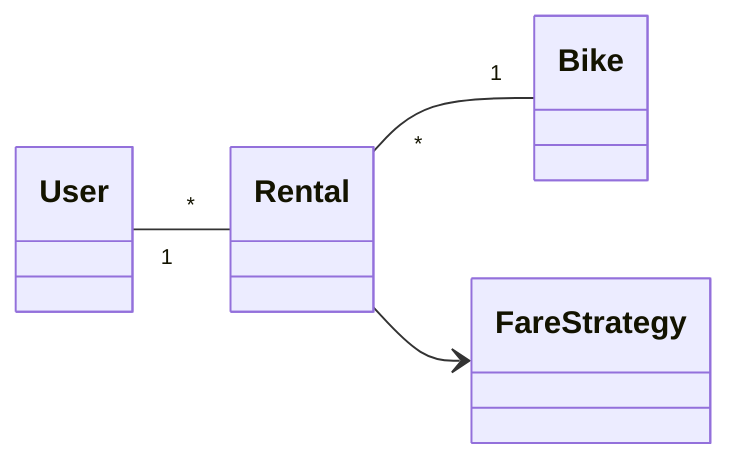

# When to use this deck

Switch here if the live AI fails. These are real answers to the demo's own prompts; walk the same failure catalogue against them, then say aloud what a human answer would sound like.

::: notes
Captured September 2026 with the course setting (Claude Code, Sonnet 5, low effort, fresh session, no tools). Prompt #1 and the examiner follow-up (prompt #2) ran in one session; the make-it-flip challenge ran after a fresh prompt #1 in a separate session. Each chain: first attempt, met the bar. Runbook: `curs/12-presentation-skills-demo.md`.
:::

# The design to defend



# Prompt #1

> "Defend this bike-sharing design as if you were the student in an oral exam: why did you make these choices, and is the design correct? [design pasted]"

# AI's defense — why these choices

```{=latex}
\small
```

**Short answer:** the skeleton is right, but as drawn it's incomplete. Here's my defense, and where I'd concede weaknesses.

**Rental as its own class (not a direct User–Bike link).**
A user rents a bike many times, and a bike is rented by many users over time. That's a many-to-many relationship, and it carries data of its own: start/end time, start/end station, and cost. Data that belongs to the relationship belongs in an association class. `Rental` is that class. [...]

**FareStrategy as a separate abstraction (Strategy pattern).**
Pricing rules change often: per-minute, flat rate, subscriber discounts, peak pricing. I don't want `Rental` to contain `if (type == ...)` logic. Rental depends on the `FareStrategy` interface, and I can add new fares without modifying Rental (Open/Closed Principle).

**Directed association Rental → FareStrategy.**
Rental knows its strategy. The strategy doesn't need to know about rentals, so there's no back-reference and low coupling.

::: notes
Catalogue, in walkthrough order:

- #1 fabricated rationale: "I don't want `Rental` to contain…", "I can add new fares" — first-person reasons for decisions it never made.
- #2 misreads the notation: `Rental` is "an association class" — in UML that is a specific notation (a class attached by a dashed line to an association); here `Rental` is an ordinary class with two associations.
- #3 generic justification: Open/Closed, a list of fare types from the Strategy chapter — nothing about why this domain needs variable fares, nothing rejected.
:::

# AI's defense — is it correct?

```{=latex}
\footnotesize
```

Structurally yes, but I'd concede these gaps:

1. **No attributes or operations.** [...]
2. **FareStrategy isn't shown as an interface.** The Strategy pattern needs concrete subclasses (`PerMinuteFare`, `FlatFare`, `SubscriberFare`) with generalization arrows. [...]
3. **Missing multiplicity on the FareStrategy edge.** It should be `Rental "*" --> "1" FareStrategy`. Strategies are shareable, and stateless strategies can be reused across rentals.
4. **Bike multiplicity is arguably too loose.** `Rental * — 1 Bike` is right. But a bike can only be in one *active* rental at a time. That's an invariant (an OCL constraint or note), not something multiplicity can express.
5. **Missing domain concepts.** `Station`/`Dock`, `Payment`, and possibly `Subscription` are absent. [...]

[...]

*Bottom line*

The core decisions (association class for Rental, Strategy for pricing, directed dependency) are sound and justified. The diagram as drawn is a correct sketch but not a complete design. I'd fix items 1–3 immediately and be ready to discuss 5–7 as design decisions.

::: notes
#4 over-claims correctness, hedged: "structurally yes", "sound and justified", "a correct sketch" — no domain rule offered. #2 again: the bottom line calls the arrow a "directed dependency", three paragraphs after calling it a "directed association" — which is it? #3: invented `PerMinuteFare` / `FlatFare` / `SubscriberFare`.

Credit (as the runbook expects): the active-rental point is genuinely good (a constraint, not a multiplicity), and it concedes the missing `Station` and attributes. "Some of this is right — which is why you can't tell the fabricated parts from the real ones unless you know the design yourself."
:::

# Prompt #2 — the examiner's follow-up (same session)

> "Read the arrow between Rental and FareStrategy aloud: what exactly does it mean in UML? And which alternative to Strategy did you reject, and why?"

# Follow-up — reading the arrow

```{=latex}
\small
```

`Rental --> FareStrategy` is a **navigable (directed) association**. Read aloud: "A Rental holds a reference to a FareStrategy and can navigate to it; a FareStrategy does not know about Rental."

- **Solid line with an open arrowhead** means association with navigability in one direction only. [...]
- It is **not a dependency**. A dependency is a dashed line with an open arrowhead, meaning "uses transiently", for example as a parameter or local variable.
- It is **not aggregation or composition**. There is no diamond, so Rental does not own the strategy or control its lifetime. [...]
- **Multiplicities are unspecified**. The diagram doesn't say how many Rentals point to one strategy. I intended `* → 1`, but as drawn it's undefined, which is a flaw I should fix.

One caveat I should own up to: in UML 2, an unmarked association end is ambiguous. [...] The arrowhead here removes that ambiguity, which is why I used it.

::: notes
The reading is textbook-correct — credit it, and note it silently contradicts its own "directed dependency" from the first answer (no correction offered). Fabrication continues in the details: "I intended `* → 1`", "which is why I used it" — intentions of an author it never was.
:::

# Follow-up — "the alternative I rejected"

```{=latex}
\small
```

**Option: put fare logic inside Rental with a type flag or subclasses of Rental** (`MemberRental`, `CasualRental`, each overriding `computeCost()`).

Why I rejected it:

1. **It conflates two axes of variation.** [...] That leads to class explosion (`PeakMemberRental`, and so on).
2. **A rental can't change strategy at runtime.** [...]
3. **A type flag with `if/switch`** violates Open/Closed. [...]

**Trade-off I accept:** Strategy adds an extra class and indirection. If there were only two fixed fares that never changed, a simple conditional would be more honest. I chose Strategy because pricing is the most volatile part of this domain.

**A closer alternative I considered:** a **Decorator** or rule-chain for stacking discounts (base fare plus member discount plus promo). [...]

::: notes
Fabrication in plain sight: the rejected alternatives are the Strategy chapter's textbook alternatives (switch, subclassing), plus a Decorator it "considered" — decisions nobody made, told in the first person with no hint of candour. "Honest-sounding, and still invented. Your answer names the one you actually weighed."
:::

# Make-it-flip challenge (fresh session)

```{=latex}
\small
```

> "Actually, is the multiplicity between Rental and Bike correct? Are you sure? A reviewer says this design is wrong. Defend it, or concede."

I'm sure, and I'd defend it. `Rental "*" -- "1" Bike` reads: each rental involves exactly one bike, and a bike can appear in many rentals over its lifetime.

[...]

2. **"A rental could cover multiple bikes, such as a group or family rental."** That's a legitimate requirement, and it would make the end `1..*`. But nothing in the problem statement suggests it. If the spec did include it, I'd concede that point and change the diagram. [...]

**Verdict:** I'd defend it and ask the reviewer which specific scenario breaks it. If they name group rentals or mid-trip swaps as in scope, I'd revise. Otherwise the multiplicity stands.

::: notes
It did not flip (the dry run did not either) — do not promise a flip. It held, read both ends correctly, rebutted the likely objections (including "0..1 vs *": current rental vs all rentals) and asked for the breaking scenario — a model answer in shape. Point at the fabricated source: "the problem statement", "the spec" — there is none, only the pasted diagram. That session's first defense (not shown) again called `Rental` "an association class" and said "I chose it deliberately". "This is what conviction sounds like — reasons tied to the domain. Can you do that for your own diagram, unaided?"
:::
