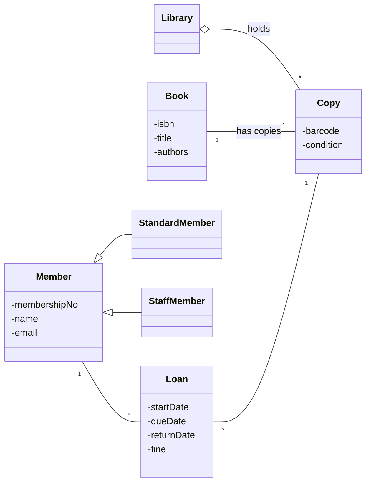

# Lab 2 Instructor Runbook — Class Diagrams from Spec

> Planificare curentă: Lab 2, după cursurile 3–4, tratează cerințe și modelarea domeniului. Corpul de mai jos este material anterior, de rescris conform `docs/semester-roadmap.md`; nu reprezintă noul pachet de predare și nu autorizează cerințe sau prerechizite din cursuri ulterioare.

> Instructor-facing companion to `Lab02.md`. **Not** a slidy deck — the lab Makefile filters `*-instructor.md` out of the published tree. Read end-to-end before the session.
>
> Spec: `docs/superpowers/specs/2026-06-01-amss-2026-lab2-design.md`.
>
> Calibrated September 2026 with Claude Sonnet 5 (low effort), one run per prompt — live output varies; walk the defects that actually appear.

## Pre-class checklist

- [ ] Seed `lab02/README.md` (brief + 1-page spec) into the course lab repo (template at the end of this file).
- [ ] Assign student-ids (`s01`…`sNN`) and fill the roster table below.
- [ ] Remind students that their lab repo root must contain the `tooling/template/` files (course settings from Lab 1). No endpoint or keys to check — students use their own Claude Pro / ChatGPT Plus sign-in.
- [ ] Confirm every student has push access to the lab repo (most still have the Lab 1 clone).

## The authored 1-page spec (honest input artifact)

This is the canonical text — it goes into `lab02/README.md` and is on the brief's "The Domain" slide. It is **honest**: no planted contradictions. Each fact is phrased to surface a specific defect; the authoring notes say which.

| Spec fact | Defect it was designed to surface (W4 name) | Calibration (Sonnet 5, low) |
|---|---|---|
| A *title* (book) vs *several physical copies*, each with its own barcode | **wrong multiplicity** — Book/Copy collapsed, `Member "*" -- "*" Book` | Not produced: `Title` and `Copy` split correctly. |
| The library *owns / holds* copies; a copy stays in the catalogue when nobody borrowed it | **missing aggregation** — the holds-relationship outlives loans | **Produced, subtly:** no `Library` class; aggregation moved to `Title "1" o-- "1..*" Copy`. |
| A loan is *exactly one copy to one member* | **wrong multiplicity** — M:N loan trap | Not produced: `Member 1 -- 0..* Loan`, `Copy 1 -- 0..* Loan`. |
| Members are *standard* or *staff* with different limits | is-a flattened to `type: String` | Not produced: abstract `Member` + two subclasses with polymorphic `maxOpenLoans()`. |
| (no infrastructure mentioned) | **invented class** / **god class** — `DatabaseManager`, `LibrarySystem` | **Produced, milder:** a `Kiosk` controller class with `borrow/return/showOpenLoans/showFines` and `..>` dependencies. No DatabaseManager, no god class. |

## What the bare prompt actually produces (defect card)

The first draft is **near-reference**. Students must be told to expect subtle defects; a student who logs "no defects" has skimmed. Observed, in order of value:

| # | Observed defect | Where to point | Critique question |
|---|---|---|---|
| 1 | **Missing aggregation / whole-part on the wrong pair** | `Title "1" o-- "1..*" Copy : has copies`; no `Library` class anywhere | "Who *holds* the copy — the title, or the library? Where is the library in this diagram?" |
| 2 | **Wrong multiplicity** (minor) | `"1..*"` on the Copy end | "Can the catalogue list a title with no copy on the shelf? Then why at least one?" |
| 3 | **Invented class** (controller) | `class Kiosk` with four operations and three `..>` dependencies | "Is the kiosk a thing the library keeps records of, or the software's controller? Does it belong in a domain model?" |
| 4 | **Claim vs diagram** | Notes: "Loan is the association class between Member and Copy" and Copy–Title "composition-ish" — diagram draws an ordinary `Loan` class and an aggregation | "The notes say association class and composition — what does the diagram actually draw?" |
| 5 | Rule only in prose | "one open loan per copy" and loan limits pushed into `Kiosk.borrow()` | "Where in the diagram does it say a copy has at most one *open* loan? Should it?" (a constraint note is acceptable; not a gate defect) |

Classic entries **not observed** with this setting: M:N Member–Book, Book/Copy collapse, `type: String` flattening, `DatabaseManager`, god class, verb-less association (all associations are labelled). Older/weaker models do produce the title/copy collapse — keep the nudge, but don't promise it.

**Dry run (September 2026)** — bare prompt → re-prompt #1 → re-prompt #2 in one session, course setting:

- **Bare prompt (new run):** defects #1, #2, #3 and #5 recurred exactly (`Title "1" o-- "1..*" Copy`, no `Library`, `Kiosk` controller, "one open loan per copy … enforced by the kiosk"). #4 did not: this run's notes did not claim an association class; instead they *rationalised* the `1..*` ("a title needs at least one copy to be borrowable"). Also seen in dry run: `Copy` has both an attribute `condition: Condition` **and** an association `Copy --> Condition` — the same fact modelled twice.
- **Re-prompt #1 did exactly what it asked, with no false claim and no regression:** `Library "1" o-- "0..*" Copy`, `Copy "0..*" --> "1" Title`, summary accurate. It left the `Kiosk` in (not asked) and offered, rather than added, a `Library`–`Title` link. So students whose draft matches the card will find little new after iteration 1 — steer them to the residue (Kiosk, duplicated `Condition`) for iteration 2.
- **Re-prompt #2 (original wording) broke the diagram.** Asked to "draw Loan as an association class", it wrote `(Member, Copy) .. Loan` — PlantUML syntax; Mermaid has **no** association-class notation, and the line fails to parse (confirmed on mermaid-cli 12: removing it, or replacing it with `Member "1" --> "0..*" Loan` + `Loan "0..*" --> "1" Copy`, renders fine). Its note falsely claimed the syntax "needs Mermaid 11 or later". It also introduced a wrong multiplicity: `Member "1" -- "0..*" Copy : borrows` says every copy always has exactly one borrower (a copy on the shelf has none). To its credit it dropped the `Kiosk`, made `Member` abstract, and raised the right caveat — an association class allows one link per member–copy pair, but the same member can borrow the same copy again, so `Loan` should really be an ordinary class. All three are excellent log material, but a non-rendering diagram derails a student mid-drill.
- **Re-prompt #2 revised after dry run; the revised wording was re-run once (September 2026):** plain Mermaid that renders, Kiosk dropped, Loan drawn as an ordinary class — but it still aggregates `Title o-- Copy` and adds `Library o-- Title`, both worth catching. New wording on the slide: *"Drop any class that isn't a library-domain concept (a Kiosk controller, a DatabaseManager, a 'LibrarySystem'). Is Loan an association class? Say why or why not — but draw it with plain Mermaid class syntax (Mermaid has no association-class notation). Model member kinds as subclasses (standard / staff), not a type field."* It keeps the association-class question open (the re-borrow argument is the good answer) without inviting invented syntax. Not yet run.
- If a student's diagram still fails to render after re-prompt #2 (older copy of the slide, or the model invents syntax anyway): tell them to log it as a claim-vs-diagram defect and replace the offending line by two plain associations through `Loan`. Either way, have them re-read multiplicities after this pass — the dry run's new wrong multiplicity appeared here, not in iteration 1.

## Reference "good" diagram (instructor-only — do NOT show during the drill)

The approximate right answer, for fast adjudication. Reveal at the close if useful.



Key correct decisions: Book and Copy are distinct; `Loan` reifies the borrow (one member, one copy); `Library o-- Copy` is aggregation; member kinds are subclasses. A student diagram need not match exactly — judge whether the critique log *caught the right things*, not whether the diagram is identical.

## Phase 1 — Brief facilitation (10 min)

1. Hand out student-ids + lab-repo URL; point students at `lab02/README.md` (it has the spec).
2. Read the spec aloud once; stress it is honest — defects come from the AI.
3. Put the 4-step read-order and the five defect names back on screen.
4. Confirm each student can create `lab02/<student-id>` and push, and that the assistant shows the course model (Claude Code `/model` → Sonnet 5, low effort; Codex → the `.codex/config.toml` model). No subscription yet / usage limit hit → pair on a colleague's laptop, separate logs.
5. Set expectations: "Your first draft will probably look right. The defects are subtle this time — the gate is still two named defects, so read every line."

**Exit gate:** every student has read the spec, has the rubric visible, and can push.

## Phase 2 — Drill floor-walking (70 min)

What healthy looks like at ~20 min: Round 1 diagram generated and rendered, at least 2 defects logged with severity, re-prompt #1 composed.

Nudges for stuck students:

- "The spec says the library *holds* copies. Where is the library in your diagram?" (the signature catch now)
- "Read `Title 1 o-- 1..* Copy` aloud. Does a title own its copies? Must it have one?"
- "Is `Kiosk` something the library keeps records of, or the program's controller?"
- "The AI's notes say 'association class'. Is that what it drew?"
- "Can two people borrow the same book at once? Then what, exactly, is a *copy*?" (only if the draft collapsed title and copy)

Watch the clock: if a student is behind at ~55 min, tell them one solid re-prompt + a log naming two defects is the floor — but note the relaxation in the share-out.

## Phase 3 — Share-out facilitation (20 min)

1. **During the drill:** scan pushed logs; pre-select 3-4 students covering *different* defects (variety). Leave one volunteer slot. Flag anyone who caught the misplaced aggregation / missing Library.
2. **0-3 min:** frame — same spec, same domain, ~100 students.
3. **3-14 min:** selected students present (~3 min each): the defect that mattered most + the move that fixed it.
4. **14-18 min:** live tally — hands up per defect: *"Whose AI put the whole-part on the wrong pair (or left out Library)? Wrote a wrong multiplicity? Added a controller or infrastructure class? Said one thing in its notes and drew another? Drew a fake association? Built a god class?"* Expect the last two to be near zero — say so: that is what "subtler defects" means. Tally on the board.
5. **18-20 min:** close — the defects you tallied are what you critique every week and in the oral defense; a wrong structure propagates downstream. Bridge to W5 + Lab 3.

## Grading guide

Apply per pushed branch. **Pass requires both:**

1. `diagram.mmd` (renders) and `critique-log.md` committed by deadline.
2. Log names at least 2 distinct W4 defects (wrong multiplicity, fake association, missing aggregation, invented class, god class) **and** gives a real re-prompt rationale (F3) for at least one iteration.

**Calibrate your expectations:** with the course setting the first draft is near-reference, so the two defects will usually be the subtle ones — misplaced/missing aggregation (#1), the `1..*` multiplicity (#2), the `Kiosk` controller as invented class (#3). A "claim vs diagram" catch (#4) is good critique but is not one of the five names; accept it as a third, not as one of the required two. Severity labels will honestly be med/low — that is fine. A log naming the M:N or Book/Copy defects must show them in the student's actual transcript/diagram (don't accept them lifted from the slide).

**Redo (not fail):** vacuous log — no named defect, or no rationale. Also redo: "no defects found, the AI got it right" with no read-order evidence — hand back with the Library question.

**Worked PASS example (library kiosk):**

> **Round 1.** Defects: missing aggregation (med) — there is no `Library` class, and the aggregation sits on `Title o-- Copy`; but the spec says the *library* holds copies, a title only groups them. Invented class (low) — `Kiosk` is the program's controller with `borrow()`/`return()`, not a domain concept. Wrong multiplicity (low) — `1..*` copies per title, but a title can have none on the shelf.
> **Re-prompt 1 + why:** I told it "the library holds its copies — add Library with aggregation to Copy; Title–Copy is a plain association, a title may have zero copies" because the whole-part was on the wrong pair, and that would make the title the owner of the copy's lifecycle. → Library appeared with `o--` to Copy; Title–Copy became `1 -- 0..*`.
> **Re-prompt 2 + why:** I told it to drop the `Kiosk` controller and to say whether Loan is an association class, because a domain model should hold what the library records, not the software. → Kiosk gone; it argued Loan must stay an ordinary class (a member can borrow the same copy twice), and I checked the multiplicities stayed correct.
> **Residual risk:** "a copy has at most one open loan" is still only in prose — nothing in the diagram stops a second open loan on the same copy.

**Worked REDO example:**

> The AI drew a class diagram. Some things were wrong so I asked again and it got better. The second one looked good. The library diagram is done.

(No named defect, no rationale → redo. Hand it back with: "name two defects from the W4 catalogue, and say *why* you chose each re-prompt.")

## Student-id ↔ roster

Fill per offering.

| student-id | student |
|---|---|
| s01 | |
| s02 | |
| … | |

## Paste-ready `lab02/README.md` (seed into the course lab repo before class)

~~~markdown
# Lab 2 — Class Diagrams from Spec

**Domain:** a library kiosk (same spec for everyone). This spec is honest — the defects come from the AI.

## The spec

A neighbourhood library runs a self-service kiosk.

- The library owns a catalogue of **titles**. A *title* (book) has an ISBN, a title, and one or more authors.
- A popular title may have several physical **copies**. A *copy* has its own barcode and a condition. A copy belongs to the library and stays in the catalogue even when nobody has borrowed it.
- A **member** has a membership number, a name, and an email. Members are **standard** (up to 3 open loans) or **staff** (up to 10).
- To borrow, a member scans a **copy**. That opens a **loan**: one member, one copy, a start date, a due date (14 days on). A copy on loan cannot be borrowed by anyone else until returned.
- A member may have many loans over time, several open at once (up to their limit). A loan always refers to exactly one copy and one member.
- On return, the member scans the copy; the loan closes with a return date, and records a fine if late.
- The kiosk shows a member their open loans and any fines owed.

**Starting prompt (Round 1):**
> "Generate a UML class diagram (as Mermaid) for this library system. [paste the spec above]"

**Structure:** bare prompt → critique with the W4 4-step read-order → re-prompt twice (name the domain rules you found broken; then drop classes that are not domain concepts). Keep your best diagram. Expect a good-looking first draft — the defects are subtle, so read every line.

**Setup:** your lab repo root must contain the course settings from `tooling/template/` (see `tooling/SETUP.md`).

**Deliverable**, on branch `lab02/<your-student-id>`:
- `lab02/<student-id>/diagram.mmd` — your best AI-driven Mermaid class diagram (must render; preview it in VS Code's Markdown preview with the "Markdown Preview Mermaid Support" extension, or with `mmdc -i diagram.mmd -o diagram.png`).
- `lab02/<student-id>/critique-log.md` — 1 page max. One block per iteration: defects found (W4 name, where, severity); the re-prompt move and why; what changed. Close with one residual risk.
- `lab02/<student-id>/transcript.md` — optional: your raw prompt/output trail.

**Submit:**
```bash
git clone <lab-repo-url>          # skip if you still have the Lab 1 clone
git checkout -b lab02/<student-id>
mkdir -p lab02/<student-id>
git add lab02/<student-id>
git commit -m "Lab 2: <student-id> library kiosk class diagram + critique log"
git push -u origin lab02/<student-id>
```

**Grading:** pass/redo. Pass = both files committed + log names at least two W4 defects and explains why you re-prompted.
~~~
