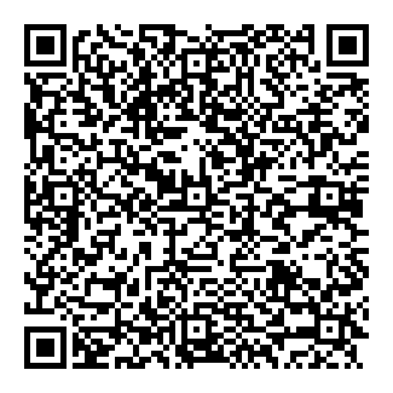

# Bun venit!

:::::: {.columns align=center}
::: {.column width="40%"}
[{width=100%}](https://teams.cloud.microsoft/l/team/19%3AVxKxx_O-NWeyohdw5ZunUYqv4Ai-s5cSD24U1-3eOZc1%40thread.tacv2/conversations?groupId=9aac9415-9492-4850-9ac4-66f7174fa3e1&tenantId=08a1a72f-fecd-4dae-8cec-471a2fb7c2f1)
:::
::: {.column width="56%"}
**AMSS — Analiza și Modelarea Sistemelor&nbsp;Software**

Traian-Florin Șerbănuță\
<traian.serbanuta@unibuc.ro>

Echipa cursului pe Microsoft Teams: codul QR și linkul sunt disponibile și după curs, în prezentarea publicată.

**Codul echipei: `fswo4rl`**
:::
::::::

::: notes
Experiența de programare este punctul de plecare; cursul introduce explicit raționamentul și vocabularul proiectării.

**Organizare:** 70–80 min: deschidere 10, organizare 20, proiect și unelte 20, motivație 20, încheiere până la 10. Teams se poate accesa după curs; exemplul bibliotecii urmează în cursul 2. []{.pace at=0 of=80}
:::

---

# Citatul zilei

> „Controlul complexității este esența programării calculatoarelor.”
>
> Original: “Controlling complexity is the essence of computer programming.”

— **Brian W. Kernighan și P. J. Plauger**

[Sursa: Software Tools in Pascal (1981), p. 311](https://seriouscomputerist.atariverse.com/media/pdf/book/Software%20Tools%20in%20Pascal.pdf#page=320)

::: notes
Reducem complexitatea prin înțelegerea problemei și decizii explicite de proiectare.
:::

---

# Întrebarea de la care pornim

> Poți explica problema și soluția de proiectare suficient de bine încât să îndrumi pe altcineva să o realizeze?

La finalul cursului, ar trebui să puteți:

- analiza o problemă necunoscută, de dimensiuni reduse;
- propune o soluție de proiectare și explica alternativele;
- urmări consecințele schimbării unei cerințe;
- îndruma lucrul cu AI și evalua justificările pe care le oferă.

::: notes
Primele trei competențe trebuie demonstrate și fără AI, prin text, schițe, tabele sau pseudocod. Experiența de programare nu înlocuiește cunoștințele de proiectare.
:::

---

# Program și comunicare

:::::: {.columns align=center}
::: {.column width="70%"}
- **14&nbsp;săptămâni de curs** și **7&nbsp;laboratoare**, de regulă o dată la două săptămâni.
- [Laboratorul 0](https://traiansf.github.io/class/amss2026/lab/00-pregatire.html): orientare opțională, care poate fi parcursă și individual.
- Laboratorul 1 se desfășoară după cursurile 1 și 2.
- Materiale: [traiansf.github.io/class/amss2026](https://traiansf.github.io/class/amss2026/) (codul&nbsp;QR alăturat).
- Întrebări și anunțuri: echipa cursului pe Microsoft Teams.
- Consultații (online): cu programare prin mesaj individual pe MS Teams.
:::
::: {.column width="26%"}
[{width=100%}](https://traiansf.github.io/class/amss2026/)
:::
::::::

::: notes
Fiecare laborator aplică cele două cursuri care îl precedă. Laboratorul 1 transferă ideile din exemplul bibliotecii într-un domeniu nou: mașinile de spălat din cămin.

**Organizare:** Laboratorul 0 este opțional; Laboratorul 1 urmează după cursul 2, conform orarului grupei. Orele și comunicarea sunt pe Teams; codul este pe primul slide. []{.pace at=10}
:::

---

# Evaluare: 10 puncte

| Componentă | Puncte |
|---|---:|
| Dosar de proiectare al echipei | 5 |
| Examen grilă individual | 3 |
| Prezență | 1 |
| Din oficiu | 1 |

**Restanță / mărire:** 9&nbsp;puncte pentru examenul grilă + 1&nbsp;punct din oficiu.

Feedback pentru proiect la cerere, pe parcursul semestrului. Punctajul pentru dosar se definitivează printr-un interviu de echipă la ultimul laborator.

::: notes
Dosarul evaluează cerințele, modelul domeniului, responsabilitățile, contractele și invarianții, starea și comportamentul. Argumentele, alternativele și validarea susțin aceste criterii. Examenul verifică raționamentul pe scenarii, nu memorarea notațiilor. La restanță/mărire: 9 puncte examen + 1 din oficiu, fără reportarea dosarului sau prezenței.

**Organizare:** discuții scurte cu echipele în laboratoare; exercițiile formative nu primesc note separate. Rubrica detaliată este pe pagina proiectului.
:::

---

# Prezența și pregătirea pentru examinare

**Punctajul pentru prezență:** întâlniri la care ați participat ÷ întâlniri de curs și laborator desfășurate pentru grupa voastră.

Fiecare întâlnire, de curs sau de laborator, are aceeași pondere; în mod normal sunt 14&nbsp;cursuri și 7&nbsp;laboratoare, plus Laboratorul&nbsp;0 pentru grupele în care s-a ținut.

**Pregătiți-vă pentru întrebări bazate pe scenarii:**

- Separați o cerință de o ipoteză nejustificată.
- Identificați încălcarea unui invariant sau stabiliți ce tranziție este permisă.
- Comparați soluții de proiectare în raport cu constrângerile date.

::: notes
Prezența se calculează din ședințele efectiv ținute: cursurile comune și laboratoarele grupei studentului. Anulările nu reduc punctajul; Laboratorul 0 contează numai unde s-a ținut, iar Cursul 14 este inclus. Punctajul rămâne între 0 și 1. Dosarul are o notă de echipă; examenul este individual.
:::

---

# Proiectul de echipă

Echipele de **3–5&nbsp;studenți** elaborează o soluție comună.

**Livrabil:** o specificație și o soluție de proiectare revizuite. Modelele și prototipurile le pot susține; nu este obligatorie o aplicație funcțională.

Laboratorul 6 (laborator deschis): finalizarea proiectului și discuții. Laboratorul 7: interviu de echipă, în care se definitivează punctajul pentru dosar.

Livrabilul (repository public) trebuie să fie definitivat cu ~1 săptămână înainte de interviu.

**Pagină cu detalii:** [traiansf.github.io/class/amss2026/proiect](https://traiansf.github.io/class/amss2026/proiect).

::: notes
Evaluăm proiectarea argumentată, nu numărul de commit-uri, diagrame sau șabloane. Modelele și prototipurile pot susține deciziile; aplicația funcțională nu este obligatorie. Echipa verifică și își asumă inclusiv contribuțiile asistate de AI.

**Organizare:** repository public GitHub/GitLab, creat și legat pe Teams la anunțarea proiectului; progresul și contribuțiile membrilor trebuie să poată fi urmărite. []{.pace at=30}
:::

---

# Ce trebuie să poată explica fiecare student

- Problema și regulile domeniului care o privesc.
- Propria contribuție la proiectare și alternativele ei.
- Cum sunt respectate regulile prin contracte și comportament.
- Rezultatele validării și limitele lor.
- Ce schimbă o cerință nouă.

::: notes
Proiectare comună, competențe individuale: fiecare explică propria contribuție și locul ei în sistem, fără a memora implementarea colegilor.
:::

---

# Ce trebuie să rezulte din munca voastră

- O specificație și o soluție de proiectare elaborate temeinic.
- Motivele deciziilor cu consecințe importante.
- Verificări prin scenarii, prin analiza modelelor sau printr-un prototip cu scop precis.
- Sarcini predate explicit și constatări de revizuire pe care le-ați verificat.
- Capacitatea de a judeca singuri, fără AI.

Prezentați verificările concis și legați-le de soluția propusă.

::: notes
Dosarul susține deciziile echipei; examenul verifică judecata individuală pe scenarii. Exercițiile de la curs antrenează construirea unei soluții fără AI. Nu cerem un număr fix de diagrame, șabloane sau defecte și nici reproducerea unui răspuns AI.
:::

---

# Instrumente și organizarea lucrului

- Alegeți un asistent AI și un model AI la care aveți acces.
- Creați un repository public pe GitHub sau GitLab când anunțați proiectul pe Teams; consemnați acolo progresul și contribuțiile membrilor, pe tot parcursul semestrului.
- Definiți explicit rolurile de analist/proiectant și evaluator (agent AI de revizuire).
- Porniți revizuirea într-un context separat, cu sursele necesare.
- Pregătiți-vă să explicați soluția fără asistent AI.

::: notes
Rolurile și predările explicite contează mai mult decât instrumentul ales. Contextele separate pot fi folosite succesiv, cu același asistent AI; nu este necesar un abonament plătit.

**Organizare:** ghiduri în `tooling/SETUP.md` și `tooling/README.md`. Fără acces la instrumente, folosiți exemple pregătite, etichetate ca atare.
:::

---

# Înainte de laboratorul 1

- Citiți [ghidul de pregătire a mediului de lucru](https://github.com/traiansf/traiansf.github.io/blob/main/class/amss-2026/tooling/SETUP.md) și [ghidul despre roluri, predarea sarcinilor și revizuire](https://github.com/traiansf/traiansf.github.io/blob/main/class/amss-2026/tooling/README.md).
- Pregătiți accesul la asistentul AI ales și la fișierele comune.
- Veți lucra în perechi, alternând rolurile.
- Veți analiza singuri un enunț scurt înainte de a folosi AI.

Primul livrabil descrie clar problema și deciziile rămase deschise.

::: notes
Laboratorul pornește de la experiența de programare și introduce termenii de analiză și proiectare. Nu presupune cunoștințe anterioare de UML.

**Organizare:** datele problemei și exercițiul sunt în ghidul laboratorului; nu cereți învățarea unei notații înainte.
:::

---

# De ce studiem analiza și proiectarea?

O implementare poate să funcționeze exact cum am cerut și totuși să&nbsp;rezolve problema greșită.

- Beneficiarii pot folosi același cuvânt pentru lucruri diferite.
- O decizie locală poate îngreuna schimbările ulterioare.
- Un rezultat convingător trebuie să poată fi verificat.

Vom învăța să formulăm întrebări, să comparăm soluții și să explicăm consecințele deciziilor.

::: notes
O cerință interpretată diferit sau o schimbare dificilă arată valoarea clarificării înainte de implementare. Întrebați ce decizie timpurie ar fi ajutat.

**Organizare:** cereți un exemplu din experiența studenților; păstrați explicațiile tehnice pentru cursul 2. []{.pace at=50}
:::

---

# Ce schimbă lucrul cu AI?

AI poate produce rapid variante, documente și cod. Alegerea problemei, verificarea rezultatului și asumarea deciziilor rămân ale voastre.

Vrem să puteți explica de ce o soluție este potrivită și ce constatare v-ar determina să o reconsiderați.

**Discuție:** când ați acceptat un rezultat care părea corect? Cum ați putea să îl verificați mai bine?

::: notes
AI poate ajuta, dar evaluarea rezultatului cere judecată proprie și cunoștințe de proiectare. Discutați și un exemplu reușit; scopul nu este găsirea obligatorie a unei greșeli.

**Organizare:** cereți experiențe concrete, fără acces la conturi sau conversații private.
:::

---

# Cum se leagă întâlnirile?

- Cursul 1: organizarea, așteptările și motivația.
- Cursul 2: înțelegem o problemă înainte să delegăm o soluție.
- Laboratorul 1: aplicăm ideile celor două cursuri unei probleme concrete.
- Fiecare laborator are loc după perechea de cursuri asociată.
- Doar laboratoarele 6 și 7 sunt dedicate proiectelor.

::: notes
[]{.pace at=70}
:::

---

# Pentru întâlnirea următoare

Pregătiți accesul la Teams, la materialele cursului și la asistentul AI ales.

Gândiți-vă la o situație în care o întrebare pusă mai devreme ar fi schimbat soluția propusă.

**Cursul 2:** o bibliotecă ne cere un sistem informatic pentru gestionarea împrumuturilor și returnărilor de cărți. Vom analiza cererea, vom compara interpretări ale ei și vom verifica o soluție propusă de un asistent AI.

---

# Experiența și așteptările voastre

:::::: {.columns align=center}
::: {.column width="30%"}
[{width=100%}](https://forms.gle/uHCXyFvxqQxsWWmH9)
:::
::: {.column width="66%"}
**[Completați chestionarul de început de curs](https://forms.gle/uHCXyFvxqQxsWWmH9)**

După curs, când aveți acces la un dispozitiv, folosiți codul QR sau linkul: [forms.gle/uHCXyFvxqQxsWWmH9](https://forms.gle/uHCXyFvxqQxsWWmH9).

Ce experiență aveți? Ce știți deja și ce ați vrea să aprofundați?

Completarea este facultativă și durează aproximativ 10–12&nbsp;minute. Vom folosi răspunsurile pentru adaptarea conținutului.
:::
::::::

::: notes
Răspunsurile ne ajută să adaptăm cursul; la final vom reveni asupra învățării și îmbunătățirilor.

**Organizare:** invitație pentru toate grupele; completare facultativă după curs, din prezentarea publicată.
:::
