# Începem cu întrebări {.transition}

Ce trebuie să înțelegem înainte de a propune o soluție?

::: notes
Înaintea unei soluții, identificăm ce trebuie clarificat și ce decizii depind de răspunsuri.

**Organizare:** minutul 0 din 100; interval 0–15 (15 min), inclusiv deschiderea, citatul și exercițiul de întrebări. []{.pace at=0 of=100}
:::

---

# Întrebarea de astăzi

Ce trebuie să înțelegem înainte de a cere unei persoane sau unui asistent AI să propună o soluție?

Astăzi analizăm o problemă de dimensiuni reduse, comparăm decizii și verificăm ce anume le susține.

::: notes
O soluție poate fi plauzibilă și totuși nepotrivită problemei. Înainte de delegare, avem nevoie de reguli clare și criterii de verificare. Astăzi introducem principiile pe care le vom aprofunda ulterior.

**Organizare:** 100 min; reperele sunt la tranziții. Laboratorul 1 urmează după acest curs.
:::

---

# Citatul zilei

> „Simplitatea este o condiție necesară pentru fiabilitate.”
>
> Original: “Simplicity is prerequisite for reliability.”

— **Edsger W. Dijkstra**

[Sursa: How do we tell truths that might hurt? — EWD498](https://www.cs.virginia.edu/~evans/cs655/readings/ewd498.html)

::: notes
Înțelegerea se vede într-o descriere pe care o putem explica și verifica înainte de delegare.

**Sursă:** transcriere universitară; afirmație marcată drept adnotare manuscrisă. Original: arhiva Dijkstra, UT Austin, EWD498.
:::

---

# Pornim de la o solicitare

Biblioteca este beneficiarul sistemului informatic. Bibliotecara o reprezintă și ne prezintă solicitarea:

> „Avem nevoie de un sistem informatic pentru gestionarea împrumuturilor și returnărilor de cărți. Membrii ar trebui să poată și depune o cerere de împrumut pentru o carte atunci când aceasta este împrumutată.”

Înainte de a cere unui agent AI să construiască ceva:

**Ce ar trebui să înțelegeți?**

::: notes
Solicitarea bibliotecarei este intenționat incompletă. Cuvinte aparent clare, precum „carte” sau „cerere”, pot ascunde reguli și identități diferite.

**Organizare:** nu arătați încă precizările bibliotecarei.
:::

---

# Exercițiu: întrebări înainte de soluții

> „Avem nevoie de un sistem informatic pentru gestionarea împrumuturilor și returnărilor de cărți. Membrii ar trebui să poată și depune o cerere de împrumut pentru o carte atunci când aceasta este împrumutată.”

Lucrați pe o coală albă, mai întâi singuri, apoi cu un coleg.

1. Scrieți două întrebări ale căror răspunsuri ar putea schimba proiectarea.
2. Descrieți o situație concretă de împrumut.
3. Numiți un lucru pe care l-ați exclude din prima versiune.

În pereche: alegeți una dintre întrebări și explicați **cum ar putea răspunsul bibliotecarei să schimbe proiectarea**.

::: notes
Întrebări utile: „carte” înseamnă titlu sau exemplar? Ce promite cererea de împrumut? Cine primește un exemplar dorit de doi membri? Cereți legătura dintre întrebare și o decizie; alegerea unui framework nu rezolvă aceste incertitudini.

**Organizare:** 6 min: 2 individual, pe coli albe, 1 în pereche, 3 pentru trei răspunsuri diferite, fără comparație cu o listă ascunsă. Lăsați slide-ul pe ecran. []{.pace dur=6}
:::

---

# Clarificăm solicitarea și limitele {.transition}

Ce comportament convenim cu bibliotecara?

::: notes
Răspunsurile bibliotecarei devin reguli explicite. Legăm fiecare precizare de o întrebare și delimităm fluxul pe care îl proiectăm.

**Organizare:** minutul 15 din 100; interval 15–25 (10 min), pentru R1–R6 și limite. []{.pace at=15}
:::

---

# Ce precizează bibliotecara: identitate

**R1 — Identitate**

- Fiecare titlu, exemplar și membru are un identificator distinct.
- Un titlu poate avea mai multe exemplare fizice; fiecare exemplar aparține unui singur titlu.
- Catalogul și evidența membrilor există deja.

Un exemplar este **disponibil** dacă nu este nici împrumutat, nici rezervat.

::: notes
Un titlu și exemplarele sale au identități diferite. R1–R6 sunt precizările făcute de bibliotecară pentru acest exercițiu, nu reguli universale ale bibliotecilor.
:::

---

# Ce precizează bibliotecara: împrumut

**R2 — Împrumut**

- Un membru poate împrumuta un exemplar disponibil sau unul rezervat chiar pentru el.
- Se creează un împrumut care leagă exemplarul de membru. Un exemplar are cel mult un împrumut activ.
- **Ridicarea** este împrumutul exemplarului rezervat de către solicitant: rezervarea se încheie, iar cererea de împrumut este îndeplinită.
- Dacă exemplarul este împrumutat sau rezervat altcuiva, operația se respinge fără modificarea stării.

**Rezervarea păstrează exemplarul pentru membru; împrumutul începe la ridicare.**

---

# Ce precizează bibliotecara: returnare

**R3 — Returnare**

- Returnarea închide împrumutul activ al exemplarului și îl păstrează în istoric.
- În aceeași operație, exemplarul este rezervat primei cereri în așteptare pentru titlul său, conform R5.
- Dacă nu există cereri în așteptare, exemplarul devine disponibil.
- Fără împrumut activ, returnarea se respinge fără modificarea stării.

Returnarea poate face exemplarul **rezervat**, nu neapărat disponibil.

---

# Ce precizează bibliotecara: cerere de împrumut

**R4 — Cerere de împrumut**

- Membrul cere un **titlu**, fără să aleagă un exemplar.
- Cererea se acceptă numai dacă titlul nu are exemplare disponibile și membrul nu are deja o cerere neîncheiată pentru același titlu.
- Se înregistrează membrul, titlul și ordinea depunerii; cererea intră în așteptare.
- O cerere în așteptare sau cu exemplar rezervat este **neîncheiată**. Duplicatul și cererea pentru un titlu cu exemplar disponibil se resping fără modificări.

Cererea îi dă membrului un loc în ordinea de așteptare pentru exemplarele returnate; nu este nici o căutare în catalog, nici un împrumut.

---

# Ce precizează bibliotecara: rezervare

**R5 — Ordinea cererilor și rezervarea**

- Pentru fiecare titlu, cererile în așteptare sunt servite în ordinea înregistrării.
- Fiecare exemplar returnat este rezervat primei cereri încă în așteptare. Cererea reține exemplarul alocat.
- O cerere cu exemplar deja rezervat nu mai participă la alocarea altui exemplar.
- Un exemplar are cel mult o rezervare activă și nu poate fi simultan împrumutat și rezervat.

Doar solicitantul poate ridica exemplarul rezervat; ridicarea îndeplinește cererea (R2).

---

# Și delimitarea funcționalității este o decizie

**R6 — Delimitare.** Includem:

- Împrumutul și returnarea, cu păstrarea istoricului.
- Cererea de împrumut, ordinea de așteptare și rezervarea la returnare.
- Ridicarea exemplarului rezervat, care îndeplinește cererea.

Operațiile folosesc identificatori cunoscuți și se procesează **pe rând**, inclusiv înregistrarea cererilor. Rezervarea rămâne până la ridicare.

Rămân în afara exercițiului: expirarea/anularea rezervărilor și cererilor, notificările, amenzile, prelungirile, autentificarea și modificarea catalogului.

::: notes
Cererea produce un flux util: loc în ordinea de așteptare → exemplar rezervat la returnare → împrumut la ridicare. Procesarea pe rând stabilește ordinea cererilor, fără să comparăm ore exacte. Expirarea și notificările sunt în afara exercițiului, nu neimportante pentru o bibliotecă reală.
:::

---

# Construim un model {.transition}

Ce concepte, responsabilități și reguli explică problema?

::: notes
Transformăm regulile în concepte, legături și responsabilități. Modelul trebuie să explice ce se schimbă și ce trebuie să rămână adevărat.

**Organizare:** minutul 25 din 100; interval 25–45 (20 min), din care 8 min pentru propunerile studenților. []{.pace at=25}
:::

---

# Cinci tipuri de afirmații

| Tip de afirmație | Exemplu din bibliotecă |
|----|--------|
| Informație convenită | R2: un exemplar are cel mult un împrumut activ. |
| Consecință dedusă | Exemplarele unui titlu pot avea stări diferite. |
| Întrebare deschisă | Poate returna exemplarul și altcineva? R3 nu spune. |
| Ipoteză | Provizoriu: oricine poate returna exemplarul. |
| Propunere de proiectare | Operația de împrumut verifică R2. |

Ipoteza răspunde provizoriu unei întrebări deschise. Ea și propunerea devin informație convenită numai după confirmarea bibliotecarei.

::: notes
Ipoteza răspunde provizoriu unei întrebări deschise și rămâne marcată până la confirmare. Din R1–R2 deducem că disponibilitatea se stabilește pe exemplar; R2 nu limitează numărul de împrumuturi pe membru. Durata rezervării ar fi tot o întrebare deschisă pentru o bibliotecă reală, dar R6 o lasă în afara exercițiului: nu blochează ce proiectăm azi.

„Folosește o bază de date relațională” nu răspunde la „ce este o carte?”. Tehnologia poate fi o restricție legitimă a bibliotecarei; aici nu a fost impusă. Legați distincțiile de întrebările studenților.
:::

---

# Exercițiu: propuneți un model

**Date:** Titlul **T** are exemplarele **C1** împrumutat lui M1 și **C2** împrumutat lui M3. Nu există cereri sau rezervări. M2 depune o cerere de împrumut pentru T, apoi M1 returnează C1.

**Reguli:** R1: titlul și exemplarele sunt distincte. R4: cererea leagă membrul de titlu; se acceptă dacă niciun exemplar nu este disponibil. R3: returnarea închide împrumutul și îl păstrează în istoric. R5: exemplarul returnat se rezervă primei cereri în așteptare. R2: numai solicitantul îl ridică; ridicarea creează un împrumut nou, încheie rezervarea și îndeplinește cererea.

Pe hârtie, apoi în pereche:

1. Descrieți situația după returnarea lui C1: ce elemente există, ce știm despre fiecare și cum sunt legate?
2. Ce informație permite respingerea unei încercări a lui M3 de a împrumuta C1?
3. Ce se schimbă atunci când M2 ridică C1?

::: notes
Cererea lui M2 se acceptă: ambele exemplare sunt împrumutate. După returnare, împrumutul lui M1 este închis și păstrat în istoric, C1 este rezervat lui M2, iar C2 rămâne împrumutat lui M3. Legătura rezervării C1–M2 permite respingerea lui M3. La ridicare, M2 primește un împrumut nou; rezervarea se încheie, iar cererea este îndeplinită. Acceptați reprezentări diferite, cu justificare.

**Organizare:** 5 min individual + 3 min în pereche, cu slide-ul pe ecran. Ascultați două propuneri înaintea modelului lucrat. []{.pace dur=8}
:::

---

# Modelarea domeniului

Modelul domeniului: conceptele bibliotecii și legăturile lor, nu clasele unui program.

| Concept | Ce reprezintă | Reguli |
|------------------|--------------------------------------------------|-------|
| Titlu | Descrierea din catalog; poate avea mai multe exemplare | R1 |
| Exemplar | Obiectul fizic; aparține unui singur titlu | R1 |
| Membru | Persoana înscrisă; împrumută și depune cereri | R1 |
| Împrumut | Leagă un membru de un exemplar; activ sau închis | R2–R3 |
| Cerere de împrumut | Leagă un membru de un titlu; păstrează ordinea depunerii | R4–R5 |
| Rezervare | Leagă cererea de exemplarul alocat solicitantului | R5 |

Cererea privește un **titlu**; rezervarea și împrumutul privesc un **exemplar**.

::: notes
La returnare se închide împrumutul și se poate aloca un exemplar unei cereri; titlul continuă să existe. O singură stare pe titlu nu exprimă aceste fapte. Rezervarea poate fi entitate separată sau legătură și stare ale cererii; comparați cu propunerile studenților, fără a impune clase.
:::

---

# Proiectare: cine de ce răspunde?

**Decizie:** operația de împrumut răspunde de respectarea regulii din R2: un exemplar are cel mult un împrumut activ.

Ea trebuie să:

1. Identifice exemplarul și membrul.
2. Verifice că exemplarul nu este împrumutat și nici rezervat altui membru.
3. Înregistreze împrumutul; la ridicare, să încheie rezervarea și să marcheze cererea îndeplinită.

O astfel de obligație a unei părți a soluției (funcție, obiect, serviciu) se numește **responsabilitate**. Interfața poate afișa disponibilitatea, dar regula trebuie verificată și în momentul împrumutului.

::: notes
La fel, înregistrarea cererii verifică lipsa exemplarelor disponibile și unicitatea cererii neîncheiate, apoi îi atribuie ordinea (R4). Dacă și interfața, și operația ar verifica R2, o schimbare a regulii ar trebui făcută în două locuri: această dependență se numește cuplare. Verificările aceleiași reguli, grupate într-un singur loc, dau coeziune. Ambele revin în cursul despre responsabilități.

**Organizare:** termenii coeziune și cuplare doar se menționează; R6 cere procesare pe rând, deci nu discutăm aici mecanisme de blocare.
:::

---

# Contracte și invarianți: reguli verificabile

**Invarianți** — reguli care rămân adevărate înainte și după fiecare operație:

- Un exemplar are cel mult un împrumut activ.
- Un exemplar nu este simultan împrumutat și rezervat.

**Contractul operației de împrumut** — ce garantează operația, la reușită și la respingere:

- Dacă reușește, exemplarul are un nou împrumut activ, pe numele membrului care îl împrumută.
- Dacă exemplarul era rezervat acestui membru, rezervarea se încheie și cererea este îndeplinită.
- Dacă exemplarul este împrumutat sau rezervat altcuiva, încercarea este respinsă fără modificarea stării.
- Celelalte împrumuturi și rezervări rămân neschimbate.

::: notes
Invariantul privește orice stare; contractul privește o operație, inclusiv respingerea ei. Ultimul punct al contractului spune ce nu se schimbă; pe el se sprijină răspunsul din S6, unde rezervarea lui M2 rămâne după ridicarea lui M4. Enunțarea invariantului nu rezolvă singură accesul concurent: dacă acesta intră în problemă, implementarea trebuie să-i asigure păstrarea.
:::

---

# Comportament: stările unui exemplar

:::::: {.columns align=center}
::: {.column width="42%"}

```mermaid
%%{init: {"theme":"base","themeVariables":{"primaryColor":"#F3F7F8","primaryTextColor":"#0A2145","primaryBorderColor":"#087373","lineColor":"#087373","fontFamily":"Arial","fontSize":"20px"}}}%%
stateDiagram-v2
    direction TB
    accTitle: Stările unui exemplar
    accDescr: Tranzițiile numerotate sunt explicate în tabel. Împrumutul și ridicarea duc în starea Împrumutat; returnarea duce în Disponibil sau Rezervat; o încercare de împrumut respinsă păstrează starea Împrumutat sau Rezervat.
    state "Disponibil" as D
    state "Împrumutat" as I
    state "Rezervat" as R
    D --> I: 1
    I --> D: 2
    I --> R: 3
    R --> I: 4
    I --> I: 5
    R --> R: 5
```

:::
::: {.column width="54%"}
| Nr. | Eveniment și condiție |
|:----------:|------------------------------------------------------------------------------------------|
| 1 | Împrumut al unui exemplar disponibil. |
| 2 | Returnare, fără cereri în așteptare. |
| 3 | Returnare; rezervare pentru prima cerere în așteptare. |
| 4 | Ridicare de către solicitant; cerere îndeplinită. |
| 5 | Împrumut respins: exemplar deja împrumutat sau rezervat altui membru; fără modificări. |
:::
::::::

::: notes
Returnarea duce la disponibil (2) sau la rezervat pentru prima cerere (3). Buclele 5 sunt respingeri fără schimbarea stării: exemplar deja împrumutat sau rezervat altui membru. Ridicarea (4) creează împrumutul, încheie rezervarea și îndeplinește cererea.

Două exemplare ale aceluiași titlu pot avea stări diferite. Diagrama acoperă tranzițiile discutate, nu toate încercările posibile: returnările respinse, fără împrumut activ (a doua scanare din S4), nu sunt desenate. Nu impune un enum ca implementare.
:::

---

# Fiecare reprezentare răspunde la anumite întrebări

- Un glosar, ca tabelul conceptelor, fixează sensul cuvintelor.
- Un contract spune ce garantează o operație.
- O diagramă de stări arată schimbările de stare și unele încercări respinse.
- O schiță poate clarifica responsabilități sau limite.
- Scenariile concrete pun la încercare ce afirmă celelalte reprezentări.

Alegeți reprezentarea care face decizia mai ușor de verificat.

::: notes
Notația nu înlocuiește înțelegerea. Diagrama stărilor nu arată ordinea cererilor, istoricul împrumuturilor sau cine impune regula. Aceste întrebări justifică perspective complementare, nu un număr obligatoriu de diagrame. Modelele executabile mici, care pot explora automat consecințele, apar în cursul despre validare.
:::

---

# Punem modelul la încercare {.transition}

Ce se întâmplă în scenarii concrete?

::: notes
Urmărim starea înainte și după operații: modelul trebuie să explice atât acceptarea, cât și respingerea, fără efecte nepermise.

**Organizare:** minutul 45 din 100; interval 45–60 (15 min): S1–S2 6 min, S3–S4 4 min, S5 2 min, S6 3 min, cu discuții și tranziție. []{.pace at=45}
:::

---

# Scenariul 1 (S1): un titlu, două exemplare

**Stare inițială:** T are C1 și C2 disponibile; membrii M1–M4 există; niciun împrumut, nicio cerere, nicio rezervare.

**S1:** M1 împrumută C1. C1 devine împrumutat lui M1; C2 rămâne disponibil.

**R1–R2:** exemplarele sunt distincte; împrumutul privește un exemplar.

S2–S6 pornesc fiecare **independent după S1**, nu unul după altul.

::: notes
[]{.pace dur=3}
:::

---

# Scenariul 2 (S2): de la cerere la împrumut

**După S1:** C1 este la M1, C2 disponibil; fără cereri sau rezervări.

| Pas | Rezultat cerut |
|---|---|
| M3 împrumută C2; M2 depune o cerere de împrumut pentru T | Ambele exemplare împrumutate; cererea lui M2 așteaptă |
| M1 returnează C1 | Împrumut închis; C1 rezervat lui M2 |
| M3 încearcă să împrumute C1 | Respingere; rezervarea rămâne |
| M2 ridică C1 | Împrumut nou; cerere îndeplinită; rezervare încheiată |

**R4–R5:** cererea se acceptă, fiindcă niciun exemplar nu este disponibil, și primește exemplarul returnat. **R2:** exemplarul rezervat poate fi ridicat doar de solicitant.

::: notes
[]{.pace dur=3}
:::

---

# Exercițiu: respingerea păstrează starea

**După S1:** C1 este împrumutat lui M1, C2 este disponibil; nu există cereri sau rezervări. S3 și S4 pornesc separat din această stare.

M1 aduce C1 la ghișeu ca să-l returneze. După el, M2 vrea un exemplar din T, fără cerere depusă.

- **S3:** Bibliotecara, grăbită, scanează C1 pe contul lui M2, fără să înregistreze mai întâi returnarea. Ce răspunde sistemul? Ce s-ar strica dacă ar accepta?
- **S4:** Bibliotecara înregistrează returnarea lui C1, dar scanează exemplarul de două ori. Apoi îl împrumută lui M2. Ce se întâmplă la fiecare pas? Ce conține istoricul la final?

**R2:** un exemplar disponibil se poate împrumuta (împrumut nou); unul deja împrumutat, nu. **R3:** returnarea închide împrumutul activ și îl păstrează în istoric; fără cereri în așteptare, exemplarul devine disponibil. Fără împrumut activ, returnarea se respinge. Respingerile nu modifică starea.

Pe hârtie: starea după fiecare pas și regula aplicată.

::: notes
S3: se respinge (R2), fără modificări; altfel C1 ar avea două împrumuturi active. Închiderea automată a împrumutului lui M1 ar fi o regulă nouă, de convenit cu bibliotecara.

S4 este o ramură separată, tot din starea de după S1. Returnarea închide împrumutul lui M1 și face C1 disponibil; a doua scanare se respinge (R3); împrumutul lui M2 este o înregistrare nouă. La final, istoricul păstrează împrumutul închis al lui M1, iar M2 are un împrumut activ, distinct.

**Organizare:** 4 min, cu slide-ul pe ecran. []{.pace dur=4}
:::

---

# Exercițiu: S5 — când acceptăm cererea?

**După S1:** C1 este la M1, C2 disponibil; fără cereri sau rezervări. M2 și M3 sunt membri cunoscuți.

1. M2 depune o cerere de împrumut pentru T.
2. M3 împrumută C2.
3. M2 depune o cerere de împrumut pentru T, apoi o repetă.

**R4:** acceptăm o cerere numai dacă nu există exemplare disponibile și nici altă cerere neîncheiată a aceluiași membru pentru același titlu. Respingerea nu modifică starea.

Pe hârtie: ce se acceptă, ce se respinge și câte cereri rămân?

::: notes
Prima cerere se respinge: C2 este disponibil. După împrumutul lui C2 se acceptă cererea M2/T; repetarea se respinge. La final așteaptă o singură cerere. S5 pornește independent după S1.

**Organizare:** 2 min, cu slide-ul pe ecran. []{.pace dur=2}
:::

---

# Exercițiu: S6 — cine primește exemplarul?

**După S1:** C1 este la M1, C2 disponibil; fără cereri sau rezervări. M1–M4 sunt membri cunoscuți.

1. M3 împrumută C2.
2. M2 depune o cerere de împrumut pentru T, apoi M4 depune una.
3. M3 returnează C2, apoi M1 returnează C1.

**R4:** cererile se acceptă, fiindcă niciun exemplar nu este disponibil. **R5:** fiecare exemplar returnat merge la prima cerere încă în așteptare; o cerere care are deja un exemplar rezervat nu mai primește altul. **R2:** fiecare solicitant ridică exemplarul rezervat propriei cereri.

Pe hârtie: cui îi rezervăm fiecare exemplar? Poate M4 să-l ridice pe al său înainte de M2?

::: notes
C2 se rezervă lui M2, C1 lui M4; împrumuturile apar abia la ridicare. M4 poate ridica primul: ordinea cererilor decide alocarea, nu ordinea venirii la bibliotecă. S6 pornește independent după S1.

**Organizare:** 3 min, cu slide-ul pe ecran. []{.pace dur=3}
:::

---

# Delegăm și verificăm {.transition}

Ce îi dăm agentului AI și cum îi evaluăm rezultatul?

::: notes
Delegăm o sarcină delimitată și evaluăm rezultatul față de reguli și scenarii. Verificăm inclusiv concluziile evaluatorului (agent AI de revizuire).

**Organizare:** minutul 60 din 100; interval 60–85 (25 min): introducere 6, exemplu pregătit și revizuire 17, sinteză 2, inclusiv discuțiile. []{.pace at=60}
:::

---

# AI poate accelera aceste activități

Putem cere unui agent AI să:

- Organizeze faptele date și întrebările deschise.
- Propună soluții de proiectare și să le compare consecințele.
- Construiască scenarii care pun la încercare o regulă.
- Explice o parte nefamiliară a unui sistem existent.
- Revizuiască o soluție pe baza unor criterii explicite.

**Întrebare:** ce stabilește fiecare verificare pe care o faceți deja (citiți propunerea, întrebați alt agent AI, rulați teste, cereți o explicație) și ce nu poate stabili?

::: notes
Un alt agent AI oferă o opinie, nu o confirmare; testele acoperă cazurile alese, iar fluența nu garantează corectitudinea. Evaluarea cere cunoștințe proprii. Și un răspuns bun trebuie susținut prin enunț, cu limitele verificării precizate.

**Organizare:** ascultați 2–3 răspunsuri; nu cereți găsirea obligatorie a unei greșeli.
:::

---

# Proiectăm înainte de a implementa

**Problemă și specificație → proiectare → plan de implementare → implementare și testare**

Revizuim rezultatul fiecărei etape înainte de a-l transmite mai departe. O problemă găsită târziu ne întoarce la decizia care a produs-o.

Înainte de implementarea de amploare:

- Stabiliți limitele, regulile și întrebările încă deschise.
- Explicați responsabilitățile, contractele și comportamentul.
- Verificați soluția pe scenariile importante, inclusiv pe respingeri.
- Transmiteți explicit sarcina și contextul etapei următoare.

::: notes
Investim într-o specificație și o proiectare temeinice înainte de implementarea de amploare. Scenariile și prototipurile pot valida decizii încă din aceste etape. TDD este o opțiune de implementare; proiectul nu cere nici TDD, nici o aplicație funcțională.
:::

---

# Ce conține o predare utilă a sarcinii?

La predarea sarcinii (**handoff**), dați următorului agent AI:

- Limitele convenite și cerințele originale (R1–R6), nu doar un rezumat.
- Deciziile de proiectare și justificarea lor.
- Regulile care trebuie să rămână adevărate.
- Întrebările deschise și deciziile pe care le blochează.
- Rezultatul cerut și verificările pentru acceptarea lui.

„Construiește aplicația bibliotecii” lasă aceste decizii implicite.

::: notes
Predarea păstrează contextul necesar și criteriile de verificare, fără a deveni un transcript. Aici cerem o descriere concisă a proiectării; pentru implementare ar trebui adăugate detaliile tehnice relevante.
:::

---

# Exemplu pregătit: delegare și verificare

Parcursul exemplului:

1. Identificăm contextul necesar unui agent AI cu rol de proiectant: enunțul clarificat al bibliotecii.
2. Verificăm conceptele, regulile și responsabilitățile propuse.
3. Examinăm pachetul pentru un evaluator (agent AI de revizuire): enunțul, soluția și criteriile de verificare.
4. Decidem ce constatări sunt susținute de enunț.

**Sarcina voastră:** explicați o decizie acceptată și puneți la încercare o afirmație.

Parcurgem pe slide-uri prompturile și **răspunsurile AI reale**, capturate înainte de curs (Codex, gpt-6.1-sol, 7 octombrie 2026). Analizați propunerea și revizuirea pe hârtie, folosind regulile și scenariile afișate.

::: notes
Verificarea poate confirma o afirmație, nu doar găsi defecte. Judecăm rezultatul prin reguli și scenarii; nu inventăm erori într-o soluție corectă.

**Organizare:** ghid: `02-intelegere-demo.md`; toate materialele sunt pe slide-uri. Capturile integrale și prompturile sunt în `scenarios/02-biblioteca/captures/2026-10-07/`. []{.pace at=66}
:::

---

# Ce îi cerem agentului AI cu rol de proiectant

**Context predat:** solicitarea bibliotecarei, regulile R1–R6 și scenariile S1–S6 prezentate anterior. **Cele trei operații:** împrumutul (inclusiv ridicarea), returnarea și cererea de împrumut.

> Propune o proiectare concisă, fără codul aplicației. Distinge conceptele domeniului și atribuie responsabilitățile celor trei operații.
>
> Precizează regulile împrumutului și rezervării, ordinea cererilor și rezultatele la succes și respingere. Parcurge S1–S6 și indică regulile care susțin deciziile.
>
> Separă cerințele, alegerile și întrebările deschise. Respectă R6. Încheie cu ce poate fi predat etapei următoare și cu limitele soluției.

::: notes
Contextul predat trebuie să susțină rezultatul cerut: enunțul integral, regulile, limitele și scenariile justifică o sarcină delimitată. Răspunsul AI numără la fel cele trei operații: ridicarea este un caz al împrumutului.

**Sursă:** `proiectant-01-prompt.md`, secțiunea „Sarcina”, integral; același fișier conține copia enunțului primit.

**Organizare:** prompt pentru pregătirea rulării; studenții îl discută, nu trebuie să-l trimită.
:::

---

# Proiectarea AI păstrează legăturile necesare?

**Fragment din răspunsul AI — gpt-6.1-sol, proiectant, rularea 1:**

> Împrumut | Înregistrare distinctă care leagă membrul de exemplar; activă sau închisă. Împrumuturile închise rămân în istoric.
>
> […]
>
> Rezervare | Alocă un exemplar unei cereri și solicitantului ei; rămâne activă până la ridicare.

**S2:** C1 a fost returnat și rezervat lui M2; C2 este încă împrumutat lui M3.

**R2:** ridicarea este permisă numai solicitantului. **R5:** rezervarea identifică exemplarul alocat cererii.

Pe hârtie: ce legături verificăm pentru a decide dacă M3 poate împrumuta C1?

::: notes
Urmărim C1 → rezervare → cerere → M2; M3 nu este solicitantul. Respingem împrumutul fără schimbări. Împrumutul lui M3 privește C2, deci nu îi dă drept asupra lui C1. Proiectarea AI păstrează distincțiile necesare.

**Sursă:** captură din 7 octombrie 2026, `proiectant-01-response.md`; două rânduri din tabel, cu omisiune marcată. Tabelul este redat ca citat.

**Organizare:** 2 min pe acest slide. []{.pace dur=2}
:::

---

# Ce predăm evaluatorului AI

**Context nou:** solicitarea, R1–R6, S1–S6 și proiectarea de examinat, fără conversația proiectantului. Poate fi același model AI, într-o conversație nouă.

> Revizuiește proiectarea față de regulile și scenariile date, fără să o modifici.
>
> Pentru fiecare constatare, indică afirmația vizată, regula și un scenariu sau o altă justificare verificabilă.
>
> Distinge defectele de alternativele de proiectare și de întrebările despre extinderi. Nu adăuga cerințe excluse prin R6. Dacă nu găsești defecte, precizează ce ai verificat și limitele revizuirii.

Ce ar lipsi dacă am preda doar proiectarea și instrucțiunea „verifică dacă e corect”?

::: notes
Contextul separat face explicit ce primește evaluatorul AI, dar nu garantează o revizuire imparțială sau corectă.

**Organizare:** păstrați promptul pe ecran în timpul răspunsurilor.
:::

---

# Verificăm și revizuirea

**Fragment din răspunsul AI — gpt-6.1-sol, evaluator, rularea 1:**

> În S6, C2 este alocat lui M2, apoi C1 lui M4. Ridicarea mai devreme de către M4 nu afectează rezervarea lui M2.

**R5:** ordinea cererilor decide alocarea; o cerere cu exemplar rezervat nu mai așteaptă alocarea altuia. **R2:** fiecare membru poate ridica propriul exemplar rezervat.

**S6:** C2 a fost rezervat lui M2, apoi C1 lui M4. M4 ajunge primul la bibliotecă și ridică C1.

Pe hârtie: acceptați constatarea? Indicați regula și starea celor două exemplare după ridicare.

::: notes
Acceptăm: ordinea alocării nu impune ordinea ridicării. C1 devine împrumutat lui M4; C2 rămâne rezervat lui M2. Confirmăm concluzia prin reguli, nu prin autoritatea evaluatorului AI.

**Sursă:** `evaluator-01-response.md`, justificarea din rândul despre ordinea alocării (R5), captură din 7 octombrie 2026.

**Organizare:** păstrați slide-ul pe ecran cât lucrează studenții.
:::

---

# Decizia noastră asupra revizuirii

**Concluzia evaluatorului AI — gpt-6.1-sol, rularea 1:**

> Nu am identificat defecte în proiectarea prezentată față de R1–R6 și S1–S6.

**Decizia noastră:** acceptăm proiectarea ca bază pentru etapa următoare. Aici am verificat S2 și S6; parcurgerea S1–S6 din răspunsul integral a fost verificată înainte de curs.

**Limita precizată de evaluatorul AI:**

> Nu verifică o implementare, persistența datelor sau executarea efectivă a schimbărilor împreună.

**Următorul agent AI:** poate elabora planul pentru fluxul cerere → rezervare → împrumut. Rămân de clarificat expirarea, notificările, accesul simultan de la mai multe ghișee și punerea în producție.

::: notes
„Nu am identificat defecte” este o concluzie limitată de obiectul verificării. Nu am rulat o aplicație. Putem accepta o proiectare fără să pretindem că implementarea viitoare este deja validată. „Executarea efectivă a schimbărilor împreună” înseamnă aplicarea ca un tot a tuturor schimbărilor unei operații, de exemplu închiderea împrumutului și rezervarea la returnare.

**Sursă:** două fragmente distincte din `evaluator-01-response.md`: prima propoziție din primul paragraf și a doua din ultimul, capturate la 7 octombrie 2026.
:::

---

# Înainte de predare: ce păstrează rezumatul?

**Fragment din răspunsul AI — gpt-6.1-sol, proiectant, rularea 1:**

> Cererile sunt alocate în ordinea înregistrării, separat pentru fiecare titlu. O cerere cu exemplar rezervat nu mai participă la alocări. Ordinea ridicării poate fi diferită de ordinea alocării (R5).

**Surse:** R5 stabilește rezervarea și prioritatea; R2 permite ridicarea numai de către solicitant. R6 lasă expirarea în afara exercițiului.

Ce s-ar pierde dacă rezumatul ar spune doar „cererile sunt servite în ordine”? Indicați distincția omisă și regula sursă.

::: notes
Formula scurtă poate confunda alocarea cu ridicarea. Verificăm sinteza prin R2 și R5; în S6, M4 poate ridica înaintea lui M2. Fluența nu înlocuiește regulile detaliate.

**Sursă:** `proiectant-01-response.md`, paragraf integral, capturat la 7 octombrie 2026.

**Organizare:** lăsați fragmentul și regulile pe ecran. []{.pace at=83}
:::

---

# Revedem deciziile și sintetizăm {.transition}

Ce schimbăm când modelul domeniului nu mai explică problema?

::: notes
O problemă găsită târziu ne poate obliga să revenim asupra unei decizii timpurii. Alegem corecția după cerința încălcată și dependențele ei.

**Organizare:** minutul 85 din 100; interval 85–95 (10 min), pentru exercițiu, cele cinci idei și legătura cu întâlnirile următoare. []{.pace at=85}
:::

---

# O ipoteză implicită: titlu = exemplar

**Mesajul 1:** solicitarea bibliotecarei, apoi „Propune un model de date și operațiile principale pentru acest sistem. Răspunde concis, fără cod complet.”

**Fragment din răspunsul AI — Claude Haiku 4.5, rularea 2, 9 octombrie 2026:**

> **Cărți** — ID, Titlu, Autor, ISBN, Anul publicării — Stare (disponibilă/împrumutată) — Locație în bibliotecă

Titlul și exemplarul devin un singur lucru, fără ca alegerea să fie marcată drept ipoteză. De ea depind ce alege membrul, ce identifică împrumutul, cum se calculează disponibilitatea și ce verifică testele returnării: o corectare ulterioară le schimbă pe toate.

*Rulare selectată din patru: celelalte trei au separat titlul de exemplar din primul răspuns.*

::: notes
Costul erorii se explică prin deciziile care depind de ea, nu printr-un multiplicator numeric arbitrar. Promptul cerea „un model de date”, de aceea răspunsul seamănă cu o schemă de tabele; problema este însă conceptuală. La mesajul 3, cu două exemplare, același agent AI scrie „Corectură majoră: Exemplare vs. Cărți”: starea trece pe exemplar, împrumutul trimite la exemplar, nu la carte, iar returnarea alocă exemplarul. De aceea clarificăm înaintea implementării de amploare.

Celelalte trei rulări (încă una Claude Haiku 4.5 și două `gpt-6-luna`, reasoning effort `low`) au separat titlul de exemplar din primul răspuns: am selectat o greșeală posibilă, nu performanța tipică.

**Sursă:** `scenarios/02-biblioteca/captures/2026-10-09/`: `mesaj-1-prompt.md` (solicitarea și instrucțiunea de pe slide) și `haiku45-02-mesaj-1-response.md`; lista atributelor este redată pe un rând. Claude Code 2.1.294, model cerut `claude-haiku-4-5`.
:::

---

# Corecție locală sau reproiectare?

**Mesajul 2**, în aceeași conversație:

> Bibliotecara a raportat o problemă: M2 a depus o cerere pentru „Ion”, care era împrumutată de M1. Când M1 a returnat-o, M3 a ajuns primul la ghișeu și a împrumutat-o, deși M2 o ceruse înaintea lui. Corectează modelul.

**Fragment din răspunsul AI — Claude Haiku 4.5, rularea 2:**

> **3. Regulă la împrumut nou** — **Verifică**: "Sunt cereri în așteptare pentru această carte?" — Dacă da → **Refuz împrumut** (carte e deja promisă) — Doar membrul cu rezervare activa poate o lua\
> **4. Stări extinse pentru carte** — disponibilă, împrumutată, **rezervată (pentru ID Membru specific)**, sub întreținere

**Exercițiu:** două exemplare din „Ion”, unul împrumutat lui M1, celălalt pe raft: le poate reprezenta modelul corectat? Ce distincție lipsește?

::: notes
Starea „rezervată” rezolvă defectul raportat, dar păstrează o singură stare pe carte: nu permite împrumuturi independente pe exemplare. Lipsesc distincția titlu–exemplar și exemplarul vizat de împrumut. La mesajul 3, cu două exemplare, agentul AI renunță la corecție și reproiectează. Identificăm întâi cerința încălcată: o corecție locală ajunge numai dacă modelul o poate susține; generalizarea nu este automat mai bună.

Nici reproiectarea din mesajul 3 nu este completă: exemplarul rezervat nu mai indică membrul, iar o cerere pentru un titlu cu exemplar disponibil devine împrumut direct, altă politică decât R4, pe care modelul nu o primise.

**Sursă:** `mesaj-2-prompt.md`, integral; `haiku45-02-mesaj-2-response.md`, punctele 3 și 4 din „Modificări necesare”, integral; listele sunt redate pe un rând.

**Organizare:** 3 min: 1 individual, 2 pentru discuție. []{.pace dur=3}
:::

---

# Cinci idei fundamentale

1. **Formularea problemei și cerințele** — ce trebuie rezolvat?
2. **Modelarea domeniului** — ce concepte și reguli contează?
3. **Atribuirea responsabilităților** — cine asigură fiecare regulă și ce depinde de această alegere?
4. **Contractele și invarianții** — ce garantează o operație și ce rămâne mereu adevărat?
5. **Stările și comportamentul** — ce se poate întâmpla și în ce ordine?

Cursurile următoare reiau aceste idei, fiecare pe o altă problemă de dimensiuni reduse.

::: notes
Coeziunea și cuplarea țin de atribuirea responsabilităților; amintiți exemplul cu verificarea R2 în interfață și în operație. Celelalte teme ale cursului, precum abstractizarea, granițele dintre componente, șabloanele de proiectare, testarea, compromisurile și validarea modelelor, inclusiv o introducere în modelarea formală, se sprijină pe aceste cinci.

**Organizare:** planul detaliat este în `../docs/redesign-2026-2027.md`.
:::

---

# Argumentăm o decizie {.transition}

Ce putem explica acum fără ajutorul unui agent AI?

::: notes
O decizie se susține prin regula relevantă și un exemplu verificabil, nu prin autoritatea unui instrument sau a unui șablon.

**Organizare:** minutul 95 din 100; interval 95–100 (5 min): 3 min individual, 2 min discuție și încheiere. []{.pace at=95}
:::

---

# Exercițiu final: explicați o decizie

Fără AI, scrieți trei răspunsuri scurte:

1. De ce distingem un titlu de un exemplar fizic?
2. Ce verificăm înainte să împrumutăm un exemplar?
3. Ce justificare ați cere înainte de a accepta o constatare dintr-o revizuire?

**Cursul următor:** formularea problemei și cerințele.

::: notes
Răspunsuri așteptate: exemplarele au identitate și stare independente; cererile privesc titluri. Împrumutul cere lipsa unui împrumut activ și a unei rezervări pentru altcineva; ridicarea încheie rezervarea și îndeplinește cererea. Decizia se justifică prin cerință și scenariu, nu prin acordul unui agent AI.

**Organizare:** acceptați și alte justificări valide; folosiți răspunsurile pentru cursul următor, fără notă separată. []{.pace dur=5}
:::
