# Începem cu întrebări {.transition}

Ce trebuie să înțelegem înainte de a propune o soluție?

::: notes
**Reper de timp: minutul 0 din 100, de la începutul cursului.** Intervalul acestei etape: minutele 0–15 (15 minute); include tranziția, explicațiile, exercițiile și discuțiile.

Includeți deschiderea și citatul în acest interval. Păstrați timpul pentru lucrul individual, compararea în pereche și discutarea întrebărilor.
:::

---

# Întrebarea de astăzi

Ce trebuie să înțelegem înainte de a cere unei persoane sau unui asistent AI să propună o soluție?

Astăzi analizăm o problemă de dimensiuni reduse, comparăm decizii și verificăm ce anume le susține.

::: notes
100 de minute, inclusiv tranziții și discuții: întrebări 0–15; clarificări și delimitare 15–25; model, responsabilități, contracte și stări 25–45; scenarii 45–60; delegare și revizuire 60–85; schimbare și sinteză 85–95; exercițiu final 95–100. Reperele cumulative sunt în notele slide-urilor de tranziție. Aspectele administrative au fost discutate în cursul 1. Acesta este un prim contact cu principiile care vor fi aprofundate în cursurile următoare. Laboratorul 1 se desfășoară după acest curs.
:::

---

# Citatul zilei

> „Simplitatea este o condiție necesară pentru fiabilitate.”
>
> Original: “Simplicity is prerequisite for reliability.”

— **Edsger W. Dijkstra**

[Sursa: How do we tell truths that might hurt? — EWD498](https://www.cs.virginia.edu/~evans/cs655/readings/ewd498.html)

::: notes
Transcriere universitară, afirmația marcată ca adnotare manuscrisă; originalul este în arhiva Dijkstra de la UT Austin, EWD498.

Legătura cu tema: O descriere pe care o putem înțelege și verifica înainte de delegare.
:::

---

# Pornim de la o solicitare

Biblioteca este beneficiarul sistemului informatic. Bibliotecarul o reprezintă și ne prezintă cererea:

> „Avem nevoie de un sistem informatic pentru gestionarea împrumuturilor și returnărilor de cărți. Membrii ar trebui să poată și depune o cerere de împrumut pentru o carte atunci când aceasta este împrumutată.”

Înainte de a cere unui agent AI să construiască ceva:

**Ce ar trebui să înțelegeți?**

::: notes
Este o solicitare intenționat incompletă a beneficiarului, nu o specificație completă. Nu arătați încă precizările. Studenții lucrează pe coli albe, fără calculator sau fișe. Toate datele necesare sunt pe slide-uri; păstrați pe ecran slide-ul fiecărui exercițiu pe durata lucrului.
:::

---

# Exercițiu: întrebări înainte de soluții

> „Avem nevoie de un sistem informatic pentru gestionarea împrumuturilor și returnărilor de cărți. Membrii ar trebui să poată și depune o cerere de împrumut pentru o carte atunci când aceasta este împrumutată.”

Lucrați pe o coală albă, mai întâi singuri, apoi cu un coleg.

1. Scrieți două întrebări ale căror răspunsuri ar putea schimba proiectarea.
2. Descrieți o situație concretă de împrumut.
3. Numiți un lucru pe care l-ați exclude din prima versiune.

Alegeți una dintre întrebările formulate și explicați **cum ar putea răspunsul beneficiarului să influențeze proiectarea**.

::: notes
Acordați două minute de lucru individual și un minut de comparare în pereche, apoi ascultați trei răspunsuri diferite. Întrebări utile: „carte” înseamnă titlu sau exemplar? Ce promite o cerere de împrumut? Ce se întâmplă când doi membri vor același exemplar? Alegerea unui framework pentru interfață ține de implementare și nu este, deocamdată, incertitudinea cea mai importantă.

Nu evaluați răspunsurile comparându-le cu o listă ascunsă. Întrebați cum influențează fiecare întrebare limitele sistemului, comportamentul sau o decizie de proiectare.
:::

---

# Clarificăm cererea și limitele {.transition}

Ce comportament convenim cu beneficiarul?

::: notes
**Reper de timp: minutul 15 din 100, de la începutul cursului.** Intervalul acestei etape: minutele 15–25 (10 minute); include tranziția, explicațiile, exercițiile și discuțiile.

Parcurgeți regulile R1–R6 și legați precizările de întrebările studenților.
:::

---

# Ce precizează bibliotecarul: identitate

**R1 — Identitate**

- Fiecare titlu, exemplar și membru are un identificator distinct.
- Un titlu poate avea mai multe exemplare fizice; fiecare exemplar aparține unui singur titlu.
- Catalogul și evidența membrilor există deja.

Un exemplar este **disponibil** dacă nu este nici împrumutat, nici rezervat.

::: notes
Regulile R1–R6 sunt precizările beneficiarului pentru acest exercițiu, nu reguli universale ale bibliotecilor. Toate apar pe slide-uri; nu cereți studenților un document separat.
:::

---

# Ce precizează bibliotecarul: împrumut

**R2 — Împrumut**

- Se poate împrumuta un exemplar disponibil sau unul rezervat chiar membrului care îl ridică.
- Se creează un împrumut care leagă exemplarul de membru. Un exemplar are cel mult un împrumut activ.
- La ridicarea exemplarului rezervat, rezervarea încetează și cererea de împrumut este îndeplinită.
- Dacă exemplarul este împrumutat sau rezervat altcuiva, operația se respinge fără modificarea stării.

**Rezervarea păstrează exemplarul pentru membru; împrumutul începe la ridicare.**

---

# Ce precizează bibliotecarul: returnare

**R3 — Returnare**

- Returnarea închide împrumutul activ al exemplarului și păstrează istoricul.
- În aceeași operație, exemplarul este rezervat primei cereri în așteptare pentru titlul său, conform R5.
- Dacă nu există cereri în așteptare, exemplarul devine disponibil.
- Fără împrumut activ, returnarea se respinge fără modificarea stării.

Returnarea poate face exemplarul **rezervat**, nu neapărat disponibil.

---

# Ce precizează bibliotecarul: cerere de împrumut

**R4 — Cerere de împrumut**

- Membrul cere un **titlu**, fără să aleagă un exemplar.
- Cererea se acceptă numai dacă titlul nu are exemplare disponibile și membrul nu are deja o cerere neîncheiată pentru el.
- Se înregistrează membrul, titlul și ordinea depunerii; cererea intră în așteptare.
- O cerere în așteptare sau cu exemplar rezervat este **neîncheiată**. Duplicatul și cererea pentru un titlu disponibil se resping fără modificări.

Cererea dă prioritate la următorul exemplar returnat; nu este o căutare în catalog.

---

# Ce precizează bibliotecarul: rezervare

**R5 — Ordinea cererilor și rezervarea**

- Pentru fiecare titlu, cererile în așteptare sunt servite în ordinea înregistrării.
- Primul exemplar returnat este rezervat primei cereri în așteptare. Cererea reține acum exemplarul alocat.
- O cerere cu exemplar deja rezervat nu mai participă la alocarea următorului exemplar.
- Un exemplar are cel mult o rezervare activă și nu poate fi simultan împrumutat și rezervat.

Doar solicitantul poate ridica exemplarul rezervat; atunci cererea se încheie (R2).

---

# Și delimitarea funcționalității este o decizie

**R6 — Delimitare.** Includem:

- Împrumutul și returnarea, cu păstrarea istoricului.
- Cererea de împrumut, ordinea de așteptare și rezervarea la returnare.
- Ridicarea exemplarului rezervat și încheierea cererii.

Operațiile folosesc identificatori cunoscuți și se procesează **pe rând**, inclusiv înregistrarea cererilor.

Rămân în afara exercițiului: expirarea/anularea rezervărilor și cererilor, notificările, amenzile, prelungirile, autentificarea și modificarea catalogului.

::: notes
Cererea are un rezultat util complet: prioritate, exemplar rezervat, împrumut la ridicare. Ordinea procesării departajează cererile fără a cere ceasuri perfect sincronizate. Expirarea și notificările sunt importante pentru un serviciu real, dar nu sunt necesare pentru parcurgerea acestui flux. În limitele exercițiului, rezervarea rămâne până la ridicare. Nu pretindeți că acesta este un sistem complet de bibliotecă.
:::

---

# Construim un model {.transition}

Ce concepte, responsabilități și reguli explică problema?

::: notes
**Reper de timp: minutul 25 din 100, de la începutul cursului.** Intervalul acestei etape: minutele 25–45 (20 minute); include tranziția, explicațiile, exercițiile și discuțiile.

Rezervați 8 minute exercițiului de proiectare; folosiți restul pentru discutarea propunerilor, concepte, responsabilități, contracte și stări.
:::

---

# Analiză: înțelegem problema

| Tip de afirmație | Exemplu din bibliotecă |
|----|--------|
| Informație convenită | R2: un exemplar are cel mult un împrumut activ. |
| Consecință dedusă | Un titlu poate avea un exemplar împrumutat și unul disponibil. |
| Ipoteză | Oricine aduce exemplarul îl poate returna, nu doar membrul. |
| Întrebare deschisă | Cât timp păstrăm rezervarea dacă membrul nu vine? |
| Propunere de proiectare | Operația de împrumut verifică regula din R2. |

„Folosește o bază de date relațională” nu răspunde la „ce este o carte?”

::: notes
Folosim aceleași cinci tipuri și în laboratorul 1. Informațiile convenite vin de la beneficiar (aici, R1–R6); o consecință dedusă trebuie să rezulte din ele. Consecința dedusă rezultă din R1 și R2: disponibilitatea se stabilește pe exemplar. O ipoteză este un răspuns provizoriu, etichetat ca atare: R3 nu spune cine poate returna exemplarul. Atenție: „un membru poate avea mai multe împrumuturi active” nu este o ipoteză, ci o consecință a R2, care nu impune un plafon de împrumuturi pe membru. O propunere de proiectare nu devine informație convenită până nu o acceptă beneficiarul.

Porniți analiza de la ce au lucrat studenții. O tehnologie poate fi o restricție externă reală, dacă o impune beneficiarul; nu lăsați impresia că tehnologia nu are ce căuta în cerințe. Aici beneficiarul nu a impus o asemenea restricție.
:::

---

# Exercițiu: propunerea voastră

**Date:** Titlul **T** are exemplarele **C1** împrumutat lui M1 și **C2** împrumutat lui M3. Nu există cereri sau rezervări. M2 depune o cerere de împrumut pentru T, apoi M1 returnează C1.

**Reguli:** R1 distinge titlul de exemplare; R3 păstrează împrumutul încheiat; R4 leagă cererea de membru și titlu; R5 rezervă exemplarul returnat primei cereri în așteptare. R2 permite ridicarea lui numai de către solicitant.

Pe hârtie, apoi în pereche:

1. Schițați conceptele și legăturile după returnarea exemplarului C1. Ce știm  despre fiecare element?
2. Ce informație permite respingerea unei încercări a lui M3 de a împrumuta C1?
3. Ce se schimbă atunci când M2 ridică C1?

::: notes
Alocați 8 minute: 5 minute individual, 3 minute în pereche. Mențineți slide-ul proiectat. La început nu există cereri sau rezervări; M2 este singurul solicitant. Cereți o alternativă și motivul alegerii în discuția propunerilor. Sunt suficiente un tabel, o schiță sau pseudocod pe hârtie. Ascultați două propuneri înainte de modelul lucrat.
:::

---

# Modelarea domeniului

| Concept | Ce distinge | Reguli |
|---|---|---|
| Titlu și exemplar | O descriere din catalog și fiecare obiect fizic | R1 |
| Împrumut | Membrul care deține un exemplar; activ sau închis | R2–R3 |
| Cerere de împrumut | Membrul care așteaptă un titlu; ordinea depunerii | R4 |
| Rezervare | Exemplarul alocat cererii, păstrat pentru solicitant | R5 |

Cererea privește un **titlu**; rezervarea și împrumutul privesc un **exemplar**.

::: notes
Comparați cu propunerile studenților. Rezervarea poate fi o entitate separată sau o legătură și o stare ale cererii. Nu impuneți clase ori tabele. La returnare, împrumutul se închide, iar cererea poate primi un exemplar; titlul continuă să existe. Cele două fapte nu pot fi comprimate într-o singură stare a titlului.
:::

---

# Proiectare: cine de ce răspunde?

**Decizie:** operația de împrumut impune regula împrumutului activ.

Ea trebuie să:

1. Identifice exemplarul și membrul selectați.
2. Verifice că exemplarul nu este împrumutat și nici rezervat altui membru.
3. Înregistreze împrumutul; la ridicarea unei rezervări, să încheie și cererea.

Interfața poate afișa disponibilitatea, dar soluția trebuie să respecte regula și în momentul împrumutului.

::: notes
Prezentați responsabilitatea ca obligația de a avea un anumit comportament și de a face respectate anumite reguli. Ea poate reveni unui obiect, unei funcții, unui serviciu sau altui mecanism; nu am ales încă unul.

Pomeniți în treacăt coeziunea (deciziile de care are nevoie această responsabilitate stau împreună) și cuplarea (informațiile și operațiile de care depinde ea). În acest exemplu introductiv nu impuneți un sistem distribuit sau un anumit mecanism de blocare.
:::

---

# Contracte și invarianți: reguli verificabile

**Invariant:** un exemplar are cel mult un împrumut activ.

**Operația de împrumutare:**

- Dacă operația reușește, exemplarul are un nou împrumut activ, pe numele membrului care îl împrumută.
- Dacă exemplarul este împrumutat sau rezervat altcuiva, încercarea este respinsă fără modificarea stării.

**La ridicarea unei rezervări:** împrumut nou, rezervare încheiată, cerere îndeplinită. Niciodată împrumut activ și rezervare activă pe același exemplar.

::: notes
Un invariant este o condiție care trebuie să fie adevărată în toate stările valide avute în vedere. Un contract precizează obligațiile și rezultatele observabile ale unei operații. Mai târziu vom defini precis precondițiile, postcondițiile, comportamentul la eșec și sensul unei „stări valide”.

Nu confundați această regulă a domeniului cu o soluție completă pentru accesul concurent. Dacă încercările simultane de împrumut fac parte din problemă, planul de implementare trebuie să explice cum se păstrează invariantul.
:::

---

# Comportament: stările unui exemplar

:::::: {.columns align=center}
::: {.column width="42%"}

```mermaid
%%{init: {"theme":"base","themeVariables":{"primaryColor":"#F3F7F8","primaryTextColor":"#0A2145","primaryBorderColor":"#087373","lineColor":"#087373","fontFamily":"Arial","fontSize":"20px"}}}%%
stateDiagram-v2
    direction TB
    accTitle: Stările unui exemplar
    accDescr: Tranzițiile numerotate sunt explicate în tabel. Împrumutul și ridicarea duc în starea Împrumutat; returnarea duce în Disponibil sau Rezervat; o încercare de împrumut respinsă păstrează starea Împrumutat sau Rezervat.
    state "Disponibil" as D
    state "Împrumutat" as I
    state "Rezervat" as R
    D --> I: 1
    I --> D: 2
    I --> R: 3
    R --> I: 4
    I --> I: 5
    R --> R: 5
```

:::
::: {.column width="54%"}
| Nr. | Eveniment și condiție |
|:----------:|------------------------------------------------------------------------------------------|
| 1 | Împrumut al unui exemplar disponibil. |
| 2 | Returnare, fără cereri în așteptare. |
| 3 | Returnare; rezervare pentru prima cerere în așteptare. |
| 4 | Ridicare de către solicitant; cerere îndeplinită. |
| 5 | Împrumut respins: exemplar deja împrumutat sau rezervat altui membru; fără modificări. |
:::
::::::

::: notes
Numerele săgeților corespund rândurilor tabelului. Urmăriți cele două rezultate ale returnării: 2 când nu există cereri în așteptare, 3 când exemplarul se rezervă primei cereri. Cele două săgeți 5 revin în aceeași stare: un nou împrumut al unui exemplar deja împrumutat este respins indiferent de membru; împrumutul unui exemplar rezervat este respins dacă îl cere alt membru decât solicitantul. Împrumutul sau rezervarea existente rămân nemodificate. Nu este o anulare urmată de o nouă rezervare. La 4, rezervarea încetează, cererea este îndeplinită și apare împrumutul.

Comparați cu o singură stare disponibil/împrumutat/rezervat pe titlu: un exemplar poate fi rezervat, iar altul împrumutat. Diagrama și tabelul ilustrează tranzițiile discutate, nu toate încercările posibile. Nu impuneți această notație sau un singur enum drept implementare.
:::

---

# Un model ne ajută să răspundem la o întrebare

- Un glosar distinge conceptele.
- Un contract explicitează promisiunile unei operații.
- O diagramă de stări arată schimbările de stare și, prin etichete, încercările respinse.
- O schiță poate clarifica responsabilități sau limite.
- Un model executabil mic poate explora consecințele.

Alegeți reprezentarea care face decizia mai ușor de verificat.

::: notes
Diagramele și limbajele lor sunt instrumente ajutătoare. Cursul nu cere o anumită notație, iar stăpânirea notației nu înlocuiește înțelegerea problemei.

Întrebați ce nu arată diagrama și tabelul anterior: ordinea cererilor mai multor membri, istoricul împrumuturilor sau cine impune o regulă. Astfel justificați nevoia mai multor perspective, fără să prezentați un catalog de diagrame.
:::

---

# Punem modelul la încercare {.transition}

Ce se întâmplă în scenarii concrete?

::: notes
**Reper de timp: minutul 45 din 100, de la începutul cursului.** Intervalul acestei etape: minutele 45–60 (15 minute); include tranziția, explicațiile, exercițiile și discuțiile.

Alocați 6 minute parcurgerii S1–S2, 4 minute pentru S3–S4, 2 minute pentru S5 și 3 minute pentru S6, incluzând discuțiile și această tranziție.
:::

---

# Scenariul 1 (S1): un titlu, două exemplare

**Stare inițială:** T are C1 și C2 disponibile; membrii M1–M4 există; niciun împrumut, nicio cerere, nicio rezervare.

**S1:** M1 împrumută C1. C1 devine împrumutat lui M1; C2 rămâne disponibil.

**R1–R2:** exemplarele sunt distincte; împrumutul privește un exemplar.

S2–S6 pornesc fiecare **independent după S1**, nu unul după altul.

---

# Scenariul 2 (S2): de la cerere la împrumut

**După S1:** C1 este la M1, C2 disponibil; fără cereri sau rezervări.

| Pas | Rezultat cerut |
|---|---|
| M3 împrumută C2; M2 cere împrumutul titlului T | Ambele exemplare împrumutate; cererea lui M2 așteaptă |
| M1 returnează C1 | Împrumut închis; C1 rezervat lui M2 |
| M3 încearcă să împrumute C1 | Respingere; rezervarea rămâne |
| M2 ridică C1 | Împrumut nou; cerere îndeplinită; rezervare încheiată |

**R4–R5:** cererea așteaptă un exemplar și primește primul returnat. **R2:** exemplarul rezervat poate fi ridicat doar de solicitant.

---

# Exercițiu: respingerea păstrează starea

După S1, C1 este împrumutat lui M1, C2 este disponibil; nu există cereri sau rezervări.

**Două ramuri independente, fiecare pornind după S1:**

- S3: M2 încearcă să împrumute C1. Ce se respinge și ce rămâne neschimbat?
- S4: C1 este returnat, apoi se încearcă o a doua returnare. Ce rămâne în istoric?

**R2:** împrumutul unui exemplar deja împrumutat se respinge fără modificarea împrumuturilor.

**R3:** returnarea închide împrumutul activ și păstrează istoricul; fără împrumut activ se respinge fără modificări.

Notați pe hârtie starea după fiecare pas și regula aplicată. Ce se înregistrează la un nou împrumut după returnare?

::: notes
Alocați aproximativ 4 minute aici, 2 minute pentru S5 și 3 minute pentru S6; restul intervalului acoperă parcurgerea S1–S2. Lăsați acest slide pe ecran. S3 și S4 pornesc independent după S1, nu după S2. Verificați starea înainte și după fiecare operație. În S4, un împrumut ulterior creează o înregistrare nouă. Întrebați și ce afirmații nu poate demonstra un singur scenariu. Acestea sunt observații introductive, nu tratarea aprofundată a contractelor din cursul 6.
:::

---

# Exercițiu: S5 — când acceptăm cererea?

**După S1:** C1 este la M1, C2 disponibil; fără cereri sau rezervări. M2 și M3 sunt membri cunoscuți.

1. M2 depune o cerere de împrumut pentru T.
2. M3 împrumută C2.
3. M2 depune o cerere de împrumut pentru T, apoi o repetă.

**R4:** acceptăm o cerere numai dacă nu există exemplare disponibile și nici altă cerere neîncheiată a aceluiași membru pentru titlu. Respingerea nu modifică starea.

Pe hârtie: ce se acceptă, ce se respinge și câte cereri rămân?

::: notes
Lăsați slide-ul pe ecran. Prima cerere se respinge: C2 este disponibil. După împrumutul lui C2 se acceptă o cerere M2/T; repetarea se respinge. La final, o singură cerere așteaptă. S5 pornește independent după S1.
:::

---

# Exercițiu: S6 — cine primește exemplarul?

**După S1:** C1 este la M1, C2 disponibil; fără cereri sau rezervări. M1–M4 sunt membri cunoscuți.

1. M3 împrumută C2.
2. M2 depune o cerere pentru împrumutul lui T, apoi M4 depune una.
3. M3 returnează C2, apoi M1 returnează C1.

**R5:** fiecare exemplar returnat merge la prima cerere încă în așteptare. O cerere care are deja un exemplar rezervat nu mai primește altul.

Pe hârtie: cui îi rezervăm fiecare exemplar? Poate M4 să-l ridice pe al său înainte de M2? **R2:** fiecare ridică exemplarul rezervat propriei cereri.

::: notes
Lăsați slide-ul pe ecran. C2 este rezervat lui M2, C1 lui M4; niciun împrumut nou până la ridicare. M4 poate ridica C1 înainte de M2: ordinea depunerii decide alocarea, nu ordinea venirii la bibliotecă. Această distincție pregătește exercițiul de revizuire. S6 pornește independent după S1.
:::

---

# Delegăm și verificăm {.transition}

Ce predăm agentului AI și cum evaluăm rezultatul?

::: notes
**Reper de timp: minutul 60 din 100, de la începutul cursului.** Intervalul acestei etape: minutele 60–85 (25 minute); include tranziția, explicațiile, exercițiile și discuțiile.

Alocați aproximativ 6 minute introducerii delegării, 17 minute demonstrației și revizuirii, apoi 2 minute sintezei verificabile. Includeți intervențiile studenților și tranziția în aceste intervale.
:::

---

# AI poate accelera aceste activități

Cereți unui agent AI să:

- Organizeze faptele date și întrebările deschise.
- Propună soluții de proiectare și să le compare consecințele.
- Construiască scenarii care pun la încercare o regulă.
- Explice o parte nefamiliară a unui sistem existent.
- Revizuiască o soluție pe baza unor criterii explicite.

**Întrebare:** ce stabilește fiecare verificare pe care o faceți deja (citiți propunerea, întrebați alt agent AI, rulați teste, cereți o explicație) și ce nu poate stabili?

::: notes
Ascultați două-trei răspunsuri. Citirea poate găsi o neconcordanță cu enunțul, dar numai dacă știm ce să căutăm; un alt agent AI oferă încă o opinie, nu o confirmare; testele trec numai pe cazurile alese; o explicație fluentă poate fi greșită. Pentru a evalua răspunsurile, aveți în continuare nevoie de cunoștințe proprii.

Nu promiteți că agentul AI va produce întotdeauna o greșeală utilă pentru discuție. Un răspuns bun este valoros: studenții trebuie să explice de ce respectă enunțul și până unde merg garanțiile lui.
:::

---

# Proiectăm înainte de a implementa

**Problemă și specificație → proiectare → plan de implementare → implementare → teste → revizuire**

Înainte de implementarea de amploare:

- Stabiliți limitele, regulile și întrebările încă deschise.
- Explicați responsabilitățile, contractele și comportamentul.
- Validați scenariile importante și puneți soluția la încercare.
- Predați explicit sarcina și contextul etapei următoare.

::: notes
Acesta este procesul convenit pentru curs: investim de la început într-o specificație și o soluție de proiectare temeinice. Faptul că testele apar după implementare arată doar o ordine posibilă; exemplele de acceptare și întrebările de validare apar și în etapele anterioare. Dezvoltarea dirijată de teste (test-driven development, TDD) este o tehnică posibilă de implementare, nu o cerință a proiectului.

Prototipurile și modelele executabile pot răspunde unor întrebări de proiectare înainte să existe o aplicație completă. Studenților nu li se cere o aplicație funcțională la acest curs.
:::

---

# Ce conține o predare utilă a sarcinii?

La predarea sarcinii (**handoff**), dați următorului agent AI:

- Limitele convenite și cerințele sursă.
- Deciziile de proiectare și justificarea lor.
- Regulile care trebuie să rămână adevărate.
- Problemele deschise și ce anume blochează.
- Rezultatul cerut și verificările pentru acceptarea lui.

„Construiește aplicația bibliotecii” lasă aceste decizii implicite.

::: notes
Predarea trebuie să ajute etapa următoare fără să devină un transcript imposibil de verificat. În demonstrația introductivă, rezultatul este o descriere concisă a soluției de proiectare. Pentru o etapă reală de implementare, planul ar avea nevoie și de detalii tehnice potrivite funcționalității vizate.
:::

---

# Demonstrație: delegăm o sarcină delimitată

Pașii demonstrației:

1. Îi dăm unui agent AI cu rol de analist/proiectant enunțul clarificat al bibliotecii.
2. Verificăm conceptele, regulile și responsabilitățile propuse.
3. Îi dăm unui evaluator (agent AI de revizuire), într-un context nou, enunțul și soluția.
4. Decidem ce constatări sunt susținute de enunț.

**Sarcina voastră:** explicați o decizie acceptată și puneți la încercare o afirmație.

Parcurgem pe slide-uri prompturile și un **exemplu didactic pregătit**, nu un răspuns AI capturat. Lucrați pe hârtie; profesorul operează instrumentele AI.

::: notes
Urmați 02-intelegere-demo.md. Demonstrația se desfășoară integral în această prezentare. Prompturile, proiectarea examinată, verificările și revizuirea apar în slide-urile următoare. Nu cereți acces la calculator, telefon, fișiere sau o prezentare separată. Un răspuns AI real poate fi pregătit înainte de curs și introdus în slide-uri cu proveniența sa; păstrați exemplul didactic disponibil în prezentare.

O afirmație pusă la încercare poate fi și confirmată, prin verificarea unui scenariu. Studenții nu trebuie să inventeze o eroare dacă rezultatul este corect.
:::

---

# Ce îi cerem agentului AI cu rol de proiectant

**Context predat:** cererea bibliotecii, regulile R1–R6 și scenariile S1–S6 prezentate anterior.

> Propune o proiectare concisă, fără codul aplicației. Distinge conceptele domeniului și atribuie responsabilitățile celor trei operații.
>
> Precizează regulile împrumutului și rezervării, ordinea cererilor și rezultatele la succes și respingere. Parcurge S1–S6 și indică regulile care susțin deciziile.
>
> Separă cerințele, alegerile și întrebările deschise. Respectă R6. Încheie cu ce poate fi predat etapei următoare și cu limitele soluției.

::: notes
Acesta este promptul folosit la pregătirea unei rulări, împreună cu enunțul integral. Nu solicitați studenților să-l trimită. Explicați legătura dintre contextul predat și rezultatul cerut.
:::

---

# Proiectare pregătită: găsiți limita reprezentării

| Concept | Informații propuse |
|---|---|
| Carte | Titlu; o singură stare: disponibilă / împrumutată / rezervată |
| Împrumut | Membru, titlu; activ / închis |
| Cerere de împrumut | Membru, titlu, ordine; în așteptare / rezervată / îndeplinită |

**Moment din S2:** C1 a fost returnat și rezervat lui M2; C2 este încă împrumutat lui M3.

**R1–R2:** împrumutul identifică exemplarul. **R5:** rezervarea leagă un exemplar de cerere; numai solicitantul îl poate ridica.

Pe hârtie: ce informație lipsește pentru a verifica ridicarea lui C1?

::: notes
Exemplu didactic pregătit, nu răspuns AI capturat. Păstrați slide-ul două minute. Lipsesc identitatea exemplarului în împrumut și legătura cerere–exemplar rezervat; o singură stare pe titlu nu distinge C1 rezervat de C2 împrumutat. Nu considerați defecte alte denumiri sau lipsa unei diagrame.
:::

---

# O corecție argumentată

| Concept | Informații păstrate |
|---|---|
| Titlu, exemplar, membru | Identități distincte; exemplarul aparține unui titlu |
| Împrumut | Membru, exemplar; activ/închis; istoric |
| Cerere de împrumut | Membru, titlu, ordine; în așteptare/cu exemplar rezervat/îndeplinită |
| Rezervare | Legătura dintre cerere și exemplarul alocat |

**Returnarea** închide împrumutul și alocă exemplarul primei cereri în așteptare (R3, R5).

**Ridicarea** verifică membrul, încheie rezervarea și cererea, creează împrumutul (R2).

::: notes
O proiectare de referință, nu singura reprezentare corectă. Rezervarea poate fi stocată separat sau prin exemplarul alocat cererii. Înregistrarea cererii verifică lipsa exemplarelor disponibile și unicitatea cererii neîncheiate, apoi îi atribuie ordinea (R4). Responsabilitățile pot fi realizate prin funcții, obiecte sau alte mecanisme.
:::

---

# Verificăm corecția: împrumut și returnare

**Inițial:** T are C1 și C2 disponibile; M1–M4 există; fără cereri, rezervări sau împrumuturi.

| Scenariu | Parcurgere și rezultat |
|---|---|
| S1, din starea inițială | M1 împrumută C1; C2 rămâne disponibil |
| S3, după S1 | M2 încearcă să împrumute C1; respingere, împrumutul lui M1 nemodificat |
| S4, după S1 | Returnăm C1: împrumut închis, păstrat; a doua returnare respinsă; reîmprumutul creează o înregistrare nouă |

S3 și S4 sunt ramuri independente. R2 împiedică împrumutul dublu; R3 păstrează istoricul.

---

# Verificăm corecția: cerere și rezervare

**Pornire pentru fiecare scenariu, independent:** C1 la M1, C2 disponibil; fără cereri sau rezervări.

- **S2:** M3 împrumută C2; M2 cere T; C1 returnat este rezervat lui M2. M3 este refuzat; M2 ridică C1 și încheie cererea.
- **S5:** cererea lui M2 este refuzată cât C2 e disponibil. După împrumutul lui C2 se acceptă o cerere M2/T, nu și duplicatul.
- **S6:** M3 împrumută C2; cereri M2/T, apoi M4/T. Returnăm C2, apoi C1: rezervări pentru M2, respectiv M4.

**R4–R5:** fără duplicate neîncheiate; alocare în ordinea cererilor. **R2:** ridicare numai de către solicitant.

::: notes
Acestea sunt parcurgeri ale proiectării, nu teste executate pe o aplicație. Pentru lucru pe hârtie, reveniți la slide-ul scenariului ales, cu datele și regula împreună pe ecran. În S6, M4 poate ridica C1 înainte de M2 fără să schimbe ordinea alocării.
:::

---

# Ce predăm evaluatorului AI

**Context nou:** cererea, R1–R6, S1–S6 și proiectarea de examinat. Același model AI poate fi folosit într-o conversație nouă.

> Revizuiește proiectarea față de regulile și scenariile date, fără să o modifici.
>
> Pentru fiecare constatare, indică afirmația vizată, regula și un scenariu sau o altă justificare verificabilă.
>
> Distinge defectele de alternativele de proiectare și de întrebările despre extinderi. Nu adăuga cerințe excluse prin R6. Dacă nu găsești defecte, precizează ce ai verificat și limitele revizuirii.

Ce ar lipsi dacă am preda doar proiectarea și cererea „verifică dacă e corect”?

::: notes
Lăsați promptul pe ecran cât ascultați răspunsurile. Contextul separat face explicită predarea, dar nu garantează o revizuire imparțială sau corectă.
:::

---

# Verificăm și revizuirea

**Afirmație pregătită a unui evaluator AI:** „Dacă M2 a depus cererea înaintea lui M4, M4 nu poate ridica niciun exemplar până nu vine M2.”

**R5:** ordinea cererilor decide alocarea; o cerere cu exemplar rezervat nu mai așteaptă alocarea altuia. **R2:** fiecare membru poate ridica propriul exemplar rezervat.

**S6:** C2 a fost rezervat lui M2, apoi C1 lui M4. M4 ajunge primul la bibliotecă și cere C1.

Pe hârtie: acceptați constatarea? Indicați regula și rezultatul corect al încercării lui M4.

::: notes
Afirmația este pregătită, nu o captură AI. Este nesusținută: ordinea alocării nu impune ordinea ridicării. M4 poate ridica C1; rezervarea lui M2 pe C2 rămâne. Lăsați slide-ul proiectat cât lucrează studenții. Contextul separat nu garantează corectitudinea evaluatorului AI. În laboratorul 1, studenții clasifică similar constatări, pe alt domeniu.
:::

---

# Decizia noastră asupra revizuirii

| Afirmație examinată | Justificare | Decizie |
|---|---|---|
| Lipsește exemplarul din împrumut și rezervare | R1–R2, R5; C1 rezervat și C2 împrumutat în S2 | Corectăm legăturile |
| M4 trebuie să aștepte ridicarea lui M2 | R2 și S6 permit ridicarea propriului exemplar | Respingem constatarea |

Ordinea **alocării** și ordinea **ridicării** nu sunt aceeași regulă.

**Următorul agent AI:** poate elabora planul pentru fluxul convenit. Expirarea, notificările, concurența și punerea în producție rămân de clarificat.

::: notes
Constatări pregătite pentru predare. Dacă folosiți un răspuns AI real și corect, cereți justificarea lui și discutați o posibilă expirare a rezervării; nu impuneți o cotă de defecte. Nu adăugați expirarea ca cerință deja convenită.
:::

---

# Păstrăm o imagine de ansamblu verificabilă

**Sinteză pregătită:** „Cererea pentru un titlu primește primul exemplar returnat, în ordinea așteptării. Exemplarul este păstrat pentru solicitant; împrumutul începe la ridicare.”

**Surse:** R5 stabilește rezervarea și prioritatea; R2 permite ridicarea numai de către solicitant. R6 lasă expirarea în afara exercițiului.

Ce s-ar pierde dacă rezumatul ar spune doar „la returnare, cartea devine disponibilă”? Indicați condiția omisă și regula sursă.

::: notes
Lăsați sinteza și regulile pe ecran. Exemplarul poate deveni rezervat, deci nu este disponibil oricărui membru. O sinteză fluentă nu înlocuiește regulile detaliate. Într-un proiect, cereți agentului AI să indice secțiunea sursă; aici urmărim legătura direct pe slide.
:::

---

# Revedem deciziile și sintetizăm {.transition}

Ce schimbăm când modelul nu mai explică problema?

::: notes
**Reper de timp: minutul 85 din 100, de la începutul cursului.** Intervalul acestei etape: minutele 85–95 (10 minute); include tranziția, explicațiile, exercițiile și discuțiile.

Includeți exercițiul despre corecție locală sau reproiectare, cele cinci idei fundamentale și legătura cu întâlnirile următoare.
:::

---

# Când o ipoteză inițială este greșită

Să presupunem că modelăm titlul și exemplarele sale ca un singur lucru.

Alegerea poate afecta:

- Cum selectează un membru obiectul dorit.
- Ce identifică înregistrarea împrumutului.
- Cum se calculează disponibilitatea.
- Ce consideră un test drept o returnare reușită.

Corectarea ulterioară a conceptului poate impune schimbarea tuturor celor patru.

::: notes
Explicați costul unei erori timpurii urmărindu-i consecințele, nu printr-un multiplicator numeric fără justificare. De aceea investim în cerințe și proiectare înainte de a delega implementarea de amploare.

Dacă verificările ulterioare scot la iveală o problemă, revedeți decizia inițială și actualizați ceea ce depinde de ea.
:::

---

# Corecție locală sau reproiectare?

O propunere stochează o singură stare pentru fiecare titlu:

`available | on_loan | reserved`

Cineva adaugă un indicator: `has_waiting_request`.

**Exercițiu:** se rezolvă astfel cazul cu două exemplare, unul împrumutat și unul disponibil?

De ce distincție mai are nevoie soluția?

::: notes
Acordați un minut de reflecție individuală, apoi discutați. Indicatorul separă existența unei cereri în așteptare de starea împrumutului, dar propunerea tot nu poate reprezenta exemplare împrumutate independent. Lipsește distincția titlu–exemplar și precizarea exemplarului la care se referă fiecare împrumut.

Ideea de reținut: identificăm cerința încălcată înainte de a alege corecția. O corecție locală poate fi potrivită dacă modelul de bază susține deja cerința. O abstractizare generală nu este automat mai bună.
:::

---

# Cinci idei fundamentale

1. **Formularea problemei și cerințele** — ce trebuie rezolvat?
2. **Modelarea domeniului** — ce concepte și reguli contează?
3. **Atribuirea responsabilităților** — cui îi revin comportamentul și dependențele?
4. **Contractele și invarianții** — ce trebuie să garanteze o operație sau o stare?
5. **Stările și comportamentul** — ce se poate întâmpla și în ce ordine?

::: notes
Explicați coeziunea și cuplarea în cadrul atribuirii responsabilităților. Celelalte teme convenite — abstractizare, delimitări, șabloane de proiectare, testare, proiectare pentru schimbare și compromisuri — se vor dezvolta pornind de la aceste baze.
:::

---

# De la concepte la analiză și schimbare

În continuare vom:

- Valida modele prin scenarii și exemple executabile mici.
- Explora stări, invarianți, interblocări (deadlocks) și contraexemple.
- Compara abstractizări și șabloane cu nevoile reale de schimbare.
- Înțelege și revizui soluții existente.
- Coordona sarcini delegate și argumenta decizii de proiectare.

Fiecare temă folosește un alt domeniu restrâns.

::: notes
Cursul despre validare include unul sau două diapozitive introductive despre modelarea formală. Vom explica atât cum se obține un rezultat, cât și limitele lui.

Planul este în ../docs/redesign-2026-2027.md. Materialele cursurilor ulterioare sunt reorganizate treptat; această întâlnire tehnică introduce principiile care vor fi aprofundate în cursurile 3–13.
:::

---

# Argumentăm o decizie {.transition}

Ce putem explica acum fără ajutorul unui agent AI?

::: notes
**Reper de timp: minutul 95 din 100, de la începutul cursului.** Intervalul acestei etape: minutele 95–100 (5 minute); include tranziția, explicațiile, exercițiile și discuțiile.

Rezervați 3 minute răspunsurilor individuale și 2 minute discutării lor și încheierii. Încheiați la minutul 100.
:::

---

# Exercițiu final: explicați o decizie

Fără AI, scrieți trei răspunsuri scurte:

1. De ce distingem un titlu de un exemplar fizic?
2. Ce verificăm înainte să împrumutăm un exemplar care poate fi rezervat?
3. Ce justificare ați cere înainte de a accepta o constatare dintr-o revizuire?

**Cursul următor:** formularea problemei și cerințele.

::: notes
Răspunsuri așteptate: exemplarele au identitate și stare de împrumut independente, iar cererile de împrumut privesc titluri; exemplarul nu are un împrumut activ și nu este rezervat altcuiva; la ridicarea rezervării se încheie cererea și rezervarea; o cerință sursă și un scenariu concret sau altă justificare verificabilă.

Acceptați și alți invarianți sau alte justificări, cu argumentele aferente. „Pentru că așa spune un șablon” sau „agentul AI a fost de acord” nu sunt argumente suficiente. Folosiți răspunsurile pentru a pregăti întâlnirea următoare; exercițiul nu introduce o nouă regulă de notare a participării.
:::
