# Începem cu întrebări {.transition}

Ce trebuie să înțelegem înainte de a propune o soluție?

::: notes
Înaintea unei soluții, identificăm ce trebuie clarificat și ce decizii depind de răspunsuri.

**Organizare:** minutul 0 din 100; interval 0–15 (15 min), inclusiv deschiderea, citatul și exercițiul de întrebări. []{.pace at=0 of=100}
:::

---

# Întrebarea de astăzi

Ce trebuie să înțelegem înainte de a cere unei persoane sau unui asistent AI să propună o soluție?

Astăzi analizăm o problemă de dimensiuni reduse, comparăm decizii și verificăm ce anume le susține.

::: notes
O soluție poate fi plauzibilă și totuși nepotrivită problemei. Înainte de delegare, avem nevoie de reguli clare și criterii de verificare. Astăzi introducem principiile pe care le vom aprofunda ulterior.

**Organizare:** 100 min; reperele sunt la tranziții. Laboratorul 1 urmează după acest curs.
:::

---

# Citatul zilei

> „Simplitatea este o condiție necesară pentru fiabilitate.”
>
> Original: “Simplicity is prerequisite for reliability.”

— **Edsger W. Dijkstra**

[Sursa: How do we tell truths that might hurt? — EWD498](https://www.cs.virginia.edu/~evans/cs655/readings/ewd498.html)

::: notes
Înțelegerea se vede într-o descriere pe care o putem explica și verifica înainte de delegare.

**Sursă:** transcriere universitară; afirmație marcată drept adnotare manuscrisă. Original: arhiva Dijkstra, UT Austin, EWD498.
:::

---

# Pornim de la o solicitare

Biblioteca este beneficiarul sistemului informatic. Bibliotecarul o reprezintă și ne prezintă cererea:

> „Avem nevoie de un sistem informatic pentru gestionarea împrumuturilor și returnărilor de cărți. Membrii ar trebui să poată și depune o cerere de împrumut pentru o carte atunci când aceasta este împrumutată.”

Înainte de a cere unui agent AI să construiască ceva:

**Ce ar trebui să înțelegeți?**

::: notes
Solicitarea beneficiarului este intenționat incompletă. Cuvinte aparent clare, precum „carte” sau „cerere”, pot ascunde reguli și identități diferite.

**Organizare:** nu arătați încă precizările; lucru pe coli albe. Lăsați datele exercițiului pe ecran.
:::

---

# Exercițiu: întrebări înainte de soluții

> „Avem nevoie de un sistem informatic pentru gestionarea împrumuturilor și returnărilor de cărți. Membrii ar trebui să poată și depune o cerere de împrumut pentru o carte atunci când aceasta este împrumutată.”

Lucrați pe o coală albă, mai întâi singuri, apoi cu un coleg.

1. Scrieți două întrebări ale căror răspunsuri ar putea schimba proiectarea.
2. Descrieți o situație concretă de împrumut.
3. Numiți un lucru pe care l-ați exclude din prima versiune.

Alegeți una dintre întrebările formulate și explicați **cum ar putea răspunsul beneficiarului să influențeze proiectarea**.

::: notes
Întrebări utile: „carte” înseamnă titlu sau exemplar? Ce promite cererea de împrumut? Cine primește un exemplar dorit de doi membri? Cereți legătura dintre întrebare și o decizie; alegerea unui framework nu rezolvă aceste incertitudini.

**Organizare:** 2 min individual, 1 min în pereche; ascultați 3 răspunsuri diferite, fără comparație cu o listă ascunsă.
:::

---

# Clarificăm cererea și limitele {.transition}

Ce comportament convenim cu beneficiarul?

::: notes
Răspunsurile beneficiarului devin reguli explicite. Legăm fiecare precizare de o întrebare și delimităm fluxul pe care îl proiectăm.

**Organizare:** minutul 15 din 100; interval 15–25 (10 min), pentru R1–R6 și limite. []{.pace at=15}
:::

---

# Ce precizează bibliotecarul: identitate

**R1 — Identitate**

- Fiecare titlu, exemplar și membru are un identificator distinct.
- Un titlu poate avea mai multe exemplare fizice; fiecare exemplar aparține unui singur titlu.
- Catalogul și evidența membrilor există deja.

Un exemplar este **disponibil** dacă nu este nici împrumutat, nici rezervat.

::: notes
Un titlu și exemplarele sale au identități diferite. R1–R6 sunt precizările beneficiarului acestui exercițiu, nu reguli universale ale bibliotecilor.
:::

---

# Ce precizează bibliotecarul: împrumut

**R2 — Împrumut**

- Se poate împrumuta un exemplar disponibil sau unul rezervat chiar membrului care îl ridică.
- Se creează un împrumut care leagă exemplarul de membru. Un exemplar are cel mult un împrumut activ.
- La ridicarea exemplarului rezervat, rezervarea încetează și cererea de împrumut este îndeplinită.
- Dacă exemplarul este împrumutat sau rezervat altcuiva, operația se respinge fără modificarea stării.

**Rezervarea păstrează exemplarul pentru membru; împrumutul începe la ridicare.**

---

# Ce precizează bibliotecarul: returnare

**R3 — Returnare**

- Returnarea închide împrumutul activ al exemplarului și păstrează istoricul.
- În aceeași operație, exemplarul este rezervat primei cereri în așteptare pentru titlul său, conform R5.
- Dacă nu există cereri în așteptare, exemplarul devine disponibil.
- Fără împrumut activ, returnarea se respinge fără modificarea stării.

Returnarea poate face exemplarul **rezervat**, nu neapărat disponibil.

---

# Ce precizează bibliotecarul: cerere de împrumut

**R4 — Cerere de împrumut**

- Membrul cere un **titlu**, fără să aleagă un exemplar.
- Cererea se acceptă numai dacă titlul nu are exemplare disponibile și membrul nu are deja o cerere neîncheiată pentru el.
- Se înregistrează membrul, titlul și ordinea depunerii; cererea intră în așteptare.
- O cerere în așteptare sau cu exemplar rezervat este **neîncheiată**. Duplicatul și cererea pentru un titlu disponibil se resping fără modificări.

Cererea dă prioritate la următorul exemplar returnat; nu este o căutare în catalog.

---

# Ce precizează bibliotecarul: rezervare

**R5 — Ordinea cererilor și rezervarea**

- Pentru fiecare titlu, cererile în așteptare sunt servite în ordinea înregistrării.
- Primul exemplar returnat este rezervat primei cereri în așteptare. Cererea reține acum exemplarul alocat.
- O cerere cu exemplar deja rezervat nu mai participă la alocarea următorului exemplar.
- Un exemplar are cel mult o rezervare activă și nu poate fi simultan împrumutat și rezervat.

Doar solicitantul poate ridica exemplarul rezervat; atunci cererea se încheie (R2).

---

# Și delimitarea funcționalității este o decizie

**R6 — Delimitare.** Includem:

- Împrumutul și returnarea, cu păstrarea istoricului.
- Cererea de împrumut, ordinea de așteptare și rezervarea la returnare.
- Ridicarea exemplarului rezervat și încheierea cererii.

Operațiile folosesc identificatori cunoscuți și se procesează **pe rând**, inclusiv înregistrarea cererilor.

Rămân în afara exercițiului: expirarea/anularea rezervărilor și cererilor, notificările, amenzile, prelungirile, autentificarea și modificarea catalogului.

::: notes
Cererea produce un flux util: prioritate → exemplar rezervat → împrumut la ridicare. Ordinea procesării departajează cererile, fără ceasuri sincronizate. Rezervarea rămâne până la ridicare; expirarea și notificările sunt în afara exercițiului, nu neimportante pentru o bibliotecă reală.
:::

---

# Construim un model {.transition}

Ce concepte, responsabilități și reguli explică problema?

::: notes
Transformăm regulile în concepte, legături și responsabilități. Modelul trebuie să explice ce se schimbă și ce trebuie să rămână adevărat.

**Organizare:** minutul 25 din 100; interval 25–45 (20 min), din care 8 min pentru propunerile studenților. []{.pace at=25}
:::

---

# Analiză: înțelegem problema

| Tip de afirmație | Exemplu din bibliotecă |
|----|--------|
| Informație convenită | R2: un exemplar are cel mult un împrumut activ. |
| Consecință dedusă | Un titlu poate avea un exemplar împrumutat și unul disponibil. |
| Ipoteză | Oricine aduce exemplarul îl poate returna, nu doar membrul. |
| Întrebare deschisă | Cât timp păstrăm rezervarea dacă membrul nu vine? |
| Propunere de proiectare | Operația de împrumut verifică regula din R2. |

„Folosește o bază de date relațională” nu răspunde la „ce este o carte?”

::: notes
Separați regulile convenite, consecințele deduse, întrebările, ipotezele și propunerile. R1–R2 implică disponibilitate pe exemplar; R2 nu limitează numărul de împrumuturi pe membru. Cine poate returna exemplarul rămâne neprecizat de R3. O propunere devine convenită doar prin acceptare.

Tehnologia poate fi o restricție legitimă a beneficiarului; aici nu a fost impusă. Legați distincțiile de întrebările studenților.
:::

---

# Exercițiu: propunerea voastră

**Date:** Titlul **T** are exemplarele **C1** împrumutat lui M1 și **C2** împrumutat lui M3. Nu există cereri sau rezervări. M2 depune o cerere de împrumut pentru T, apoi M1 returnează C1.

**Reguli:** R1 distinge titlul de exemplare; R3 păstrează împrumutul încheiat; R4 leagă cererea de membru și titlu; R5 rezervă exemplarul returnat primei cereri în așteptare. R2 permite ridicarea lui numai de către solicitant.

Pe hârtie, apoi în pereche:

1. Schițați conceptele și legăturile după returnarea exemplarului C1. Ce știm  despre fiecare element?
2. Ce informație permite respingerea unei încercări a lui M3 de a împrumuta C1?
3. Ce se schimbă atunci când M2 ridică C1?

::: notes
După returnare, împrumutul lui M1 este încheiat, C1 este rezervat lui M2, iar C2 rămâne împrumutat lui M3. Legătura rezervării C1–M2 permite respingerea lui M3. La ridicare, M2 primește un împrumut nou; cererea și rezervarea se încheie. Acceptați reprezentări diferite, cu justificare.

**Organizare:** 5 min individual + 3 min în pereche, cu slide-ul pe ecran. Ascultați două propuneri înaintea modelului lucrat. []{.pace min=8}
:::

---

# Modelarea domeniului

| Concept | Ce distinge | Reguli |
|---|---|---|
| Titlu și exemplar | O descriere din catalog și fiecare obiect fizic | R1 |
| Împrumut | Membrul care deține un exemplar; activ sau închis | R2–R3 |
| Cerere de împrumut | Membrul care așteaptă un titlu; ordinea depunerii | R4 |
| Rezervare | Exemplarul alocat cererii, păstrat pentru solicitant | R5 |

Cererea privește un **titlu**; rezervarea și împrumutul privesc un **exemplar**.

::: notes
La returnare se închide împrumutul și se poate aloca un exemplar unei cereri; titlul continuă să existe. O singură stare pe titlu nu exprimă aceste fapte. Rezervarea poate fi entitate separată sau legătură și stare ale cererii; comparați cu propunerile studenților, fără a impune clase.
:::

---

# Proiectare: cine de ce răspunde?

**Decizie:** operația de împrumut impune regula împrumutului activ.

Ea trebuie să:

1. Identifice exemplarul și membrul selectați.
2. Verifice că exemplarul nu este împrumutat și nici rezervat altui membru.
3. Înregistreze împrumutul; la ridicarea unei rezervări, să încheie și cererea.

Interfața poate afișa disponibilitatea, dar soluția trebuie să respecte regula și în momentul împrumutului.

::: notes
Responsabilitatea este obligația de a asigura un comportament și respectarea unor reguli; poate reveni unei funcții, unui obiect sau unui serviciu. Coeziunea grupează deciziile legate de aceeași responsabilitate; cuplarea descrie dependențele ei.

**Organizare:** introduceți termenii pe scurt; nu alegem aici distribuirea sau mecanismul de blocare.
:::

---

# Contracte și invarianți: reguli verificabile

**Invariant:** un exemplar are cel mult un împrumut activ.

**Operația de împrumutare:**

- Dacă operația reușește, exemplarul are un nou împrumut activ, pe numele membrului care îl împrumută.
- Dacă exemplarul este împrumutat sau rezervat altcuiva, încercarea este respinsă fără modificarea stării.

**La ridicarea unei rezervări:** împrumut nou, rezervare încheiată, cerere îndeplinită. Niciodată împrumut activ și rezervare activă pe același exemplar.

::: notes
Invariantul trebuie respectat în toate stările valide. Contractul precizează obligațiile și rezultatele unei operații, inclusiv la eșec. Enunțarea invariantului nu rezolvă singură accesul concurent: dacă acesta intră în problemă, implementarea trebuie să-i asigure păstrarea.
:::

---

# Comportament: stările unui exemplar

:::::: {.columns align=center}
::: {.column width="42%"}

```mermaid
%%{init: {"theme":"base","themeVariables":{"primaryColor":"#F3F7F8","primaryTextColor":"#0A2145","primaryBorderColor":"#087373","lineColor":"#087373","fontFamily":"Arial","fontSize":"20px"}}}%%
stateDiagram-v2
    direction TB
    accTitle: Stările unui exemplar
    accDescr: Tranzițiile numerotate sunt explicate în tabel. Împrumutul și ridicarea duc în starea Împrumutat; returnarea duce în Disponibil sau Rezervat; o încercare de împrumut respinsă păstrează starea Împrumutat sau Rezervat.
    state "Disponibil" as D
    state "Împrumutat" as I
    state "Rezervat" as R
    D --> I: 1
    I --> D: 2
    I --> R: 3
    R --> I: 4
    I --> I: 5
    R --> R: 5
```

:::
::: {.column width="54%"}
| Nr. | Eveniment și condiție |
|:----------:|------------------------------------------------------------------------------------------|
| 1 | Împrumut al unui exemplar disponibil. |
| 2 | Returnare, fără cereri în așteptare. |
| 3 | Returnare; rezervare pentru prima cerere în așteptare. |
| 4 | Ridicare de către solicitant; cerere îndeplinită. |
| 5 | Împrumut respins: exemplar deja împrumutat sau rezervat altui membru; fără modificări. |
:::
::::::

::: notes
Returnarea duce la disponibil (2) sau la rezervat pentru prima cerere (3). Buclele 5 sunt respingeri fără schimbarea stării: exemplar deja împrumutat sau rezervat altui membru. Ridicarea (4) încheie cererea și rezervarea și creează împrumutul.

Două exemplare ale aceluiași titlu pot avea stări diferite. Diagrama acoperă tranzițiile discutate, nu toate încercările posibile, și nu impune un enum ca implementare.
:::

---

# Un model ne ajută să răspundem la o întrebare

- Un glosar distinge conceptele.
- Un contract explicitează promisiunile unei operații.
- O diagramă de stări arată schimbările de stare și, prin etichete, încercările respinse.
- O schiță poate clarifica responsabilități sau limite.
- Un model executabil mic poate explora consecințele.

Alegeți reprezentarea care face decizia mai ușor de verificat.

::: notes
Notația nu înlocuiește înțelegerea. Diagrama stărilor nu arată ordinea cererilor, istoricul împrumuturilor sau cine impune regula. Aceste întrebări justifică perspective complementare, nu un număr obligatoriu de diagrame.
:::

---

# Punem modelul la încercare {.transition}

Ce se întâmplă în scenarii concrete?

::: notes
Urmărim starea înainte și după operații: modelul trebuie să explice atât acceptarea, cât și respingerea, fără efecte nepermise.

**Organizare:** minutul 45 din 100; interval 45–60 (15 min): S1–S2 6 min, S3–S4 4 min, S5 2 min, S6 3 min, cu discuții și tranziție. []{.pace at=45}
:::

---

# Scenariul 1 (S1): un titlu, două exemplare

**Stare inițială:** T are C1 și C2 disponibile; membrii M1–M4 există; niciun împrumut, nicio cerere, nicio rezervare.

**S1:** M1 împrumută C1. C1 devine împrumutat lui M1; C2 rămâne disponibil.

**R1–R2:** exemplarele sunt distincte; împrumutul privește un exemplar.

S2–S6 pornesc fiecare **independent după S1**, nu unul după altul.

::: notes
[]{.pace min=3}
:::

---

# Scenariul 2 (S2): de la cerere la împrumut

**După S1:** C1 este la M1, C2 disponibil; fără cereri sau rezervări.

| Pas | Rezultat cerut |
|---|---|
| M3 împrumută C2; M2 cere împrumutul titlului T | Ambele exemplare împrumutate; cererea lui M2 așteaptă |
| M1 returnează C1 | Împrumut închis; C1 rezervat lui M2 |
| M3 încearcă să împrumute C1 | Respingere; rezervarea rămâne |
| M2 ridică C1 | Împrumut nou; cerere îndeplinită; rezervare încheiată |

**R4–R5:** cererea așteaptă un exemplar și primește primul returnat. **R2:** exemplarul rezervat poate fi ridicat doar de solicitant.

::: notes
[]{.pace min=3}
:::

---

# Exercițiu: respingerea păstrează starea

După S1, C1 este împrumutat lui M1, C2 este disponibil; nu există cereri sau rezervări.

**Două ramuri independente, fiecare pornind după S1:**

- S3: M2 încearcă să împrumute C1. Ce se respinge și ce rămâne neschimbat?
- S4: C1 este returnat, apoi se încearcă o a doua returnare. Ce rămâne în istoric?

**R2:** împrumutul unui exemplar deja împrumutat se respinge fără modificarea împrumuturilor.

**R3:** returnarea închide împrumutul activ și păstrează istoricul; fără împrumut activ se respinge fără modificări.

Notați pe hârtie starea după fiecare pas și regula aplicată. Ce se înregistrează la un nou împrumut după returnare?

::: notes
S3 și S4 pornesc independent după S1, nu după S2. Comparați starea înainte și după respingere. În S4, un împrumut ulterior creează o înregistrare nouă. Un singur scenariu nu demonstrează corectitudinea tuturor cazurilor.

**Organizare:** 4 min, cu slide-ul pe ecran. []{.pace min=4}
:::

---

# Exercițiu: S5 — când acceptăm cererea?

**După S1:** C1 este la M1, C2 disponibil; fără cereri sau rezervări. M2 și M3 sunt membri cunoscuți.

1. M2 depune o cerere de împrumut pentru T.
2. M3 împrumută C2.
3. M2 depune o cerere de împrumut pentru T, apoi o repetă.

**R4:** acceptăm o cerere numai dacă nu există exemplare disponibile și nici altă cerere neîncheiată a aceluiași membru pentru titlu. Respingerea nu modifică starea.

Pe hârtie: ce se acceptă, ce se respinge și câte cereri rămân?

::: notes
Prima cerere se respinge: C2 este disponibil. După împrumutul lui C2 se acceptă cererea M2/T; repetarea se respinge. La final așteaptă o singură cerere. S5 pornește independent după S1.

**Organizare:** 2 min, cu slide-ul pe ecran. []{.pace min=2}
:::

---

# Exercițiu: S6 — cine primește exemplarul?

**După S1:** C1 este la M1, C2 disponibil; fără cereri sau rezervări. M1–M4 sunt membri cunoscuți.

1. M3 împrumută C2.
2. M2 depune o cerere pentru împrumutul lui T, apoi M4 depune una.
3. M3 returnează C2, apoi M1 returnează C1.

**R5:** fiecare exemplar returnat merge la prima cerere încă în așteptare. O cerere care are deja un exemplar rezervat nu mai primește altul.

Pe hârtie: cui îi rezervăm fiecare exemplar? Poate M4 să-l ridice pe al său înainte de M2? **R2:** fiecare ridică exemplarul rezervat propriei cereri.

::: notes
C2 se rezervă lui M2, C1 lui M4; împrumuturile apar abia la ridicare. M4 poate ridica primul: ordinea cererilor decide alocarea, nu ordinea venirii la bibliotecă. S6 pornește independent după S1.

**Organizare:** 3 min, cu slide-ul pe ecran. []{.pace min=3}
:::

---

# Delegăm și verificăm {.transition}

Ce predăm agentului AI și cum evaluăm rezultatul?

::: notes
Delegăm o sarcină delimitată și evaluăm rezultatul față de reguli și scenarii. Verificăm inclusiv concluziile evaluatorului AI.

**Organizare:** minutul 60 din 100; interval 60–85 (25 min): introducere 6, exemplu pregătit și revizuire 17, sinteză 2, inclusiv discuțiile. []{.pace at=60}
:::

---

# AI poate accelera aceste activități

Cereți unui agent AI să:

- Organizeze faptele date și întrebările deschise.
- Propună soluții de proiectare și să le compare consecințele.
- Construiască scenarii care pun la încercare o regulă.
- Explice o parte nefamiliară a unui sistem existent.
- Revizuiască o soluție pe baza unor criterii explicite.

**Întrebare:** ce stabilește fiecare verificare pe care o faceți deja (citiți propunerea, întrebați alt agent AI, rulați teste, cereți o explicație) și ce nu poate stabili?

::: notes
Un alt agent AI oferă o opinie, nu o confirmare; testele acoperă cazurile alese, iar fluența nu garantează corectitudinea. Evaluarea cere cunoștințe proprii. Și un răspuns bun trebuie justificat prin enunț și prin limitele verificării.

**Organizare:** ascultați 2–3 răspunsuri; nu cereți găsirea obligatorie a unei greșeli.
:::

---

# Proiectăm înainte de a implementa

**Problemă și specificație → proiectare → plan de implementare → implementare → teste → revizuire**

Înainte de implementarea de amploare:

- Stabiliți limitele, regulile și întrebările încă deschise.
- Explicați responsabilitățile, contractele și comportamentul.
- Validați scenariile importante și puneți soluția la încercare.
- Predați explicit sarcina și contextul etapei următoare.

::: notes
Investim într-o specificație și o proiectare temeinice înainte de implementarea de amploare. Scenariile de acceptare și prototipurile pot valida decizii încă din aceste etape. TDD este o opțiune de implementare; proiectul nu cere nici TDD, nici o aplicație funcțională.
:::

---

# Ce conține o predare utilă a sarcinii?

La predarea sarcinii (**handoff**), dați următorului agent AI:

- Limitele convenite și cerințele sursă.
- Deciziile de proiectare și justificarea lor.
- Regulile care trebuie să rămână adevărate.
- Problemele deschise și ce anume blochează.
- Rezultatul cerut și verificările pentru acceptarea lui.

„Construiește aplicația bibliotecii” lasă aceste decizii implicite.

::: notes
Predarea păstrează contextul necesar și criteriile de verificare, fără a deveni un transcript. Aici cerem o descriere concisă a proiectării; pentru implementare ar trebui adăugate detaliile tehnice relevante.
:::

---

# Exemplu pregătit: delegare și verificare

Parcursul exemplului:

1. Identificăm contextul necesar unui agent AI cu rol de analist/proiectant: enunțul clarificat al bibliotecii.
2. Verificăm conceptele, regulile și responsabilitățile propuse.
3. Examinăm pachetul pentru un evaluator (agent AI de revizuire): enunțul, soluția și criteriile de verificare.
4. Decidem ce constatări sunt susținute de enunț.

**Sarcina voastră:** explicați o decizie acceptată și puneți la încercare o afirmație.

Parcurgem pe slide-uri prompturile și **răspunsuri AI reale**, capturate înainte de curs (Codex, gpt-6.1-sol, 7 octombrie 2026). Analizați propunerea și revizuirea pe hârtie, folosind regulile și scenariile afișate.

::: notes
Verificarea poate confirma o afirmație, nu doar găsi defecte. Judecăm rezultatul prin reguli și scenarii; nu inventăm erori într-o soluție corectă.

**Organizare:** ghid: `02-intelegere-demo.md`; toate materialele sunt pe slide-uri. Capturile integrale și prompturile sunt în `scenarios/02-biblioteca/captures/2026-10-07/`. []{.pace at=66}
:::

---

# Ce îi cerem agentului AI cu rol de proiectant

**Context predat:** cererea bibliotecii, regulile R1–R6 și scenariile S1–S6 prezentate anterior.

> Propune o proiectare concisă, fără codul aplicației. Distinge conceptele domeniului și atribuie responsabilitățile celor trei operații.
>
> Precizează regulile împrumutului și rezervării, ordinea cererilor și rezultatele la succes și respingere. Parcurge S1–S6 și indică regulile care susțin deciziile.
>
> Separă cerințele, alegerile și întrebările deschise. Respectă R6. Încheie cu ce poate fi predat etapei următoare și cu limitele soluției.

::: notes
Contextul predat trebuie să susțină rezultatul cerut: enunțul integral, regulile, limitele și scenariile justifică o sarcină delimitată.

**Organizare:** prompt pentru pregătirea rulării; studenții îl discută, nu trebuie să-l trimită.
:::

---

# Proiectare AI: ce permite reprezentarea?

**Fragment din răspunsul AI — gpt-6.1-sol, proiectant, rularea 1:**

> Împrumut | Înregistrare distinctă care leagă membrul de exemplar; activă sau închisă. Împrumuturile închise rămân în istoric.
>
> […]
>
> Rezervare | Alocă un exemplar unei cereri și solicitantului ei; rămâne activă până la ridicare.

**S2:** C1 a fost returnat și rezervat lui M2; C2 este încă împrumutat lui M3.

**R2:** ridicarea este permisă numai solicitantului. **R5:** rezervarea identifică exemplarul alocat cererii.

Pe hârtie: ce legături verificăm pentru a decide dacă M3 poate ridica C1?

::: notes
Urmărim C1 → rezervare → cerere → M2; M3 nu este solicitantul. Respingem ridicarea fără schimbări. Împrumutul lui M3 privește C2, deci nu îi dă drept asupra lui C1. Modelul AI păstrează distincțiile necesare.

**Sursă:** captură din 7 octombrie 2026, `proiectant-01-response.md`; două rânduri din tabel, cu omisiune marcată. Tabelul este redat ca citat.

**Organizare:** 2 min pe acest slide. []{.pace min=2}
:::

---

# Explicăm proiectarea prin reguli

| Concept | Informații păstrate |
|---|---|
| Titlu, exemplar, membru | Identități distincte; exemplarul aparține unui titlu |
| Împrumut | Membru, exemplar; activ/închis; istoric |
| Cerere de împrumut | Membru, titlu, ordine; în așteptare/cu exemplar rezervat/îndeplinită |
| Rezervare | Legătura dintre cerere și exemplarul alocat |

**Returnarea** închide împrumutul și alocă exemplarul primei cereri în așteptare (R3, R5).

**Ridicarea** verifică membrul, încheie rezervarea și cererea, creează împrumutul (R2).

::: notes
Rezervarea poate fi separată sau reprezentată prin exemplarul alocat cererii. Înregistrarea cererii verifică lipsa exemplarelor disponibile și unicitatea cererii neîncheiate, apoi îi atribuie ordinea (R4). Tabelul sintetizează explicația profesorului, nu citează răspunsul AI. Aceasta nu este singura reprezentare corectă; funcțiile sau obiectele rămân alegeri de proiectare.
:::

---

# Verificăm proiectarea: împrumut și returnare

**Inițial:** T are C1 și C2 disponibile; M1–M4 există; fără cereri, rezervări sau împrumuturi.

| Scenariu | Parcurgere și rezultat |
|---|---|
| S1, din starea inițială | M1 împrumută C1; C2 rămâne disponibil |
| S3, după S1 | M2 încearcă să împrumute C1; respingere, împrumutul lui M1 nemodificat |
| S4, după S1 | Returnăm C1: împrumut închis, păstrat; a doua returnare respinsă; reîmprumutul creează o înregistrare nouă |

S3 și S4 sunt ramuri independente. R2 împiedică împrumutul dublu; R3 păstrează istoricul.

---

# Verificăm proiectarea: cerere și rezervare

**Pornire pentru fiecare scenariu, independent:** C1 la M1, C2 disponibil; fără cereri sau rezervări.

- **S2:** M3 împrumută C2; M2 cere T; C1 returnat este rezervat lui M2. M3 este refuzat; M2 ridică C1 și încheie cererea.
- **S5:** cererea lui M2 este refuzată cât C2 e disponibil. După împrumutul lui C2 se acceptă o cerere M2/T, nu și duplicatul.
- **S6:** M3 împrumută C2; cereri M2/T, apoi M4/T. Returnăm C2, apoi C1: rezervări pentru M2, respectiv M4.

**R4–R5:** fără duplicate neîncheiate; alocare în ordinea cererilor. **R2:** ridicare numai de către solicitant.

::: notes
Parcurgem proiectarea, nu executăm teste pe o aplicație. În S6, M4 poate ridica C1 înaintea lui M2, fără schimbarea ordinii alocării.

**Organizare:** pentru lucru pe hârtie, reveniți la scenariul ales, cu datele și regula pe ecran.
:::

---

# Ce predăm evaluatorului AI

**Context nou:** cererea, R1–R6, S1–S6 și proiectarea de examinat. Același model AI poate fi folosit într-o conversație nouă.

> Revizuiește proiectarea față de regulile și scenariile date, fără să o modifici.
>
> Pentru fiecare constatare, indică afirmația vizată, regula și un scenariu sau o altă justificare verificabilă.
>
> Distinge defectele de alternativele de proiectare și de întrebările despre extinderi. Nu adăuga cerințe excluse prin R6. Dacă nu găsești defecte, precizează ce ai verificat și limitele revizuirii.

Ce ar lipsi dacă am preda doar proiectarea și cererea „verifică dacă e corect”?

::: notes
Contextul separat face explicit ce primește evaluatorul AI, dar nu garantează o revizuire imparțială sau corectă.

**Organizare:** păstrați promptul pe ecran în timpul răspunsurilor.
:::

---

# Verificăm și revizuirea

**Fragment din răspunsul AI — gpt-6.1-sol, evaluator, rularea 1:**

> În S6, C2 este alocat lui M2, apoi C1 lui M4. Ridicarea mai devreme de către M4 nu afectează rezervarea lui M2.

**R5:** ordinea cererilor decide alocarea; o cerere cu exemplar rezervat nu mai așteaptă alocarea altuia. **R2:** fiecare membru poate ridica propriul exemplar rezervat.

**S6:** C2 a fost rezervat lui M2, apoi C1 lui M4. M4 ajunge primul la bibliotecă și cere C1.

Pe hârtie: acceptați constatarea? Indicați regula și starea celor două exemplare după ridicare.

::: notes
Acceptăm: ordinea alocării nu impune ordinea ridicării. C1 devine împrumutat lui M4; C2 rămâne rezervat lui M2. Confirmăm concluzia prin reguli, nu prin autoritatea evaluatorului AI.

**Sursă:** `evaluator-01-response.md`, celula despre R5 din tabel, captură din 7 octombrie 2026.

**Organizare:** păstrați slide-ul pe ecran cât lucrează studenții.
:::

---

# Decizia noastră asupra revizuirii

**Concluzia evaluatorului AI — gpt-6.1-sol, rularea 1:**

> Nu am identificat defecte în proiectarea prezentată față de R1–R6 și S1–S6.

**Decizia profesorului:** acceptăm proiectarea ca bază pentru etapa următoare. Am verificat identitățile, condițiile operațiilor și traseele S1–S6.

**Limita precizată de evaluatorul AI:**

> Nu verifică o implementare, persistența datelor sau executarea efectivă a schimbărilor împreună.

**Următorul agent AI:** poate elabora planul pentru fluxul convenit. Expirarea, notificările, concurența și punerea în producție rămân de clarificat.

::: notes
„Nu am identificat defecte” este o concluzie limitată de obiectul verificării. Nu am rulat o aplicație. Putem accepta o proiectare fără să pretindem că implementarea viitoare este deja validată.

**Sursă:** două fragmente distincte din `evaluator-01-response.md`, primul și ultimul paragraf, capturate la 7 octombrie 2026.
:::

---

# Păstrăm o imagine de ansamblu verificabilă

**Fragment din răspunsul AI — gpt-6.1-sol, proiectant, rularea 1:**

> Cererile sunt alocate în ordinea înregistrării, separat pentru fiecare titlu. O cerere cu exemplar rezervat nu mai participă la alocări. Ordinea ridicării poate fi diferită de ordinea alocării (R5).

**Surse:** R5 stabilește rezervarea și prioritatea; R2 permite ridicarea numai de către solicitant. R6 lasă expirarea în afara exercițiului.

Ce s-ar pierde dacă rezumatul ar spune doar „cererile sunt servite în ordine”? Indicați distincția omisă și regula sursă.

::: notes
Formula scurtă poate confunda alocarea cu ridicarea. Verificăm sinteza prin R2 și R5; în S6, M4 poate ridica înaintea lui M2. Fluența nu înlocuiește regulile detaliate.

**Sursă:** `proiectant-01-response.md`, paragraf integral, capturat la 7 octombrie 2026.

**Organizare:** lăsați fragmentul și regulile pe ecran. []{.pace at=83}
:::

---

# Revedem deciziile și sintetizăm {.transition}

Ce schimbăm când modelul nu mai explică problema?

::: notes
O problemă găsită târziu poate cere revizuirea unei decizii timpurii. Alegem corecția după cerința încălcată și dependențele ei.

**Organizare:** minutul 85 din 100; interval 85–95 (10 min), pentru exercițiu, cele cinci idei și legătura cu întâlnirile următoare. []{.pace at=85}
:::

---

# Când o ipoteză inițială este greșită

Să presupunem că modelăm titlul și exemplarele sale ca un singur lucru.

Alegerea poate afecta:

- Cum selectează un membru obiectul dorit.
- Ce identifică înregistrarea împrumutului.
- Cum se calculează disponibilitatea.
- Ce consideră un test drept o returnare reușită.

Corectarea ulterioară a conceptului poate impune schimbarea tuturor celor patru.

::: notes
Costul erorii se explică prin deciziile care depind de ea, nu printr-un multiplicator numeric arbitrar. Când verificarea descoperă problema, revedem decizia inițială și actualizăm consecințele ei. De aceea clarificăm înaintea implementării de amploare.
:::

---

# Corecție locală sau reproiectare?

O propunere stochează o singură stare pentru fiecare titlu:

`available | on_loan | reserved`

Cineva adaugă un indicator: `has_waiting_request`.

**Exercițiu:** se rezolvă astfel cazul cu două exemplare, unul împrumutat și unul disponibil?

De ce distincție mai are nevoie soluția?

::: notes
Indicatorul separă cererea în așteptare de împrumut, dar nu permite împrumuturi independente pe exemplare. Lipsesc distincția titlu–exemplar și exemplarul vizat de împrumut. Identificăm întâi cerința încălcată: o corecție locală ajunge numai dacă modelul o poate susține; generalizarea nu este automat mai bună.

**Organizare:** 1 min individual, apoi discuție.
:::

---

# Cinci idei fundamentale

1. **Formularea problemei și cerințele** — ce trebuie rezolvat?
2. **Modelarea domeniului** — ce concepte și reguli contează?
3. **Atribuirea responsabilităților** — cui îi revin comportamentul și dependențele?
4. **Contractele și invarianții** — ce trebuie să garanteze o operație sau o stare?
5. **Stările și comportamentul** — ce se poate întâmpla și în ce ordine?

::: notes
Legați coeziunea și cuplarea de atribuirea responsabilităților. Abstractizarea, delimitările, șabloanele, testarea și compromisurile se dezvoltă pornind de la aceste cinci baze.
:::

---

# De la concepte la analiză și schimbare

În continuare vom:

- Valida modele prin scenarii și exemple executabile mici.
- Explora stări, invarianți, interblocări (deadlocks) și contraexemple.
- Compara abstractizări și șabloane cu nevoile reale de schimbare.
- Înțelege și revizui soluții existente.
- Coordona sarcini delegate și argumenta decizii de proiectare.

Fiecare temă folosește un alt domeniu restrâns.

::: notes
Cursurile 3–13 aprofundează aceste principii. La validare vom introduce și modelarea formală, explicând atât rezultatele, cât și limitele lor.

**Organizare:** planul detaliat este în `../docs/redesign-2026-2027.md`.
:::

---

# Argumentăm o decizie {.transition}

Ce putem explica acum fără ajutorul unui agent AI?

::: notes
O decizie se susține prin regula relevantă și un exemplu verificabil, nu prin autoritatea unui instrument sau a unui șablon.

**Organizare:** minutul 95 din 100; interval 95–100 (5 min): 3 min individual, 2 min discuție și încheiere. []{.pace at=95}
:::

---

# Exercițiu final: explicați o decizie

Fără AI, scrieți trei răspunsuri scurte:

1. De ce distingem un titlu de un exemplar fizic?
2. Ce verificăm înainte să împrumutăm un exemplar care poate fi rezervat?
3. Ce justificare ați cere înainte de a accepta o constatare dintr-o revizuire?

**Cursul următor:** formularea problemei și cerințele.

::: notes
Răspunsuri așteptate: exemplarele au identitate și stare independente; cererile privesc titluri. Împrumutul cere lipsa unui împrumut activ și a unei rezervări pentru altcineva; ridicarea încheie cererea și rezervarea. Decizia se justifică prin cerință și scenariu, nu prin acordul unui agent AI.

**Organizare:** acceptați și alte justificări valide; folosiți răspunsurile pentru cursul următor, fără notă separată. []{.pace min=5}
:::
