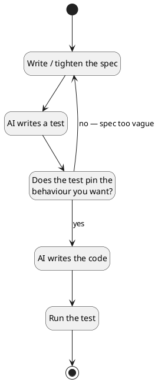

# Today's Agenda

1. Frame: from requirements (W2) to testable specs
2. Live demo: is your spec testable?
3. Tests as the executable form of requirements
4. How AI-written tests fail
5. The vague-spec loop
6. Traceability: use case → scenario → test

::: notes
Last week we elicited requirements; today we make them testable. No re-introduction — students saw who I am in W1/W2. Open straight into structure.

Authoring note (spec gate §6.10): this lecture is authored fresh. It does **not** draw on the 2025 testing lecture (`class/amss/curs/10-testing.md`), which is reserved for W11 (model evaluation & quality). Do not "restore" 2025 testing content here.
:::

---

# Recap: Architect + Critic

- **Architect / director (B):** drive AI through the SDLC.
- **Critic / reviewer (A):** read AI's output and name what's wrong or missing.

Last week (W2) you drove AI to produce a requirements doc — and critiqued it. Today: can you *test* what you wrote?

::: notes
W2 produced prose requirements. W3 asks the harder question: is that prose precise enough to turn into something executable? Keep the recap to one breath; the hook is the next slide.
:::

---

# A Requirement That Looks Fine — Until You Test It

From last week's bike-sharing doc:

> *"Users are charged for renting a bike."*

What would a test assert? `fare(60) == ?`

You can't fill in the blank — the spec never says the price. **That gap is invisible in prose and obvious in a test.**

::: notes
This is the whole lecture in one slide. The prose looks complete; the moment you try to write the assertion, the hole appears. Don't resolve it here — the demo resolves it live.
:::

---

# Four Threads in Today's Lecture

1. A test is the executable form of a requirement.
2. AI writes tests too — and they fail in their own ways.
3. The loop: if AI can't write a passing test from your spec, your spec is too vague.
4. Traceability: use case → scenario → test.

::: notes
Section preview. Threads 2 and 3 are the central payload. Brief — students need hooks before the demo.
:::

---

# Literacy Floor: F1 + F3 + F4

From W1: in the oral defense, *unaided*, you must demonstrate:

- **F1** — read & critique AI-generated artifacts on the spot.
- **F3** — articulate why you directed AI a certain way.
- **F4** — defend traceability across your project.

Today drills F1 on *tests*, and extends F4: the test is the new end of the trace.

::: notes
First of two F1+F3+F4 mentions today (the second lands in the close). Say it the same way each time. F4 is the anchored one this week — the trace gains an executable tail.
:::

---

# Demo: Bike-Sharing Fare — Is Your Spec Testable?

> Live: drive AI to write a test for a requirement from last week. Watch what price it invents.

**Prompt to AI:** *"Here's a requirement from last week's bike-sharing app: 'Users are charged for renting a bike.' Write a pytest test for the fare calculation."*

::: notes
Switch to Continue.dev with an editor pane and a terminal pane visible. Run the runbook at `class/amss-2026/curs/03-testable-specs-demo.md` for ~12-14 min. This slide stays on screen as the lecture-side anchor. If live AI fails, the runbook §8 covers the fallback path.
:::

---

# A Test Is a Requirement You Can Run

- A **requirement** says what the system should do.
- A **test** says it in a form the machine checks for you.

> Same intent. One is prose; the other fails loudly when violated.

::: notes
Core reframe of the segment. The test isn't a separate QA artifact — it's the requirement, made executable.
:::

---

# Acceptance Criterion ↔ Assertion

**Prose acceptance criterion:**

> "A 60-minute rental costs €3.00."

**The same thing, executable:**

```python
def test_paid_ride_charges_per_minute():
    assert fare(60) == 3.00
```

The assertion *is* the acceptance criterion — you just can't hand-wave it.

::: notes
Use the demo's fare example so students stay in one mental model. The point: writing the assertion forces you to know the exact number. Prose lets you dodge it.
:::

---

# If You Can't Write the Assertion, the Spec Is Underspecified

Try to test "users are charged for renting a bike":

```python
def test_fare():
    assert fare(60) == ???   # the spec never said
```

No number → no test → the requirement isn't done yet.

::: notes
The constructive form of the mantra. The inability to write the assertion is diagnostic — it tells you exactly where the spec is vague. This is what the demo just showed live.
:::

---

# Two Kinds of Spec: Prose and Executable

| | Prose spec | Executable spec (test) |
|---|---|---|
| Readable by | humans | humans + machine |
| Fails when violated? | silently | loudly |
| Pins exact behaviour? | optional | required |

Both are specs. The test is the one you can't fake.

::: notes
Not "tests replace requirements" — they're the same requirement at two precision levels. The executable one forces precision the prose one lets you skip.
:::

---

# AI Writes Tests Too — and They Fail in Their Own Ways

You critiqued AI's *requirements* last week. Now critique AI's *tests*.

A test can be green and still be worthless. The critic question is always:

> *"Does this test fail for a wrong implementation? Does it pin the behaviour I actually want?"*

::: notes
Sets up the catalogue. This is F1 applied to tests — the same critic skill, new target.
:::

---

# Test Failure #1: Invented Assumption

**Definition:** the test hard-codes a value the spec never stated.

```python
def test_fare():
    assert fare(60) == 6.0   # where did €6 come from?
```

**Critique:** *"My spec never said €0.10/min. The AI guessed — and a teammate's AI would guess differently."*

::: notes
The anchor failure mode — it's what fired in the demo's cycle 1. The guess looks authoritative; that's the trap. Re-reference whatever value the live model actually invented.
:::

---

# Test Failure #2: Trivially-Passing Test

**Definition:** the assertion holds for almost any implementation.

```python
def test_fare():
    assert fare(10) >= 0   # true for 0, 999, anything
```

**Critique:** *"Does this fail for a wrong implementation? If not, it proves nothing."*

::: notes
Green, but tests nothing. Students should learn to ask "what wrong code would still pass this?" — if the answer is "lots," the test is trivial.
:::

---

# Test Failure #3: Tautological Test

**Definition:** the expected value is computed the same way the code computes it.

```python
def test_fare():
    assert fare(60) == (60 - 30) * 0.10   # mirrors the implementation
```

**Critique:** *"If the code and the test share the same bug, the test still passes."*

::: notes
The most seductive failure — it looks rigorous. But it can't catch a bug in the formula because it reuses the formula. Hand-compute expected values instead.
:::

---

# Two More: Missing Boundary & Faithful-to-a-Wrong-Spec

- **Missing boundary:** no test at exactly 30 min, at the cap, or at 0. The interesting bugs live at the edges.
- **Faithful to a wrong spec:** the test correctly encodes a spec that is itself wrong (e.g. no cap → unbounded charge). The test is right; the spec isn't.

::: notes
Secondary modes. The second is subtle and important: a green test against a bad spec gives false confidence. Plant for W11 — AI checking its own output against its own tests is a weak evaluator; the human stays the backstop.
:::

---

# The Loop



::: notes
This is a process flowchart, **not** a UML state machine (those are W7). It is drawn with plantuml's state primitives only because the build pipeline renders them reliably (graphviz `dot` is not installed). Do not teach the notation here — point at the back-edge: "no, spec too vague" → tighten the spec. That loop is the lecture.
:::

---

# The Mantra

> **If AI can't write a passing test from your spec, your spec is too vague.**

You watched it live: the vague fare spec produced a guessed test; the tightened spec produced a test that pins the behaviour.

::: notes
Say it plainly. The demo is its proof. This sentence is the bridge from requirements (W2) to everything downstream.
:::

---

# Worked Example: The Fare Spec in Two Passes

**Pass 1 (vague):** "Users are charged for renting a bike."
→ AI invents €0.10/min. The test encodes a guess.

**Pass 2 (tightened):** "Free first 30 min, then €0.10/min, capped at €5."
→ AI writes tests for 20 min, 30 min, 60 min, and the cap. Each pins a real decision.

::: notes
The tightening is the architect move; spotting the guess is the critic move. Same A+B loop as W2, now on tests. Refer back to the demo screen.
:::

---

# When Does the Loop Stop?

Not when the code is "done."

> The loop stops when the test stops *surprising* you — when every assertion is one you'd have written by hand and stand behind.

::: notes
Students will want a mechanical stopping rule. There isn't one. The signal is subjective but real: when the AI's tests no longer reveal a decision you hadn't made, the spec is precise enough.
:::

---

# The Human Closes the Loop

AI will happily generate plausible tests forever.

What it can't do: decide whether a test expresses *what you actually want*. That judgment — the architect-critic call — is yours, and it's what the oral defense checks.

::: notes
Reinforces ownership. The loop has no exit condition AI can compute for you. This is why the course grades the trail, not the green checkmark.
:::

---

# The Chain Gains a Tail

Last week's chain:

> requirement → use case

This week it grows an executable end:

> requirement → use case → **scenario → test**

::: notes
W2 established requirement → use case. W3 extends it to the test. This is F4's structure — and the test is the first node you can *run* to check the link.
:::

---

# Scenario = A Concrete Instance of a Use Case

- **Use case:** "Rent a bike" (one user goal).
- **Scenario:** "A 60-minute rental." (one concrete path through it).
- **Test:** `test_paid_ride_charges_per_minute` (that scenario, runnable).

A use case has many scenarios; each interesting scenario becomes a test case.

::: notes
The bridge from W2's "use case = one user goal" to a testable artifact. Scenario is the missing middle term — concrete enough to assert on.
:::

---

# Test = Scenario Made Runnable

The test is the binding that makes traceability *verifiable*, not just documented.

> A documented trace says "this requirement is covered." A test *proves* it — and breaks loudly when the link rots.

::: notes
Documentation traces drift silently. An executable trace fails when reality diverges from the requirement. That's why the test is the strongest node in the chain.
:::

---

# Broken Links (a preview of W10)

A test that asserts behaviour **no requirement asked for** is an orphan — just like a fabricated requirement with no user need.

W10 makes finding broken links across the whole trace its own skill.

::: notes
Symmetry with W2's fabrication critique: fabrication adds a node with no parent; an orphan test adds a leaf with no parent. Both break traceability. W10 owns the full broken-link hunt.
:::

---
