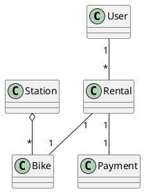

# W4 Demo Runbook — Bike-Sharing Class Diagram

> Procedural script for the W4 lecture's live demo. **Not** a slidy deck — pandoc skips `*-demo.md` (filter installed during W1). Read end-to-end before running. Estimated runtime: 12-14 minutes inside the lecture's "Demo" segment.
>
> Spec reference: `docs/superpowers/specs/2026-05-29-amss-2026-w4-design.md` §4.
>
> This demo's artifact is a **rendered diagram**. The "aha" beat is *reading the structure against the domain* — wrong multiplicities, meaningless associations, missing whole-part.

## 0. Setup (pre-class, ~1 min)

- VS Code open, Continue.dev installed and configured against the canonical course endpoint (see `class/amss-2026/tooling/SETUP.md`).
- Continue.dev mode set to **agentic chat**.
- A **PlantUML preview pane** open in VS Code — students must SEE the rendered diagram to critique multiplicity and associations; raw PlantUML text is not enough.
- Browser tab pre-opened to `class/amss-2026/curs/04-class-diagrams-demo-fallback/01-fallback-cycle1-diagram.png` in case the live AI fails.
- The deck's "Demo" trigger slide is on screen.

## 1. Architect prompt #1 — verbatim

Paste this into Continue.dev's chat (do **not** improvise):

> *"Generate a UML class diagram (as PlantUML) for the city bike-sharing app: users rent and return bicycles at stations across a city; payment is by app; staff rebalance bikes between stations."*

Render the result in the preview pane. **Time:** ~1 min to type, ~2-3 min for AI to generate + render.

## 2. Defect catalogue — pick 2-3 from the menu

Walk the rendered diagram aloud. Pick the **2-3 defects that actually appear**. Over-spec'ing absorbs model variance. #1 (multiplicity) is near-certain — anchor on it.

| # | Defect | What to point at | Critique question |
|---|---|---|---|
| 1 | Wrong multiplicity | `Rental "*" -- "*" Bike` or a reversed `User`/`Rental` end | *"Read the multiplicity aloud. Can one rental really involve many bikes? What's the real number?"* |
| 2 | Fake / decorative association | A line between `User` and `Station` with no label or meaning | *"What does this association mean? Name the verb. If you can't, why is the line there?"* |
| 3 | Missing aggregation/composition | `Station -- Bike` as a plain association, not a whole-part | *"A station holds bikes — is that a plain link, or a whole-part? Why isn't it an aggregation?"* |
| 4 | Invented class | `DatabaseManager`, `BikeController`, `AppManager` — implementation, not domain | *"Is this a domain concept or an implementation detail? Walk it back to the requirements."* |
| 5 | God class | One `BikeShareSystem` holding most attributes and operations | *"Why does one class do everything? What are the real responsibilities here?"* |
| 6 | Attribute that should be an association | `User.rentals: String` / `Station.bikeList: String` | *"Should this attribute be a relationship to another class? What type is it really?"* |

If the diagram is suspiciously clean → jump to §7 "Make-it-fail reserve".

## 3. Critique walkthrough (~5 min)

Walk the chosen 2-3 defects against the rendered diagram. Ask the room first ("does anything look wrong with this structure?") before delivering the critique. Name the move explicitly the first time:

> *"That's the **critic** half — reading the diagram AI drew and asking 'does this structure match the domain?' Next is the **architect** half — I re-prompt with the domain constraints it missed."*

Slow down here — this is the F1 skill in action.

## 4. Architect prompt #2 — constructed live (constraint scaffold)

Type this into Continue.dev:

> *"Revise the class diagram. A rental is exactly one bike and one user — fix the multiplicities. Make the Station–Bike relationship an aggregation (a station holds bikes). Drop any class that's an implementation detail rather than a domain concept — keep only domain classes."*

Naming the domain rules is the pivot. Re-render. **Time:** ~1 min to type, ~2-3 min for AI to revise + render.

## 5. Reference solution (instructor's verified render target)

The live AI output varies. This is the **dry-run-verified** reference the instructor confirms renders before delivery (spec gate §6.5) — the tightened domain model the critique converges toward:

Correct multiplicities (a rental is one bike, one user, one payment), Station–Bike as an aggregation, only domain classes. If the live output reaches something like this after prompt #2, the loop worked.

## 6. Recap (~1 min)

> *"One architect-critic cycle on a class diagram. The first pass drew everything plausible-looking; the critic half read the structure against the domain and found wrong multiplicities and a missing aggregation; the architect half re-prompted with the domain constraints — and the second pass tightened. Reading a diagram against its domain is exactly the F1 skill the oral defense checks, and the loop is what Lab 2 asks you to do this week."*

Point back to the F1 anchor slide.

## 7. Make-it-fail reserve — AI produces a clean diagram

If AI's first diagram is suspiciously clean (low probability — class diagrams reliably over-model), restore the critique surface:

> *"Now expand this into a complete enterprise architecture with all supporting subsystems."*

This near-certainly triggers god classes, invented infrastructure (caches, controllers, managers), and over-modeling. If even that is clean, fall back to `03-fallback-make-it-fail.png` and walk the screenshot.

## 8. Fallback path — live AI fails

If the live AI fails (no response after 20s, network down, garbage output), switch to the pre-recorded renders:

- `04-class-diagrams-demo-fallback/01-fallback-cycle1-diagram.png` — seed diagram with ≥2 visible defects.
- (walk the same defect catalogue against the screenshot)
- `04-class-diagrams-demo-fallback/02-fallback-cycle2-revised.png` — post-critique revised diagram.

Acknowledge briefly ("the model is having a moment — here's the dry-run capture") and continue. The pedagogical content is identical.

## 9. Time budget reconciliation

| Beat | Duration |
|---|---|
| Prompt #1 typed | ~1 min |
| AI generates + render | ~2-3 min |
| Critique walkthrough | ~5 min |
| Prompt #2 typed | ~1 min |
| AI revises + render | ~2-3 min |
| Recap | ~1 min |
| **Total** | **12-14 min** |

If ahead of schedule, do not pad — use generation/render pauses to predict aloud what the diagram should show before it appears, then take 1-2 questions.

## 10. Lab 2 synergy & fallback assets

This demo is the forerunner of Lab 2's drill (this week's lab): drive AI to a class diagram from a 1-page spec, iterate at least twice, keep a critique log (1 page max). The runbook's prompt #2 (domain-constraint scaffold) is the move Lab 2's critique log documents, and §2's defect catalogue is the vocabulary it uses.

Fallback assets captured during the solo dry-run (spec §6.5), in `04-class-diagrams-demo-fallback/`:

- `01-fallback-cycle1-diagram.png` — rendered cycle-1 diagram with ≥2 defects.
- `02-fallback-cycle2-revised.png` — rendered revised diagram.
- `03-fallback-make-it-fail.png` — rendered over-modeled "enterprise architecture" output.

When the procurement decision changes the canonical endpoint, the dry-run reruns and the PNGs refresh.
