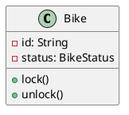
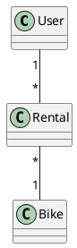
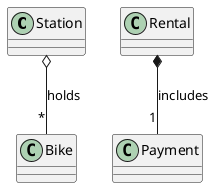
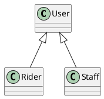
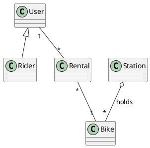
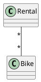
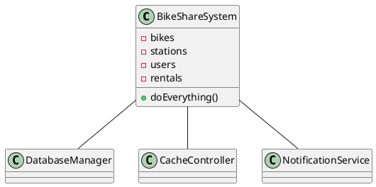
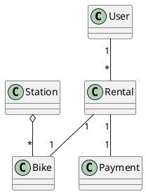

# Today's Agenda

1. Frame: from behaviour (Week 3) to structure
2. Live demo: drive AI to a class diagram
3. Core notation: the reading floor
4. How AI gets class diagrams wrong
5. Reading critically: the Critique drill
6. Bridge to Week 5 + Lab 2

::: notes
Week 3 pinned behaviour with tests; today we model the structure that realises it — and Lab 2 this week is your hands-on follow-through. No re-introduction; open straight into structure.

Authoring note: this lecture reshapes 2025's `class/amss/curs/02-class.md` (Book-class compartments, aggregation/composition and generalization examples, and the over-complicated -> simplified diagram pair), reframed from "here is the notation" to "here is what AI gets wrong about it."
:::

---

# Recap: Architect and Critic

- **Architect / director:** drive AI through the software development lifecycle (SDLC).
- **Critic / reviewer:** read AI's output and name what's wrong or missing.

In Week 3 you critiqued AI-written tests. Today: the same loop, on a diagram.

::: notes
Week 3 was behaviour (tests); today is structure (classes). One breath of recap.
:::

---

# From Behaviour to Structure

- **Week 3 pinned what the system does** — a test says "a 60-minute rental costs €3.00."
- **Today: what objects realise it** — a `Rental`, a `Bike`, a `User`, a `Payment`, and how they relate.

The class diagram is the central structural artifact.

::: notes
The bridge from Week 3. The fare test implies objects: something holds the duration, something computes the charge. Today we draw that structure.
:::

---

# Four Threads Today

1. The class diagram as the central structural artifact.
2. Driving AI to produce one.
3. Reading it critically — multiplicity, fake associations, missing whole-part.
4. The literacy floor: what you must read & critique cold.

::: notes
Threads 3 and 4 are the payload. Brief preview before the demo.
:::

---

# The Literacy Floor: Critique, Rationale, Traceability

From Week 1: in the oral defense, *unaided*, you must demonstrate:

- **Critique** — read & critique AI-generated artifacts on the spot.
- **Rationale** — articulate why you directed AI a certain way.
- **Traceability** — defend the trace across your project.

Today is Critique at its sharpest: read an AI-drawn class diagram and name what's wrong.

::: notes
First of two Critique, Rationale, Traceability mentions. Critique anchored this week — reading & critiquing a diagram cold IS the oral-defense skill. Same wording in the close.
:::

---

# Demo: Bike-Sharing Class Diagram

> Live: drive AI to draw the structure. Watch the multiplicities, the associations, and what's missing.

**Prompt to AI:** *"Generate a UML class diagram (as PlantUML) for the city bike-sharing app: users rent and return bicycles at stations across a city; payment is by app; staff rebalance bikes between stations."*

::: notes
Switch to Continue.dev with a PlantUML preview pane — students must SEE the rendered diagram. Run the runbook at `class/amss-2026/curs/04-class-diagrams-demo.md` for ~12-14 min. Fallback: runbook §8.
:::

---

# A Class: Three Compartments

Name, attributes (data), operations (behaviour). `-` private, `+` public.

::: notes
Adapts 2025's Book-class compartment example to the bike-sharing domain. The three compartments are the atom of every class diagram.
:::

---

# Associations + Multiplicity

Read it aloud: *one* user has *many* rentals; *many* rentals each reference *one* bike. Multiplicity is where AI most often lies.

::: notes
The most defect-prone element. Drill reading multiplicity aloud — 1, *, 0..1, 1..*. This is correct multiplicity; the defect catalogue shows the wrong version.
:::

---

# Aggregation vs Composition

- **Aggregation** (hollow diamond): a station *holds* bikes; bikes outlive the station.
- **Composition** (filled diamond): a rental *includes* its payment; the payment dies with it.

::: notes
Reuses 2025's aggregation/composition contrast. The lifetime distinction is what AI routinely flattens into a plain line.
:::

---

# Generalization (is-a)

A `Rider` *is a* `User`; `Staff` *is a* `User`. The hollow triangle points at the parent.

::: notes
Reuses 2025's generalization example. "is-a" vs the "has-a" of association — AI sometimes models is-a as a plain association.
:::

---

# Beyond the Floor

You'll meet these reading AI output — recognise them, but they're not today's focus:

- **Interfaces** — a contract a class implements.
- **Abstract classes** — a partial parent you can't instantiate.
- **Dependency arrows** — "uses" without owning.

Today's reading floor is the four above: class, association + multiplicity, aggregation/composition, generalization.

::: notes
Deliberate scope boundary (spec §5.4). Name them so students aren't lost when AI emits them, but don't teach them today.
:::

---

# The Reading Floor, Together

One small diagram, all four elements. If you can read this, you can critique AI's.

::: notes
Consolidation. Every element of the floor in one bike-sharing diagram. This is the Critique reading target.
:::

---

# Your Turn: Read It Aloud

Read this diagram aloud to your neighbour (60s): what does each multiplicity say? Spot anything that can't be right.

::: notes
Active reading before the defect catalogue. Have a pair voice "one user, many rentals; many rentals, one bike" aloud — saying multiplicities out loud is exactly the cold-read skill the oral defense checks. Take one or two readings, then move into the defects.
:::

---

# AI Draws Plausible Structure — and Gets It Wrong

A class diagram can look professional and still misrepresent the domain. The critic question:

> *"Does this structure match the domain — or just look like a diagram?"*

::: notes
Sets up the catalogue — Critique applied to structure. The three core defects are spec-named: multiplicity, fake associations, missing aggregation.
:::

---

# Defect #1: Wrong Multiplicity

Many-to-many? One rental is *one* bike. **Critique:** *"Read it aloud — can a single rental involve many bikes? Fix the number."*

::: notes
The anchor defect — it fired in the demo's cycle 1. Wrong multiplicity is invisible until you read it aloud against the domain.
:::

---

# Defect #2: Fake / Decorative Association

A line between `User` and `Station` with no label, no verb, no meaning.

**Critique:** *"What does this association mean? Name the verb. If you can't, the line shouldn't be there."*

::: notes
AI adds lines because diagrams "should" be connected. An association with no nameable verb is decoration. Kept textual — a rendered meaningless line teaches less than the question.
:::

---

# Defect #3: Missing Aggregation

`Station -- Bike` as a plain line hides that a station *holds* bikes — a whole-part relationship.

**Critique:** *"Is this a plain link or a whole-part? Why isn't it an aggregation?"*

::: notes
The third spec-named core defect. AI flattens whole-part into plain associations because both render as lines; the ownership/lifetime meaning is lost.
:::

---

# AI Over-Models

A **god class** plus **invented infrastructure** (`DatabaseManager`, `CacheController`) — implementation, not domain.

::: notes
Reframes 2025's over-complicated diagram. AI over-models because it doesn't have to choose what matters. Defects #4 (invented class) and #5 (god class) together.
:::

---

# The Critic Simplifies

Same domain, only the classes that earn their place. **You saw defect #1 (multiplicity) live in the demo.**

::: notes
Reuses 2025's simplified diagram, reframed as the critique RESULT. The attribute-that-should-be-an-association defect (e.g. `User.rentals: String`) folds in here — the fix is the `User "1" -- "*" Rental` link. Ties the catalogue back to the demo. Note the `Rental "1" -- "1" Bike` reads 1-1 *within a single rental*, whereas earlier `Rental "*" -- "1" Bike` takes the bike's view across time — one bike participates in many rentals. Both are correct; the difference is the lifetime you scope the association to.
:::

---

# How to Read an AI Class Diagram

A fixed order, every time:

1. Are the classes real **domain** concepts? (or invented infrastructure)
2. Are the **multiplicities** right? (read each aloud)
3. Does each **association** name a real relationship?
4. Are **whole-part** relationships captured? (aggregation/composition)

::: notes
This IS the Critique drill. A repeatable read-order beats ad-hoc staring. Students internalise it for the oral defense and Lab 2.
:::

---

# The Critique Loop on Structure

read -> name the defects -> re-prompt with domain constraints -> re-read.

Same architect-and-critic loop as Week 2 (requirements) and Week 3 (tests) — now on a diagram.

::: notes
The loop is the through-line of the course. The scaffold that tightens AI output here is naming the domain rules (a rental is one bike) — exactly the demo's prompt #2.
:::

---

# Apply It to Your Own Output

This week's lab (Lab 2): you drive AI to a class diagram from a 1-page spec, then run *this* read-order against what it draws.

The critique log is the evidence — what you caught and how you fixed it.

::: notes
Bridges the read-order to Lab 2's deliverable. The read-order is the rubric for the critique log.
:::

---

# The Human Decides What Matches the Domain

AI can draw plausible structure forever. Deciding whether it matches the *domain* — that's the architect-and-critic call.

It's what the oral defense checks, and AI can't make it for you.

::: notes
Reinforces ownership, mirroring Week 3's "human closes the loop." The defense grades this judgment, not the diagram's polish.
:::

---

# This Week's Lab: Lab 2

- Drive AI to produce a class diagram from a 1-page spec.
- Iterate at least twice; log what changed and why.
- Deliverable: the PlantUML diagram + a critique log (1 page max).
- Commit to the course lab repo.

::: notes
Lab 2 spec is its own document (forthcoming). Keep high-level so it survives late details. "At least twice" / "1 page max" use words, not the dropped >= / <= glyphs (Week 3 PDF-glyph lesson).
:::

---

# Next Week: Other Structural Views (Week 5)

One class diagram isn't the whole structure.

**Week 5:** object, package, component, and deployment views — and where AI over- or under-decomposes at the architecture level.

::: notes
Clean handoff. Week 4 was the class diagram; Week 5 widens to the other structural views.
:::

---

# Critique, Rationale, Traceability — The Through-Line

Today you drilled:

- **Critique** — read an AI class diagram and named its defects on the spot.
- **Traceability** — the class is a structural node in the trace: requirement -> use case -> class (the behavioural tail, the test, came in Week 3).

Rationale (why you directed AI a certain way) lands in your project narrative.

::: notes
Second and final Critique, Rationale, Traceability mention. Critique anchored, same wording as the frame. The one-line trace touch keeps Traceability continuity without a dedicated segment.
:::

---

# That's It For Today

- Next lecture (Week 5): other structural views.
- This week's lab (Lab 2): drive AI to a class diagram, then critique it.

Questions?

::: notes
Closer. Open the floor. No trailing slide separator after this one.
:::
