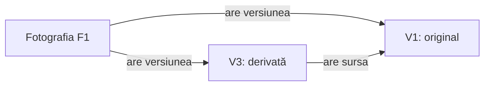

# Ce trebuie să distingem? {.transition}

Două descrieri identice înseamnă același lucru?

::: notes
Un model de domeniu ne ajută să explicăm situațiile cerute folosind concepte, identități și relații. Reluăm din cursul 3 legătura dintre o afirmație și regula care o susține; nu reluăm întregul material parcurs prea repede.

**Organizare:** minutul 0 din 100; interval 0–15 (15 min), inclusiv coperta, citatul și discuția inițială. 30 de slide-uri cu tot cu copertă. []{.pace at=0 of=100}
:::

---

# Citatul zilei

> „Un sistem de abstractizări care descrie aspecte selectate ale unui domeniu […]”
>
> Original: “A system of abstractions that describes selected aspects of a domain […]”

— **Eric Evans**

[Sursa: Domain-Driven Design Reference — definiția modelului](https://www.domainlanguage.com/wp-content/uploads/2016/05/DDD_Reference_2015-03.pdf#page=6)

::: notes
„Selectate” contează: păstrăm distincțiile necesare întrebărilor noastre. Arhiva de azi urmărește fotografiile și proveniența editărilor, fără să modeleze algoritmul care schimbă pixelii.

**Sursă:** publicația autorului, Definitions, intrarea model, pagina PDF 6. Fragment păstrat din materialul anterior verificat în `docs/quotations.md`; finalul după domain este omis explicit.
:::

---

# Aceeași legendă, două fotografii

O arhivă conține două fotografii distincte:

| Fotografie | Legendă | Versiune originală |
|---|---|---|
| F1 | Curte | V1 |
| F2 | Curte | V2 |

**Regula beneficiarului:** legenda se poate schimba; fotografia își păstrează identificatorul.

Pe hârtie, apoi în pereche: schimbăm legenda lui F1 în „Dimineață”. **Ce se schimbă și ce rămâne?** Am putea folosi legenda pentru a identifica fotografia?

::: notes
Se schimbă numai legenda lui F1. F2 și identificatorii F1, F2, V1, V2 rămân aceiași. Legenda nu identifică fotografia: poate coincide și se poate schimba. Separăm ce spune enunțul de o presupunere despre identitatea imaginilor după conținut.

**Organizare:** 7 min: 2 individual, 2 în pereche, 3 discuție. Datele sunt construite pentru curs. []{.pace dur=7}
:::

---

# Un model răspunde la întrebări

Pentru arhiva noastră vrem să putem spune:

- despre **care fotografie** vorbim, chiar dacă îi schimbăm legenda;
- **ce versiuni** îi aparțin;
- **din ce versiune** provine o editare.

Nu modelăm albume, drepturi de acces, ștergeri sau stocarea fișierelor.

::: notes
Aceste întrebări selectează conceptele utile. Modelul nu trebuie să reproducă toate proprietățile unei fotografii sau toate funcțiile unei arhive reale. Regulile și limitele sunt convenite în scenariul didactic, nu descoperite de un agent AI.
:::

---

# Identitate și schimbare {.transition}

Ce rămâne același lucru atunci când îi schimbăm o proprietate?

::: notes
Identitatea se explică prin continuitatea pe care o cere domeniul. Un identificator o exprimă în exemplu, fără să alegem aici cum este generat sau stocat.

**Organizare:** minutul 15 din 100; interval 15–35 (20 min), inclusiv exercițiul despre editare. []{.pace at=15}
:::

---

# Identitatea nu este descrierea

**R1:** fiecare fotografie are un identificator stabil și o legendă modificabilă. Fotografii distincte pot avea aceeași legendă.

| Întrebare | Răspuns pentru F1 |
|---|---|
| „Care fotografie?” | F1 |
| „Cum este descrisă acum?” | „Curte”, apoi „Dimineață” |
| „A apărut o fotografie nouă?” | Nu, am schimbat legenda. |

**Identificatorul** și **atributul descriptiv** răspund la întrebări diferite.

::: notes
Un atribut poate ajuta căutarea fără să fie identitatea. Evităm să transformăm exemplul într-o regulă universală conform căreia numele nu poate niciodată identifica ceva: aici imposibilitatea rezultă precis din R1.
:::

---

# Fotografia și versiunea ei

**R2:** fiecare versiune are identificator propriu și aparține exact unei fotografii. O fotografie are cel puțin o versiune.

**R3:** la catalogare se creează unicul original al fotografiei. Originalul se păstrează și nu are versiune-sursă.

**R4:** editarea unei versiuni existente creează o versiune nouă a aceleiași fotografii, cu exact acea versiune drept sursă.

::: notes
Fotografia reprezintă continuitatea dintre editări; versiunea reprezintă un conținut păstrat. „Original” este rolul unei versiuni, nu neapărat un al treilea tip de obiect. Sursa trebuie să existe înainte de noua versiune.
:::

---

# Asemănare și identitate

| Situație | Ce putem afirma |
|---|---|
| F1 și F2 au legenda „Curte” | Rămân fotografii distincte. |
| V1 este originalul lui F1 | V1 este o versiune a lui F1. |
| V3 este creată prin editarea lui V1 | V3 și V1 sunt versiuni distincte ale lui F1. |

Nici egalitatea textului, nici o asemănare vizuală nu stabilesc singure identitatea.

::: notes
Ultima afirmație privește ce putem deduce din regulile furnizate. Importul repetat al aceluiași fișier nu este convenit; nu deducem automat că ar crea o fotografie nouă sau că ar reutiliza una existentă.
:::

---

# După prima editare

**Înainte:** fotografia F1, legenda „Curte”, originalul V1.

**Acțiune:** edităm conținutul lui V1 și obținem V3.

**Reguli:** versiunea nouă are identitate proprie, aparține aceleiași fotografii și reține sursa. Editarea păstrează V1 și legenda fotografiei.

În pereche, schițați situația de după editare. Arătați **ce s-a adăugat**, **ce legătură a apărut** și **ce s-a păstrat**.

::: notes
Așteptăm aceeași fotografie F1, acum cu V1 și V3; sursa lui V3 este V1. Conținutul lui V1 și legenda „Curte” rămân. O simplă săgeată este suficientă; nu cerem clase, metode sau o notație UML.

**Organizare:** 8 min: 3 schiță în pereche, 3 comparație cu altă pereche, 2 discuție. []{.pace dur=8}
:::

---

# Editarea adaugă, nu suprascrie

| Element | Înainte | După |
|---|---|---|
| Fotografie | F1, „Curte” | F1, „Curte” |
| Original | V1 | V1, păstrat |
| Versiune derivată | — | V3, aparține lui F1 |
| Sursa lui V3 | — | V1 |

**R5:** editarea nu mută versiuni între fotografii și nu schimbă versiunile existente sau legenda. Operațiile se execută pe rând.

::: notes
Acesta este răspunsul de referință construit de profesor din R2–R5, nu o captură AI. Nu confundăm „fotografia are o versiune nouă” cu „originalul are acum alt conținut”. Operațiile scenariului sunt secvențiale.
:::

---

# Relațiile au reguli {.transition}

Ce situații permite schița noastră și ce situații exclude?

::: notes
Numele conceptelor nu sunt suficiente. Numărul permis de asocieri și restricțiile dintre ele decid ce situații poate exprima modelul.

**Organizare:** minutul 35 din 100; interval 35–60 (25 min), inclusiv construirea și compararea ramurilor de editare. []{.pace at=35}
:::

---

# Un vocabular comun

| Termen | Sensul în acest domeniu |
|---|---|
| Fotografie | Elementul identificat care reunește versiunile sale. |
| Versiune | Conținut păstrat, cu identitate proprie. |
| Original | Unica versiune creată la catalogare, fără sursă. |
| Sursă | Versiunea existentă din care a fost creată o derivată. |
| Legendă | Text modificabil al fotografiei. |

**Verificare:** „am schimbat fotografia” este suficient de precis?

::: notes
Nu: poate însemna schimbarea legendei sau crearea unei versiuni. Cerem reformularea cu termenii din tabel. Vocabularul devine util când separă operații cu efecte diferite, nu doar când enumeră substantive.
:::

---

# Două relații diferite

**Apartenența** spune ale cui sunt versiunile. **Sursa** spune de unde provine o editare.

Săgețile arată relațiile numite pe ele; nu reprezintă ordinea execuției.

::: notes
Aceasta este o diagramă a unui exemplu concret, nu modelul complet: toate nodurile sunt identificate. Următorul slide generalizează câte asocieri sunt permise. O singură diagramă fără reguli nu ar exclude, de exemplu, două originale pentru F1.
:::

---

# Câte asocieri sunt permise?

| Pentru fiecare… | Regula |
|---|---|
| fotografie | Cel puțin o versiune; exact un original. |
| versiune | Exact o fotografie. |
| original | Nicio versiune-sursă. |
| versiune derivată | Exact o sursă, din aceeași fotografie. |
| versiune folosită ca sursă | Zero, una sau mai multe derivate directe. |

Aceste numere sunt **cardinalități**. Restricția „din aceeași fotografie” mai cere și compararea apartenenței.

::: notes
Cardinalitatea nu spune totul: „exact o sursă” ar permite încă o sursă din altă fotografie dacă am omite restricția. R4 permite editarea oricărei versiuni existente, inclusiv a uneia deja folosite ca sursă. Nu introducem limite care lipsesc din reguli.
:::

---

# Putem edita din nou originalul?

F1 are originalul **V1** și derivata **V3**, creată din V1.

**R4:** orice versiune existentă poate fi editată; noua versiune are exact o sursă, din aceeași fotografie. Cele existente se păstrează.

Edităm **din nou V1** și obținem **V4**.

1. Desenați relațiile de sursă pentru V3 și V4.
2. Ar fi corect un model care permite numai editarea ultimei versiuni?

::: notes
V3 și V4 au ambele sursa V1: două ramuri, nu lanțul V1–V3–V4. Condiția „numai ultima versiune” ar respinge o acțiune permisă explicit de R4. Aici verificăm modelul printr-un caz care separă cele două interpretări.

**Organizare:** 8 min: 2 individual, 3 comparație în pereche, 3 discuție. []{.pace dur=8}
:::

---

# Două limite ale modelului

**O asociere interzisă:** V1 aparține lui F1. Propunem V5 pentru F2, cu sursa V1. R4 o exclude: sursa și derivata trebuie să aparțină aceleiași fotografii.

**O întrebare încă deschisă:** importăm din nou același fișier. Refolosim fotografia sau creăm alta?

**R6:** importul repetat și eliminarea duplicatelor sunt în afara exercițiului; nu avem o regulă de dedus.

::: notes
„Interzis” și „neconvenit” cer reacții diferite. Pentru prima situație avem un rezultat justificat; pentru a doua trebuie discutat cu beneficiarul dacă extindem domeniul. R6 exclude și albumele, accesul, ștergerea, formatele, stocarea și algoritmii de editare; identificatorii sunt deja disponibili.
:::

---

# Conceptul nu impune reprezentarea

Regula „V3 are sursa V1” poate fi exprimată prin:

- o referință între obiecte;
- o asociere între înregistrări identificate;
- o săgeată într-o schiță discutată cu beneficiarul.

Oricare variantă trebuie să păstreze **sursa unică**, **apartenența** și **originalul**.

::: notes
Nu evaluăm modelul după numărul de clase sau de tabele. Un atribut pentru rolul de original sau o legătură explicită spre original pot exprima aceeași regulă, dacă păstrăm coerența. Alegerea implementării cere alte întrebări decât cele abordate astăzi.
:::

---

# Verificăm un model propus de AI {.transition}

Ce păstrăm, ce corectăm și pe ce regulă ne bazăm?

::: notes
Folosim răspunsuri reale pregătite înainte de curs, cu toate încercările păstrate. Un răspuns poate fi util și totuși să conțină o generalizare nejustificată. Analiza umană precedă verdictul asupra revizuirii.

**Organizare:** minutul 60 din 100; interval 60–90 (30 min): tranziție și două prompturi 6, două comparații ale analizei 10, revizuire și corecție 8, reprezentare și sinteză 6. Fără rulări live. []{.pace at=60}
:::

---

# Sarcina agentului AI analist

**Instrucțiunea exactă:**

> Propune un model de domeniu pentru regulile de mai jos: concepte, identități, relații și restricții. Explică prin S1–S4 cum susține modelul regulile. Separă alegerile de reprezentare de cerințe. Nu scrie cod și nu impune o notație. Răspunde în română, în maximum 450 de cuvinte.

**Context:** R1–R6 și exemplele discutate: schimbarea legendei, prima editare, două ramuri, sursa din altă fotografie; importul repetat rămâne neconvenit.

::: notes
Contextul integral este `scenarios/04-fotografii/captures/2026-10-10/context.md`; regulile și cazurile relevante au apărut în prezentare. Nu cerem un anumit defect. Două rulări Claude Haiku 4.5 au primit același prompt; analizăm rularea 02. Promptul complet și ambele răspunsuri sunt arhivate.
:::

---

# Un răspuns susținut de reguli

**Captură reală · Claude Haiku 4.5 · 10.10.2026 · analist 02**, fragment:

> Un atribut modificabil, **Legenda**, aparține numai Fotografiei, nu versiunilor. Legenda se poate schimba fără să afecteze versiunile sau identitatea fotografiei.

**R1:** fotografia are identificator stabil și legendă modificabilă. **R5:** schimbarea legendei păstrează versiunile.

În pereche: aplicați fragmentul la F1 și F2, ambele cu legenda „Curte”. Ce verifică schimbarea legendei numai pentru F1?

::: notes
Fragment fidel din răspunsul analistului 02; restul răspunsului este omis. Confirmăm o parte corectă, nu căutăm obligatoriu o eroare în fiecare fragment. Exemplul verifică separarea identităților și localizarea atributului la fotografia vizată.

**Organizare:** 5 min, cu discuție. []{.pace dur=5}
:::

---

# O generalizare prea largă

**Aceeași captură · analist 02 · fragmente:**

> Fiecare Versiune are zero sau o Sursă (relație recursivă).
>
> […]
>
> modelul permite orice orice configurație DAG cu original ca sursă indirectă.

Un graf orientat fără cicluri (**DAG**) poate avea și o versiune cu **două surse**.

**R4 cere exact o sursă pentru fiecare derivată.** Ar fi admis V5 cu sursele V3 și V4, chiar dacă toate aparțin lui F1?

::: notes
Repetiția „orice orice” este în original. Nu penalizăm formularea lingvistică; discutăm contradicția dintre „zero sau o Sursă” și „orice configurație DAG”. Două surse încalcă R4 chiar fără ciclu. Răspunsul descrie corect cazul celor două ramuri în alt paragraf; defectul este generalizarea, nu întregul model. Nu cerem teorie a grafurilor: două săgeți de sursă spre aceeași derivată sunt suficiente ca exemplu.

**Organizare:** 5 min: întâi verdict și regulă în pereche, apoi comparație. []{.pace dur=5}
:::

---

# Sarcina de revizuire

**Instrucțiunea exactă pentru evaluator (agent AI de revizuire):**

> Ești evaluator (agent AI de revizuire). Verifică propunerea de mai jos exclusiv față de contextul și sarcina furnizate. Identifică afirmațiile susținute, contradicțiile, omisiunile relevante și alegerile prezentate ca cerințe. Pentru fiecare observație, indică fragmentul și regula sau scenariul relevant. Nu presupune că trebuie să existe greșeli; dacă o afirmație este corectă, explică de ce. Nu scrie cod. Răspunde în română, în maximum 400 de cuvinte.

**Context nou:** aceleași reguli și exemple + sarcina și răspunsul integral al analistului 02.

::: notes
Revizuirea nu primește comentariile profesorului sau conversația analistului. Pe slide-ul următor apare rularea evaluatorului AI 03, cu instrucțiunea corect transmisă și sarcina analistului AI inclusă. Primele două revizuiri, cu o problemă de codare a diacriticelor în instrucțiune, sunt păstrate în arhivă; nu apar pe slide-uri. Contextul nou nu garantează independența erorilor sau corectitudinea verdictului.
:::

---

# Ce observă revizuirea?

**Captură reală · Claude Haiku 4.5 · 10.10.2026 · evaluator 03**, fragment:

> În S3, V3 și V4 nu sunt „doi copaci independenți" — sunt două noduri la același nivel în același arbore, ambii cu sursă V1.

**Cazul S3:** V3 provine din V1; edităm din nou V1 și obținem V4.

Explicați observația prin două săgeți. Este suficientă confirmarea acestui caz pentru a accepta „orice DAG”?

::: notes
Fragment fidel din evaluatorul AI 03. Observația despre ramuri este corectă; verificarea unui exemplu nu justifică generalizarea la toate grafurile fără cicluri. Revizuirea integrală observă și că un DAG poate avea noduri cu mai mulți părinți. Verificăm această observație prin limita de o sursă din R4. Cererile sale despre mecanismele de implementare și prevenirea ștergerii depășesc sarcina de modelare și limitele R6; nu le adoptăm automat.

**Organizare:** 4 min, inclusiv răspunsuri. []{.pace dur=4}
:::

---

# Decizia noastră asupra modelului

**Analiză a profesorului, pornind de la R3–R4:**

- Păstrăm identitățile și separarea fotografiei de versiuni.
- Păstrăm mai multe derivate directe din aceeași sursă.
- Înlocuim „orice DAG” cu **ramuri pornind din unicul original; fiecare derivată are exact o sursă**.

Sursa există înaintea noii versiuni. Urmărind sursele, revenim la original, fără cicluri sau reunirea a două surse într-o versiune.

::: notes
Aceasta este corecția umană, nu o a treia captură AI. Concluzia rezultă din construcția permisă: pornim cu originalul și adăugăm fiecare versiune printr-o singură legătură spre una existentă. Nu introducem acum operația de combinare a două versiuni.

**Organizare:** 4 min, cu o justificare oferită de studenți. []{.pace dur=4}
:::

---

# Două reprezentări, aceeași regulă

**Relație între obiecte:** versiunea V3 se referă la fotografia F1 și la versiunea-sursă V1.

**Înregistrare cu identificatori:**

| Versiune | Fotografie | Sursă |
|---|---|---|
| V1 | F1 | — |
| V3 | F1 | V1 |
| V4 | F1 | V1 |

În ambele variante, **ce ar trebui verificat înainte de a adăuga o versiune?**

::: notes
Sursa trebuie să existe și să aparțină fotografiei respective; noua versiune primește identitate distinctă și nu înlocuiește conținutul alteia. Tabelul este reprezentarea unui exemplu, nu o schemă de bază de date prescrisă. Variantele sunt construite de profesor din modelul corectat.
:::

---

# Ce transmitem mai departe

Un model discutabil cu altă persoană conține:

- **sensuri:** fotografie, versiune, original, sursă;
- **reguli:** identitate, apartenență și numărul permis de asocieri;
- **exemple:** schimbarea legendei, editarea și două ramuri;
- **limite:** încă nu știm politica importului repetat.

O diagramă ajută când putem explica fiecare legătură printr-o regulă sau un exemplu.

::: notes
Acesta este rezumatul pentru o conversație de proiectare, nu un șablon de livrabil. Întrebările despre cine execută operațiile și unde se verifică regulile pregătesc cursul 5, fără să îi anticipăm teoria.
:::

---

# Transferăm ideea {.transition}

Ce distincție păstrăm într-un domeniu nou?

::: notes
Transferul arată dacă studenții pot recunoaște nevoia de identitate și relații fără vocabularul fotografiilor. Folosim doar regulile afișate în exercițiu.

**Organizare:** minutul 90 din 100; interval 90–100 (10 min): exercițiu și discuție 7, încheiere 3. []{.pace at=90}
:::

---

# Aceeași piesă, două reprezentații

Un teatru identifică piesa **P7**, cu titlu modificabil. Piese distincte pot avea același titlu.

P7 are reprezentațiile **R1**, vineri, și **R2**, sâmbătă. Fiecare reprezentație are identificator propriu și privește exact o piesă. O piesă poate exista fără reprezentații programate.

Pe hârtie, apoi cu un coleg:

1. Se schimbă titlul lui P7. Ce identități se păstrează?
2. Câte reprezentații poate avea o piesă? Câte piese are o reprezentație?
3. Ce informație pierdem dacă păstrăm doar titlul și ultima dată?

::: notes
P7, R1 și R2 se păstrează. Piesa poate avea zero sau mai multe reprezentații; fiecare reprezentație exact o piesă. „Ultima dată” nu păstrează ambele reprezentații și identitățile lor. Nu transferăm relația de sursă a editărilor: nu este cerută aici.

**Organizare:** 7 min: 2 individual, 2 în pereche, 3 discuție. []{.pace dur=7}
:::

---

# Trei întrebări pentru orice model

**Identitate:** ce rămâne același lucru când îi schimbăm descrierea?

**Relații:** ce este legat de ce și câte asocieri sunt permise?

**Verificare:** ce exemplu ar separa două interpretări ale modelului?

La laborator aplicăm aceste întrebări unui atelier comunitar de reparații, prin schițe, comparații și discuții.

::: notes
Modelul este util dacă distincțiile lui explică situațiile cerute. Capturile AI au oferit atât afirmații corecte, cât și o generalizare de corectat; verdictul a venit din reguli și exemple.

**Organizare:** ultimele 3 min; încheiere la minutul 100. []{.pace dur=3}
:::
