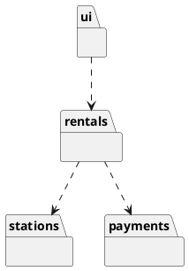

# W5 Demo Runbook — Bike-Sharing Architecture View

> Procedural script for the W5 lecture's live opener. **Not** a slidy deck — pandoc skips `*-demo.md`. Read end-to-end before running. Estimated runtime: **~8 minutes** inside the lecture's "Demo" segment (shorter than W4's full demo — this opener seeds the gallery, it isn't the whole payload).
>
> Design reference: the master spec's W5 row (`docs/superpowers/specs/2026-05-01-amss-ai-redesign-design.md` §2) — "AI's tendency to over- or under-decompose at the architecture level."
>
> This demo's artifact is a **rendered component/package diagram**. The "aha" beat is *reading the grain* — too many parts, or parts the spec never asked for. It hands directly into the deck's defect gallery.

## 0. Setup (pre-class, ~1 min)

- VS Code open, Continue.dev installed and configured against the canonical course endpoint (see `class/amss-2026/tooling/SETUP.md`).
- Continue.dev mode set to **agentic chat**.
- A **PlantUML preview pane** open in VS Code — students must SEE the rendered diagram to judge the grain; raw PlantUML text is not enough.
- The W4 bike-sharing class diagram visible or recallable (this demo decomposes *that* system — continuity matters).
- Browser tab pre-opened to `class/amss-2026/curs/05-other-structural-demo-fallback/01-fallback-overdecomposed.png` in case the live AI fails.
- The deck's "Demo" trigger slide is on screen.

## 1. Architect prompt #1 — verbatim

Paste this into Continue.dev's chat (do **not** improvise):

> *"Generate a UML component diagram (as PlantUML) for the city bike-sharing app from last week: rentals, stations, payments, and users."*

Render the result in the preview pane. **Time:** ~1 min to type, ~2 min for AI to generate + render.

## 2. Defect catalogue — pick the ones that appear

Walk the rendered diagram aloud. Pick the **2-3 defects that actually appear**. Over-decomposition (#1) is near-certain — anchor on it.

| # | Defect | What to point at | Critique question |
|---|---|---|---|
| 1 | Over-decomposition | A component per class plus a repository per entity (`BikeService`, `RentalRepository`, …) | *"What boundary does each split earn? Which of these are really one part?"* |
| 2 | Invented infrastructure | `DatabaseManager`, `CacheService`, `MessageQueue`, `LoadBalancer` | *"Is this in the requirements, or did AI assume an architecture? Walk it back to the spec."* |
| 3 | Components with no interfaces | Boxes labelled `...Service` with no provided/required interfaces | *"Name what this component provides and requires. If you can't, it's just a renamed class."* |
| 4 | Wrong dependency direction / cycle | An arrow from a domain part back into the UI, or a dependency loop | *"Read the arrows around the loop. Why does payments need the UI?"* |
| 5 | Under-decomposition | One `BikeShareApp` component holding everything (rarer here, common if prompt is vaguer) | *"Where are the boundaries? Name three parts that could be built and tested separately."* |

If the diagram is suspiciously clean → jump to §6 "Make-it-fail reserve".

## 3. Critique walkthrough (~3 min)

Walk the chosen 2-3 defects against the rendered diagram. Ask the room first ("does this look like the right number of parts?") before delivering the critique. Name the move explicitly:

> *"That's the **critic** half — reading the structure AI drew and asking 'is this the right grain?' Next is the **architect** half — I re-prompt with the structural constraints it ignored."*

This is the F1 skill at the architecture level — the same thing Lab 3 grades next week.

## 4. Architect prompt #2 — constructed live (constraint scaffold)

Type this into Continue.dev:

> *"Revise it. Group by domain capability, not one component per class — aim for a handful of parts. Each component must declare the interfaces it provides and requires. Drop any infrastructure the spec didn't mention (no database managers, caches, or queues). Dependencies must point one way, with no cycles."*

Naming the structural rules is the pivot. Re-render. **Time:** ~1 min to type, ~2 min for AI to revise + render.

## 5. Reference solution (instructor's verified render target)

The live AI output varies. This is the **dry-run-verified** reference the instructor confirms renders before delivery — the tightened decomposition the critique converges toward:

A handful of domain parts, dependencies flowing one way, no invented infrastructure. If the live output reaches something like this after prompt #2, the loop worked. Pivot straight into the deck's defect gallery — the live failure you just saw is defect #1 (or #2) of that gallery.

## 6. Make-it-fail reserve — AI produces a clean diagram

If AI's first diagram is already well-grained (low probability — architecture prompts reliably over-decompose), restore the critique surface:

> *"Make this production-ready with all the supporting infrastructure and microservices."*

This near-certainly triggers over-decomposition and invented infrastructure (caches, queues, gateways, managers). If even that is clean, fall back to the dry-run capture and walk the screenshot.

## 7. Fallback path — live AI fails

If the live AI fails (no response after 20s, network down, garbage output), switch to the pre-recorded renders:

- `05-other-structural-demo-fallback/01-fallback-overdecomposed.png` — cycle-1 diagram with visible over-decomposition + invented infrastructure.
- (walk the same defect catalogue against the screenshot)
- `05-other-structural-demo-fallback/02-fallback-redecomposed.png` — post-critique revised diagram at the right grain.

Acknowledge briefly ("the model is having a moment — here's the dry-run capture") and continue. The pedagogical content is identical.

## 8. Time budget reconciliation

| Beat | Duration |
|---|---|
| Prompt #1 typed | ~1 min |
| AI generates + render | ~2 min |
| Critique walkthrough | ~3 min |
| Prompt #2 typed + AI revises + render | ~2 min |
| **Total** | **~8 min** |

This is an opener, not the whole demo — keep it tight and hand into the gallery. If ahead of schedule, do not pad; predict aloud what the revised diagram should show before it appears.

## 9. Lab 3 synergy & fallback assets

This demo is the forerunner of Lab 3 (next week): a team defect hunt on flawed structural artifacts (class, package, component). The defect catalogue in §2 is the vocabulary teams will use; the deck's read-order is the rubric.

Fallback assets to capture during the solo dry-run, in `05-other-structural-demo-fallback/`:

- `01-fallback-overdecomposed.png` — rendered cycle-1 diagram with over-decomposition + invented infrastructure.
- `02-fallback-redecomposed.png` — rendered revised diagram at the right grain.

When the procurement decision changes the canonical endpoint, the dry-run reruns and the PNGs refresh.
