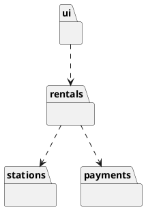

# W5 Demo Runbook — Bike-Sharing Architecture View

Calibrated September 2026 with Claude Sonnet 5 (low effort), one run per prompt — live output varies; walk the defects that actually appear.

> Procedural script for the W5 lecture's live opener. **Not** a slidy deck — pandoc skips `*-demo.md`. Read end-to-end before running. Estimated runtime: **~8 minutes** inside the lecture's "Demo" segment (shorter than W4's full demo — this opener seeds the gallery, it isn't the whole payload).
>
> Design reference: the master spec's W5 row (`docs/superpowers/specs/2026-05-01-amss-ai-redesign-design.md` §2) — "AI's tendency to over- or under-decompose at the architecture level."
>
> This demo's artifact is a **rendered component/package diagram**. The "aha" beat is *reading the grain* — too many parts, or parts the spec never asked for. It hands directly into the deck's defect gallery.

## 0. Setup (pre-class, ~1 min)

- VS Code open on a repository containing the course settings from `tooling/template/` (see `class/amss-2026/tooling/SETUP.md`); demo runs in the **Claude Code panel** with those settings (Sonnet 5, low effort). Check with `/model` before class. Start a **fresh session** — the prompt's "from last week" is left without context (see defect #5); if the assistant does find last week's diagram in the repository, #5 simply won't appear.
- A **PlantUML preview pane** (PlantUML extension by jebbs, server render) open in VS Code — students must SEE the rendered diagram to judge the grain; raw PlantUML text is not enough.
- The W4 bike-sharing class diagram visible or recallable (this demo decomposes *that* system — continuity matters).
- Browser tab pre-opened to `class/amss-2026/curs/05-other-structural-demo-fallback/01-fallback-overdecomposed.png` in case the live AI fails.
- The deck's "Demo" trigger slide is on screen.

## 1. Architect prompt #1 — verbatim

Paste this into the Claude Code panel (do **not** improvise):

> *"Generate a UML component diagram (as PlantUML) for the city bike-sharing app from last week: rentals, stations, payments, and users."*

Render the result in the preview pane. **Time:** ~1 min to type, ~2 min for AI to generate + render.

## 2. Defect catalogue — pick the ones that appear

Walk the rendered diagram aloud. Pick the **2-3 defects that actually appear**. In calibration the model produced a stock microservice layout: invented infrastructure (#1) was the loudest defect — anchor on it — with moderate over-decomposition (#2) and no interfaces at all (#3). No cycles, no single god component.

| # | Defect | What to point at | Critique question |
|---|---|---|---|
| 1 | Invented infrastructure | `API Gateway`, a `Web Portal` client, a `Notification Service`, a `database` per service (`User DB`, `Station DB`, `Rental DB`, `Payment DB`) — none in the four domains the prompt named | *"Is this in the requirements, or did AI assume an architecture? Walk each box back to the spec."* |
| 2 | Over-decomposition (nested) | Every service split into sub-components (`Auth` + `Profile Management`, `Station Registry` + `Dock Availability`, `Billing` + `Payment Gateway Adapter`) | *"What boundary does each split earn? Could you replace `Dock Availability` without touching `Station Registry`?"* |
| 3 | Components with no interfaces | Every arrow a bare `-->` between `...Service` boxes; no provided/required interface anywhere | *"Name what `Payment Service` provides and what `Rental Service` requires from it. If you can't, it's just a renamed class."* |
| 4 | Missing domain part | No bike/fleet component (bikes hidden as `Bike Tracking` inside `Rental Service`); staff rebalancing absent | *"Where do bikes and rebalancing live? Last week's class diagram had them — why did they vanish?"* |
| 5 | Missing context | The model says it has no record of "last week" and builds a generic layout from the four nouns | *"What did it base this on? What should we have handed it — and whose job was that?"* |

Also plausible, not seen in calibration: a dependency cycle (e.g. payments calling back into the UI) or the opposite failure, one `BikeShareApp` box holding everything (the deck's gallery covers both).

If the diagram is suspiciously clean → jump to §6 "Make-it-fail reserve".

## 3. Critique walkthrough (~3 min)

Walk the chosen 2-3 defects against the rendered diagram. Ask the room first ("does this look like the right number of parts?") before delivering the critique. Name the move explicitly:

> *"That's the **critic** half — reading the structure AI drew and asking 'is this the right grain?' Next is the **architect** half — I re-prompt with the structural constraints it ignored."*

This is the F1 skill at the architecture level — the same thing Lab 3 grades next week.

## 4. Architect prompt #2 — constructed live (constraint scaffold)

Type this into the Claude Code panel:

> *"Revise it. Drop any infrastructure the prompt didn't mention — no API gateway, web portal, notification service, or per-service databases. Group by domain capability without nested sub-components — aim for a handful of parts, and say which part owns the bikes. Each component must declare the interfaces it provides and requires. Dependencies must point one way, with no cycles."*

Not calibrated (only prompt #1 was run): as the render appears, check the claimed changes against the diagram — especially whether real provided/required interfaces appeared or just labels on arrows.

Naming the structural rules is the pivot. Re-render. **Time:** ~1 min to type, ~2 min for AI to revise + render.

## 5. Reference solution (instructor's verified render target)

The live AI output varies. This is the **dry-run-verified** reference the instructor confirms renders before delivery — the tightened decomposition the critique converges toward:

```plantuml
@startuml
package "ui" {
}
package "rentals" {
}
package "stations" {
}
package "payments" {
}
ui ..> rentals
rentals ..> stations
rentals ..> payments
@enduml
```

A handful of domain parts, dependencies flowing one way, no invented infrastructure. If the live output reaches something like this after prompt #2, the loop worked. Pivot straight into the deck's defect gallery — the live invented infrastructure is the gallery's Defect #3, the nested splits its Defect #2.

## 6. Make-it-fail reserve — AI produces a clean diagram

If AI's first diagram is already well-grained (low probability — in calibration the first draft already invented a gateway, a portal, notifications and four databases), restore the critique surface:

> *"Make this production-ready with all the supporting infrastructure and microservices."*

Expect more invented infrastructure (caches, queues, gateways) and finer splits. If even that is clean, fall back to the dry-run capture and walk the screenshot.

## 7. Fallback path — live AI fails

If the live AI fails (no response after 20s, network down, garbage output), switch to the pre-recorded renders:

- `05-other-structural-demo-fallback/01-fallback-overdecomposed.png` — cycle-1 diagram with visible over-decomposition + invented infrastructure.
- (walk the same defect catalogue against the screenshot)
- `05-other-structural-demo-fallback/02-fallback-redecomposed.png` — post-critique revised diagram at the right grain.

Acknowledge briefly ("the model is having a moment — here's the dry-run capture") and continue. The pedagogical content is identical.

## 8. Time budget reconciliation

| Beat | Duration |
|---|---|
| Prompt #1 typed | ~1 min |
| AI generates + render | ~2 min |
| Critique walkthrough | ~3 min |
| Prompt #2 typed + AI revises + render | ~2 min |
| **Total** | **~8 min** |

This is an opener, not the whole demo — keep it tight and hand into the gallery. If ahead of schedule, do not pad; predict aloud what the revised diagram should show before it appears.

## 9. Lab 3 synergy & fallback assets

This demo is the forerunner of Lab 3 (next week): a team defect hunt on flawed structural artifacts (class, package, component). The defect catalogue in §2 is the vocabulary teams will use; the deck's read-order is the rubric.

Fallback assets to capture during the solo dry-run, in `05-other-structural-demo-fallback/`:

- `01-fallback-overdecomposed.png` — rendered cycle-1 diagram with over-decomposition + invented infrastructure.
- `02-fallback-redecomposed.png` — rendered revised diagram at the right grain.

When the course settings pinned in `tooling/template/` (model, effort) change, the dry-run reruns and the PNGs refresh.
