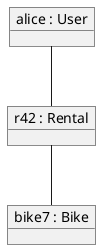
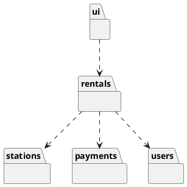
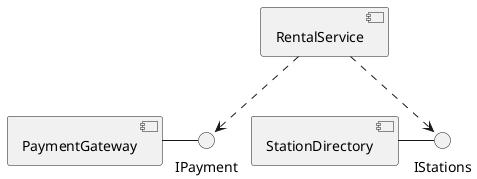
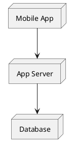
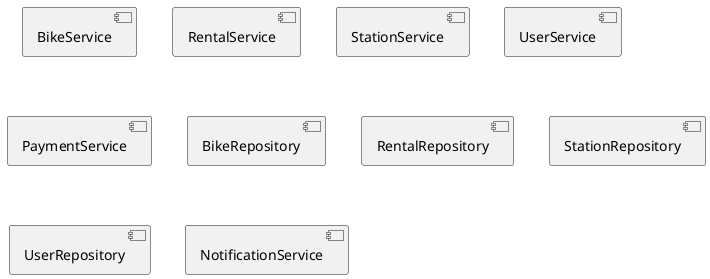
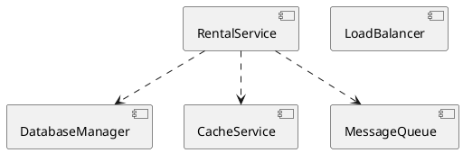
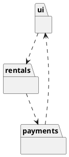
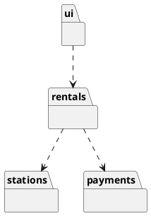

# Today's Agenda

1. Frame: from one class diagram to the whole structure
2. Live opener: drive AI to a package/component view
3. Reading floor: object, package, component (deployment in passing)
4. How AI over- and under-decomposes
5. Reading critically: the architecture read-order
6. Bridge to Lab 3 + W6

::: notes
W4 pinned one class diagram; today we widen to how the whole system is carved into parts. No re-introduction — open straight into decomposition. Package and component are the load-bearing pair; object and deployment are cameos.
:::

---

# Recap: Architect + Critic

- **Architect / director (B):** drive AI through the SDLC.
- **Critic / reviewer (A):** read AI's output and name what's wrong or missing.

In W4 you critiqued an AI-drawn class diagram. Today: the same loop, one level up — at the architecture.

::: notes
One breath of recap. W4 was a single diagram; today is the structure of the whole system.
:::

---

# From One Class Diagram to the Whole Structure

- **W4 gave you one class diagram** — `User`, `Rental`, `Bike`, `Station`, `Payment` and how they relate.
- **A real system has many such classes**, across many parts. How is it carved up?

Today's question: **what are the parts, and is the split right?**

::: notes
The bridge from W4. One class diagram models a slice; a system is dozens of classes that must be grouped into parts. The act of grouping — decomposition — is today's subject and today's defect surface.
:::

---

# Literacy Floor: F1 + F3 + F4

From W1: in the oral defense, *unaided*, you must demonstrate:

- **F1** — read & critique AI-generated artifacts on the spot.
- **F3** — articulate why you directed AI a certain way.
- **F4** — defend traceability across your project.

Today is F1 at the architecture level: read an AI-drawn structure and name where it over- or under-decomposes.

::: notes
First of two F1+F3+F4 mentions. F1 anchored this week on architecture views — reading a package/component diagram cold and naming bad decomposition IS the oral-defense skill. Same wording in the close.
:::

---

# Four Views, One Question

All four answer "what are the parts?" at different altitudes:

- **Object** — a *snapshot*: specific instances at one instant.
- **Package** — a *logical grouping*: which classes belong together.
- **Component** — a *replaceable unit* with declared interfaces.
- **Deployment** — *where it runs*: nodes and artifacts.

Today's load-bearing pair: **package + component**. The other two: recognise them.

::: notes
The map. Deliberately rank the four: package and component are where decomposition lives and where Lab 3 will hunt defects. Object and deployment get cameos. Set the expectation now so the depth split reads as intentional, not rushed.
:::

---

# Demo: Drive AI to an Architecture View

> Live: ask AI to decompose the bike-sharing system into packages and components. Watch the grain — too many parts, or invented ones.

**Prompt to AI:** *"Generate a UML component diagram (as PlantUML) for the city bike-sharing app from last week: rentals, stations, payments, and users."*

::: notes
Switch to Continue.dev with a PlantUML preview pane — students must SEE the rendered diagram. Run the runbook at `class/amss-2026/curs/05-other-structural-demo.md` for ~8 min. The near-certain failure is over-decomposition (a component per class) plus invented infrastructure. Fallback: runbook §7.
:::

---

# Object Diagram: A Snapshot

The class diagram's *types* at one **instant**: `alice` holds rental `r42` on `bike7`.

::: notes
Cameo, not a drill. An object diagram is the class diagram populated with concrete instances. When it earns its place: pinning down a confusing multiplicity by making it concrete — "show me one rental with the bikes attached" exposes a wrong many-to-many faster than staring at the type diagram. Recognise it, move on.
:::

---

# Package Diagram: Grouping

A package groups related classes. The dashed arrow reads **"depends on."**

::: notes
The first floor element. A package is a named bag of related classes — a namespace. The dependency arrow is the load-bearing notation: read each one aloud — "ui depends on rentals; rentals depends on stations, payments, users." Adapts 2025's e-commerce package example to bike-sharing.
:::

---

# Reading a Package Diagram

Read every dependency aloud, and ask two things:

1. **Direction** — do dependencies flow one way (ui toward domain), or loop back?
2. **Cycles** — does any package depend, directly or transitively, on one that depends on it?

A dependency **cycle** is a smell: the two packages are really one.

::: notes
This is the F1 drill for packages. Direction and cycles are what AI gets wrong and what the eye misses. A cycle means the boundary is fake — you cannot build, test, or reason about either package alone. Drill reading the arrows aloud.
:::

---

# Component Diagram: Replaceable Units

`PaymentGateway` **provides** `IPayment` (lollipop); `RentalService` **requires** it (dashed). A component is defined by its **interfaces**, not its internals.

::: notes
The second floor element. Ball-and-socket: provided interface is the lollipop, required is the dependency arrow into it. The key idea for critique: you should be able to swap PaymentGateway for another provider of IPayment without touching RentalService. If a "component" has no declared interfaces, it is just a renamed class. Adapts 2025's sales-server component example.
:::

---

# Reading a Component Diagram

For each component, ask:

1. What does it **provide**? (the interfaces others depend on)
2. What does it **require**? (the interfaces it depends on)
3. Could you **replace** it without touching its neighbours?

If you can't name a component's provided and required interfaces, it isn't a component.

::: notes
The F1 drill for components. The replace test is the sharpest one — a real component is swappable behind its interface. AI loves to draw boxes labelled "Service" with no interfaces at all; the read-order catches that immediately.
:::

---

# Beyond the Floor: Deployment

*Where* it runs: nodes (hardware/environments) and the artifacts on them. It matters for non-functional requirements — latency, availability — but it is not today's drill.

::: notes
Cameo. Deployment answers "where does it run," which is an NFR conversation (W2). Name it so students aren't lost when AI emits one, but don't drill it. Other structural views (composite structure, profiles) get a one-line mention only — deliberate scope boundary, spec §2.
:::

---

# AI Decomposes Plausibly — and Gets the Grain Wrong

A package or component diagram can look professional and still split the system badly. The critic question:

> *"Are these the right parts, at the right grain — or just boxes?"*

::: notes
Sets up the gallery — F1 applied to architecture. The payload is over- vs under-decomposition (spec §2's named W5 failure mode), plus invented infrastructure and bad dependency direction. These are pre-built flawed bike-sharing artifacts, walked together — a dry run of the Lab 3 defect hunt.
:::

---

# Defect #1: Under-Decomposition

One package — or one `BikeShareApp` component — holding everything. **Critique:** *"Where are the boundaries? Name three parts that could be built and tested separately."*

::: notes
The god class scaled up to architecture. AI under-decomposes when the prompt is vague — one box "covers" the system without committing to any structure. The fix is forcing it to name separable parts. This is the architecture-level twin of W4's god class.
:::

---

# Defect #2: Over-Decomposition

A component **per class**, plus a repository per entity. **Critique:** *"What boundary does each split earn? Which of these are really one part?"*

::: notes
The opposite failure, and the one the live demo most often triggers. AI mistakes "more boxes" for "better architecture" — a microservice per class is ceremony, not decomposition. The critique forces each split to justify itself by a real boundary (independent deployment, independent team, independent change). Most collapse back together.
:::

---

# Defect #3: Invented Infrastructure

`DatabaseManager`, `CacheService`, `MessageQueue` — infrastructure nobody asked for. **Critique:** *"Is this in the requirements, or did AI assume an architecture?"*

::: notes
W4's invented-class defect at architecture scale. AI pattern-matches "real system" to a stock cloud stack and bolts on caches, queues, and load balancers the spec never mentioned. The critique walks each box back to a requirement; the unjustified ones go.
:::

---

# Defect #4: Wrong Dependency Direction

`payments` depends back on `ui` — a **cycle**, and inverted layering. **Critique:** *"Read the arrows around the loop. Why does payments need the UI?"*

::: notes
The dependency defect made visible. A cycle ties the three packages into one tangle; inverted layering (domain depending on UI) breaks reuse and testability. Reading the arrows aloud around the loop exposes it — exactly the package read-order from two slides back.
:::

---

# The Critic Re-Decomposes

A handful of **domain** packages; dependencies flow **one way**; no invented infrastructure. The right grain.

::: notes
The critique result — the counterpart to W4's "the critic simplifies." Same domain, parts that earn their place, acyclic dependencies pointing toward the domain. This is what prompt #2 in the demo converges toward.
:::

---

# How to Read an AI Architecture View

A fixed order, every time:

1. Are these the real **parts** of *this* system? (domain, not invented infrastructure)
2. Is the **grain** right? (not one box; not a box per class)
3. Do **dependencies** point one way? (no cycles, layering respected)
4. Is each **component** defined by its interfaces? (provided + required)

::: notes
This IS the F1 drill for architecture, and the rubric Lab 3 will hand teams. A repeatable read-order beats ad-hoc staring. Students internalise it for the oral defense and the Lab 3 defect hunt.
:::

---

# The Critique Loop on Architecture

read -> name the bad split -> re-prompt with structural constraints -> re-read.

Same architect-critic loop as W2 (requirements), W3 (tests), W4 (class diagram) — now on a decomposition.

::: notes
The loop is the through-line. The scaffold that tightens AI output here is naming the structural rules — "group by domain capability, not by class; only components with real interfaces; no infrastructure I didn't ask for" — exactly the demo's prompt #2.
:::

---

# The Human Decides the Right Grain

AI can split a system into one box or a hundred. Neither is "more correct" on its own — the **right grain** is a judgment about *this* system's real boundaries.

That judgment is the architect-critic call, and AI can't make it for you.

::: notes
Reinforces ownership, mirroring W4's "the human decides what matches the domain." The defense grades this judgment — why these parts, why this grain — not the diagram's polish.
:::

---

# Looking Ahead: Lab 3 (Next Week)

Lab 3 is a **team defect hunt**: you'll receive flawed structural artifacts — a class diagram, a package diagram, a component diagram — and compete to find the most defects, with severity ratings.

Today's read-order is your defect-hunt rubric. This lecture was the dry run.

::: notes
W5 has no lab of its own (labs are biweekly; Lab 3 runs in W6). The gallery we just walked IS the Lab 3 format in miniature. Point students at the read-order as the rubric they'll use. Keep high-level — the Lab 3 brief is its own document.
:::

---

# Next Week: Behavioral I (W6)

Structure is done — W4 (classes) and W5 (architecture) cover *what the parts are*.

**W6:** use cases and sequence diagrams — *how the parts interact over time*, and where AI fabricates messages.

::: notes
Clean handoff. Structure (W4-W5) closes; behaviour (W6-W7) opens. The bike-sharing domain carries forward — the same parts now exchange messages.
:::

---

# F1 + F3 + F4 — The Through-Line

Today you drilled:

- **F1** — read an AI architecture view and named where it over- or under-decomposed.
- **F4** — the package/component is a structural node in the trace: requirement -> use case -> class -> part.

F3 (why you directed AI a certain way) lands in your project narrative.

::: notes
Second and final F1+F3+F4 mention. F1 anchored, same wording as the frame. The one-line trace touch extends W4's "class is a structural node" up to the architecture level, keeping F4 continuity without a dedicated segment.
:::

---

# That's It For Today

- Next lecture (W6): behavioral I — use cases + sequence.
- Next week's lab (Lab 3): team defect hunt on flawed structural artifacts.

Questions?

::: notes
Closer. Open the floor. No trailing slide separator after this one.
:::
