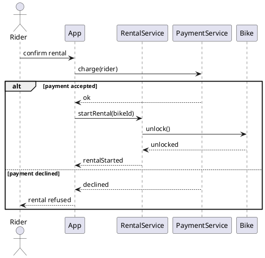

# W6 Demo Runbook — Bike-Sharing "Rent a Bike" Sequence

> Procedural script for the W6 lecture's live demo. **Not** a slidy deck — pandoc skips `*-demo.md`. Read end-to-end before running. Estimated runtime: 12-14 minutes inside the lecture's "Demo" segment.
>
> Design reference: the master spec's W6 row (`docs/superpowers/specs/2026-05-01-amss-ai-redesign-design.md` §2) — "AI-generated sequences and where they fabricate messages."
>
> This demo's artifact is a **rendered sequence diagram**. The "aha" beat is *reading the messages against the responsibilities* — invented messages, broken order, missing returns, and the absent failure path.

## 0. Setup (pre-class, ~1 min)

- VS Code open, Continue.dev installed and configured against the canonical course endpoint (see `class/amss-2026/tooling/SETUP.md`).
- Continue.dev mode set to **agentic chat**.
- A **PlantUML preview pane** open in VS Code — students must SEE the rendered diagram to read message order and returns; raw PlantUML text is not enough.
- The W4 bike-sharing class diagram recallable (this sequence realises a use case over *those* objects — the cross-link in defect #5 needs it).
- Browser tab pre-opened to `class/amss-2026/curs/06-behavioral-i-demo-fallback/01-fallback-cycle1-sequence.png` in case the live AI fails.
- The deck's "Demo" trigger slide is on screen.

## 1. Architect prompt #1 — verbatim

Paste this into Continue.dev's chat (do **not** improvise):

> *"Generate a UML sequence diagram (as PlantUML) for renting a bike in the city bike-sharing app: a rider unlocks a bike at a station and is charged by app."*

Render the result in the preview pane. **Time:** ~1 min to type, ~2-3 min for AI to generate + render.

## 2. Defect catalogue — pick 2-3 from the menu

Walk the rendered diagram aloud. Pick the **2-3 defects that actually appear**. Over-spec'ing absorbs model variance. #4 (only the happy path) is near-certain — anchor on it.

| # | Defect | What to point at | Critique question |
|---|---|---|---|
| 1 | Fabricated message | A `FraudDetector`, `Analytics`, or `Logger` call no requirement asked for | *"What requirement does this message serve? Who is responsible for it? If nothing, why is it here?"* |
| 2 | Impossible order | A result message sent before the call that causes it | *"Read top to bottom — can this step happen before the step that triggers it?"* |
| 3 | Missing return | A `charge()` or `unlock()` call with no dashed return, yet the caller proceeds | *"Where's the response? How does the caller know it succeeded?"* |
| 4 | Only the happy path | No `alt` — payment never declined, bike never already taken | *"What happens when payment fails? AI drew success and stopped."* |
| 5 | Message to a stranger / invented lifeline | `Rider -> Bike : chargeCard()`, or a `DatabaseManager` lifeline | *"Could these objects even talk? Check the class diagram. And who asked for a DatabaseManager?"* |

If the diagram is suspiciously complete → jump to §7 "Make-it-fail reserve".

## 3. Critique walkthrough (~5 min)

Walk the chosen 2-3 defects against the rendered diagram. Ask the room first ("does anything look wrong with this interaction?") before delivering the critique. Name the move explicitly the first time:

> *"That's the **critic** half — reading the conversation AI drew and asking 'does each message really happen?' Next is the **architect** half — I re-prompt with the responsibilities and the failure case it missed."*

Slow down here — this is the F1 skill in action, on behaviour.

## 4. Architect prompt #2 — constructed live (constraint scaffold)

Type this into Continue.dev:

> *"Revise the sequence. Keep only messages a requirement justifies — drop any fraud, analytics, or logging step nobody asked for. Every call that returns a result must show its dashed return. Add the payment-declined path as an alt fragment. Only let objects exchange messages if they are associated in the class diagram."*

Naming the responsibilities and demanding the failure path is the pivot. Re-render. **Time:** ~1 min to type, ~2-3 min for AI to revise + render.

## 5. Reference solution (instructor's verified render target)

The live AI output varies. This is the **dry-run-verified** reference the instructor confirms renders before delivery — the corrected interaction the critique converges toward:

Real messages, correct order, returns present, the declined-payment branch modelled. If the live output reaches something like this after prompt #2, the loop worked.

## 6. Recap (~1 min)

> *"One architect-critic cycle on a sequence. The first pass drew a smooth-looking conversation; the critic half read it message by message and found an invented step and no failure path; the architect half re-prompted with the responsibilities and the declined-payment case — and the second pass tightened. Reading an interaction against its responsibilities is exactly the F1 skill the oral defense checks, and it's the read-order Lab 4 will hand you in W8."*

Point back to the F1 anchor slide.

## 7. Make-it-fail reserve — AI produces a clean sequence

If AI's first sequence is suspiciously complete (low probability — sequences reliably omit the failure path), restore the critique surface:

> *"Make this enterprise-grade with full observability, fraud checks, and audit logging."*

This near-certainly triggers fabricated messages (fraud scoring, analytics, audit writes) and invented lifelines (DatabaseManager, MessageQueue). If even that is clean, fall back to `03-fallback-make-it-fail.png` and walk the screenshot.

## 8. Fallback path — live AI fails

If the live AI fails (no response after 20s, network down, garbage output), switch to the pre-recorded renders:

- `06-behavioral-i-demo-fallback/01-fallback-cycle1-sequence.png` — seed sequence with a fabricated message and no failure path.
- (walk the same defect catalogue against the screenshot)
- `06-behavioral-i-demo-fallback/02-fallback-cycle2-revised.png` — post-critique revised sequence with the alt fragment.

Acknowledge briefly ("the model is having a moment — here's the dry-run capture") and continue. The pedagogical content is identical.

## 9. Time budget reconciliation

| Beat | Duration |
|---|---|
| Prompt #1 typed | ~1 min |
| AI generates + render | ~2-3 min |
| Critique walkthrough | ~5 min |
| Prompt #2 typed | ~1 min |
| AI revises + render | ~2-3 min |
| Recap | ~1 min |
| **Total** | **12-14 min** |

If ahead of schedule, do not pad — use generation/render pauses to predict aloud what the next message should be before it appears, then take 1-2 questions.

## 10. Lab 4 synergy & fallback assets

This demo is the forerunner of Lab 4's behavioural defect hunt (W8): teams receive flawed behavioural artifacts (sequence, state, activity) and compete to spot the most defects with severity ratings. The §2 defect catalogue is the vocabulary; the deck's sequence read-order is the rubric. (This week's lab, Lab 3, is the *structural* hunt — W4-W5 content.)

Fallback assets to capture during the solo dry-run, in `06-behavioral-i-demo-fallback/`:

- `01-fallback-cycle1-sequence.png` — rendered cycle-1 sequence with a fabricated message and no failure path.
- `02-fallback-cycle2-revised.png` — rendered revised sequence with the alt fragment.
- `03-fallback-make-it-fail.png` — rendered over-instrumented "enterprise-grade" output.

When the procurement decision changes the canonical endpoint, the dry-run reruns and the PNGs refresh.
