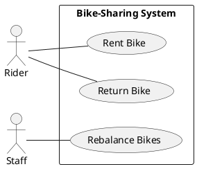
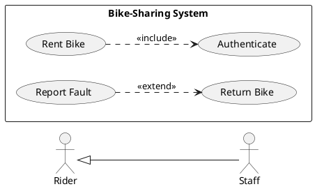
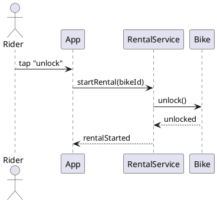
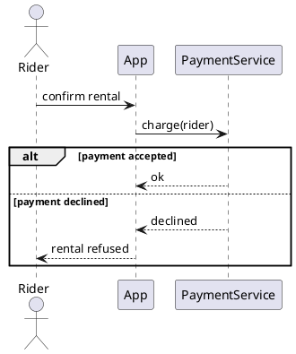
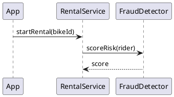
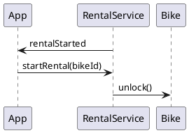
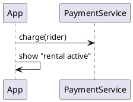
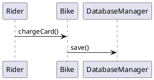
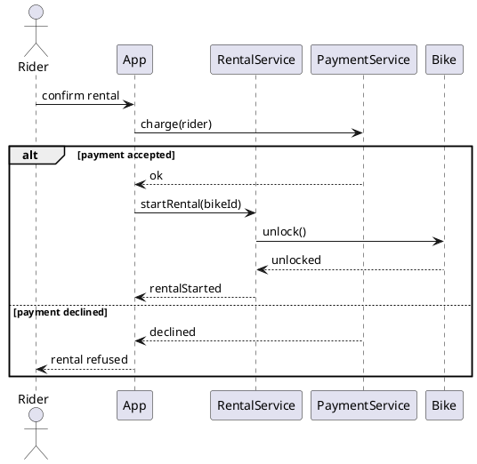

# Today's Agenda

1. Frame: from structure to behaviour
2. Use cases: from concept to notation
3. Sequence diagrams realise use cases
4. Live demo: drive AI to a sequence
5. Reading critically: where AI fabricates messages
6. Bridge to Week 7 + Lab 3 this week

::: notes
Weeks 4-5 modelled what the parts are; today we model how they interact over time. Use cases got their concept in Week 2; today they get their UML (Unified Modeling Language) notation, and sequence diagrams enter as the realisation. The payload is reading AI sequences for fabricated messages. No re-introduction — open into the structure-to-behaviour bridge.
:::

---

# Recap: Architect and Critic

- **Architect / director:** drive AI through the software development lifecycle (SDLC).
- **Critic / reviewer:** read AI's output and name what's wrong or missing.

In Weeks 4-5 you critiqued AI-drawn *structure*. Today: the same loop, on *behaviour*.

::: notes
One breath of recap. Structure (classes, packages, components) was Weeks 4-5; today is behaviour — how those parts talk to each other over time.
:::

---

# From Structure to Behaviour

- **Weeks 4-5 pinned the parts** — classes, packages, components: *what the system is made of*.
- **Today: how the parts interact** — which object sends which message to which, and in what order.

Today's question: **does this interaction really happen — or did AI invent it?**

::: notes
The bridge from Weeks 4-5. A static structure says nothing about runtime collaboration. Behaviour fills that in — and it's where AI most freely fabricates, because nothing on the page forces a message to be real.
:::

---

# The Literacy Floor: Critique, Rationale, Traceability

From Week 1: in the oral defense, *unaided*, you must demonstrate:

- **Critique** — read & critique AI-generated artifacts on the spot.
- **Rationale** — articulate why you directed AI a certain way.
- **Traceability** — defend the trace across your project.

Today is Critique on behaviour: read an AI sequence and name the fabricated or missing messages. **Traceability touch:** requirement -> use case -> sequence -> class is the behavioural tail of the trace.

::: notes
First of two Critique, Rationale, Traceability mentions. Critique anchored this week on sequences — reading one cold and naming invented messages IS the oral-defense skill. The trace line extends Weeks 4-5's structural nodes with the behavioural tail. Same wording in the close.
:::

---

# Use Cases: From Concept to Notation

- **Week 2 gave you the concept** — a use case is one thing a user wants to accomplish; a bucket for requirements.
- **Today: the notation** — actors, ovals, system boundary, and the relationships between use cases.

The use case says **what** the user wants; the sequence will say **how** the system delivers it.

::: notes
Week 2 deliberately taught "use case" as a structural noun with no diagrams, and promised the notation here (Week 2 deck, "Until then... nothing more"). Today delivers that promise. Keep this compact — use-case diagrams are low AI-defect-density; the critique depth is on sequences.
:::

---

# Use Case Diagram

**Actors** (stick figures) sit outside; **use cases** (ovals) sit inside the **system boundary** (the box).

::: notes
The use-case notation, on the familiar bike-sharing domain. Three elements: actor, oval, boundary. Read it aloud — "a Rider can Rent Bike and Return Bike; Staff can Rebalance Bikes." Adapts 2025's enroll/use-case example, re-domained.
:::

---

# Include / Extend / Generalization

- **Include** — mandatory sub-behaviour: Rent Bike *always* includes Authenticate.
- **Extend** — optional: Report Fault *may* extend Return Bike.
- **Generalization** — Staff *is-a* Rider (plus more).

::: notes
The three relationships Week 2 promised. Include is reuse you always do; extend is conditional; generalization is is-a between actors or use cases. Don't over-drill — name them, show one of each, move on to sequences.
:::

---

# Sequence Diagrams Realise Use Cases

A use case names a goal. A **sequence diagram** shows the objects collaborating to fulfil it — message by message, in time order.

> "Rent a Bike" (the use case) -> a sequence of messages between `Rider`, `App`, `RentalService`, `Bike`.

::: notes
The spec's framing: sequence diagrams as use-case realisations. This is also a trace link (Traceability): the use case is realised by a sequence, whose objects come from the Week 4 class diagram. The demo picks up exactly this use case.
:::

---

# Demo: Drive AI to a Sequence

> Live: ask AI to draw the interaction for "rent a bike." Watch the messages — are they real, in the right order, with the failure path?

**Prompt to AI:** *"Generate a UML sequence diagram (as PlantUML) for renting a bike in the city bike-sharing app: a rider unlocks a bike at a station and is charged by app."*

::: notes
Switch to Continue.dev with a PlantUML preview pane — students must SEE the rendered diagram. Run the runbook at `class/amss-2026/curs/06-behavioral-i-demo.md` for ~12 min. The near-certain failures: a fabricated message and a missing failure path. Fallback: runbook §8.
:::

---

# Sequence: Lifelines + Messages

Each box has a **lifeline** down the page; **time flows top to bottom**. Solid arrow = a call; dashed = a return.

::: notes
The sequence floor on bike-sharing. The atoms: lifeline (who), message (what), direction (caller to callee), return (dashed). Read it aloud top to bottom — this is the Critique reading target for behaviour.
:::

---

# Reading a Sequence

Read top to bottom, and check:

1. **Order** — does each message only depend on what happened above it?
2. **Returns** — does every call that needs an answer get a dashed return?
3. **Activation** — is it clear which object is executing at each step?

::: notes
The Critique drill for sequences. Order and returns are where AI slips. A message that uses a result not yet returned is an impossible order; a call with no return leaves the caller hanging. Drill reading the arrows in sequence.
:::

---

# Your Turn: Spot the Break

Look back at the lifelines-and-messages sequence — but imagine `RentalService --> App : rentalStarted` is sent *before* `App -> RentalService : startRental(bikeId)`.

> With your neighbour, 90 seconds: which of the three checks — **order / returns / activation** — does this sequence break?

::: notes
Quick paired diagnosis before the defect gallery. The planted break is an impossible order (a result before its cause), so it fails the order check — but let pairs argue it out for 90 seconds before the reveal. This primes Defect #2 and gets every student reading arrows actively rather than watching.
:::

---

# Alternative Paths

Real interactions have **failure paths**. The `alt` fragment shows the branch. AI usually draws only the happy path.

::: notes
The alt fragment is the floor element AI most often omits. Payment declined, bike already taken, network down — these are the interactions that matter for correctness, and AI skips them because the happy path "looks complete." Anchor this; it's defect #4.
:::

---

# AI Draws Plausible Conversations — and Invents Messages

A sequence can read smoothly and still contain messages that never happen. The critic question:

> *"Does each message map to a real responsibility — or did AI invent it to connect the boxes?"*

::: notes
Sets up the gallery — Critique applied to behaviour. The core defect is the fabricated message (spec: "where they fabricate messages"). Nothing on a sequence diagram forces a message to be real, so AI fills gaps with plausible-sounding calls.
:::

---

# Defect #1: Fabricated Message

`FraudDetector.scoreRisk` — no requirement asked for it. **Critique:** *"What requirement does this message serve? Who is responsible for it? If nothing, it shouldn't be here."*

::: notes
The anchor defect. AI adds a plausible-sounding step (fraud scoring, analytics, logging) that no requirement justifies. The critique walks the message back to a requirement and a responsible object; the unjustified one goes. This is Week 4's invented-class defect, now as an invented message.
:::

---

# Defect #2: Impossible Order

`rentalStarted` is sent *before* `startRental` requests it. **Critique:** *"Read top to bottom — can step 1 happen before step 2 that causes it?"*

::: notes
Causality broken: a result appears before its cause. AI sometimes orders messages by narrative plausibility, not by data dependency. Reading top-to-bottom against "what does this step need from above it" exposes it.
:::

---

# Defect #3: Missing Return

`App` declares the rental active without waiting for `charge` to return. **Critique:** *"Where's the response to charge? How does App know it succeeded?"*

::: notes
A dangling call: the caller proceeds without the answer it needs. The missing dashed return is the tell. This matters for correctness — App is claiming success it never confirmed.
:::

---

# Defect #4: Only the Happy Path

A sequence with no `alt` — payment never declined, bike never already taken, network never down.

**Critique:** *"What happens when payment fails? AI drew the success case and stopped."*

::: notes
The most common omission, and the costliest. Kept textual — the absence of a branch is the defect, and a slide can't render a missing thing. Pair it with the alt-fragment floor slide: the fix is adding the failure branch.
:::

---

# Defect #5: Message to a Stranger

`Rider` calls `Bike.chargeCard` — but the class diagram has no such association, and `DatabaseManager` is an invented lifeline. **Critique:** *"Could these objects even talk? Check the class diagram."*

::: notes
The light cross-link to Week 4. A sequence message implies an association in the class diagram; a message between unassociated objects is a catchable defect — trace it back to the structure. Plus the invented infrastructure lifeline (DatabaseManager), the Week 5 defect in behavioural form. One slide, two related tells; don't expand into a full structural re-derivation.
:::

---

# The Critic's Corrected Sequence

Real messages, correct order, returns present, one failure path.

::: notes
The critique result — the counterpart to Week 4's "the critic simplifies." Every message maps to a responsibility, order respects causality, calls return, and the declined-payment branch is modelled. This is what the demo's prompt #2 converges toward.
:::

---

# How to Read an AI Sequence

A fixed order, every time:

1. Does each **message** map to a real responsibility? (or is it invented)
2. Is the **order** causally possible? (no result before its cause)
3. Are the **returns** present? (no dangling calls)
4. Is the **failure path** modelled? (not just the happy path)

::: notes
This IS the Critique drill for behaviour, and the rubric Lab 4 (Week 8) will hand teams for the behavioural defect hunt. A repeatable read-order beats ad-hoc staring. Students internalise it for the oral defense.
:::

---

# The Critique Loop on Behaviour

read -> name the fabricated/missing messages -> re-prompt with the responsibilities + the failure case -> re-read.

Same architect-and-critic loop as Weeks 2-5 — now on an interaction.

::: notes
The loop is the through-line. The scaffold that tightens AI output here is naming the responsibilities and demanding the failure path — "only messages a requirement justifies; add the payment-declined branch" — exactly the demo's prompt #2.
:::

---

# The Human Decides What Really Happens

AI can write a plausible conversation between objects forever. Whether it's the interaction the system *actually* performs — that's the architect-and-critic call.

It's what the oral defense checks, and AI can't make it for you.

::: notes
Reinforces ownership, mirroring Weeks 4-5's closes. The defense grades whether the interaction is real and complete, not whether the diagram is tidy.
:::

---

# This Week's Lab: Lab 3

Lab 3 runs this week — a **team defect hunt on flawed structural artifacts** (class, package, component) from Weeks 4-5. Bring your structural read-orders.

The *behavioural* defect hunt — sequences and the diagrams in Week 7 — is Lab 4 (Week 8).

::: notes
Labs lag lectures by design: this week's lab is the structural hunt (Weeks 4-5 content), while today's lecture opens behaviour. Be explicit so students aren't confused that the lab and lecture topics differ. Today's sequence read-order is what they'll reuse in Lab 4.
:::

---

# Next Week: Behavioral II (Week 7)

Sequences show *one* interaction. But an object has a whole **lifecycle**, and a workflow has many steps.

**Week 7:** state machines (object lifecycles) and activity diagrams (workflows) — and AI's orphan states, unreachable transitions, missed guards.

::: notes
Clean handoff. Week 6 was inter-object interaction (sequence); Week 7 widens to intra-object lifecycle (state) and workflow (activity). Bike-sharing carries forward — a Bike's states, a rental's workflow.
:::

---

# Critique, Rationale, Traceability — The Through-Line

Today you drilled:

- **Critique** — read an AI sequence and named its fabricated and missing messages.
- **Traceability** — the sequence is the behavioural node in the trace: requirement -> use case -> sequence -> class (the structure came in Weeks 4-5).

Rationale (why you directed AI a certain way) lands in your project narrative.

::: notes
Second and final Critique, Rationale, Traceability mention. Critique anchored, same wording as the frame. The trace line now spans structure (Weeks 4-5) and behaviour (Week 6), keeping Traceability continuity without a dedicated segment.
:::

---

# That's It For Today

- Next lecture (Week 7): behavioral II — state + activity.
- This week's lab (Lab 3): team defect hunt on flawed structural artifacts.

Questions?

::: notes
Closer. Open the floor. No trailing slide separator after this one.
:::
