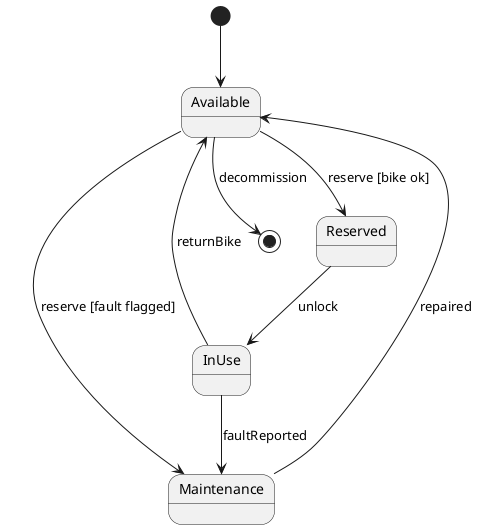

# W7 Demo Runbook — Bike State Machine

> Procedural script for the W7 lecture's live opener. **Not** a slidy deck — pandoc skips `*-demo.md`. Read end-to-end before running. Estimated runtime: **~8 minutes** inside the lecture's "Demo" segment (an opener that seeds the gallery, not the whole payload).
>
> Design reference: the master spec's W7 row (`docs/superpowers/specs/2026-05-01-amss-ai-redesign-design.md` §2) — "AI failure modes (orphan states, unreachable transitions, missed guards)."
>
> This demo's artifact is a **rendered state machine**. The "aha" beat is *tracing reachability* — a state nothing enters, a state nothing leaves, a branch nothing decides. It hands directly into the deck's defect gallery.

## 0. Setup (pre-class, ~1 min)

- VS Code open, Continue.dev installed and configured against the canonical course endpoint (see `class/amss-2026/tooling/SETUP.md`).
- Continue.dev mode set to **agentic chat**.
- A **PlantUML preview pane** open in VS Code — students must SEE the rendered diagram to trace reachability; raw PlantUML text is not enough.
- Browser tab pre-opened to `class/amss-2026/curs/07-behavioral-ii-demo-fallback/01-fallback-cycle1-states.png` in case the live AI fails.
- The deck's "Demo" trigger slide is on screen.

## 1. Architect prompt #1 — verbatim

Paste this into Continue.dev's chat (do **not** improvise):

> *"Generate a UML state machine diagram (as PlantUML) for a bike in the city bike-sharing app: it can be available, reserved, in use, and under maintenance."*

Render the result in the preview pane. **Time:** ~1 min to type, ~2 min for AI to generate + render.

## 2. Defect catalogue — pick the ones that appear

Trace the rendered diagram from the initial state. Pick the **2-3 defects that actually appear**. An orphan/unreachable state (#1) is near-certain — anchor on it.

| # | Defect | What to point at | Critique question |
|---|---|---|---|
| 1 | Orphan / unreachable state | `Maintenance` with no transition in | *"How does a bike ever enter Maintenance? Trace a path to it from the start."* |
| 2 | Dead-end state | A non-final state with no transition out | *"Once here, what happens? Give it an exit or make it final."* |
| 3 | Missed guard | Two transitions on the same event, no guards | *"Both fire on the same event — what decides? Add the guards."* |
| 4 | No initial / final | No `[*]` start, or no path to an end | *"Where does this begin? Where does it end?"* |

If the diagram is suspiciously complete → jump to §6 "Make-it-fail reserve".

## 3. Critique walkthrough (~3 min)

Trace the chosen 2-3 defects from the initial state. Ask the room first ("can a bike reach every state here?") before delivering the critique. Name the move explicitly:

> *"That's the **critic** half — tracing the lifecycle AI drew and asking 'can the object reach and leave every state?' Next is the **architect** half — I re-prompt with the missing transitions and guards."*

This is the F1 skill on lifecycles — the same thing Lab 4 grades next week.

## 4. Architect prompt #2 — constructed live (constraint scaffold)

Type this into Continue.dev:

> *"Revise the state machine. Every state must be reachable from the start and have a way out or be final — wire Maintenance in (a fault is reported in use) and out (repaired). When one event leads to two states, add guards to decide. Include an initial and a final state."*

Naming the missing wiring is the pivot. Re-render. **Time:** ~1 min to type, ~2 min for AI to revise + render.

## 5. Reference solution (instructor's verified render target)

The live AI output varies. This is the **dry-run-verified** reference the instructor confirms renders before delivery — the corrected lifecycle the critique converges toward:

Every state reachable and escapable, the reserve branch guarded, initial and final present. If the live output reaches something like this after prompt #2, the loop worked. Pivot straight into the deck's defect gallery — the live failure you just saw is defect #1 (or #2) of that gallery.

## 6. Make-it-fail reserve — AI produces a clean state machine

If AI's first diagram is already sound (low probability — AI reliably strands a state), restore the critique surface:

> *"Add all the edge-case states: lost, stolen, reserved-but-expired, charging, low-battery."*

This near-certainly produces orphan states (no transition in) and dead ends (no transition out). If even that is clean, fall back to the dry-run capture and walk the screenshot.

## 7. Fallback path — live AI fails

If the live AI fails (no response after 20s, network down, garbage output), switch to the pre-recorded renders:

- `07-behavioral-ii-demo-fallback/01-fallback-cycle1-states.png` — cycle-1 state machine with an orphan/dead-end state and a missed guard.
- (walk the same defect catalogue against the screenshot)
- `07-behavioral-ii-demo-fallback/02-fallback-cycle2-revised.png` — post-critique revised state machine.

Acknowledge briefly ("the model is having a moment — here's the dry-run capture") and continue. The pedagogical content is identical.

## 8. Time budget reconciliation

| Beat | Duration |
|---|---|
| Prompt #1 typed | ~1 min |
| AI generates + render | ~2 min |
| Critique walkthrough | ~3 min |
| Prompt #2 typed + AI revises + render | ~2 min |
| **Total** | **~8 min** |

This is an opener, not the whole demo — keep it tight and hand into the gallery. If ahead of schedule, do not pad; predict aloud which state will be stranded before it appears.

## 9. Lab 4 synergy & fallback assets

This demo is a forerunner of Lab 4 (next week, W8): a team defect hunt on flawed behavioural artifacts (sequence, state, activity). The §2 defect catalogue is the vocabulary; the deck's behaviour read-order is the rubric.

Fallback assets to capture during the solo dry-run, in `07-behavioral-ii-demo-fallback/`:

- `01-fallback-cycle1-states.png` — rendered cycle-1 state machine with an orphan/dead-end state.
- `02-fallback-cycle2-revised.png` — rendered revised state machine.

When the procurement decision changes the canonical endpoint, the dry-run reruns and the PNGs refresh.
