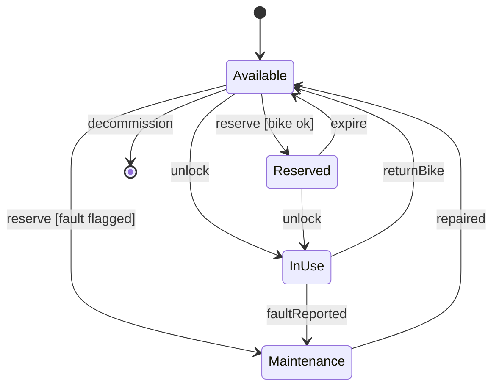

# W7 Demo Runbook — Bike State Machine

Calibrated September 2026 with Claude Sonnet 5 (low effort), one run per prompt — live output varies; walk the defects that actually appear.

> Procedural script for the W7 lecture's live opener. **Not** a slidy deck — pandoc skips `*-demo.md`. Read end-to-end before running. Estimated runtime: **~8 minutes** inside the lecture's "Demo" segment (an opener that seeds the gallery, not the whole payload).
>
> Design reference: the master spec's W7 row (`docs/superpowers/specs/2026-05-01-amss-ai-redesign-design.md` §2) — "AI failure modes (orphan states, unreachable transitions, missed guards)."
>
> This demo's artifact is a **rendered state machine**. The "aha" beat is *tracing the lifecycle against the domain* — the spec's classic failures (orphan states, dead ends, missed guards) plus the ones current models actually make: a transition the domain needs that nobody drew, a guard nobody can evaluate, a label that misuses the notation. It hands directly into the deck's defect gallery.
>
> **Calibration note:** at the course setting the first draft is near-reference on the classic defects — all four states reachable, initial and final present, the `returnBike` branch guarded. No orphan state appeared. The critique surface is subtler (see §2); §6's reserve is strengthened for a fully clean draft.

## 0. Setup (pre-class, ~1 min)

- VS Code open on a repository containing the course settings from `tooling/template/` (see `class/amss-2026/tooling/SETUP.md`); demo runs in the **Claude Code panel** with those settings (Sonnet 5, low effort). Check with `/model` before class.
- A **Mermaid preview** open in VS Code (the built-in Markdown preview with the "Markdown Preview Mermaid Support" extension) — students must SEE the rendered diagram to trace reachability; raw Mermaid text is not enough.
- Browser tab pre-opened to `class/amss-2026/curs/07-behavioral-ii-demo-fallback/01-fallback-cycle1-states.png` in case the live AI fails.
- The deck's "Demo" trigger slide is on screen.

## 1. Architect prompt #1 — verbatim

Paste this into the Claude Code panel (do **not** improvise):

> *"Generate a UML state machine diagram (as Mermaid) for a bike in the city bike-sharing app: it can be available, reserved, in use, and under maintenance."*

Render the result in the preview pane. **Time:** ~1 min to type, ~2 min for AI to generate + render.

## 2. Defect catalogue — pick the ones that appear

Trace the rendered diagram from the initial state. Pick the **2-3 defects that actually appear**. Run the classic reachability check first — at the calibrated setting it came out clean, and saying so ("every state is reachable and escapable — good") is itself the lesson: a clean structural check is where the critique *starts*, not ends. Then trace real rider journeys; anchor on the missing walk-up transition (#1).

Observed in calibration (Sonnet 5, low effort):

| # | Defect | What to point at | Critique question |
|---|---|---|---|
| 1 | Missing domain transition | No `Available --> InUse` — the only way into `InUse` is via `Reserved` | *"I walk up to a free bike and unlock it without reserving. Which transition is that? Trace it."* |
| 2 | Vague guard | `returnBike() [OK condition]` vs `[reported issue]` | *"Who evaluates 'OK condition'? Name the condition so a tester could check it."* |
| 3 | Notation misuse | `reservationExpired() / cancelReservation()` on one transition | *"In UML, `event / action` means 'on this event, do that action'. Did it mean two alternative events? Then it needs two transitions."* |
| 4 | Missing mid-ride fault | Faults only reported on return (or when idle); nothing leaves `InUse` for a fault during the ride | *"The chain snaps mid-ride. What state is the bike in, and how does the ride end?"* |
| 5 | Partial fault coverage | `flagForMaintenance()` only from `Available` — a reserved bike cannot be flagged | *"A reserved bike is found broken before pickup. Where does it go?"* |

Classic defects older/weaker models produce (not observed here — check anyway, it takes ten seconds): orphan state with no transition in; dead-end non-final state; two transitions on one event with no guards; no `[*]` start or end.

If the diagram is clean on all of the above → jump to §6 "Make-it-fail reserve".

## 3. Critique walkthrough (~3 min)

Trace the chosen 2-3 defects from the initial state. Ask the room first ("can a bike reach every state here? — now: can a rider do everything a rider really does?") before delivering the critique. Name the move explicitly:

> *"That's the **critic** half — tracing the lifecycle AI drew, first for reachability, then against real journeys: walk-up rental, a fault mid-ride. Next is the **architect** half — I re-prompt with the missing transitions and concrete guards."*

This is the F1 skill on lifecycles — the same thing Lab 4 grades next week.

## 4. Architect prompt #2 — constructed live (constraint scaffold)

Type this into the Claude Code panel:

> *"Revise the state machine. A rider can also unlock an available bike without reserving it. A fault can be reported during a ride, and a reserved bike can be flagged as faulty before pickup. Replace vague guards with conditions a tester could check, and use one transition per event — `event / action` means an action, not an alternative event. Keep an initial and a final state."*

Naming the missing journeys is the pivot. Re-render. **Time:** ~1 min to type, ~2 min for AI to revise + render.

**Critique beat — re-check the revision, don't trust the summary.** The calibration's follow-up (the older prompt #2, which asked only for Maintenance wiring and guards) applied what was asked and described it accurately — but left the missing `Available --> InUse` unnoticed and added a redundant guard (`reportFault() [mid-ride fault]` — the event already says it). It also sent the bike to `UnderMaintenance` mid-ride with no word on the rider. Across settings, follow-ups sometimes claim fixes that were not made. Tick each request against the new render, aloud: *"It says walk-up is added — show me the arrow."* Ask: *"The bike is in Maintenance mid-ride — where is the rider, and how is the rental closed?"*

## 5. Reference solution (instructor's verified render target)

The live AI output varies. This is the **dry-run-verified** reference the instructor confirms renders before delivery — the corrected lifecycle the critique converges toward:

```mermaid
stateDiagram-v2
    [*] --> Available
    Available --> Reserved : reserve [bike ok]
    Available --> Maintenance : reserve [fault flagged]
    Available --> InUse : unlock
    Reserved --> InUse : unlock
    Reserved --> Available : expire
    InUse --> Available : returnBike
    InUse --> Maintenance : faultReported
    Maintenance --> Available : repaired
    Available --> [*] : decommission
```

Every state reachable and escapable, walk-up rental and a mid-ride fault covered, the reserve branch guarded, initial and final present. If the live output reaches something like this after prompt #2, the loop worked. Pivot straight into the deck's defect gallery — the live defects map to gallery defect #6 (missing domain transition) and the guard discussion of defect #3; the classic orphan/dead-end entries (#1, #2) are what the structural check you just ran would have caught.

## 6. Make-it-fail reserve — AI produces a clean state machine

The calibrated first draft was near-reference on structure, so a fully clean draft (walk-up present, mid-ride fault present, concrete guards) is a real possibility. Restore the critique surface by growing the state space — wiring errors scale with the number of states:

> *"Add all the edge-case states: lost, stolen, reserved-but-expired, charging, low-battery. Model 'in use' as a composite state with Riding and Paused substates."*

Not calibrated — dry-run it and capture the result (`03-fallback-make-it-fail.png`). Walk it with the full read-order: an edge-case state with no way in or out (can a stolen bike ever come back?), a low-battery condition modelled as a state that overlaps `InUse`, an event leaving the composite that the substates ignore. If even that is clean, praise it briefly and walk the fallback capture from §7 — the gallery carries the classic defects.

## 7. Fallback path — live AI fails

If the live AI fails (no response after 20s, network down, garbage output), switch to the pre-recorded renders:

- `07-behavioral-ii-demo-fallback/01-fallback-cycle1-states.png` — cycle-1 state machine (no walk-up transition, vague guard, notation misuse).
- (walk the same defect catalogue against the screenshot)
- `07-behavioral-ii-demo-fallback/02-fallback-cycle2-revised.png` — post-critique revised state machine.

Acknowledge briefly ("the model is having a moment — here's the dry-run capture") and continue. The pedagogical content is identical.

## 8. Time budget reconciliation

| Beat | Duration |
|---|---|
| Prompt #1 typed | ~1 min |
| AI generates + render | ~2 min |
| Critique walkthrough | ~2.5 min |
| Prompt #2 typed + AI revises + render | ~2 min |
| Re-check the revision against the requests | ~0.5 min |
| **Total** | **~8 min** |

This is an opener, not the whole demo — keep it tight and hand into the gallery. If ahead of schedule, do not pad; ask the room to name a real rider journey before tracing it.

## 9. Lab 4 synergy & fallback assets

This demo is a forerunner of Lab 4 (next week, W8): a team defect hunt on flawed behavioural artifacts (sequence, state, activity). The §2 defect catalogue (observed plus classic) is the vocabulary; the deck's behaviour read-order is the rubric.

Fallback assets to capture during the solo dry-run, in `07-behavioral-ii-demo-fallback/`:

- `01-fallback-cycle1-states.png` — rendered cycle-1 state machine (calibrated: no walk-up transition, vague guard, `event / action` misuse).
- `02-fallback-cycle2-revised.png` — rendered revised state machine.
- `03-fallback-make-it-fail.png` — rendered output of the §6 reserve prompt.

When the course model setting changes (`tooling/template/`), the dry-run reruns and the PNGs refresh.
