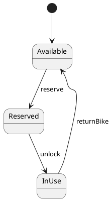
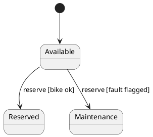
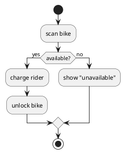
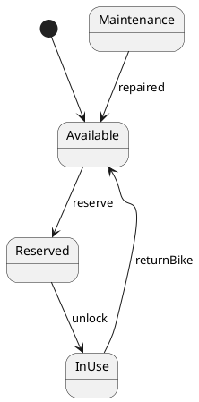
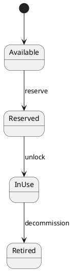
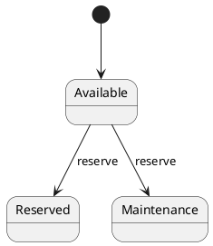
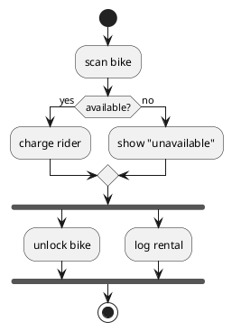
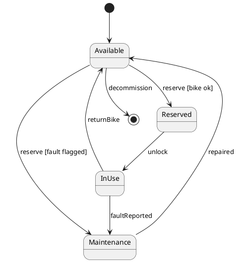

# Today's Agenda

1. Frame: from one interaction to a whole lifecycle
2. Two views: state machines + activity diagrams
3. Live opener: drive AI to a Bike state machine
4. Reading critically: orphan states, dead ends, missed guards
5. The behaviour read-order
6. Bridge to Week 8 + Lab 4

::: notes
Week 6 modelled one interaction (a sequence). Today we model an object's whole lifecycle (state machine) and a workflow's branching/parallel structure (activity). The named payload is state-machine defects: orphan states, unreachable transitions, missed guards. No re-introduction — open into the interaction-to-lifecycle bridge.
:::

---

# Recap: Architect and Critic

- **Architect / director:** drive AI through the software development lifecycle (SDLC).
- **Critic / reviewer:** read AI's output and name what's wrong or missing.

In Week 6 you critiqued an AI *interaction* (a sequence). Today: the same loop, on a *lifecycle* and a *workflow*.

::: notes
One breath of recap. Week 6 was inter-object interaction over one path; today is intra-object lifecycle (state) and whole-workflow control flow (activity).
:::

---

# From One Interaction to a Whole Lifecycle

- **Week 6 pinned one interaction** — the messages for "rent a bike", one path through one use case.
- **Today: the whole behaviour** — a `Bike` lives through many **states**; a rental **workflow** branches and runs in parallel.

Today's question: **can the object actually reach — and leave — every state the model claims?**

::: notes
The bridge from Week 6. A sequence shows one successful path; it says nothing about all the states an object passes through or what happens on every branch. State machines and activity diagrams fill that in — and it's where AI strands states and forgets to merge.
:::

---

# The Literacy Floor: Critique, Rationale, Traceability

From Week 1: in the oral defense, *unaided*, you must demonstrate:

- **Critique** — read & critique AI-generated artifacts on the spot.
- **Rationale** — articulate why you directed AI a certain way.
- **Traceability** — defend the trace across your project.

Today is Critique on lifecycles: read a state machine and name orphan states, unreachable transitions, missed guards. **Traceability touch:** state and activity are behavioural nodes in the trace, alongside the Week 6 sequence.

::: notes
First of two Critique, Rationale, Traceability mentions. Critique anchored this week on state machines — reading one cold and naming a stranded state IS the oral-defense skill. Same wording in the close.
:::

---

# Two Views Today

Both answer "how does it behave?" at different scopes:

- **State machine** — one object's **lifecycle**: the states it passes through and what moves it between them.
- **Activity diagram** — a **workflow** across steps (and actors): branches, parallelism, start to finish.

The named payload is **state-machine defects**; both views are load-bearing for Lab 4.

::: notes
The map. State machines are one object over time; activity diagrams are a process across steps. The spec's failure modes (orphan states, unreachable transitions, missed guards) are state-machine defects, so state carries the gallery — but Lab 4 critiques activity too, so it gets a real floor.
:::

---

# Demo: Drive AI to a Bike State Machine

> Live: ask AI for the lifecycle of a `Bike`. Watch for a state it can never reach, a state it can never leave, and a branch with no guard.

**Prompt to AI:** *"Generate a UML state machine diagram (as PlantUML) for a bike in the city bike-sharing app: it can be available, reserved, in use, and under maintenance."*

::: notes
Switch to Continue.dev with a PlantUML preview pane — students must SEE the rendered diagram. Run the runbook at `class/amss-2026/curs/07-behavioral-ii-demo.md` for ~8 min. The near-certain failures: an orphan/dead-end state and a missed guard. Fallback: runbook §7.
:::

---

# State Machine: States + Transitions

Boxes are **states**; arrows are **transitions** labelled by the **event** that fires them. `[*]` is the initial pseudo-state; a transition to `[*]` would be the final.

::: notes
The state floor on bike-sharing. The atoms: state, transition, event, initial/final pseudo-state. Read it aloud — "from Available, a reserve event moves to Reserved." Adapts 2025's ATM-lifecycle / turnstile examples, re-domained.
:::

---

# Reading a State Machine

Read every state, and ask:

1. **Reachable?** Is there a path from the initial state to this one?
2. **Escapable?** Does this state have a way out — or is it a final state?
3. **Triggered?** Does every transition name the event that fires it?

A state you can't reach, or can't leave, is a defect.

::: notes
This is the Critique drill for state machines. Reachability and escapability are exactly what AI gets wrong — it adds a state and forgets to wire it in or out. Drill tracing paths from the initial state.
:::

---

# Guards + Events

A **guard** `[condition]` chooses between transitions on the **same event**. Without guards, two transitions on `reserve` are ambiguous — which one fires?

::: notes
The guard sets up defect #3. Syntax: `event [guard] / action`. When one event can lead to two states, a guard must decide; AI routinely draws both transitions on the same event with no guard, leaving the model nondeterministic.
:::

---

# Activity Diagram: Actions + Flow

Rounded boxes are **actions**; the diamond is a **decision**; flow runs from `start` to `stop`.

::: notes
The activity floor on the rental workflow. The atoms: action, control flow, decision, initial/final. Note the if/else rejoins before stop — a decision that branches must merge. Adapts 2025's order-processing / check-in activity examples.
:::

---

# Decisions, Forks, Joins

- **Decision / merge** — a branch (diamond out) must rejoin (merge in).
- **Fork / join** — parallel flows split at a fork bar and must synchronise at a join bar.
- **One initial**; one or more **final** nodes.

Every split needs its matching rejoin.

::: notes
The structural rules for activity diagrams. Decision pairs with merge; fork pairs with join. AI breaks these symmetries — branching without merging, forking without joining — which is defect #4. Keep it crisp; the floor is the symmetry rule.
:::

---

# Reading an Activity

Read the flow, and ask:

1. Does every **decision** eventually **merge**?
2. Does every **fork** reach a **join**?
3. Is there a path from start to a **final** node?

A dangling branch or an unsynchronised fork is a defect.

::: notes
The Critique drill for activity diagrams. The symmetry checks (decision/merge, fork/join) plus reachability of a final node. These are the activity analogues of the state machine's reachable/escapable checks.
:::

---

# AI Draws Plausible Lifecycles — and Strands States

A state machine can list all the right states and still be broken: a state nothing reaches, a state nothing leaves, a branch nothing decides. The critic question:

> *"Can the object actually reach — and leave — every state, and is every branch decided?"*

::: notes
Sets up the gallery — Critique applied to behaviour. The core defects are spec-named: orphan/unreachable states, and missed guards. AI lists states fluently but wires them carelessly, because a state box looks complete on its own.
:::

---

# Your Turn: Spot the Defect

Look at the next state machine before we critique it.

**20 seconds with your neighbour:** what's wrong with this lifecycle before we critique it?

::: notes
A quick pair beat right before the gallery. Let them try the reachable/escapable checks themselves on Defect #1's diagram — most rooms catch that nothing puts a bike into Maintenance. Take one answer, then reveal the named defect. Keep it tight, 20-30 seconds of discussion.
:::

---

# Defect #1: Orphan / Unreachable State

`Maintenance` has no transition *in* — nothing ever puts a bike there. **Critique:** *"How does a bike ever enter Maintenance? There's no path to it."*

::: notes
The anchor defect. AI lists a state from the prompt ("under maintenance") but never wires an incoming transition, so it is unreachable. The fix is the missing transition (e.g. `InUse --> Maintenance : faultReported`).
:::

---

# Defect #2: Dead-End State

`Retired` has no way out and isn't a final state — the bike is stuck forever. **Critique:** *"Once Retired, what happens? Either give it an exit or make it a final state."*

::: notes
The escapability failure. A non-final state with no outgoing transition is a dead end — the lifecycle silently halts. The fix is either a transition out or a transition to the final pseudo-state `[*]`.
:::

---

# Defect #3: Missed Guard

Two `reserve` transitions, no guards — which fires? **Critique:** *"Both on the same event with no condition. What decides? Add the guards."*

::: notes
The third spec-named defect. Nondeterminism: one event, two targets, no guard to choose. AI draws every plausible transition and forgets that branching on one event needs guards. The fix: `[bike ok]` vs `[fault flagged]`.
:::

---

# Defect #4: Activity — Missing Merge / Fork Without Join

If AI branches without rejoining, or forks parallel flows that never synchronise, the workflow's control flow is broken. **Critique:** *"Where does this branch rejoin? Where does the fork join?"*

::: notes
The activity-side payload. AI breaks decision/merge and fork/join symmetry. This slide shows the correct structure; the demo and gallery surface the broken version (a decision with no merge, or a fork with no join). Point at the symmetry rule from the floor.
:::

---

# Defect #5: No Initial / No Final

A state machine with no initial pseudo-state (where does it begin?), or an activity with no final node (when is it done?).

**Critique:** *"Where does this start? Where does it end? A behaviour model needs both."*

::: notes
Both views share this defect. Kept textual — the absence of a start/end node is the defect, hard to render as a picture. AI sometimes omits the initial/final markers entirely, leaving the lifecycle unbounded.
:::

---

# The Critic's Corrected State Machine

Every state reachable *and* escapable, guards on the branch, initial and final present.

::: notes
The critique result — the counterpart to Week 4's "the critic simplifies." Maintenance now has a way in (faultReported) and out (repaired); the reserve branch is guarded; the final transition exists. This is what the demo's prompt #2 converges toward.
:::

---

# How to Read an AI Behaviour Model

A fixed order, every time:

1. Is every **state / node reachable** from the start?
2. Is every state **escapable** (or a final)?
3. Are there **guards** wherever one event branches?
4. Does every **decision merge** and every **fork join**?
5. Is there a path to a **final**?

::: notes
This IS the Critique drill for behaviour, and the rubric Lab 4 will hand teams next week for the state/activity artifacts (the sequence read-order from Week 6 covers the third). A repeatable read-order beats ad-hoc staring.
:::

---

# The Critique Loop on Lifecycles

read -> name the orphan/unreachable/missed-guard -> re-prompt with the missing transitions + guards -> re-read.

Same architect-and-critic loop as Weeks 2-6 — now on a lifecycle and a workflow.

::: notes
The loop is the through-line. The scaffold that tightens AI output here is naming the missing wiring — "how does a bike enter and leave Maintenance? guard the reserve branch" — exactly the demo's prompt #2.
:::

---

# The Human Decides the Real Lifecycle

AI can list states and draw transitions forever. Whether the object can *actually* move through them — reach every state, leave every state, branch correctly — is the architect-and-critic call.

It's what the oral defense checks, and AI can't make it for you.

::: notes
Reinforces ownership, mirroring Weeks 4-6's closes. The defense grades whether the lifecycle is sound and complete, not whether the diagram is tidy.
:::

---

# Looking Ahead: Lab 4 (Next Week)

Lab 4 (Week 8) is a **team defect hunt on flawed behavioural artifacts** — sequence (Week 6) + state + activity (Week 7), same format as Lab 3.

Today's behaviour read-orders are your defect-hunt rubric.

::: notes
Week 7 has no lab of its own (labs are biweekly; Lab 4 runs in Week 8). The gallery we just walked is the Lab 4 format in miniature. The Week 6 sequence read-order plus today's state/activity read-order together are the full rubric. Keep high-level — the Lab 4 brief is its own document.
:::

---

# Next Week: Patterns I (Week 8)

Behaviour is done — Week 6 (interactions) and Week 7 (lifecycles + workflows) cover *how the system behaves*.

**Week 8:** design patterns — the reusable solutions, when to apply them, and how AI overuses or mislabels them. (Plus Lab 4, the behavioural defect hunt.)

::: notes
Clean handoff. Structure (Weeks 4-5) and behaviour (Weeks 6-7) are complete; Week 8 opens patterns. Bike-sharing can carry into the patterns examples. Flag Lab 4 runs in Week 8.
:::

---

# Critique, Rationale, Traceability — The Through-Line

Today you drilled:

- **Critique** — read an AI state machine and named its orphan states, dead ends, and missed guards.
- **Traceability** — state and activity join the sequence as behavioural nodes in the full trace: requirement -> use case -> class -> sequence / state / activity -> test.

Rationale (why you directed AI a certain way) lands in your project narrative.

::: notes
Second and final Critique, Rationale, Traceability mention. Critique anchored, same wording as the frame. The trace line now spans structure (Weeks 4-5) and full behaviour (Weeks 6-7), keeping Traceability continuity without a dedicated segment.
:::

---

# That's It For Today

- Next lecture (Week 8): patterns I — selection.
- Next week's lab (Lab 4): team defect hunt on flawed behavioural artifacts.

Questions?

::: notes
Closer. Open the floor. No trailing slide separator after this one.
:::
