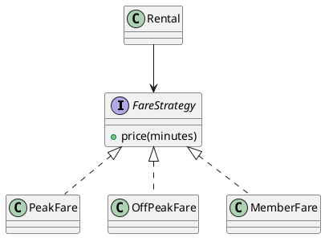

# W8 Demo Runbook — Pattern Selection for Fare Calculation

> Procedural script for the W8 lecture's live demo. **Not** a slidy deck — pandoc skips `*-demo.md`. Read end-to-end before running. Estimated runtime: 12-14 minutes inside the lecture's "Demo" segment.
>
> Design reference: the master spec's W8 row (`docs/superpowers/specs/2026-05-01-amss-ai-redesign-design.md` §2) — "common failure: AI overuses patterns / decorates without solving anything."
>
> This demo's artifact is a **list of pattern suggestions** (and ideally a sketch of each). The "aha" beat is *counting the patterns against the problems* — how many are proposed, how many solve a problem that exists, how many are merely labeled.

## 0. Setup (pre-class, ~1 min)

- VS Code open, Continue.dev installed and configured against the canonical course endpoint (see `class/amss-2026/tooling/SETUP.md`).
- Continue.dev mode set to **agentic chat**.
- A scratch buffer or chat pane visible — the artifact here is a *list of patterns with rationale*; a PlantUML preview pane is useful for prompt #2's structure but not essential for #1.
- Browser tab pre-opened to `class/amss-2026/curs/08-patterns-i-demo-fallback/01-fallback-overuse.png` in case the live AI fails.
- The deck's "Demo" trigger slide is on screen.

## 1. Architect prompt #1 — verbatim

Paste this into Continue.dev's chat (do **not** improvise):

> *"What design patterns should I use to implement fare calculation in the bike-sharing app? Rides are charged per minute, with peak / off-peak rates and a member discount."*

Read the response aloud. **Time:** ~1 min to type, ~2-3 min for AI to respond.

## 2. Defect catalogue — pick 2-3 from the menu

Count the patterns AI proposes, then test each against the problem. Pick the **2-3 defects that actually appear**. Overuse (#1) is near-certain — anchor on it.

| # | Defect | What to point at | Critique question |
|---|---|---|---|
| 1 | Overuse | A stack of patterns (Strategy + Factory + Singleton + Observer + Decorator) for one fare calc | *"What recurring problem does each solve? Strip every pattern whose problem isn't here."* |
| 2 | Decoration / labeled-not-applied | "Use the Strategy pattern" with just an if/else, no interface | *"Where's the interface and the interchangeable classes? A name isn't a pattern."* |
| 3 | Wrong pattern | Singleton for fare config; Observer where a direct call would do | *"Does the pattern's intent match the problem, or just its vocabulary?"* |
| 4 | Premature abstraction | A Factory/Builder for a single concrete fare/payment type | *"What variation does this absorb today? Build it when the second case arrives."* |
| 5 | Mislabeling | A "Factory" that's a Builder; an "Adapter" called a Facade | *"Name it correctly — a wrong name is a hollow rationale."* |

If AI proposes only one well-justified pattern → jump to §7 "Make-it-fail reserve".

## 3. Critique walkthrough (~5 min)

Walk the chosen 2-3 defects against the suggestion list. Ask the room first ("how many patterns did it propose — and how many problems do we actually have?") before delivering the critique. Name the move explicitly the first time:

> *"That's the **critic** half — reading the patterns AI proposed and asking 'does each solve a problem that exists here?' Next is the **architect** half — I re-prompt to force the problem before the pattern."*

Slow down here — this is the F3 skill in action: rationale before pattern.

## 4. Architect prompt #2 — constructed live (constraint scaffold)

Type this into Continue.dev:

> *"For each pattern you suggested, name the recurring problem it solves and the variation it absorbs. Drop any pattern that doesn't have one. For the patterns that remain, show the class structure (interface + concrete classes), don't just name them."*

Forcing the problem before the pattern is the pivot. **Time:** ~1 min to type, ~2-3 min for AI to revise.

## 5. Reference solution (instructor's verified render target)

The live AI output varies. This is the **dry-run-verified** reference the instructor confirms renders before delivery — the one justified pattern the critique converges toward:

Strategy is warranted — three interchangeable fare rules behind one interface, real recurring variation. Everything else AI proposed has no problem behind it. If the live output narrows to roughly this after prompt #2, the loop worked.

## 6. Recap (~1 min)

> *"One architect-critic cycle on a design decision. The first pass reached for a stack of patterns; the critic half asked what problem each solves and found most solve nothing here; the architect half re-prompted to name the problem before the pattern — and it narrowed to Strategy, the one with real variation. Justifying a pattern by its problem is exactly the F3 skill the oral defense checks, and W9 deepens it into 'applied or just labeled?'"*

Point back to the F3 anchor slide.

## 7. Make-it-fail reserve — AI suggests only one justified pattern

If AI proposes a single, well-justified pattern (low probability — pattern questions reliably over-produce), restore the critique surface:

> *"Make this enterprise-grade and future-proof with the full set of design patterns a senior architect would use."*

This near-certainly triggers overuse, premature abstraction, and mislabeling. If even that is clean, fall back to `02-fallback-make-it-fail.png` and walk the screenshot.

## 8. Fallback path — live AI fails

If the live AI fails (no response after 20s, network down, garbage output), switch to the pre-recorded captures:

- `08-patterns-i-demo-fallback/01-fallback-overuse.png` — cycle-1 suggestion list with an over-patterned stack.
- (walk the same defect catalogue against the screenshot)
- `08-patterns-i-demo-fallback/02-fallback-strategy.png` — the narrowed, justified Strategy structure.

Acknowledge briefly ("the model is having a moment — here's the dry-run capture") and continue. The pedagogical content is identical.

## 9. Time budget reconciliation

| Beat | Duration |
|---|---|
| Prompt #1 typed | ~1 min |
| AI responds | ~2-3 min |
| Critique walkthrough | ~5 min |
| Prompt #2 typed | ~1 min |
| AI revises | ~2-3 min |
| Recap | ~1 min |
| **Total** | **12-14 min** |

If ahead of schedule, do not pad — count the proposed patterns aloud and predict which will survive the "name the problem" test before re-prompting, then take 1-2 questions.

## 10. W9 + project synergy

This week's lab (Lab 4) is the *behavioural* defect hunt (W6-W7 content), not patterns — so this demo does not feed Lab 4 directly. The selection skill feeds **W9** (the deeper applied-vs-labeled critique on specific patterns) and the **project design narrative**, where students must justify every pattern they apply (F3).

Fallback assets to capture during the solo dry-run, in `08-patterns-i-demo-fallback/`:

- `01-fallback-overuse.png` — captured cycle-1 over-patterned suggestion.
- `02-fallback-strategy.png` — the narrowed Strategy structure after prompt #2.
- `03-fallback-make-it-fail.png` — the over-engineered "enterprise-grade" output from the reserve prompt.

When the procurement decision changes the canonical endpoint, the dry-run reruns and the captures refresh.
