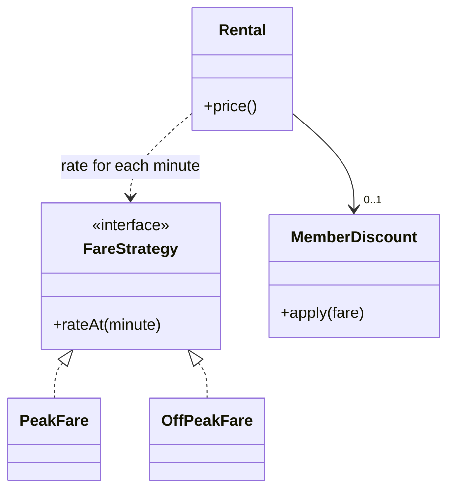

# W8 Demo Runbook — Pattern Selection for Fare Calculation

Calibrated September 2026 with Claude Sonnet 5 (low effort), one run per prompt — live output varies; walk the defects that actually appear.

> Procedural script for the W8 lecture's live demo. **Not** a slidy deck — pandoc skips `*-demo.md`. Read end-to-end before running. Estimated runtime: 12-14 minutes inside the lecture's "Demo" segment.
>
> Design reference: the master spec's W8 row (`docs/superpowers/specs/2026-05-01-amss-ai-redesign-design.md` §2) — "common failure: AI overuses patterns / decorates without solving anything."
>
> This demo's artifact is a **list of pattern suggestions** (and ideally a sketch of each). The "aha" beat is *counting the patterns against the problems* — how many are proposed, how many solve a problem that exists, and whether the chosen pattern actually handles the domain.
>
> **Calibration note:** at the course setting the first answer is close to reference — Strategy for the rates, Decorator for the member discount, an "optional" Factory, a short code sketch, and a self-aware "this may be overkill" hedge. No stack of five patterns. The critique surface is the optional extra, the domain case the pattern mishandles (a ride crossing the peak boundary), and prose that disagrees with its own code (see §2). Prompt #2 and the §7 reserve were dry-run in September 2026 (notes in §2, §4, §7); in those runs prompt #1 already handled the boundary, and prompt #2 narrowed to a rate table rather than Strategy.

## 0. Setup (pre-class, ~1 min)

- VS Code open on a repository containing the course settings from `tooling/template/` (see `class/amss-2026/tooling/SETUP.md`); demo runs in the **Claude Code panel** with those settings (Sonnet 5, low effort). Check with `/model` before class.
- A scratch buffer or chat pane visible — the artifact here is a *list of patterns with rationale*; a Mermaid preview (VS Code's Markdown preview with the "Markdown Preview Mermaid Support" extension) is useful for prompt #2's structure but not essential for #1.
- Browser tab pre-opened to `class/amss-2026/curs/08-patterns-i-demo-fallback/01-fallback-overuse.png` in case the live AI fails.
- The deck's "Demo" trigger slide is on screen.

## 1. Architect prompt #1 — verbatim

Paste this into the Claude Code panel (do **not** improvise):

> *"What design patterns should I use to implement fare calculation in the bike-sharing app? Rides are charged per minute, with peak / off-peak rates and a member discount."*

Read the response aloud. **Time:** ~1 min to type, ~2-3 min for AI to respond.

## 2. Defect catalogue — pick 2-3 from the menu

Count the patterns AI proposes, then test each against the problem — and against a concrete ride. Pick the **2-3 defects that actually appear**. Anchor on the peak-boundary ride (#1): it shows a textbook-correct pattern choice can still price the domain wrong.

Observed in calibration (Sonnet 5, low effort):

| # | Defect | What to point at | Critique question |
|---|---|---|---|
| 1 | Pattern mishandles the domain | Strategy "chosen based on ride start time"; `calculate(minutes)` applies one rate to the whole ride | *"A ride starts 16:50 off-peak and ends 17:40 in peak. What does it pay? Rides are charged per minute."* |
| 2 | Premature abstraction (the "optional" extra) | "Factory (simple, optional) to pick the right strategy" | *"What variation does the Factory absorb that one `if` doesn't? If it's optional, why is it on the list?"* |
| 3 | Speculative justification | Decorator for one discount, justified by "stack promos later" | *"How many discounts do we have today? Is 'later' a requirement or a guess?"* |
| 4 | Prose and code disagree | Prose says `RateStrategy` and "wrap the base fare calculator"; code has `FareStrategy`, and the decorator wraps a strategy, not `FareCalculator` — which just forwards the call | *"Which one is the design? What does `FareCalculator` add besides a hop?"* |
| 5 | Hedging hands the decision back | "Worth it once you expect more tiers… overkill if this is the only rule… a single function is fine too" | *"Both answers are offered. Which do you pick, and why? That reason is your Rationale."* |

Also seen in dry run (September 2026, two fresh runs of prompt #1): **both runs already split a boundary-crossing ride into segments** (one in the sketch, one in prose: "a ride from 16:50 to 17:20 needs to be split"), so #1 may not appear — then anchor on #2/#3 and credit the split aloud. #2 (Factory "once you have more than one pricing context"), #3 (Decorator for "promo codes later") and #5 recurred. New:

| # | Defect | What to point at | Critique question |
|---|---|---|---|
| 6 | Pattern name stretched | "An explicit ordered list of `FareAdjustment` objects, which is a light Chain of Responsibility" — every step runs; no handler passes or stops the request | *"In a Chain of Responsibility, who decides to stop? Here, does anyone?"* |

A deeper question worth one sentence: peak/off-peak may be *data* (a rate per time band), not *behaviour* — is Strategy warranted at all? Classic defects older/weaker models produce (not observed here): a five-pattern stack (Singleton, Observer…), "Strategy" that is only an if/else, mislabelled patterns.

If AI proposes only one well-justified pattern and handles the boundary → jump to §7 "Make-it-fail reserve".

## 3. Critique walkthrough (~5 min)

Walk the chosen 2-3 defects against the suggestion list. Ask the room first ("how many patterns did it propose, how many problems do we actually have — and what does a ride from 16:50 to 17:40 cost?") before delivering the critique. Name the move explicitly the first time:

> *"That's the **critic** half — reading the patterns AI proposed and asking 'does each solve a problem that exists here, and does it get the domain right?' Next is the **architect** half — I re-prompt to force the problem before the pattern, and the awkward case into the design."*

Slow down here — this is the F3 skill in action: rationale before pattern.

## 4. Architect prompt #2 — constructed live (constraint scaffold)

Type this into the Claude Code panel:

> *"A ride can start off-peak and end in peak; it is charged per minute at the rate in force for each minute. Show how your design prices it. For each pattern and class you suggested, name the variation it absorbs today — drop any that only absorbs a variation we might have later. Show the remaining structure as a Mermaid class diagram."*

Forcing the awkward case and the problem before the pattern is the pivot. **Time:** ~1 min to type, ~2-3 min for AI to revise.

**Critique beat — re-check the revision.** Dry run (September 2026, ~22 s, Mermaid rendered): the prompt worked, and the model went further than the §5 reference. It priced a worked ride correctly (16:50–17:12: 10 off-peak + 12 peak minutes, $3.40, member $3.06), gave a keep/drop table, and explicitly **retracted Strategy, Decorator and Factory** — peak/off-peak "differ only in data", so one `RateSchedule` with `rateAt(minuteStart)` replaces the hierarchy. The retraction is honest: the class diagram has no leftover pattern classes. What to point at:

- **Over-compliance.** It dropped "rate versioning and time zones" as "future" — but evaluating the peak window in the city's local time is a correctness concern *today*, not a variation. *"Is a time zone a variation we might have later, or a bug we have now?"*
- **Hidden assumptions.** The peak window (17:00–19:00), the rates and "22 whole minutes" are invented; partial-minute rounding and a second (morning) peak window are silently out — `RateSchedule` holds one `peakWindow`.
- **Where the split lives.** The diagram shows it only as a `rateAt(minuteStart)` method and an association label — the per-minute walk is prose. Fair enough for a class diagram; ask what test would prove it.

Across settings, follow-ups sometimes claim a fix the structure does not show — tick the keep/drop table against the diagram. If a student defends Strategy against the rate table, that is the §5 debate — take it.

## 5. Reference solution (instructor's verified render target)

The live AI output varies. This is the **dry-run-verified** reference the instructor confirms renders before delivery — the one justified pattern the critique converges toward:

```mermaid
classDiagram
  class FareStrategy {
    <<interface>>
    +rateAt(minute)
  }
  class PeakFare
  class OffPeakFare
  class MemberDiscount {
    +apply(fare)
  }
  class Rental {
    +price()
  }
  FareStrategy <|.. PeakFare
  FareStrategy <|.. OffPeakFare
  Rental ..> FareStrategy : rate for each minute
  Rental --> "0..1" MemberDiscount
```

Strategy is warranted for the rate — interchangeable rate rules behind one interface, picked per minute so a ride crossing the peak boundary pays both. The member discount is an independent axis (it applies at peak and off-peak alike), so it is a plain step after pricing, not a third strategy; a Decorator earns its place only once several stackable discounts exist. No Factory, no pass-through calculator. If the live output narrows to roughly this after prompt #2, the loop worked. (If a student argues for a rate table instead of Strategy, that is a good answer — take it. In the September 2026 dry run the model itself landed on the rate table after prompt #2; then ask the room when Strategy *would* earn its place — rates that differ in rule, not just in number.)

## 6. Recap (~1 min)

> *"One architect-critic cycle on a design decision. The first pass was plausible — textbook patterns, even a humble hedge; the critic half asked what problem each solves and priced one awkward ride, and found an optional extra and a pattern that charged the wrong rate; the architect half re-prompted with the awkward case and 'name the variation it absorbs today' — and it narrowed to what has real variation today (Strategy, or just a rate table — say which one you got). Justifying a pattern by its problem is exactly the F3 skill the oral defense checks, and W9 deepens it into 'applied or just labeled?'"*

Point back to the F3 anchor slide.

## 7. Make-it-fail reserve — AI suggests only one justified pattern

The calibrated first answer was already restrained (two patterns plus an optional one), so a single, well-justified pattern that also handles the boundary is plausible. Restore the critique surface:

> *"Make this enterprise-grade and future-proof with the full set of design patterns a senior architect would use."*

Dry run (September 2026, ~21 s, long answer — budget ~1 min just to scroll it): the model **pushes back in prose and complies in the table**. It opens "I'm not adding every pattern", closes "building all of this on day one … would slow you down", yet lists ten patterns (Strategy, Specification, Composite, Chain of Responsibility, Factory + Repository, Builder, Value Object, Observer/outbox, Facade, Ports & Adapters) in a column literally headed "Future change it absorbs". Capture it as `03-fallback-make-it-fail.png`. What to point at:

- **Named, not applied.** Specification, Composite and Observer appear only in the table and the ASCII box diagram — nothing in the sketch implements them; "Factory + Repository" has a repository and no factory; `SegmentSplitter` is labelled "Iterator" but is a method returning segments.
- **Mislabel.** The "Chain of Responsibility" is a sorted list where every adjustment runs — same stretch as defect #6.
- **A bug the patterns hide.** `MemberDiscount` computes from `fare.subtotal`, so the "explicit, testable order" of adjustments does not affect it; and the tariff is picked once at `ride.start` — the boundary problem again, one level up.
- **Which voice wins?** *"It says don't build this — and then builds it. Which part is the design?"*

Walk each added pattern with the four selection questions. The lesson stands, sharpened: the model did not refuse a requirement with no problem behind it — it hedged. If a run is clean, fall back to `03-fallback-make-it-fail.png` and walk the screenshot.

## 8. Fallback path — live AI fails

If the live AI fails (no response after 20s, network down, garbage output), switch to the pre-recorded captures:

- `08-patterns-i-demo-fallback/01-fallback-overuse.png` — cycle-1 suggestion list (calibrated: Strategy by start time, Decorator, optional Factory).
- (walk the same defect catalogue against the screenshot)
- `08-patterns-i-demo-fallback/02-fallback-strategy.png` — the narrowed, justified Strategy structure.

Acknowledge briefly ("the model is having a moment — here's the dry-run capture") and continue. The pedagogical content is identical.

## 9. Time budget reconciliation

| Beat | Duration |
|---|---|
| Prompt #1 typed | ~1 min |
| AI responds | ~2-3 min |
| Critique walkthrough | ~4.5 min |
| Prompt #2 typed | ~1 min |
| AI revises | ~2-3 min |
| Re-check the revision | ~0.5 min |
| Recap | ~1 min |
| **Total** | **12-14 min** |

If ahead of schedule, do not pad — count the proposed patterns aloud and predict which will survive the "name the problem" test before re-prompting, then take 1-2 questions.

## 10. W9 + project synergy

This week's lab (Lab 4) is the *behavioural* defect hunt (W6-W7 content), not patterns — so this demo does not feed Lab 4 directly. The selection skill feeds **W9** (the deeper applied-vs-labeled critique on specific patterns) and the **project design narrative**, where students must justify every pattern they apply (F3).

Fallback assets to capture during the solo dry-run, in `08-patterns-i-demo-fallback/`:

- `01-fallback-overuse.png` — captured cycle-1 suggestion list.
- `02-fallback-strategy.png` — the narrowed Strategy structure after prompt #2.
- `03-fallback-make-it-fail.png` — the over-engineered "enterprise-grade" output from the reserve prompt.

When the course model setting changes (`tooling/template/`), the dry-run reruns and the captures refresh.
