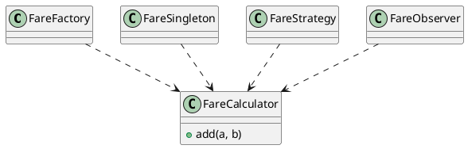
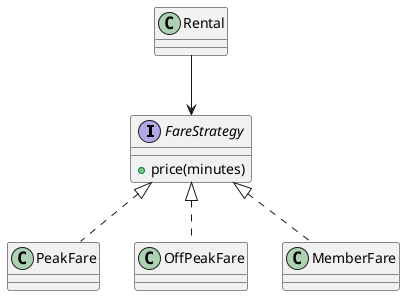

# Today's Agenda

1. Frame: from modeling to designing
2. The vocabulary: what a pattern is, three categories
3. The selection question: when a pattern earns its place
4. Live demo: drive AI to suggest patterns
5. Reading critically: where AI overuses and decorates
6. Bridge to Week 9; note this week's Lab 4

::: notes
Weeks 4-7 modelled the system's structure and behaviour. Today shifts to a design decision: which patterns, if any, to apply. The named payload is AI overusing patterns and decorating without solving anything. A pattern is a tool, never a goal — open into the modeling-to-designing bridge.
:::

---

# Recap: Architect and Critic

- **Architect / director:** drive AI through the software development lifecycle (SDLC).
- **Critic / reviewer:** read AI's output and name what's wrong or missing.

In Weeks 4-7 you critiqued AI's *models*. Today: the same loop, on a *design decision* — which patterns to use.

::: notes
One breath of recap. The models (structure, behaviour) are done; today is a judgement call layered on top — and judgement is exactly where AI is weakest and the critic strongest.
:::

---

# From Modeling to Designing

- **Weeks 4-7 pinned what the system is and does** — classes, interactions, lifecycles.
- **Today: how to structure the solution well** — design patterns, the named solutions to recurring problems.

Today's question: **does this pattern solve a real problem here — or is it decoration?**

::: notes
The bridge. Patterns are reusable solutions, but only to problems that actually recur. AI treats patterns as a sign of sophistication and sprinkles them everywhere; the critic asks whether the problem the pattern solves is even present.
:::

---

# The Literacy Floor: Critique, Rationale, Traceability

From Week 1: in the oral defense, *unaided*, you must demonstrate:

- **Critique** — read & critique AI-generated artifacts on the spot.
- **Rationale** — articulate why you directed AI a certain way.
- **Traceability** — defend traceability across your project.

Today is **Rationale** at its sharpest: a pattern is only as good as the *reason* for it. "Why this pattern, or why none?" is the question the defense asks.

::: notes
First of two Critique, Rationale, Traceability mentions. Patterns are where Rationale bites hardest — applying a pattern with no reason is the signature AI failure, and "I used Strategy because the tutorial did" fails the defense. Critique still applies (reading the suggestion), but rationale is the payload. Same wording in the close.
:::

---

# What Is a Design Pattern?

A **named, reusable solution to a recurring problem in a context** (Gang of Four). Three parts:

- **Problem** — the recurring situation it addresses.
- **Solution** — the structure that resolves it.
- **Consequences** — what it costs (always some indirection).

A pattern is a tool for a problem — **not a goal in itself.**

::: notes
The definition, reframed around the problem. The "consequences" part is the one AI ignores — every pattern adds indirection, which is only worth paying when the problem is real. Adapts 2025's "What are design patterns" framing.
:::

---

# Three Categories

- **Creational** — how objects are made: Factory, Builder, Singleton.
- **Structural** — how objects are composed: Adapter, Decorator, Composite, Proxy.
- **Behavioral** — how objects interact: Strategy, Observer, State, Command.

A **vocabulary** for naming solutions — not a checklist to apply.

::: notes
The Gang of Four (GoF) classification, lifted from 2025. The framing shift: this is a shared vocabulary so designers can name a solution in one word, NOT a menu where more-is-better. Don't drill each pattern — Week 9 does the deep dives.
:::

---

# The Vocabulary in Bike-Sharing

Where these *might* fit our domain:

- **Strategy** — interchangeable fare rules (peak / off-peak / member).
- **Observer** — riders notified when a station has bikes.
- **State** — the `Bike` lifecycle from Week 7 (Available, Reserved, InUse…).
- **Factory** — creating the right `Payment` (cash / card).

Recognise the shape. Whether each is *warranted* is the next question.

::: notes
Grounds the vocabulary in the familiar domain, and links State back to Week 7's Bike state machine. "Might fit" is deliberate — naming a candidate is not the same as justifying it. Week 9 builds the structures; today is selection.
:::

---

# The Selection Question

Before applying any pattern, ask:

1. Is there a **recurring** problem — or a one-off?
2. Is there real **variation or change** to absorb?
3. Does the pattern's **intent** match this problem?
4. Is the **indirection worth it**?

If you can't answer these, you don't have a pattern — you have decoration.

::: notes
The selection rubric — the heart of Week 8. These four questions are the Rationale scaffold: a pattern is justified only when a recurring problem with real variation matches the pattern's intent at a cost worth paying. This is the read-order for the demo and the gallery.
:::

---

# Your Turn: Does It Earn Its Place?

AI proposes **Strategy + Factory + Singleton + Observer** for a per-minute fare calc with peak / off-peak / member rates.

With your neighbour (2 min): which survive the four questions? Be ready to defend **one keep** and **one cut**.

::: notes
Quick pair-and-share before the cost slide. Push them to apply the four questions live, not just react. The expected answer: only Strategy survives (real, recurring fare variation); the rest are decoration. Take two or three votes on which to cut, then move into the cost framing.
:::

---

# A Pattern Is a Cost

Every pattern adds **indirection** — more classes, more hops to follow.

- **Worth it** when it absorbs real, recurring variation.
- **Pure cost** when it doesn't — harder to read, nothing gained.

The question is never *"which pattern?"* It's *"is a pattern warranted at all?"*

::: notes
The cost framing is what disarms overuse. AI never weighs the indirection cost because it doesn't pay it. Naming the cost out loud reframes the whole selection decision — most "should I use a pattern?" answers are "no".
:::

---

# Demo: Drive AI to Suggest Patterns

> Live: ask AI which patterns to use for fare calculation. Watch how many it proposes — and whether each solves a problem that exists.

**Prompt to AI:** *"What design patterns should I use to implement fare calculation in the bike-sharing app? Rides are charged per minute, with peak / off-peak rates and a member discount."*

::: notes
Switch to Continue.dev. Run the runbook at `class/amss-2026/curs/08-patterns-i-demo.md` for ~12 min. The near-certain failure: a stack of patterns (Strategy + Factory + Singleton + Observer…) where only Strategy is warranted, some merely labeled. Fallback: runbook §8.
:::

---

# AI Reaches for Patterns — and Decorates

AI proposes patterns fluently, because patterns signal "good design." But a pattern with no problem behind it is decoration. The critic question:

> *"What problem does this pattern solve here — and does that problem actually exist?"*

::: notes
Sets up the gallery — Rationale applied to design. The core defects are overuse and decoration (spec: "AI overuses patterns / decorates without solving anything"). AI optimises for looking sophisticated, not for solving the problem at hand.
:::

---

# Defect #1: Overuse

Four patterns to add two numbers. **Critique:** *"What recurring problem does each solve? Strip every pattern whose problem isn't here."*

::: notes
The anchor defect. AI stacks patterns on a trivial need because more patterns "look" more engineered. The critique walks each one back to its problem; for a simple sum, none survive. Vivid as a diagram — the machinery dwarfs the work.
:::

---

# Defect #2: Decoration — Labeled, Not Applied

A method with an `if peak / else off-peak` branch, **called "the Strategy pattern"** — but no `FareStrategy` interface, no interchangeable implementations.

**Critique:** *"Where's the Strategy interface? The interchangeable classes? A name isn't a pattern."*

::: notes
The decoration defect, kept textual — the point is the absence of structure. AI labels an if/else a "Strategy" to claim the pattern without building it. Week 9 deepens this applied-vs-labeled critique; today, name it. The label without the structure is the tell.
:::

---

# Defect #3: Wrong Pattern

- **Singleton** for the fare config — creates hidden global state, untestable.
- **Observer** where a direct method call would do — indirection for nothing.

**Critique:** *"Does the pattern's intent match the problem — or just its vocabulary?"*

::: notes
Intent mismatch. AI reaches for a familiar pattern whose intent doesn't fit: Singleton solves "exactly one instance," not "shared config"; Observer solves "many reactive dependents," not "call this once." The critique tests intent against problem.
:::

---

# Defect #4: Premature Abstraction

A `PaymentFactory` and a `PaymentBuilder` — for a single concrete `CardPayment`. No second type exists yet.

**Critique:** *"What variation does this absorb today? Build the abstraction when the second case arrives, not before."*

::: notes
Speculative generality — YAGNI. AI adds factories and builders "in case we extend later," paying indirection now for variation that may never come. The fix: apply the pattern when the second concrete case actually appears.
:::

---

# Defect #5: Mislabeling

A `PaymentFactory` that's actually a **Builder**; an `Adapter` called a **Facade**.

**Critique:** *"Name it correctly. If the name is wrong, the rationale is hollow — and so is the traceability."*

::: notes
The vocabulary failure. AI uses pattern names loosely, so the design's self-description lies. This matters for Traceability — a mislabeled pattern breaks the trace from problem to solution. Correct naming is the floor of an honest design narrative.
:::

---

# The Critic's Selection

One pattern, justified: fare rules really vary (peak / off-peak / member), so **Strategy** earns its place. Everything else: no pattern.

::: notes
The critique result. Strategy is warranted because the variation is real and recurring — three interchangeable fare rules behind one interface. This is "applied, not labeled": the interface and the concrete classes exist. The demo's prompt #2 converges here.
:::

---

# How to Read AI's Pattern Suggestions

A fixed order, every time:

1. What **problem** does each pattern claim to solve?
2. Does that problem **exist here** — recurring, with real variation?
3. Is the pattern **actually applied** (the structure), or just **labeled**?
4. Is the **indirection worth it**?

::: notes
This IS the Rationale drill for design. A repeatable read-order beats being dazzled by pattern names. Students internalise it for Week 9's deeper critique and for defending their own project's design choices.
:::

---

# The Critique Loop on Design

read -> name the overuse / decoration -> re-prompt "name the recurring problem first, then the pattern" -> re-read.

Same architect-and-critic loop as Weeks 2-7 — now on a design decision.

::: notes
The loop is the through-line. The scaffold that tightens AI output here is forcing the problem before the pattern — "for each pattern, name the recurring problem and the variation it absorbs; drop any without one" — exactly the demo's prompt #2.
:::

---

# The Human Decides Whether a Pattern Earns Its Place

AI will apply a pattern to anything. Whether the problem *warrants* one — whether the indirection buys something — is the architect-and-critic call.

It's what the oral defense checks, and AI can't make it for you.

::: notes
Reinforces ownership, mirroring Weeks 4-7's closes. The defense grades the Rationale: why this pattern, or why none. "The AI suggested it" is not a reason.
:::

---

# This Week's Lab: Lab 4

Lab 4 runs this week — a **team defect hunt on flawed behavioural artifacts** (sequence, state, activity) from Weeks 6-7. Bring your behaviour read-orders.

Today's patterns content feeds **Week 9** and your project's design narrative, not this week's lab.

::: notes
Labs lag lectures: this week's lab is the behavioural hunt (Weeks 6-7 content), while today's lecture opens patterns. Be explicit so students aren't confused the lab and lecture topics differ. The patterns selection skill lands in Week 9 and the project defense.
:::

---

# Next Week: Patterns II (Week 9)

Today was *whether* to use a pattern. Next week is *which*, in depth.

**Week 9:** Visitor, Mediator, Bridge, Adapter, Decorator, Proxy, Composite — and the deeper critique: **was this pattern applied, or just labeled?**

::: notes
Clean handoff. Week 8 was selection (whether / cost / overuse); Week 9 is the specific structural and behavioural patterns plus the applied-vs-labeled critique that defect #2 previewed today. Bike-sharing carries forward.
:::

---

# Critique, Rationale, Traceability — The Through-Line

Today you drilled:

- **Rationale** — justified *why* a pattern (or none): named the problem before the solution.
- **Critique** — read AI's pattern suggestions and named overuse, decoration, mislabeling.

Traceability: a correctly-named, justified pattern keeps the trace from problem to solution honest.

::: notes
Second and final Critique, Rationale, Traceability mention. Rationale anchored this week — it is the deliverable. The Traceability touch ties correct naming to the trace, setting up Week 9 and the project narrative.
:::

---

# That's It For Today

- Next lecture (Week 9): patterns II — the specific patterns + applied-vs-labeled critique.
- This week's lab (Lab 4): team defect hunt on flawed behavioural artifacts.

Questions?

::: notes
Closer. Open the floor. No trailing slide separator after this one.
:::
