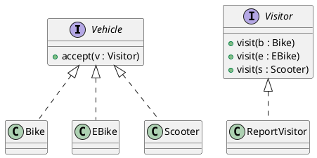

# W9 Demo Runbook — "Apply the Visitor Pattern"

> Procedural script for the W9 lecture's live opener. **Not** a slidy deck — pandoc skips `*-demo.md`. Read end-to-end before running. Estimated runtime: **~8 minutes** inside the lecture's "Demo" segment (an opener that seeds the gallery, not the whole payload).
>
> Design reference: the master spec's W9 row (`docs/superpowers/specs/2026-05-01-amss-ai-redesign-design.md` §2) — "pattern-level critique: was this applied or just labeled?"
>
> This demo's artifact is **AI's "Visitor" implementation** (PlantUML and/or code). The "aha" beat is *checking for double dispatch* — does each vehicle have `accept()` and the visitor a `visit()` per type, or is it a single method with an `instanceof` cascade wearing the name?

## 0. Setup (pre-class, ~1 min)

- VS Code open, Continue.dev installed and configured against the canonical course endpoint (see `class/amss-2026/tooling/SETUP.md`).
- Continue.dev mode set to **agentic chat**.
- A PlantUML preview pane and/or a code pane visible — the tell (instanceof vs accept/visit) shows in either.
- Browser tab pre-opened to `class/amss-2026/curs/09-patterns-ii-demo-fallback/01-fallback-fake-visitor.png` in case the live AI fails.
- The deck's "Demo" trigger slide is on screen.

## 1. Architect prompt #1 — verbatim

Paste this into Continue.dev's chat (do **not** improvise):

> *"Apply the Visitor pattern to compute a maintenance report across our vehicle types (Bike, EBike, Scooter) in the bike-sharing app."*

Render / read the result. **Time:** ~1 min to type, ~2 min for AI to respond.

## 2. Defect catalogue — pick the ones that appear

Check the result against the Visitor signature (accept + double dispatch). Pick the **2-3 defects that actually appear**. The instanceof cascade (#1) is near-certain — anchor on it.

| # | Defect | What to point at | Critique question |
|---|---|---|---|
| 1 | No double dispatch | a single `visit(Vehicle)` with an `instanceof` / `switch` on type | *"Where is accept()? Where is the dispatch on type? This is the switch the pattern exists to remove."* |
| 2 | Missing accept() | vehicles have no `accept(visitor)` method | *"How does the visitor get the concrete type without accept()?"* |
| 3 | Interface-changing | the "visitor" returns different shapes per call, no common visit signature | *"What's the visitor's interface? It should be visit() per type."* |
| 4 | Pattern theater | named `VisitorManager` / comments only, no structure | *"Strip the name — is there accept/visit, or just a labeled method?"* |

If AI produces a correct double-dispatch Visitor first try → jump to §6 "Make-it-fail reserve".

## 3. Critique walkthrough (~3 min)

Walk the chosen 2-3 defects against the result. Ask the room first ("is this actually a Visitor — where's the double dispatch?") before delivering the critique. Name the move explicitly:

> *"That's the **critic** half — reading the pattern AI claimed and checking the structure, not the name. Next is the **architect** half — I re-prompt for the mechanism the pattern is defined by."*

This is the F1 skill on patterns: structure over label.

## 4. Architect prompt #2 — constructed live (constraint scaffold)

Type this into Continue.dev:

> *"Show the double dispatch: each vehicle has accept(visitor) that calls visitor.visit(this); the visitor has a visit method per concrete type — visit(Bike), visit(EBike), visit(Scooter). No instanceof, no switch on type."*

Demanding the mechanism is the pivot. Re-render. **Time:** ~1 min to type, ~2 min for AI to revise.

## 5. Reference solution (instructor's verified render target)

The live AI output varies. This is the **dry-run-verified** reference the instructor confirms renders before delivery — the applied Visitor the critique converges toward:

`accept` on each vehicle calls back `visit(this)`; one `visit` per type; no `instanceof`. If the live output reaches this after prompt #2, the loop worked. Pivot into the deck's gallery — the live failure you just saw is defect #3 of that gallery (Visitor without double dispatch).

## 6. Make-it-fail reserve — AI produces a correct Visitor first try

If AI builds a correct double-dispatch Visitor immediately (low probability — AI reliably reaches for instanceof), restore the critique surface:

> *"Now also add Adapter, Decorator, and Proxy patterns to this design."*

This near-certainly triggers mislabels and pattern theater (a Proxy that adds behaviour, a non-composable "Decorator"). If even that is clean, fall back to `02-fallback-make-it-fail.png` and walk the screenshot.

## 7. Fallback path — live AI fails

If the live AI fails (no response after 20s, network down, garbage output), switch to the pre-recorded captures:

- `09-patterns-ii-demo-fallback/01-fallback-fake-visitor.png` — cycle-1 instanceof-cascade labeled Visitor.
- (walk the same defect catalogue against the screenshot)
- `09-patterns-ii-demo-fallback/02-fallback-real-visitor.png` — the applied double-dispatch Visitor.

Acknowledge briefly ("the model is having a moment — here's the dry-run capture") and continue. The pedagogical content is identical.

## 8. Time budget reconciliation

| Beat | Duration |
|---|---|
| Prompt #1 typed | ~1 min |
| AI responds | ~2 min |
| Critique walkthrough | ~3 min |
| Prompt #2 typed + AI revises | ~2 min |
| **Total** | **~8 min** |

This is an opener, not the whole demo — keep it tight and hand into the gallery. If ahead of schedule, do not pad; ask the room to spot the instanceof before you point at it.

## 9. Project synergy & fallback assets

W9 has no lab of its own (Lab 5, the project checkpoint, is next week). The verification skill feeds the **project design narrative**: every pattern a student claims must survive this structure check in the oral defense (F3). This demo is the rehearsal.

Fallback assets to capture during the solo dry-run, in `09-patterns-ii-demo-fallback/`:

- `01-fallback-fake-visitor.png` — captured instanceof-cascade "Visitor".
- `02-fallback-real-visitor.png` — the applied double-dispatch Visitor after prompt #2.
- `03-fallback-make-it-fail.png` — the mislabeled extra patterns from the reserve prompt.

When the procurement decision changes the canonical endpoint, the dry-run reruns and the captures refresh.
