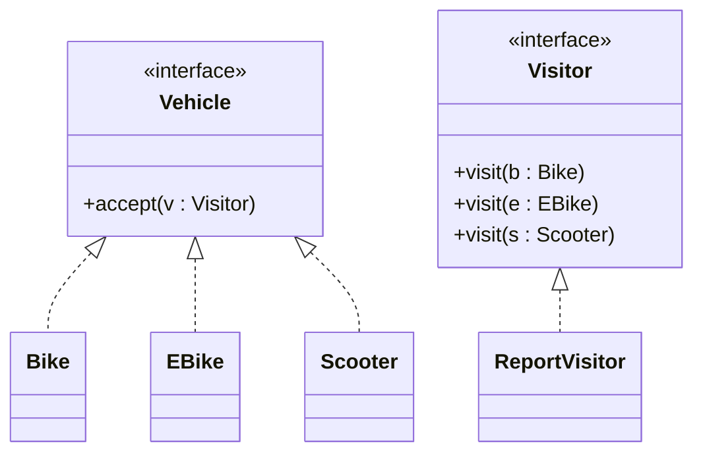

# W9 Demo Runbook — "Apply the Visitor Pattern"

Calibrated September 2026 with Claude Sonnet 5 (low effort), one run per prompt — live output varies; walk the defects that actually appear.

> Procedural script for the W9 lecture's live opener. **Not** a slidy deck — pandoc skips `*-demo.md`. Read end-to-end before running. Estimated runtime: **~8 minutes** inside the lecture's "Demo" segment (an opener that seeds the gallery, not the whole payload).
>
> Design reference: the master spec's W9 row (`docs/superpowers/specs/2026-05-01-amss-ai-redesign-design.md` §2) — "pattern-level critique: was this applied or just labeled?"
>
> This demo's artifact is **AI's "Visitor" implementation** (Mermaid and/or code). The "aha" beat is *verifying the claim* — does each vehicle have `accept()` and the visitor a `visit` per type? — and then *stress-testing the design with patterns nobody needs*.
>
> **Calibration note:** at the course setting the first answer is essentially the reference — correct double dispatch (`accept` on each vehicle, `visitBike` / `visitEBike` / `visitScooter`, no `instanceof`) plus an accurate explanation of the Visitor trade-off. The instanceof-cascade "Visitor" did not appear (in any calibrated model). So the demo runs in two moves: **verify** the first answer (it passes — confirming a claim is part of verifying it), then run the former make-it-fail prompt as the **planned** prompt #2 (§4), which asks for patterns with no problem behind them. §6 holds a stronger reserve.

## 0. Setup (pre-class, ~1 min)

- VS Code open on a repository containing the course settings from `tooling/template/` (see `class/amss-2026/tooling/SETUP.md`); demo runs in the **Claude Code panel** with those settings (Sonnet 5, low effort). Check with `/model` before class.
- A Mermaid preview (VS Code's Markdown preview with the "Markdown Preview Mermaid Support" extension) and/or a code pane visible — the structure (accept/visit, or its absence) shows in either. Claude Code may write the code into files in the repository rather than the chat; open them.
- Browser tab pre-opened to `class/amss-2026/curs/09-patterns-ii-demo-fallback/01-fallback-cycle1-visitor.png` in case the live AI fails.
- The deck's "Demo" trigger slide is on screen.

## 1. Architect prompt #1 — verbatim

Paste this into the Claude Code panel (do **not** improvise):

> *"Apply the Visitor pattern to compute a maintenance report across our vehicle types (Bike, EBike, Scooter) in the bike-sharing app."*

Render / read the result. **Time:** ~1 min to type, ~2 min for AI to respond.

## 2. Defect catalogue — pick the ones that appear

First run the deck's four verification checks against the Visitor signature (accept + double dispatch) aloud. At the calibrated setting they pass — say so: *"Structure present, benefit delivered, name correct. The claim checks out."* Then pick **1-2 of the smaller defects that actually appear**; the real critique surface comes from prompt #2.

Observed in calibration (Sonnet 5, low effort):

| # | Defect | What to point at | Critique question |
|---|---|---|---|
| 1 | Invented thresholds | `tireWear > 0.7`, `mileageKm > 3000` / `2000` / `1500`, `batteryHealth < 0.6`, `batteryCycles > 500` — none were given | *"Where do these numbers come from? Who signs off on them — and where are they written down?"* |
| 2 | Duplicated rules | The tire-wear and mileage checks copied into `visitBike` and `visitEBike`; `id` / `mileageKm` redeclared in every class, the `Vehicle` interface has only `accept` | *"The mileage rule changes. How many places do you edit?"* |
| 3 | Stateful visitor | `accept` returns `void`; results pile up in a public mutable `entries` list | *"Run the report twice with the same visitor. What does the second report say?"* |
| — | *Not a defect (check understanding)* | `visitBike(b)` / `visitEBike(e)` instead of an overloaded `visit(...)` | *"Is this still double dispatch?"* — yes; TypeScript has no overloading, so distinct names are the idiom. |

Classic defects older/weaker models produce (not observed here — keep them for the gallery): a single `visit(Vehicle)` with an `instanceof` / `switch` cascade; no `accept()` on the vehicles; a `VisitorManager` with no structure behind the name.

If the first answer *is* the classic fake → walk it (deck defect #3), then use the old double-dispatch scaffold as prompt #2: *"Show the double dispatch: each vehicle has accept(visitor) that calls back a visit method for its own type. No instanceof, no switch on type."*

## 3. Critique walkthrough (~2 min)

Walk the checks and the chosen 1-2 defects against the result. Ask the room first ("is this actually a Visitor — where's the double dispatch?") before delivering the verdict. Name the move explicitly:

> *"That's the **critic** half — reading the pattern AI claimed and checking the structure, not the name. This time it's real. Next is the **architect** half — and I'm going to push it somewhere a pattern is *not* warranted, to see what it does."*

This is the F1 skill on patterns: structure over label — including when the label is honest.

## 4. Architect prompt #2 — planned stress test

Type this into the Claude Code panel:

> *"Now also add Adapter, Decorator, and Proxy patterns to this design."*

The prompt names patterns with no problem behind them — the Week 8 selection question meets the Week 9 signature check. Not calibrated; dry-run it and capture the result. Read what comes back with two questions per added pattern:

- *"What problem does it solve here?"* (Week 8) — an Adapter with nothing external to adapt, a Proxy that controls no access, a Decorator for a behaviour nobody asked for.
- *"Is the signature there?"* (Week 9) — a "Proxy" that adds behaviour is a Decorator (gallery defect #4); a "Decorator" that cannot wrap another decorator is inheritance (defect #2); a class named after a pattern with no structure is theater (defect #5).

If the model pushes back ("none of these fit here, because…"), that is the good answer — ask the room whether its reasons are right, and credit it. **Time:** ~2 min to type and respond — the prompt is one line.

**Critique beat — check the claims.** Across settings, follow-ups sometimes claim structure that is not in the code. For each "I added X", find the class and its signature before accepting it (~1 min).

## 5. Reference solution (instructor's verified render target)

The live AI output varies. This is the **dry-run-verified** reference the instructor confirms renders before delivery — the applied Visitor the critique converges toward:

```mermaid
classDiagram
  class Vehicle {
    <<interface>>
    +accept(v : Visitor)
  }
  class Visitor {
    <<interface>>
    +visit(b : Bike)
    +visit(e : EBike)
    +visit(s : Scooter)
  }
  class Bike
  class EBike
  class Scooter
  class ReportVisitor
  Vehicle <|.. Bike
  Vehicle <|.. EBike
  Vehicle <|.. Scooter
  Visitor <|.. ReportVisitor
```

`accept` on each vehicle calls back its type's `visit`; one `visit` per type (distinct method names are fine in languages without overloading); no `instanceof`. At the calibrated setting the **first** answer already matches this — the verification in §2 is the beat. Pivot into the deck's gallery: the prompt #2 output maps to defects #2, #4 and #5 (whatever actually appeared); defect #3 (Visitor without double dispatch) is the classic fake that older/weaker models produce and the deck's "Your Turn" slide exercises.

## 6. Make-it-fail reserve — prompt #2 comes back clean

If the model declines the extra patterns with sound reasons, or adds them with correct signatures and real problems behind them, push on the one constraint Visitor cannot survive:

> *"Simplify the maintenance report: we don't want to touch the vehicle classes at all."*

A real Visitor needs `accept()` on every vehicle, so this pulls toward a type switch. Not calibrated — dry-run it and capture the result (`03-fallback-make-it-fail.png`). The critique: *does it still call the result a Visitor?* An `instanceof` cascade that keeps the name is gallery defect #3; one that honestly drops the name ("this is no longer a Visitor — it's a type switch; here's the trade-off") is the right answer, and worth saying so. If even that is clean, go to the deck's "Your Turn: Spot the Fake" slide — it carries the classic fake.

## 7. Fallback path — live AI fails

If the live AI fails (no response after 20s, network down, garbage output), switch to the pre-recorded captures:

- `09-patterns-ii-demo-fallback/01-fallback-cycle1-visitor.png` — cycle-1 Visitor (calibrated: correct double dispatch, invented thresholds).
- (run the verification checks and the §2 catalogue against the screenshot)
- `09-patterns-ii-demo-fallback/02-fallback-added-patterns.png` — the prompt #2 output with the added Adapter / Decorator / Proxy.

Acknowledge briefly ("the model is having a moment — here's the dry-run capture") and continue. The pedagogical content is identical.

## 8. Time budget reconciliation

| Beat | Duration |
|---|---|
| Prompt #1 typed | ~1 min |
| AI responds | ~2 min |
| Verification + critique walkthrough | ~2 min |
| Prompt #2 typed + AI responds | ~2 min |
| Check the added patterns' claims | ~1 min |
| **Total** | **~8 min** |

This is an opener, not the whole demo — keep it tight and hand into the gallery. If ahead of schedule, do not pad; ask the room to find `accept()` and the per-type `visit` before you point at them.

## 9. Project synergy & fallback assets

W9 has no lab of its own (Lab 5, the project checkpoint, is next week). The verification skill feeds the **project design narrative**: every pattern a student claims must survive this structure check in the oral defense (F3). This demo is the rehearsal.

Fallback assets to capture during the solo dry-run, in `09-patterns-ii-demo-fallback/`:

- `01-fallback-cycle1-visitor.png` — captured cycle-1 Visitor.
- `02-fallback-added-patterns.png` — the added Adapter / Decorator / Proxy from prompt #2.
- `03-fallback-make-it-fail.png` — the "don't touch the vehicle classes" output from the reserve prompt.

When the course model setting changes (`tooling/template/`), the dry-run reruns and the captures refresh.
