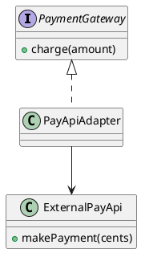
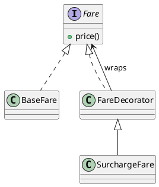
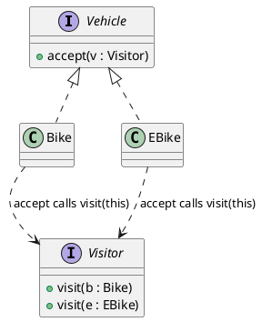
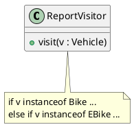
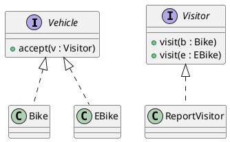

# Today's Agenda

1. Frame: from selecting a pattern to verifying it
2. Seven patterns and their signature structures
3. Live opener: drive AI to "apply" a pattern
4. Reading critically: applied, or just labeled?
5. How to verify a pattern claim
6. Bridge to W10 + your project

::: notes
W8 asked whether a pattern is warranted. Today asks the next question: when AI says "I used the X pattern", did it actually build the structure — or just write the name? The named payload is the applied-vs-labeled critique. Open into the selecting-to-verifying bridge.
:::

---

# Recap: Architect + Critic

- **Architect / director (B):** drive AI through the SDLC.
- **Critic / reviewer (A):** read AI's output and name what's wrong or missing.

In W8 you decided *whether* a pattern earns its place. Today: *was it actually applied* — or just labeled?

::: notes
One breath of recap. W8 was selection (whether / which / cost). Today is verification — the claim "this is a Decorator" is something the critic checks, not accepts.
:::

---

# From Selecting to Verifying

- **W8 pinned the decision** — is a pattern warranted here?
- **Today: the verification** — AI says "I applied the Visitor pattern." Did it build the structure, or just write the name?

Today's question: **is the pattern actually there — or is the label decoration?**

::: notes
The bridge. W8's defect #2 (decoration) was the preview: a name with no structure. Today develops it into a full critique skill across seven named patterns. A pattern label is a claim; the structure is the evidence.
:::

---

# Literacy Floor: F1 + F3 + F4

From W1: in the oral defense, *unaided*, you must demonstrate:

- **F1** — read & critique AI-generated artifacts on the spot.
- **F3** — articulate why you directed AI a certain way.
- **F4** — defend traceability across your project.

Today is **F1** on patterns: read a pattern claim and verify the structure is actually present. The label is a claim; the structure is the evidence.

::: notes
First of two F1+F3+F4 mentions. F1 anchored this week — verifying a pattern's structure against its name IS the oral-defense skill, and it directly defends a project's design narrative (F3). Same wording in the close.
:::

---

# Seven Patterns, One Question

Recognise the intent of each:

- **Adapter** — convert one interface into another.
- **Decorator** — add behaviour by wrapping, same interface.
- **Proxy** — stand in for an object, control access.
- **Composite** — treat a tree of objects uniformly.
- **Bridge** — separate an abstraction from its implementation.
- **Visitor** — add operations without changing the elements.
- **Mediator** — centralise how objects interact.

::: notes
The W9 vocabulary, lifted from 2025. One line of intent each — recognition, not deep teaching. The deep dives are the three with the clearest signature structures (Adapter, Decorator, Visitor); the rest stay recognition-level. Don't drill all seven.
:::

---

# Each Pattern Has a Signature Structure

A pattern is **not a name** — it's a specific structure that delivers a specific benefit.

- No structure -> the name is empty.
- Wrong structure -> the name is a lie.

The critic verifies the structure, then the name.

::: notes
The pivot of the whole lecture. AI knows the names fluently and the structures unreliably. Every featured pattern next has a signature structure you can check for; the gallery shows the label without it. Set this up clearly.
:::

---

# Adapter — the Signature

**Applied** = the adapter implements *our* interface and translates to the external one. Bike-sharing: wrap an external payment API as a `PaymentGateway`.

::: notes
Adapter's signature: implements the target interface, delegates to (and converts for) the adaptee. The tell of a real Adapter is that clients see only PaymentGateway. If the "adapter" exposes the external API's methods, it adapts nothing.
:::

---

# Decorator — the Signature

**Applied** = same interface, wraps a `Fare`, adds behaviour, and is **composable** (a decorator wraps another). Bike-sharing: a surcharge on a base fare.

::: notes
Decorator's signature: implements the SAME interface it wraps, holds a reference to one, and adds behaviour — so decorators stack. The tell: you can wrap a decorator in another decorator. If it's a subclass with no wrapping, it's inheritance wearing the name.
:::

---

# Visitor — the Signature

**Applied** = **double dispatch**: `vehicle.accept(v)` calls `v.visit(this)`. Adds operations without touching the vehicles. **No `instanceof`.**

::: notes
Visitor's signature is double dispatch: the element's accept() calls back the type-specific visit(). That is what removes the type switch. The tell of a fake Visitor is an instanceof/switch cascade — the demo surfaces exactly that.
:::

---

# Demo: Drive AI to "Apply" a Pattern

> Live: ask AI to apply the Visitor pattern. Watch whether it builds double dispatch — or writes a switch on the type and calls it Visitor.

**Prompt to AI:** *"Apply the Visitor pattern to compute a maintenance report across our vehicle types (Bike, EBike, Scooter) in the bike-sharing app."*

::: notes
Switch to Continue.dev. Run the runbook at `class/amss-2026/curs/09-patterns-ii-demo.md` for ~8 min. The near-certain failure: a class with an instanceof/switch on vehicle type, labeled "Visitor", with no accept(). Then pivot to the gallery. Fallback: runbook §7.
:::

---

# The Critic Question

When AI claims a pattern:

> *"Is the signature structure actually there — or just the name?"*

A pattern label is a claim to verify, not a fact to accept.

::: notes
Sets up the gallery — F1 applied to pattern claims. The defects below are all forms of "the label without the structure" (spec: "was this applied or just labeled?"). AI writes confident pattern names; the critic checks each against its signature.
:::

---

# Defect #1: Adapter That Isn't

A "PayApiAdapter" that exposes `makePayment(cents)` directly — clients still see the external API. Or a passthrough that converts nothing.

**Critique:** *"What interface does this adapt to? If clients still see the external API, nothing was adapted."*

::: notes
The Adapter fails when it doesn't implement the target interface — it just renames or forwards. The signature check (does it implement OUR interface and convert?) catches it. Kept textual; the contrast is the slide-7 structure.
:::

---

# Defect #2: Decorator That's Really Inheritance

A `SurchargeFare extends BaseFare` — a subclass, no wrapping, not composable. Or a "decorator" that changes the interface.

**Critique:** *"Can you wrap one decorator in another? If not, it's inheritance — and it can't stack."*

::: notes
The Decorator fails when it subclasses instead of wrapping, losing composability, or when it changes the interface, losing substitutability. The "can it stack?" question is the fastest signature check.
:::

---

# Defect #3: Visitor Without Double Dispatch

A single `visit(Vehicle)` with an `instanceof` cascade — labeled Visitor, no `accept`, no double dispatch.

**Critique:** *"Where is accept()? Where is the dispatch on type? This is the switch the pattern exists to remove."*

::: notes
The anchor defect — and the demo's payload. A real Visitor has accept() on each element and overloaded visit() per type; the fake has one method with an instanceof cascade. The pattern's entire purpose (no type switch) is exactly what AI reintroduces.
:::

---

# Defect #4: Mislabel

- A **Proxy** that *adds* behaviour — that's a Decorator.
- A **Composite** that isn't recursive — just a flat list, no tree.
- A **Bridge** with the abstraction and implementation fused.

**Critique:** *"Name it by its structure, not its vibe. Which pattern does this structure actually match?"*

::: notes
Pattern-name confusion: the structure exists but matches a different pattern, or a degenerate version. AI reaches for the prestigious-sounding name. The fix is naming by structure — and it matters for F4, because a mislabeled pattern breaks the design narrative.
:::

---

# Defect #5: Pattern Theater

Pattern names in class names and comments — `StrategyManager`, `// Observer pattern here` — with no structural reality behind them.

**Critique:** *"Strip the label. Is there a Strategy interface and interchangeable implementations — or just an if/else?"*

::: notes
Decoration at scale (W8's defect #2, now across the codebase). AI sprinkles pattern vocabulary to signal sophistication. The critique strips the name and asks for the structure. This is the habit the oral defense punishes hardest.
:::

---

# How to Verify a Pattern Claim

A fixed order, every time:

1. What is the pattern's **signature structure**?
2. Is that structure **actually present**?
3. Does it **deliver the benefit** the pattern exists for?
4. Is the **name correct** for the structure?

::: notes
This IS the F1 drill for patterns. A repeatable verification beats being impressed by a pattern name. Students internalise it for defending their own project's design choices — every claimed pattern must pass these four.
:::

---

# Applied, Not Labeled

The corrected Visitor: `accept` on each vehicle, `visit` per type, no `instanceof`. Structure present, benefit delivered, name correct.

::: notes
The critique result — the counterpart to the slide-13 fake. Contrast them side by side: the fake has one visit(Vehicle) + instanceof; the real has accept() on elements and visit() per type. This is what the demo's prompt #2 converges toward.
:::

---

# The Critique Loop on Patterns

read the claim -> check the signature structure -> re-prompt "show the structure, not the label" -> re-read.

Same architect-critic loop as W2-W8 — now on a pattern claim.

::: notes
The loop is the through-line. The scaffold that tightens AI output here is demanding the mechanism — "show accept/visit double dispatch, no instanceof" — exactly the demo's prompt #2. The pattern's signature is the constraint.
:::

---

# The Human Decides Whether the Pattern Is Real

AI labels patterns fluently and builds them unreliably. Verifying that the structure is actually present — and delivers the benefit — is the architect-critic call.

It's what the oral defense checks, and AI can't make it for you.

::: notes
Reinforces ownership, mirroring W4-W8's closes. The defense grades whether your claimed patterns are real (F1) and justified (F3), not whether the names sound impressive.
:::

---

# This Connects to Your Project

Every pattern you claim in your design narrative, you must **defend structurally** in the oral defense.

A labeled-not-applied pattern fails F3: you can't justify a structure that isn't there.

::: notes
The direct project tie. Students will claim patterns in their design docs; W9's verification is exactly how examiners test those claims. "I used Strategy" invites "show me the interface and the implementations." Patterns are an F3 minefield if labeled, not applied.
:::

---

# Next Week: Cross-Layer Traceability (W10)

Patterns done — W8 (selection) and W9 (verification) cover *designing with patterns*.

**W10:** the full trace — requirement -> use case -> class -> state / sequence -> test — and how to keep it intact. Plus **Lab 5**, your checkpoint defense.

::: notes
Clean handoff. W10 anchors F4 (traceability), pulling together every artifact type from W2-W9 into one chain, and pairs with Lab 5 (the intermediate checkpoint defense). Bike-sharing carries forward.
:::

---

# F1 + F3 + F4 — The Through-Line

Today you drilled:

- **F1** — verified a pattern's structure against its label, and named the fakes.
- **F3** — a claimed pattern is only defensible if its structure is real.

F4: a correctly-named, genuinely-applied pattern keeps the design narrative honest.

::: notes
Second and final F1+F3+F4 mention. F1 anchored this week — structure over label. The F3/F4 touches set up W10's traceability and the project defense, where every pattern claim is tested.
:::

---

# That's It For Today

- Next lecture (W10): cross-layer traceability.
- Next week's lab (Lab 5): project workshop + checkpoint defense.

Questions?

::: notes
Closer. Open the floor. No trailing slide separator after this one.
:::
