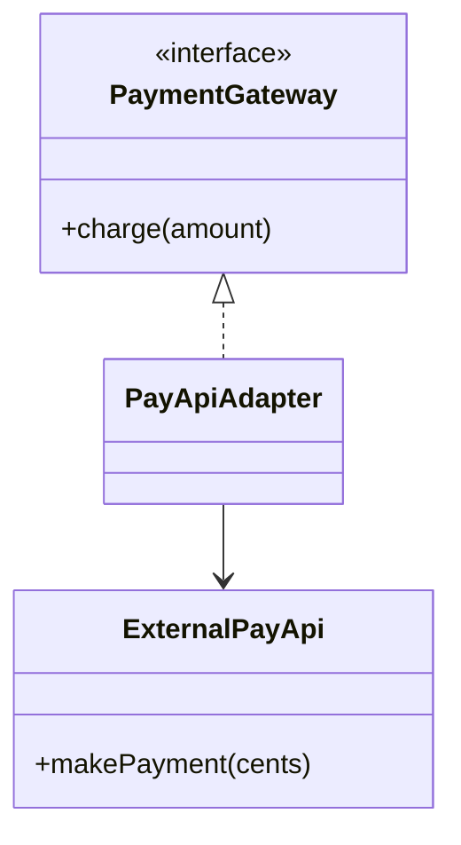
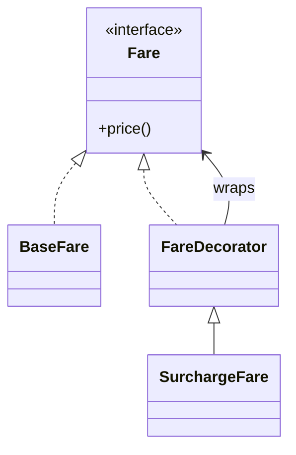
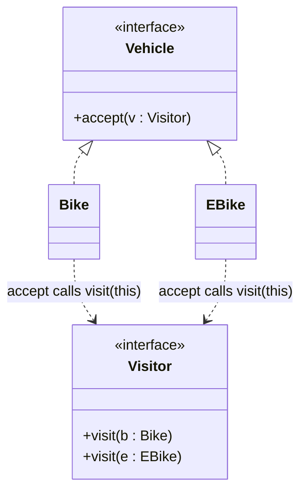
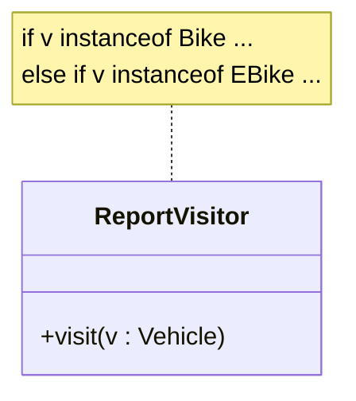
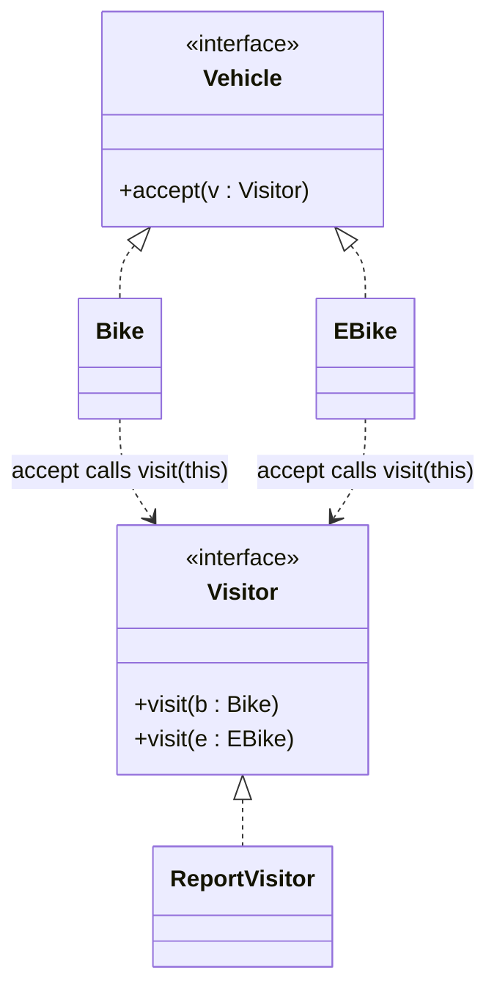

# Today's Agenda

1. Frame: from selecting a pattern to verifying it
2. Seven patterns and their signature structures
3. Live opener: drive AI to "apply" a pattern
4. Reading critically: applied, or just labeled?
5. How to verify a pattern claim
6. Bridge to Week 10 + your project

::: notes
Week 8 asked whether a pattern is warranted. Today asks the next question: when AI says "I used the X pattern", did it actually build the structure — or just write the name? The named payload is the applied-vs-labeled critique. Open into the selecting-to-verifying bridge.
:::

---

# Citatul zilei

> „De la o abstractizare dorim un mecanism care permite exprimarea detaliilor relevante și omiterea celor irelevante.”

— **Barbara Liskov și Stephen Zilles**

[Sursa: Programming with Abstract Data Types (1974)](https://gleitzman.com/media/docs/adt-liskov.pdf#page=2) · traducere din engleză

::: notes
Original: “What we desire from an abstraction is a mechanism which permits the expression of relevant details and the suppression of irrelevant details.”

Copie a articolului original, The Meaning of Abstraction, pagina 51 (pagina PDF 2). Se păstrează atribuirea ambilor autori.

Legătura cu tema: O abstractizare păstrează ce contează pentru problema tratată și ascunde detaliile care nu contează.
:::

---

# Recap: Architect and Critic

- **Architect / director:** drive AI through the software development lifecycle (SDLC).
- **Critic / reviewer:** read AI's output and name what's wrong or missing.

In Week 8 you decided *whether* a pattern earns its place. Today: *was it actually applied* — or just labeled?

::: notes
One breath of recap. Week 8 was selection (whether / which / cost). Today is verification — the claim "this is a Decorator" is something the critic checks, not accepts.
:::

---

# From Selecting to Verifying

- **Week 8 pinned the decision** — is a pattern warranted here?
- **Today: the verification** — AI says "I applied the Visitor pattern." Did it build the structure, or just write the name?

Today's question: **is the pattern actually there — or is the label decoration?**

::: notes
The bridge. Week 8's defect #2 (decoration) was the preview: a name with no structure. Today develops it into a full critique skill across seven named patterns. A pattern label is a claim; the structure is the evidence.
:::

---

# The Literacy Floor: Critique, Rationale, Traceability

From Week 1: in the oral defense, *unaided*, you must demonstrate:

- **Critique** — read & critique AI-generated artifacts on the spot.
- **Rationale** — articulate why you directed AI a certain way.
- **Traceability** — defend the trace across your project.

Today is **Critique** on patterns: read a pattern claim and verify the structure is actually present. The label is a claim; the structure is the evidence.

::: notes
First of two Critique, Rationale, Traceability mentions. Critique anchored this week — verifying a pattern's structure against its name IS the oral-defense skill, and it directly defends a project's design narrative (Rationale). Same wording in the close.
:::

---

# Seven Patterns, One Question

Recognise the intent of each:

- **Adapter** — convert one interface into another.
- **Decorator** — add behaviour by wrapping, same interface.
- **Proxy** — stand in for an object, control access.
- **Composite** — treat a tree of objects uniformly.
- **Bridge** — separate an abstraction from its implementation.
- **Visitor** — add operations without changing the elements.
- **Mediator** — centralise how objects interact.

::: notes
The Week 9 vocabulary, lifted from 2025. One line of intent each — recognition, not deep teaching. The deep dives are the three with the clearest signature structures (Adapter, Decorator, Visitor); the rest stay recognition-level. Mediator in particular stays recognition-level only — name and intent, no signature drill. Don't drill all seven.
:::

---

# Each Pattern Has a Signature Structure

A pattern is **not a name** — it's a specific structure that delivers a specific benefit.

- No structure -> the name is empty.
- Wrong structure -> the name is a lie.

The critic verifies the structure, then the name.

::: notes
The pivot of the whole lecture. AI always knows the names; whether it built the structure varies — current models usually get the famous patterns right when asked directly, and slip on less common ones, on patterns added without a problem, and under constraints that fight the pattern. Weaker models slip more. Every featured pattern next has a signature structure you can check for; the gallery shows the label without it. Set this up clearly.
:::

---

# Adapter — the Signature


```mermaid
classDiagram
  class PaymentGateway {
    <<interface>>
    +charge(amount)
  }
  class ExternalPayApi {
    +makePayment(cents)
  }
  class PayApiAdapter
  PaymentGateway <|.. PayApiAdapter
  PayApiAdapter --> ExternalPayApi
```

**Applied** = the adapter implements *our* interface and translates to the external one. Bike-sharing: wrap an external payment API as a `PaymentGateway`.

::: notes
Adapter's signature: implements the target interface, delegates to (and converts for) the adaptee. The tell of a real Adapter is that clients see only PaymentGateway. If the "adapter" exposes the external API's methods, it adapts nothing.
:::

---

# Decorator — the Signature


```mermaid
classDiagram
  class Fare {
    <<interface>>
    +price()
  }
  class BaseFare
  class FareDecorator
  class SurchargeFare
  Fare <|.. BaseFare
  Fare <|.. FareDecorator
  FareDecorator --> Fare : wraps
  FareDecorator <|-- SurchargeFare
```

**Applied** = same interface, wraps a `Fare`, adds behaviour, and is **composable** (a decorator wraps another). Bike-sharing: a surcharge on a base fare.

::: notes
Decorator's signature: implements the SAME interface it wraps, holds a reference to one, and adds behaviour — so decorators stack. The tell: you can wrap a decorator in another decorator. If it's a subclass with no wrapping, it's inheritance wearing the name.
:::

---

# Visitor — the Signature


```mermaid
classDiagram
  class Vehicle {
    <<interface>>
    +accept(v : Visitor)
  }
  class Visitor {
    <<interface>>
    +visit(b : Bike)
    +visit(e : EBike)
  }
  class Bike
  class EBike
  Vehicle <|.. Bike
  Vehicle <|.. EBike
  Bike ..> Visitor : accept calls visit(this)
  EBike ..> Visitor : accept calls visit(this)
```

**Applied** = **double dispatch**: `vehicle.accept(v)` calls `v.visit(this)`. Adds operations without touching the vehicles. **No `instanceof`.**

::: notes
Visitor's signature is double dispatch: the element's accept() calls back the type-specific visit(). That is what removes the type switch. The tell of a fake Visitor is an instanceof/switch cascade — the check the demo runs first. In languages without overloading, `visitBike` / `visitEBike` with distinct names is still double dispatch.
:::

---

# Demo: Drive AI to "Apply" a Pattern

> Live: ask AI to apply the Visitor pattern. Verify whether it built double dispatch — or wrote a switch on the type and called it Visitor. Then ask it for patterns we don't need, and verify again.

**Prompt to AI:** *"Apply the Visitor pattern to compute a maintenance report across our vehicle types (Bike, EBike, Scooter) in the bike-sharing app."*

::: notes
Switch to the Claude Code panel in VS Code (course settings: Sonnet 5, low effort). Run the runbook at `class/amss-2026/curs/09-patterns-ii-demo.md` for ~8 min. Current models usually get this Visitor right first try — accept() on each vehicle, a visit per type, no instanceof — so the first beat is verifying the claim and saying it passes, plus the smaller issues (invented maintenance thresholds, duplicated rules). The second prompt asks it to add Adapter, Decorator and Proxy with no problem behind them; that output feeds the gallery. Live output varies — walk what actually appears. Fallback: runbook §7.
:::

---

# The Critic Question

When AI claims a pattern:

> *"Is the signature structure actually there — or just the name?"*

A pattern label is a claim to verify, not a fact to accept.

::: notes
Sets up the gallery — Critique applied to pattern claims. The defects below are all forms of "the label without the structure" (spec: "was this applied or just labeled?"). AI writes confident pattern names; the critic checks each against its signature.
:::

---

# Defect #1: Adapter That Isn't

A "PayApiAdapter" that exposes `makePayment(cents)` directly — clients still see the external API. Or a passthrough that converts nothing.

**Critique:** *"What interface does this adapt to? If clients still see the external API, nothing was adapted."*

::: notes
The Adapter fails when it doesn't implement the target interface — it just renames or forwards. The signature check (does it implement OUR interface and convert?) catches it. Kept textual; the contrast is the slide-7 structure.
:::

---

# Defect #2: Decorator That's Really Inheritance

A `SurchargeFare extends BaseFare` — a subclass, no wrapping, not composable. Or a "decorator" that changes the interface.

**Critique:** *"Can you wrap one decorator in another? If not, it's inheritance — and it can't stack."*

::: notes
The Decorator fails when it subclasses instead of wrapping, losing composability, or when it changes the interface, losing substitutability. The "can it stack?" question is the fastest signature check.
:::

---

# Defect #3: Visitor Without Double Dispatch


```mermaid
classDiagram
  class ReportVisitor {
    +visit(v : Vehicle)
  }
  note for ReportVisitor "if v instanceof Bike ...<br/>else if v instanceof EBike ..."
```

A single `visit(Vehicle)` with an `instanceof` cascade — labeled Visitor, no `accept`, no double dispatch.

**Critique:** *"Where is accept()? Where is the dispatch on type? This is the switch the pattern exists to remove."*

::: notes
The classic defect. A real Visitor has accept() on each element and a visit() per type; the fake has one method with an instanceof cascade — the pattern's entire purpose (no type switch) reintroduced under its name. Weaker models produce it on request; current ones mostly don't for a plain request, and it can return under constraints that fight the pattern ("don't touch the vehicle classes") and in hand-written code — though a current model given that constraint may instead honestly drop the name and call it a type switch, which is the right answer. The Your Turn slide drills it.
:::

---

# Defect #4: Mislabel

- A **Proxy** that *adds* behaviour — that's a Decorator.
- A **Composite** that isn't recursive — just a flat list, no tree.
- A **Bridge** with the abstraction and implementation fused.

**Critique:** *"Name it by its structure, not its vibe. Which pattern does this structure actually match?"*

::: notes
Pattern-name confusion: the structure exists but matches a different pattern, or a degenerate version. AI reaches for the prestigious-sounding name. The fix is naming by structure — and it matters for Traceability, because a mislabeled pattern breaks the design narrative.
:::

---

# Defect #5: Pattern Theater

Pattern names in class names and comments — `StrategyManager`, `// Observer pattern here` — with no structural reality behind them.

**Critique:** *"Strip the label. Is there a Strategy interface and interchangeable implementations — or just an if/else?"*

::: notes
Decoration at scale (Week 8's defect #2, now across the codebase). AI sprinkles pattern vocabulary to signal sophistication. The critique strips the name and asks for the structure. This is the habit the oral defense punishes hardest.
:::

---

# Your Turn: Spot the Fake

Here is what AI handed back, labeled "Visitor":

```java
class ReportVisitor {
  String visit(Vehicle v) {
    if (v instanceof Bike)  ...
    else if (v instanceof EBike) ...
  }
}
```

With your neighbour (60s): which signature check exposes this — and which pattern is it *really*?

::: notes
Let pairs talk for 60 seconds, then take two answers. The exposing check: "where is accept() on the elements, and where is the dispatch on type?" — there is none, just an instanceof cascade. What it really is: a plain type switch wearing the Visitor name (Defect #3). This primes the verification recipe on the next slide.
:::

---

# How to Verify a Pattern Claim

A fixed order, every time:

1. What is the pattern's **signature structure**?
2. Is that structure **actually present**?
3. Does it **deliver the benefit** the pattern exists for?
4. Is the **name correct** for the structure?

::: notes
This IS the Critique drill for patterns. A repeatable verification beats being impressed by a pattern name. Students internalise it for defending their own project's design choices — every claimed pattern must pass these four.
:::

---

# Applied, Not Labeled


```mermaid
classDiagram
  class Vehicle {
    <<interface>>
    +accept(v : Visitor)
  }
  class Visitor {
    <<interface>>
    +visit(b : Bike)
    +visit(e : EBike)
  }
  class Bike
  class EBike
  class ReportVisitor
  Vehicle <|.. Bike
  Vehicle <|.. EBike
  Visitor <|.. ReportVisitor
  Bike ..> Visitor : accept calls visit(this)
  EBike ..> Visitor : accept calls visit(this)
```

The corrected Visitor: `accept` on each vehicle, `visit` per type, no `instanceof`. Structure present, benefit delivered, name correct.

::: notes
The critique result — the counterpart to the slide-13 fake. Contrast them side by side: the fake has one visit(Vehicle) + instanceof; the real has accept() on elements and visit() per type. This is roughly what the demo's first answer looked like — which is why verifying includes confirming: a claim that checks out is a finding too.
:::

---

# The Critique Loop on Patterns

read the claim -> check the signature structure -> re-prompt "show the structure, not the label" -> re-read.

Same architect-and-critic loop as Weeks 2-8 — now on a pattern claim.

::: notes
The loop is the through-line. The scaffold that tightens AI output here is demanding the mechanism — "show accept/visit double dispatch, no instanceof"; for each added pattern, "show the signature and the problem it solves". The pattern's signature is the constraint, and the re-read checks each "I added X" against the code.
:::

---

# The Human Decides Whether the Pattern Is Real

AI labels patterns fluently; whether it built them — this time — is something you verify, not assume. Checking that the structure is actually present — and delivers the benefit — is the architect-and-critic call.

It's what the oral defense checks, and AI can't make it for you.

::: notes
Reinforces ownership, mirroring Weeks 4-8's closes. The defense grades whether your claimed patterns are real (Critique) and justified (Rationale), not whether the names sound impressive.
:::

---

# This Connects to Your Project

Every pattern you claim in your design narrative, you must **defend structurally** in the oral defense.

A labeled-not-applied pattern fails Rationale: you can't justify a structure that isn't there.

::: notes
The direct project tie. Students will claim patterns in their design docs; Week 9's verification is exactly how examiners test those claims. "I used Strategy" invites "show me the interface and the implementations." Patterns are a Rationale minefield if labeled, not applied.
:::

---

# Next Week: Cross-Layer Traceability (Week 10)

Patterns done — Week 8 (selection) and Week 9 (verification) cover *designing with patterns*.

**Week 10:** the full trace — requirement -> use case -> class -> state / sequence -> test — and how to keep it intact. Plus **Lab 5**, your checkpoint defense.

::: notes
Clean handoff. Week 10 anchors Traceability, pulling together every artifact type from Weeks 2-9 into one chain, and pairs with Lab 5 (the intermediate checkpoint defense). Bike-sharing carries forward.
:::

---

# Critique, Rationale, Traceability — The Through-Line

Today you drilled:

- **Critique** — verified a pattern's structure against its label, and named the fakes.
- **Rationale** — a claimed pattern is only defensible if its structure is real.

Traceability: a correctly-named, genuinely-applied pattern keeps the design narrative honest.

::: notes
Second and final Critique, Rationale, Traceability mention. Critique anchored this week — structure over label. The Rationale/Traceability touches set up Week 10's traceability and the project defense, where every pattern claim is tested.
:::

---

# That's It For Today

- Next lecture (Week 10): cross-layer traceability.
- Next week's lab (Lab 5): project workshop + checkpoint defense.

Questions?

::: notes
Closer. Open the floor. No trailing slide separator after this one.
:::
