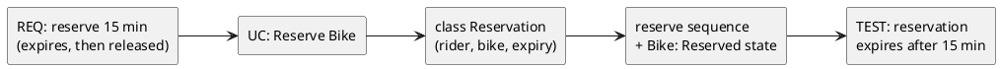

# W10 Demo Runbook — Trace a New Feature

> Procedural script for the W10 lecture's live opener. **Not** a slidy deck — pandoc skips `*-demo.md`. Read end-to-end before running. Estimated runtime: **~8 minutes** inside the lecture's "Demo" segment (an opener that seeds the gallery, not the whole payload).
>
> Design reference: the master spec's W10 row (`docs/superpowers/specs/2026-05-01-amss-ai-redesign-design.md` §2) — "critique exercises (find broken links)."
>
> This demo's artifact is **AI's full trace for one feature** (requirement, use case, class, sequence, test). The "aha" beat is *walking the chain* — does every layer agree, does the test check exactly what the requirement states, does anything appear that no requirement asked for?

## 0. Setup (pre-class, ~1 min)

- VS Code open, Continue.dev installed and configured against the canonical course endpoint (see `class/amss-2026/tooling/SETUP.md`).
- Continue.dev mode set to **agentic chat**.
- A scratch/chat pane visible — the artifact is a multi-layer text answer; a PlantUML preview helps for the sequence/class but is not essential.
- Browser tab pre-opened to `class/amss-2026/curs/10-traceability-demo-fallback/01-fallback-broken-trace.png` in case the live AI fails.
- The deck's "Demo" trigger slide is on screen.

## 1. Architect prompt #1 — verbatim

Paste this into Continue.dev's chat (do **not** improvise):

> *"For a new feature — a rider can reserve a bike for 15 minutes before pickup — give me the requirement, the use case, the class changes, the sequence, and a test."*

Read the five layers aloud. **Time:** ~1 min to type, ~2 min for AI to respond.

## 2. Defect catalogue — pick the ones that appear

Walk the chain requirement-to-test, then test-to-requirement. Pick the **2-3 defects that actually appear**. A drift between layers (#4) is near-certain — anchor on it.

| # | Defect | What to point at | Critique question |
|---|---|---|---|
| 1 | Orphan requirement | a stated requirement (e.g. "reservation expires") with no test | *"Walk this requirement forward — where's the test? If none, it was dropped."* |
| 2 | Orphan artifact / gold-plating | a class or test for something no requirement mentioned | *"Walk this back — which requirement needs it? If none, why is it here?"* |
| 3 | Dangling link | the sequence references a class the class-changes section never added | *"This points at something that doesn't exist. Add the class or fix the message."* |
| 4 | Drift / inconsistency | the 15-min timeout is in one layer, missing/different in another | *"The layers disagree on the timeout — which is right? Fix the others."* |
| 5 | Test mismatch | the test checks something the requirement didn't state | *"Does this test verify exactly what the requirement says — no more, no less?"* |

If the trace is suspiciously consistent → jump to §6 "Make-it-fail reserve".

## 3. Critique walkthrough (~3 min)

Walk the chosen 2-3 defects along the chain. Ask the room first ("does every layer say the same thing about the 15 minutes?") before delivering the critique. Name the move explicitly:

> *"That's the **critic** half — walking the trace AI built and checking the links hold, not the artifacts in isolation. Next is the **architect** half — I re-prompt to make the layers consistent."*

This is the F4 skill: the chain, not the node.

## 4. Architect prompt #2 — constructed live (constraint scaffold)

Type this into Continue.dev:

> *"Make the layers consistent: every requirement must have a test, every class must trace to a requirement, drop anything no requirement asked for, and the test must check exactly what the requirement states. Then list the trace links: requirement -> use case -> class -> sequence -> test."*

Demanding the explicit links is the pivot. Re-read. **Time:** ~1 min to type, ~2 min for AI to revise.

## 5. Reference solution (instructor's verified target)

The live AI output varies. This is the **dry-run-verified** reference the instructor confirms before delivery — the consistent trace the critique converges toward:

Every layer encodes the 15-minute expiry; the test checks exactly that; nothing extra appears. If the live output reaches a consistent chain like this after prompt #2, the loop worked. Pivot into the deck's gallery — the live drift you saw is defect #4 of that gallery.

## 6. Make-it-fail reserve — AI produces a consistent trace first try

If AI's first trace is fully consistent (low probability — five independently-generated layers reliably drift), restore the critique surface:

> *"Now add loyalty points, surge pricing, and fraud detection to this feature."*

This near-certainly introduces orphan artifacts (classes/tests with no requirement) and drift. If even that is clean, fall back to `02-fallback-make-it-fail.png` and walk the screenshot.

## 7. Fallback path — live AI fails

If the live AI fails (no response after 20s, network down, garbage output), switch to the pre-recorded captures:

- `10-traceability-demo-fallback/01-fallback-broken-trace.png` — cycle-1 trace with a drift and an orphan.
- (walk the same defect catalogue against the screenshot)
- `10-traceability-demo-fallback/02-fallback-consistent-trace.png` — the repaired, consistent trace.

Acknowledge briefly ("the model is having a moment — here's the dry-run capture") and continue. The pedagogical content is identical.

## 8. Time budget reconciliation

| Beat | Duration |
|---|---|
| Prompt #1 typed | ~1 min |
| AI responds | ~2 min |
| Critique walkthrough | ~3 min |
| Prompt #2 typed + AI revises | ~2 min |
| **Total** | **~8 min** |

This is an opener, not the whole demo — keep it tight and hand into the gallery. If ahead of schedule, do not pad; have the room walk the trace backward (test to requirement) and predict where it breaks.

## 9. Checkpoint synergy & fallback assets

This demo is the rehearsal for **Lab 5** this week — the project checkpoint defense, where each student walks **their own** project's trace. The §2 defect catalogue is exactly what examiners probe; the deck's audit order is the rubric. Tell students: run this audit on their own trace before the checkpoint.

Fallback assets to capture during the solo dry-run, in `10-traceability-demo-fallback/`:

- `01-fallback-broken-trace.png` — captured cycle-1 trace with drift + orphan.
- `02-fallback-consistent-trace.png` — the repaired trace after prompt #2.
- `03-fallback-make-it-fail.png` — the gold-plated trace from the reserve prompt.

When the procurement decision changes the canonical endpoint, the dry-run reruns and the captures refresh.
