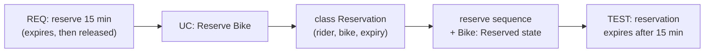

# W10 Demo Runbook — Trace a New Feature

Calibrated September 2026 with Claude Sonnet 5 (low effort), one run per prompt — live output varies; walk the defects that actually appear.

> Procedural script for the W10 lecture's live opener. **Not** a slidy deck — pandoc skips `*-demo.md`. Read end-to-end before running. Estimated runtime: **~8 minutes** inside the lecture's "Demo" segment (an opener that seeds the gallery, not the whole payload).
>
> Design reference: the master spec's W10 row (`docs/superpowers/specs/2026-05-01-amss-ai-redesign-design.md` §2) — "critique exercises (find broken links)."
>
> This demo's artifact is **AI's full trace for one feature** (requirement, use case, class, sequence, test). The "aha" beat is *walking the chain* — does every layer agree, does the test check exactly what the requirement states, does anything appear that no requirement asked for?

## 0. Setup (pre-class, ~1 min)

- VS Code open on a repository containing the course settings (`tooling/template/` copied in — see `class/amss-2026/tooling/SETUP.md`), the **Claude Code panel** open and signed in; `/model` shows **Sonnet 5, low effort**.
- The Claude Code panel visible — the artifact is a multi-layer text answer; a Mermaid preview (VS Code's Markdown preview with the "Markdown Preview Mermaid Support" extension) helps for the sequence/class but is not essential.
- Browser tab pre-opened to `class/amss-2026/curs/10-traceability-demo-fallback/01-fallback-broken-trace.png` in case the live AI fails.
- The deck's "Demo" trigger slide is on screen.

## 1. Architect prompt #1 — verbatim

Paste this into the Claude Code panel (do **not** improvise):

> *"For a new feature — a rider can reserve a bike for 15 minutes before pickup — give me the requirement, the use case, the class changes, the sequence, and a test."*

Read the five layers aloud. **Time:** ~1 min to type, ~2 min for AI to respond.

## 2. Defect catalogue — pick the ones that appear

Walk the chain requirement-to-test, then test-to-requirement. Pick the **2-3 defects that actually appear**. In calibration the 15-minute value was consistent in every layer (no drift) — the breaks were **dangling links** (#1 below) and **requirement clauses with no test** (#2). Anchor on those.

| # | Defect | What to point at | Critique question |
|---|---|---|---|
| 1 | Dangling link (observed) | the sequence calls `Bike.setStatus(...)` / `checkStatus()`, the test calls `service.setClock(...)`, `new ReservationService(clock)`, `ReservationExpiredException` — none declared in the class changes; `Rider` is used everywhere but never introduced | *"This message points at an operation that doesn't exist. Add it to the class, or fix the message."* |
| 2 | Orphan requirement clause (observed) | the requirement says "unavailable to other riders" and the use case has a cancel flow — the single test covers only expiry | *"Walk each clause forward — where's the test for 'unavailable to other riders'? For cancel?"* |
| 3 | Requirement not realised in the behaviour (observed) | `fulfillReservation(reservationId)` takes no rider — nothing in the sequence checks the unlocker is the rider who reserved; `Bike.unlock(rider)` is declared but never called | *"Show me the link that enforces 'unavailable to other riders'. Which message does it?"* |
| 4 | Duplicated responsibility (observed) | `Bike.reserve(rider)` and `ReservationService.createReservation(...)` both claim the same job; the sequence uses only the service | *"Two classes own 'reserve'. Which one does the sequence use — and why does the other exist?"* |
| 5 | Orphan artifact / gold-plating (observed) | `ReservationExpiryScheduler`, the "notify rider" message on expiry, the countdown — no requirement asked for them | *"Walk this back — which requirement needs it? If none, why is it here?"* |
| 6 | Test mismatch (mild, observed) | the test asserts an exception on fulfil-after-expiry (the requirement says "returns to the pool"); it tests 15 min **+1 s** but not the boundary at exactly 15:00 | *"Does this test verify exactly what the requirement says — no more, no less? What happens at 15:00 sharp?"* |

Also note: in calibration (no repository instruction files) the class and sequence came as pseudo-code, not diagrams. With the course `AGENTS.md` present, expect Mermaid; if you still get pseudo-code, that is itself a critique point (*"is this a UML sequence diagram?"*).

Drift of the 15-minute value between layers is the classic trace failure (older/weaker models produce it) — the deck's gallery covers it; do not promise it live. If the trace is suspiciously consistent → jump to §6 "Make-it-fail reserve".

## 3. Critique walkthrough (~3 min)

Walk the chosen 2-3 defects along the chain. Ask the room first ("every message in the sequence — is its operation in the class changes?"; "which clause of the requirement does the test check?") before delivering the critique. If they check the 15 minutes first, confirm it is consistent — a trace can agree on the headline number and still break at the joins. Name the move explicitly:

> *"That's the **critic** half — walking the trace AI built and checking the links hold, not the artifacts in isolation. Next is the **architect** half — I re-prompt to make the layers consistent."*

This is the F4 skill: the chain, not the node.

## 4. Architect prompt #2 — constructed live (constraint scaffold)

Type this into the Claude Code panel:

> *"Make the layers consistent: every operation the sequence or the test calls must be declared in the class changes, including Rider; every clause of the requirement — expiry, 'unavailable to other riders', cancel — must have a test; only the rider who reserved may unlock; drop anything no requirement asked for. Then list the trace links: requirement -> use case -> class -> sequence -> test."*

Demanding the explicit links is the pivot. Re-walk the revision rather than trusting its link list: check that each newly declared operation is actually the one the sequence calls, and that the new tests really exercise the clauses they claim. Re-read. **Time:** ~1 min to type, ~2 min for AI to revise.

## 5. Reference solution (instructor's verified target)

The live AI output varies. This is the **dry-run-verified** reference the instructor confirms before delivery — the consistent trace the critique converges toward:

```mermaid
flowchart LR
  R["REQ: reserve 15 min<br/>(expires, then released)"]
  U["UC: Reserve Bike"]
  C["class Reservation<br/>(rider, bike, expiry)"]
  S["reserve sequence<br/>+ Bike: Reserved state"]
  T["TEST: reservation<br/>expires after 15 min"]
  R --> U
  U --> C
  C --> S
  S --> T
```

Every layer encodes the 15-minute expiry; the test checks exactly that; nothing extra appears. If the live output reaches a consistent chain like this after prompt #2, the loop worked. Pivot into the deck's gallery — the dangling links you saw are defect #3 of that gallery, the untested clauses are defect #1.

## 6. Make-it-fail reserve — AI produces a consistent trace first try

If AI's first trace is fully consistent (unlikely — the calibration run had four broken-link defects, though no value drift), restore the critique surface:

> *"Now add loyalty points, surge pricing, and fraud detection to this feature."*

This is expected to introduce orphan artifacts (classes/tests with no requirement) and new dangling links — not tested in calibration, so check before promising it. If even that is clean, fall back to `02-fallback-make-it-fail.png` and walk the screenshot.

## 7. Fallback path — live AI fails

If the live AI fails (no response after 20s, network down, garbage output), switch to the pre-recorded captures:

- `10-traceability-demo-fallback/01-fallback-broken-trace.png` — cycle-1 trace with dangling links and an untested requirement clause.
- (walk the same defect catalogue against the screenshot)
- `10-traceability-demo-fallback/02-fallback-consistent-trace.png` — the repaired, consistent trace.

Acknowledge briefly ("the model is having a moment — here's the dry-run capture") and continue. The pedagogical content is identical.

## 8. Time budget reconciliation

| Beat | Duration |
|---|---|
| Prompt #1 typed | ~1 min |
| AI responds | ~2 min |
| Critique walkthrough | ~3 min |
| Prompt #2 typed + AI revises | ~2 min |
| **Total** | **~8 min** |

This is an opener, not the whole demo — keep it tight and hand into the gallery. If ahead of schedule, do not pad; have the room walk the trace backward (test to requirement) and predict where it breaks.

## 9. Checkpoint synergy & fallback assets

This demo is the rehearsal for **Lab 5** this week — the project checkpoint defense, where each student walks **their own** project's trace. The §2 defect catalogue is exactly what examiners probe; the deck's audit order is the rubric. Tell students: run this audit on their own trace before the checkpoint.

Fallback assets to capture during the solo dry-run, in `10-traceability-demo-fallback/`:

- `01-fallback-broken-trace.png` — captured cycle-1 trace with dangling links + untested clause.
- `02-fallback-consistent-trace.png` — the repaired trace after prompt #2.
- `03-fallback-make-it-fail.png` — the gold-plated trace from the reserve prompt.

When the course settings change (model or effort in `tooling/template/`), the dry-run reruns and the captures refresh.
