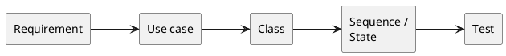
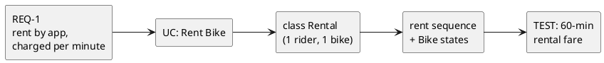
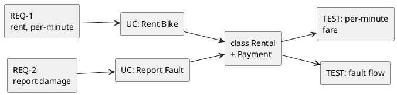

# Today's Agenda

1. Frame: the links between the artifacts
2. The full trace, end to end
3. Live opener: drive AI to a trace — watch a link break
4. Reading critically: finding broken links
5. How to audit a trace
6. Bridge to W11 + Lab 5 this week

::: notes
W2-W9 built every artifact type. Today is the chain that connects them: requirement to use case to class to sequence/state to test. This is the F4 anchor — the "defend traceability" skill from the literacy floor. The payload is finding broken links. Open into why the links matter.
:::

---

# Recap: Architect + Critic

- **Architect / director (B):** drive AI through the SDLC.
- **Critic / reviewer (A):** read AI's output and name what's wrong or missing.

In W2-W9 you critiqued individual artifacts. Today: the **links between them** — does the whole chain hold together?

::: notes
One breath of recap. Every prior week critiqued one artifact type in isolation. Today zooms out to the connections — a set of individually-fine artifacts can still fail to form a coherent whole.
:::

---

# Why Traceability

- **AI builds each layer plausibly — and independently.** The class diagram looks right; the tests look right.
- **But they drift.** The test checks a flat fare; the requirement said per-minute. Nobody linked them.

Today's question: **does every requirement reach a test — and every artifact trace back to a requirement?**

::: notes
The core insight. AI generates each artifact in its own context, so cross-artifact consistency is the default casualty. Drift is invisible inside any single artifact — you only see it by following the links. Traceability is the discipline that catches it.
:::

---

# Literacy Floor: F1 + F3 + F4

From W1: in the oral defense, *unaided*, you must demonstrate:

- **F1** — read & critique AI-generated artifacts on the spot.
- **F3** — articulate why you directed AI a certain way.
- **F4** — defend traceability across your project.

Today is **F4** at its sharpest: walk the trace from any requirement to its test and back, and name the broken links. This is the skill the whole course pointed toward.

::: notes
First of two F1+F3+F4 mentions. F4 anchored this week — the oral defense IS a trace walk: "show me the requirement behind this class; show me the test that verifies it." Every prior week built a node; today is the chain. Same wording in the close.
:::

---

# The Full Trace

Every node is an artifact you have built since W2. One chain, requirement to test.

::: notes
The trace skeleton. Requirements (W2), use cases (W2/W6), classes (W4), sequence/state (W6/W7), tests (W3). Each arrow is a realisation or verification link. This is the spine the rest of the lecture instantiates and then breaks.
:::

---

# A Worked Trace: "Rent a Bike"

The bike-sharing chain, concrete: the requirement is realised by the use case, the class, the behaviour — and verified by the test.

::: notes
The same chain, instantiated on the domain built across the course. Walk it aloud both ways: forward (REQ-1 leads to a test) and backward (the test exists because of REQ-1). This bidirectional walk is exactly the checkpoint defense.
:::

---

# Each Link Is a Claim

Every arrow asserts something:

- "this **use case** realises that requirement"
- "this **class** realises that use case"
- "this **test** verifies that requirement"

A link you **cannot justify** is a broken link — even if both ends are fine.

::: notes
The critical reframe: the artifacts can each be correct while the links between them are wrong or absent. F4 is about the links, not the nodes. A class and a test can both be impeccable and still not be connected to anything that needed them.
:::

---

# Conventions: IDs + Links

Make the links **explicit**, not implicit:

- Give artifacts IDs: `REQ-1`, `UC-2`, `TEST-3`.
- Tag each artifact with what it traces to: a test names its requirement.
- Keep a small **trace matrix**: requirement across, artifacts down.

If the link lives only in your head, it breaks silently.

::: notes
The maintenance discipline. Implicit links (matching names, shared intuition) drift without warning; explicit IDs and a trace matrix make a broken link visible. This is what students should set up for their projects now, before Lab 5.
:::

---

# Demo: Drive AI to a Trace

> Live: ask AI for the full trace of a new feature. Walk it — does every layer agree, and does the test match the requirement?

**Prompt to AI:** *"For a new feature — a rider can reserve a bike for 15 minutes before pickup — give me the requirement, the use case, the class changes, the sequence, and a test."*

::: notes
Switch to Continue.dev. Run the runbook at `class/amss-2026/curs/10-traceability-demo.md` for ~8 min. The near-certain failure: a layer that drifts — a test that checks something the requirement didn't state, or a class with no requirement, or the 15-minute timeout present in one layer and missing in another. Then pivot to the gallery. Fallback: runbook §7.
:::

---

# AI Builds Layers Independently — and They Drift

Each artifact can be locally fine and globally inconsistent. The critic question:

> *"Does every requirement reach a test — and does every artifact trace back to a requirement?"*

::: notes
Sets up the gallery — F4 applied to the chain. The defects are all forms of broken links (spec: "find broken links"). Walking the trace, not inspecting any one artifact, is what surfaces them.
:::

---

# Defect #1: Orphan Requirement

`REQ-2: a rider can report a damaged bike` — but no use case, no class, no test realises it.

**Critique:** *"Walk REQ-2 forward. Where does it go? If nowhere, the feature was silently dropped."*

::: notes
The anchor defect. A requirement with no downstream artifacts means the feature exists on paper but nowhere in the design. AI drops requirements it didn't happen to elaborate. Forward-walking every requirement catches it.
:::

---

# Defect #2: Orphan Artifact / Gold-Plating

A `LoyaltyPointsManager` class, or a test for surge-pricing — but **no requirement** asked for either.

**Critique:** *"Walk this backward. Which requirement needs it? If none, why is it here?"*

::: notes
The mirror of #1. An artifact with no requirement behind it is gold-plating — AI invented work nobody asked for. Backward-walking every artifact catches it. This ties to W4/W8's invented-class and overuse defects, now as a trace failure.
:::

---

# Defect #3: Dangling Link

The rent sequence sends `charge()` to a `Wallet` class — but **`Wallet` is not in the class diagram**.

**Critique:** *"This link points at something that doesn't exist. Add the class, or fix the message."*

::: notes
Cross-link to W6's "message to a stranger". A link whose target is absent is broken at the join. The artifacts disagree about what exists. Following the link from sequence to class exposes the gap.
:::

---

# Defect #4: Drift / Inconsistency

The class says `Payment`; the sequence says `Wallet`. The requirement says **per-minute**; the test checks a **flat fare**.

**Critique:** *"The layers disagree. Which one is right — and fix the others to match."*

::: notes
The most insidious defect: both ends exist, but they say different things. AI generated the test in a context that lost the per-minute detail. Drift is only visible by comparing across the link — never from inside one artifact.
:::

---

# Defect #5: Stale Link

The requirement changed — `per-minute` became `per-hour` — but the use case, class, and test still encode **per-minute**.

**Critique:** *"The trace points at the old requirement. A change in one node must propagate along every link."*

::: notes
The maintenance failure. Traceability is not a one-time wiring; a change anywhere must ripple. AI does not re-walk the trace when one artifact changes, so downstream nodes silently go stale. This is why the trace is a living artifact.
:::

---

# The Repaired Trace

Every requirement reaches a test; every artifact traces back; the layers agree.

::: notes
The critique result. REQ-2 now has a use case and a test (orphan fixed); no class without a requirement (gold-plating gone); Payment consistent across layers; the test matches the per-minute rule. This is the state Lab 5 asks students to defend.
:::

---

# How to Audit a Trace

A fixed order, every time:

1. Does every **requirement** reach a **test**? (forward walk)
2. Does every **artifact** trace back to a **requirement**? (backward walk)
3. Do the **layers agree**? (no drift across a link)
4. Any **stale links**? (did a change propagate?)

::: notes
This IS the F4 drill. Forward walk catches orphan requirements; backward walk catches gold-plating; cross-checking catches drift and dangling links; the staleness pass catches un-propagated changes. A repeatable audit beats hoping it all lines up.
:::

---

# The Critique Loop on Traceability

walk the trace -> name the broken link -> fix the artifact / re-prompt -> re-walk.

Same architect-critic loop as W2-W9 — now on the chain itself.

::: notes
The loop is the through-line. Here the scaffold is the audit order plus explicit IDs — when AI's layers drift, you name the broken link and re-prompt the specific artifact to match, then re-walk to confirm nothing else moved.
:::

---

# The Human Owns the Trace

AI generates the layers. Keeping them consistent — walking the trace, catching the drift, propagating the changes — only the human does.

The trace is **the human's artifact**. It's what the oral defense checks, and AI can't maintain it for you.

::: notes
Reinforces ownership, the strongest version yet: the individual artifacts may be AI's, but the trace that binds them is the student's own work and responsibility. This is the heart of the architect-critic pedagogy.
:::

---

# This IS the Checkpoint Defense

Lab 5 this week: you walk **your project's** trace — requirement to test — in a short checkpoint defense.

Broken links are exactly what examiners probe: *"show me the test for this requirement"; "which requirement needs this class?"*

::: notes
The direct lab tie. Lab 5 is the intermediate checkpoint (the 1-point gate). Today's audit order is the rehearsal: a student who has walked their own trace and fixed the broken links defends cleanly; one who hasn't gets caught at the first dangling link.
:::

---

# F4 — The Skill the Whole Course Built Toward

- W2 requirements, W4 classes, W6 sequences, W7 states, W3 tests — every week was a **node**.
- Today is the **chain**.

The oral defense is a trace walk. If you can walk it, you can defend it.

::: notes
The capstone framing. This is why the course embedded UML literacy where it is used rather than as standalone diagram lectures — so that every artifact is a node in one defensible chain. F4 is the integration of everything.
:::

---

# Next Week: Model Evaluation & Quality (W11)

Traceability checks the links hold. **W11** checks the quality of what they connect:

- consistency, completeness, correctness;
- static evaluation, conformance, simulation;
- and where **AI is a worse evaluator than you**.

::: notes
Clean handoff. W10 is structural integrity of the trace; W11 is the quality of the models themselves and the limits of AI as a self-evaluator. Bike-sharing carries forward.
:::

---

# F1 + F3 + F4 — The Through-Line

Today you drilled:

- **F4** — walked the trace requirement-to-test and named the broken links.
- **F1** — read across artifacts and caught drift no single artifact reveals.

F3: when you fix a broken link, you say *why* the layers must agree.

::: notes
Second and final F1+F3+F4 mention. F4 anchored this week — the chain is the deliverable. The F1/F3 touches reinforce that auditing the trace draws on the whole literacy floor at once. Sets up the checkpoint defense.
:::

---

# That's It For Today

- Next lecture (W11): model evaluation & quality.
- This week's lab (Lab 5): project workshop + checkpoint defense — walk your trace.

Questions?

::: notes
Closer. Open the floor. No trailing slide separator after this one.
:::
