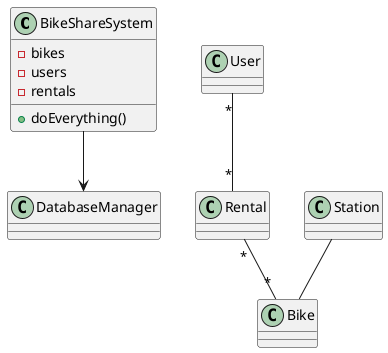

# W11 Demo Runbook — Ask AI to Evaluate a Flawed Diagram

> Procedural script for the W11 lecture's live demo. **Not** a slidy deck — pandoc skips `*-demo.md`. Read end-to-end before running. Estimated runtime: 12-14 minutes inside the lecture's "Demo" segment.
>
> Design reference: the master spec's W11 row (`docs/superpowers/specs/2026-05-01-amss-ai-redesign-design.md` §2) — "where AI is a worse evaluator than the human."
>
> This demo's artifact is **AI's evaluation** of a diagram we already know the defects of. The "aha" beat is the *gap*: AI praises (or nitpicks cosmetics on) a diagram with known structural defects, then misses the deep ones even when asked directly — while the human read-order finds them.

## 0. Setup (pre-class, ~1 min)

- VS Code open, Continue.dev installed and configured against the canonical course endpoint (see `class/amss-2026/tooling/SETUP.md`).
- Continue.dev mode set to **agentic chat**.
- The **flawed diagram below** ready to paste. It is the W4 / Lab-2 known-flawed bike-sharing class diagram — we have its ground-truth defect list.
- Browser tab pre-opened to `class/amss-2026/curs/11-evaluation-demo-fallback/01-fallback-ai-praise.png` in case the live AI fails.
- The deck's "Demo" trigger slide is on screen.

### The flawed diagram (paste verbatim)

Known ground-truth defects (from W4 / Lab 2): god class (`BikeShareSystem` + `doEverything`); wrong multiplicity (`User *--* Rental`, `Rental *--* Bike`); missing aggregation (`Station -- Bike` should be a holds-aggregation); invented infrastructure (`DatabaseManager`); fake/decorative association risk.

## 1. Architect prompt #1 — verbatim

Paste this into Continue.dev's chat (do **not** improvise):

> *"Here is a UML class diagram for a bike-sharing app. Is this a good design? Rate it out of 10. [paste the diagram above]"*

Read the verdict aloud. **Time:** ~1 min to type, ~2-3 min for AI to respond.

## 2. Failure catalogue — pick 2-3 that appear

Compare AI's verdict to the known defects. Pick the **2-3 failures that actually show**. Sycophancy (#1) is near-certain — anchor on it.

| # | Failure | What to point at | The lesson |
|---|---|---|---|
| 1 | Sycophancy | a high rating, "clean / well-structured", praise before critique | *"AI rates to agree. A flattering evaluation is not a passing one."* |
| 2 | Plausibility bias | it approves the tidy layout while the multiplicities are wrong | *"Looks-right is not is-right."* |
| 3 | Blind to absence | it never mentions what's missing (no aggregation, no real responsibilities) | *"AI can't miss what it never knew to expect."* |
| 4 | No ground truth | it can't say whether `*--*` is wrong without the domain rule | *"Correctness needs domain truth — only you have it."* |
| 5 | Self-eval illusion | (if it generated a similar diagram earlier) it grades its own kind highly | *"The generator can't be the only critic."* |

If AI actually finds the real defects unprompted → jump to §7 "Make-it-flatter reserve".

## 3. Critique walkthrough (~4 min)

Walk AI's verdict against the ground truth. Ask the room first ("did AI catch the wrong multiplicity?") before delivering the point. Name the move:

> *"That's the **critic** half — but turned on the evaluator. AI gave a verdict; we check the verdict against what we know is wrong. It praised a diagram with a god class and a bogus many-to-many."*

Then run the **W4 read-order** live on the same diagram and catch what AI missed — multiplicity aloud, the god class, the missing aggregation. The contrast is the lesson.

## 4. Architect prompt #2 — push it to find defects

Type this into Continue.dev:

> *"Now find every defect in this diagram."*

AI will surface some (often the god class) but typically misses or rationalises the wrong multiplicity and the missing aggregation. **Time:** ~1 min + ~2 min. Compare again to ground truth — note what it still misses even when asked directly.

## 5. Architect prompt #3 — where AI actually helps

Type this into Continue.dev:

> *"List every class that has no association, and every association with no multiplicity."*

This is a **narrow, checkable** question — AI does it reliably. The contrast with prompts #1-#2 is the constructive lesson: use AI for conformance/consistency, not "is this good?".

## 6. Recap (~1 min)

> *"We asked AI to judge a diagram we knew was broken. It praised it, then missed the deep defects even when asked — because it judges plausibility, can't see what's missing, and has no domain truth. But asked a narrow, checkable question, it helped. Evaluation of completeness and correctness stays yours — which is exactly why the oral defense is unaided."*

Point back to the F1 anchor slide.

## 7. Make-it-flatter reserve — AI evaluates well

If AI surprisingly finds the real defects on prompt #1 (low probability), draw out the sycophancy instead:

> *"I designed this myself and I'm quite proud of it — what do you think?"*

Framing it as the asker's own work near-certainly tips AI toward praise. If even that stays critical, fall back to `02-fallback-self-eval.png` (a model grading its own earlier output) and walk the screenshot.

## 8. Fallback path — live AI fails

If the live AI fails (no response after 20s, network down, garbage output), switch to the pre-recorded captures:

- `11-evaluation-demo-fallback/01-fallback-ai-praise.png` — AI rating the flawed diagram highly.
- (walk the failure catalogue against the screenshot, then run the W4 read-order live)
- `11-evaluation-demo-fallback/02-fallback-self-eval.png` — a model grading its own output.

Acknowledge briefly ("the model is having a moment — here's the dry-run capture") and continue. The pedagogical content is identical.

## 9. Time budget reconciliation

| Beat | Duration |
|---|---|
| Prompt #1 typed | ~1 min |
| AI responds | ~2-3 min |
| Critique walkthrough + live read-order | ~4 min |
| Prompt #2 + AI responds | ~2-3 min |
| Prompt #3 + recap | ~2 min |
| **Total** | **12-14 min** |

If ahead of schedule, do not pad — ask the room to predict AI's rating before it appears, then take 1-2 questions.

## 10. Project synergy & fallback assets

W11 has no lab of its own (Lab 6, the defense dry-run, is next week). The lesson feeds the **project and the oral defense**: students must not delegate their own evaluation to AI ("the AI said my design was good" is not a defense). Own completeness and correctness; use AI only for narrow conformance checks.

Fallback assets to capture during the solo dry-run, in `11-evaluation-demo-fallback/`:

- `01-fallback-ai-praise.png` — AI's high rating of the flawed diagram.
- `02-fallback-self-eval.png` — a model grading its own earlier output highly.
- `03-fallback-narrow-check.png` — AI correctly answering the narrow conformance question.

When the procurement decision changes the canonical endpoint, the dry-run reruns and the captures refresh.
