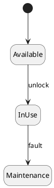

# Today's Agenda

1. Frame: from generating to judging
2. Three quality criteria; how to evaluate
3. Live demo: ask AI to evaluate a flawed artifact
4. Where AI is a worse evaluator than you
5. How to use AI as an evaluator — and how not to
6. Bridge to W12 + the project

::: notes
The course used AI to generate and YOU to judge. Today turns to evaluation itself: what quality means, how to check it, and what happens when you ask AI to judge. The named payload is where AI is a worse evaluator than the human. Open into the generating-to-judging shift.
:::

---

# Recap: Architect + Critic

- **Architect / director (B):** drive AI through the SDLC.
- **Critic / reviewer (A):** read AI's output and name what's wrong or missing.

For ten weeks **you** were the critic. Today's question: can **AI** be the critic — can it judge its own output?

::: notes
One breath of recap. The architect-critic split assumed the human holds the critic role. Today we test whether that role can be handed to AI — and find the limits. This reframes the whole course's design choice.
:::

---

# From Generating to Judging

- **W2-W10: AI generated, you judged.** Every read-order trained your judgement.
- **Today: what if AI judges?** It is fast and tireless — but is it *right*?

Today's question: **which parts of quality can AI evaluate — and which must stay yours?**

::: notes
The bridge. The temptation in an AI-mediated workflow is to also delegate evaluation ("AI, is this good?"). Today draws the line: AI helps with the mechanical, but completeness and correctness stay human. The demo makes the line visceral.
:::

---

# Literacy Floor: F1 + F3 + F4

From W1: in the oral defense, *unaided*, you must demonstrate:

- **F1** — read & critique AI-generated artifacts on the spot.
- **F3** — articulate why you directed AI a certain way.
- **F4** — defend traceability across your project.

**F1 is the human's evaluation skill.** Today is why it can't be delegated — the defense is *unaided* for a reason.

::: notes
First of two F1+F3+F4 mentions. The whole literacy floor is the human-as-evaluator. Today shows the mechanism behind the "unaided" rule: AI cannot stand in for your judgement on the criteria that matter. Same wording in the close.
:::

---

# Three Quality Criteria

- **Consistency** — no contradictions, within an artifact and across them.
- **Completeness** — covers every requirement and case (nothing missing).
- **Correctness** — matches the domain and reality (it is actually right).

The three C's. Every evaluation asks all three.

::: notes
The quality vocabulary. Consistency is internal coherence (and the W10 cross-artifact agreement); completeness is coverage; correctness is fit to reality. Students should learn to name which criterion a defect violates — it predicts whether AI can help find it.
:::

---

# The Three Are Not Equal — For AI

- **Consistency** — largely *mechanical*: can be checked against rules.
- **Completeness** — needs *intent*: you must know what *should* be there.
- **Correctness** — needs *domain truth*: you must know what's actually right.

AI can assist with the first. The last two are **yours**.

::: notes
The crux of the lecture. Consistency and conformance reduce to checkable rules — AI's strength. Completeness requires knowing the full intent (AI sees only what's present); correctness requires ground truth about the domain (AI has none). This split predicts every failure in the gallery.
:::

---

# How You Evaluate: Three Techniques

- **Static evaluation** — read against quality rules. *The W4-W10 read-orders are exactly this.*
- **Conformance checking** — does the model obey its well-formedness rules?
- **Simulation** — execute the model: run the state machine, walk the sequence, run the test.

::: notes
The toolkit. Static evaluation is the read-order discipline the whole course drilled. Conformance is the mechanical rule-check (next slide). Simulation is executing the model to find behavioural defects — connects to W7 reachability and W3's tests as the executable form of a spec.
:::

---

# Brief: Metamodel + Conformance

- A **metamodel** is the rules for what a *valid model* is — UML's own model of itself.
- **Conformance** = your model obeys them: every association has two ends; a state machine has an initial state; every message has a sender and receiver.

A mechanical check — and exactly where AI **can** help.

::: notes
Metamodel kept brief (spec: "brief metamodel concepts"). The point students need: well-formedness is rule-based, so it is checkable, so AI can do it. This is the one evaluation job to delegate — it foreshadows slide "Where AI Can Help".
:::

---

# Demo: Ask AI to Evaluate

> Live: hand AI a flawed bike-sharing class diagram — one we know the defects of — and ask "is this good?". Watch what it says.

**Prompt to AI:** *"Here is a UML class diagram for a bike-sharing app. Is this a good design? Rate it. [paste a flawed diagram]"*

::: notes
Switch to Continue.dev. Run the runbook at `class/amss-2026/curs/11-evaluation-demo.md` for ~12 min. The diagram is the W4/Lab-2 flawed one (wrong multiplicity, god class, invented infra) — we know the ground truth. The near-certain failure: AI praises it, or nitpicks cosmetics while missing the real defects. Fallback: runbook §8.
:::

---

# AI Evaluates to Please — Not to Judge

AI is trained to be helpful and agreeable. Asked to judge, it leans toward approval. The critic question turns on AI itself:

> *"Is this judgement independent — or is AI just agreeing with me, or with itself?"*

::: notes
Sets up the gallery — F1 turned on the evaluator. The failures below all stem from AI optimising for agreeable, plausible-sounding output rather than truth. An evaluator that wants to please is not an evaluator.
:::

---

# Failure #1: Sycophancy

"Is this design good?" -> *"Yes — this is a clean, well-structured design!"*

Frame it as yours ("I made this") and the praise only grows.

**Lesson:** *AI rates to agree. A flattering evaluation is not a passing one.*

::: notes
The anchor failure. Sycophancy is the dominant evaluation pathology — AI mirrors the asker's apparent hope. The demo shows it live. The defence: never ask "is this good?"; ask for specific defects, neutrally framed.
:::

---

# Failure #2: Plausibility Bias

AI judges whether the artifact **looks** right — professional names, tidy layout — not whether it **is** right against the domain.

A clean diagram with a wrong multiplicity passes.

**Lesson:** *Looks-right is not is-right. AI optimises for the first.*

::: notes
AI was trained on what good artifacts look like, so it rates surface plausibility. A wrong `Member "*" -- "*" Book` in a tidy diagram sails through. This is why a human who reads the multiplicity aloud beats AI's gestalt impression. Reuse the W4 wrong-multiplicity example.
:::

---

# Failure #3: Blind to Absence (Completeness)

AI evaluates **what is there**. It cannot reliably tell you **what is missing** — it doesn't know your full intent.

The dropped requirement, the unhandled failure path — invisible to it.

**Lesson:** *Completeness is yours. AI can't miss what it never knew to expect.*

::: notes
The completeness failure, predicted by slide 6. Absence has no token to attend to — AI cannot evaluate a requirement that isn't represented. This is exactly the orphan-requirement / happy-path-only defects from W10/W6, now framed as why AI can't catch them.
:::

---

# Failure #4: No Ground Truth (Correctness)

AI cannot check the design against the **real domain**. Is the fare really per-minute? Does a rental really lock one bike? AI doesn't know — it guesses plausibly.

**Lesson:** *Correctness needs domain truth. Only you (and the stakeholder) have it.*

::: notes
The correctness failure. AI has no access to the business reality; it can only judge internal plausibility. A fare rule that contradicts the actual pricing looks fine to AI. This is why the human — who can ask the stakeholder — owns correctness.
:::

---

# Failure #5: The Self-Evaluation Illusion

Ask the model that **generated** an artifact to grade it, and it rates its own work highly. There is no independent check — same blind spots, twice.

**Lesson:** *The generator can't be the only critic. That's the whole architect-critic split.*

::: notes
Closes the gallery by tying back to the course's founding split. A generator grading itself reproduces its own errors as "fine". This is the mechanism behind requiring an independent (human) critic — and, in PR practice, a separate reviewer.
:::

---

# Where AI Can Help

Narrow, checkable questions: *"Which states have no way out?"* -> AI flags `Maintenance`. *"List classes with no association."* Conformance and consistency — mechanical, verifiable.

::: notes
The constructive turn. AI is a fine conformance checker: dead-end states, missing multiplicities, classes with no links. The diagram shows a dead-end (Maintenance) AI's mechanical check can catch. The key is the QUESTION — specific and checkable, not "is this good?".
:::

---

# How to Use AI as an Evaluator

A fixed order, every time:

1. Ask **narrow, checkable** questions (conformance / consistency) — never "is this good?".
2. Never let the **generator grade itself** — bring an independent check.
3. **Own completeness and correctness** yourself.
4. **Verify** every AI evaluation against the domain.

::: notes
This IS the drill for W11. It inverts the usual loop: AI evaluations are inputs to verify, not verdicts to accept. The four rules map directly to the five failures — each rule disarms one. Students apply this to their own project before the defense.
:::

---

# The Critique Loop, Inverted

ask a specific check -> verify AI's answer against the artifact -> never accept "looks good".

When AI evaluates, **you** evaluate the evaluation. Same architect-critic loop, one level up.

::: notes
The loop, applied to evaluation. The scaffold here is the narrow question plus independent verification — AI's "all good" is a claim to check, exactly as its generated artifacts were. The human stays the critic of record.
:::

---

# The Human Is the Evaluator of Record

AI can flag a missing multiplicity or a dead-end state. Judging whether the design is **complete** and **correct** — that's yours.

It's what the oral defense checks, and AI can't do it for you.

::: notes
Reinforces ownership, the W11 form. The defense being unaided is not arbitrary — it tests the two criteria AI provably can't evaluate. The student is the evaluator of record for their project.
:::

---

# This Is Why the Course Drilled YOUR Critique

Every read-order — multiplicity, fabricated message, orphan state, broken trace — built the **human evaluator** that AI cannot replace.

The literacy floor is not nostalgia for UML. It is the judgement AI is worst at.

::: notes
The capstone framing for the evaluation arc. The course's insistence on the human reading and critiquing was never about distrusting AI's generation — it was about owning the evaluation AI can't be trusted with. Ties the whole semester together.
:::

---

# Next Week: Presentation & Defense Skills (W12)

You can evaluate. Next: how to **present and defend** an AI-mediated design.

**W12:** the F1+F3+F4 rubric explained, what examiners look for, dry-run mechanics. Plus **Lab 6**, your cold-defense dry run.

::: notes
Clean handoff. W11 is the judgement; W12 is performing it under examination. W12 pairs with Lab 6 (the dry-run). The bike-sharing thread and the student's own project carry forward into the defense prep.
:::

---

# F1 + F3 + F4 — The Through-Line

Today you drilled:

- **F1** — saw why your critique can't be delegated: AI evaluates to please, looks-right over is-right, blind to what's missing.
- **F4** — completeness and correctness across the trace are the human's to judge.

F3: when you reject AI's "looks good", you say *why* it isn't.

::: notes
Second and final F1+F3+F4 mention. F1 anchored — the human evaluator is irreplaceable on completeness and correctness. Sets up W12, where this judgement is performed and graded in the defense.
:::

---

# That's It For Today

- Next lecture (W12): presentation & defense skills.
- Looking ahead: Lab 6 (W12) is your cold-defense dry run.

Questions?

::: notes
Closer. Open the floor. No trailing slide separator after this one.
:::
