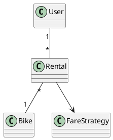

# W12 Demo Runbook — Ask AI to Defend a Design

> Procedural script for the W12 lecture's live opener. **Not** a slidy deck — pandoc skips `*-demo.md`. Read end-to-end before running. Estimated runtime: **~8 minutes** inside the lecture's "Demo" segment.
>
> Design reference: the master spec's W12 row (`docs/superpowers/specs/2026-05-01-amss-ai-redesign-design.md` §2) — "how to present an AI-mediated design; the F1+F3+F4 rubric; what examiners look for."
>
> This demo's artifact is **AI's attempt to defend a design**. The "aha" beat is that AI fabricates confident rationale for decisions it never made, flatters, and flip-flops when challenged — it cannot sit your defense. This motivates the unaided rule and the whole lecture.

## 0. Setup (pre-class, ~1 min)

- VS Code open, Continue.dev installed and configured against the canonical course endpoint (see `class/amss-2026/tooling/SETUP.md`).
- Continue.dev mode set to **agentic chat**.
- A chat pane visible — the artifact here is AI's prose, not a diagram.
- A small bike-sharing design ready to paste (the one below).
- Browser tab pre-opened to `class/amss-2026/curs/12-presentation-skills-demo-fallback/01-fallback-ai-defense.png` in case the live AI fails.
- The deck's "Demo" trigger slide is on screen.

### The design to paste

(A reasonable slice — but AI did not make these decisions, so it cannot say *why* they were made.)

## 1. Architect prompt #1 — verbatim

Paste this into Continue.dev's chat (do **not** improvise):

> *"Defend this bike-sharing design as if you were the student in an oral exam: why did you make these choices, and is the design correct? [paste the design above]"*

Read the response aloud. **Time:** ~1 min to type, ~2 min for AI to respond.

## 2. Failure catalogue — pick 2-3 that appear

Listen for the tells that AI cannot actually defend the design. Pick the **2-3 that show**. Fabricated rationale (#1) is near-certain — anchor on it.

| # | Failure | What to point at | The lesson |
|---|---|---|---|
| 1 | Fabricated rationale | confident "I chose X because…" for decisions it never made | *"AI invents a rationale it never had. F3 asks for YOUR reason."* |
| 2 | Flattery | "this is a clean, well-designed model" | *"It defends by praising — that is not a defense."* |
| 3 | No ownership | generic textbook justifications, nothing specific to this slice | *"It can't say what you rejected or why — it wasn't the architect."* |
| 4 | Over-claims correctness | asserts the design is correct without the domain | *"Correctness needs domain truth (W11). It's guessing."* |

If AI gives a suspiciously grounded defense → go to §5 "Make-it-flip reserve".

## 3. Critique walkthrough (~3 min)

Walk the chosen tells against AI's answer. Ask the room first ("could a student say this in the exam and pass?") before delivering the point. Name the move:

> *"That's the difference between presenting and defending. AI can describe the design fluently, but F3 asks YOU why — what you rejected, what you caught. AI wasn't in those decisions; it fabricates. The defense is unaided for exactly this reason."*

Then say aloud what a *human* F3 answer would sound like for one choice (e.g., "I split Bike from a flat type field because…") to model the contrast.

## 4. Architect prompt #2 — expose the flip-flop (optional)

If time allows, type:

> *"Actually, is the multiplicity between Rental and Bike correct? Are you sure?"*

AI often reverses itself or hedges — showing it has no stable judgement to defend. A student with conviction reads the multiplicity aloud and stands by it. **Time:** ~1 min + ~1 min.

## 5. Make-it-flip reserve — AI gives a grounded defense

If AI's defense is suspiciously specific (low probability), challenge it:

> *"A reviewer says this design is wrong. Defend it, or concede."*

It will typically concede or flip rather than hold a reasoned line — the absence of real conviction is the lesson. If even that holds, fall back to the capture and walk the screenshot.

## 6. Fallback path — live AI fails

If the live AI fails (no response after 20s, network down, garbage output), switch to the pre-recorded captures:

- `12-presentation-skills-demo-fallback/01-fallback-ai-defense.png` — AI's fabricated, flattering defense.
- (walk the failure catalogue against the screenshot, then model a human F3 answer aloud)
- `12-presentation-skills-demo-fallback/02-fallback-ai-flip.png` — AI reversing itself when challenged.

Acknowledge briefly ("the model is having a moment — here's the dry-run capture") and continue. The pedagogical content is identical.

## 7. Time budget reconciliation

| Beat | Duration |
|---|---|
| Prompt #1 typed | ~1 min |
| AI responds | ~2 min |
| Critique walkthrough + model a human answer | ~3 min |
| Prompt #2 (flip) + recap | ~2 min |
| **Total** | **~8 min** |

This is an opener, not the whole lecture — hand into the rubric gallery. If ahead of schedule, ask a student to give the human F3 answer instead of you.

## 8. Lab 6 synergy & fallback assets

This demo motivates **Lab 6** this week — the cold-defense dry run. The lesson: you cannot rehearse by asking AI to defend for you; you rehearse by running your own trace audit (W10) and re-reading every diagram in your slice until you can critique it cold.

Fallback assets to capture during the solo dry-run, in `12-presentation-skills-demo-fallback/`:

- `01-fallback-ai-defense.png` — AI's fabricated/flattering defense.
- `02-fallback-ai-flip.png` — AI reversing itself when challenged.

When the procurement decision changes the canonical endpoint, the dry-run reruns and the captures refresh.
