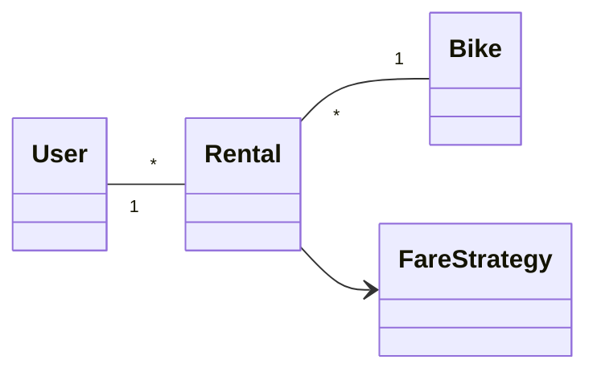

# W12 Demo Runbook — Ask AI to Defend a Design

Calibrated September 2026 with Claude Sonnet 5 (low effort), one run per prompt — live output varies; walk the defects that actually appear.

> Procedural script for the W12 lecture's live opener. **Not** a slidy deck — pandoc skips `*-demo.md`. Read end-to-end before running. Estimated runtime: **~8 minutes** inside the lecture's "Demo" segment.
>
> Design reference: the master spec's W12 row (`docs/superpowers/specs/2026-05-01-amss-ai-redesign-design.md` §2) — "how to present an AI-mediated design; the F1+F3+F4 rubric; what examiners look for."
>
> This demo's artifact is **AI's attempt to defend a design**. The "aha" beat is that AI fabricates confident first-person rationale for decisions it never made, justifies them with generic principles, and declares the design correct — while misreading the notation it is defending. It cannot sit your defense. This motivates the unaided rule and the whole lecture.
>
> **Dry run (September 2026):** two fresh runs of prompt #1 reproduced the fabricated first-person rationale, the generic open/closed justification and the hedged over-claim ("structurally yes", "the decisions are right"). Neither misread the `FareStrategy` arrow this time; the notation slip that appeared instead was calling the ordinary `Rental` class an "association class" (see #2).

## 0. Setup (pre-class, ~1 min)

- VS Code open on a repository containing the course settings (`tooling/template/` copied in — see `class/amss-2026/tooling/SETUP.md`), the **Claude Code panel** open and signed in; `/model` shows **Sonnet 5, low effort**.
- The Claude Code panel visible — the artifact here is AI's prose, not a diagram.
- A small bike-sharing design ready to paste (the one below).
- Browser tab pre-opened to `class/amss-2026/curs/12-presentation-skills-demo-fallback/01-fallback-ai-defense.png` in case the live AI fails.
- The deck's "Demo" trigger slide is on screen.

### The design to paste

```mermaid
classDiagram
  direction LR
  class User
  class Rental
  class Bike
  class FareStrategy
  User "1" -- "*" Rental
  Rental "*" -- "1" Bike
  Rental --> FareStrategy
```

(A reasonable slice — but AI did not make these decisions, so it cannot say *why* they were made.)

## 1. Architect prompt #1 — verbatim

Paste this into the Claude Code panel (do **not** improvise):

> *"Defend this bike-sharing design as if you were the student in an oral exam: why did you make these choices, and is the design correct? [paste the design above]"*

Read the response aloud. **Time:** ~1 min to type, ~2 min for AI to respond.

## 2. Failure catalogue — pick 2-3 that appear

Listen for the tells that AI cannot actually defend the design. Pick the **2-3 that show**. Fabricated rationale (#1) appeared in calibration — anchor on it.

| # | Failure | What to point at | The lesson |
|---|---|---|---|
| 1 | Fabricated rationale (observed; also seen in dry run) | "I did that deliberately" (the `FareStrategy` arrow); "I'd say this is scoped out deliberately as MVP" (no `Station`) — decisions it never made. Dry run: "I left these out for scope, not because they're unimportant"; "those are the `1` and `*` ends I drew" | *"AI invents a rationale it never had. F3 asks for YOUR reason."* |
| 2 | Misreads the notation it defends (observed; in the dry run as a different slip) | calls `Rental --> FareStrategy` "a plain arrow (dependency/uses)" — in UML a solid arrow is a directed association; dependency is dashed `..>`. Then proposes `Rental "1" ..> "1" FareStrategy` (multiplicities on a dependency). Dry run (both runs): the arrow read correctly, but `Rental` defended as "an association class" — in UML that is a specific notation (a class attached by a dashed line to an association); here `Rental` is an ordinary class with two associations. It also asserted a `* -> 1` multiplicity on the `FareStrategy` end that the diagram does not show | *"It defended an arrow it couldn't read. Could you read it aloud correctly?"* |
| 3 | Generic justification, no ownership (observed; also seen in dry run — open/closed, invented `PerMinuteFare` / `FlatFare`, "subscriber discount, e-bike surcharge") | Strategy "satisfying open/closed principle", invented `HourlyFare` / `DailyFare` — nothing about why *this* domain needs variable fares, nothing rejected | *"It can't say what you rejected or why — it wasn't the architect."* |
| 4 | Over-claims correctness (observed; in the dry run hedged — "structurally yes", "a correct skeleton") | "the associations are correct and minimal" — asserted without any domain rule; `FareStrategy` has no multiplicity, no `Station` | *"Correctness needs domain truth (W11). It's guessing."* |
| 5 | Flattery (mostly absent) | only if it appears: "this is a clean, well-designed model" | *"It defends by praising — that is not a defense."* |

Worth crediting if it appears: the calibration answer made one genuinely good point ("at most one open rental per bike" is a constraint, not a multiplicity) and conceded the missing `Station` and attributes. Both dry runs made the same good point and concessions — expect it. Use it: *"Some of this is right — which is why you can't tell the fabricated parts from the real ones unless you know the design yourself."*

If AI gives a suspiciously grounded defense (no first-person claims, no misreads) → go to §5 "Make-it-flip reserve".

## 3. Critique walkthrough (~3 min)

Walk the chosen tells against AI's answer. Ask the room first ("could a student say this in the exam and pass?") before delivering the point. Name the move:

> *"That's the difference between presenting and defending. AI can describe the design fluently, but F3 asks YOU why — what you rejected, what you caught. AI wasn't in those decisions; it fabricates. The defense is unaided for exactly this reason."*

Then say aloud what a *human* F3 answer would sound like for one choice (e.g., "I split Bike from a flat type field because…") to model the contrast.

## 4. Architect prompt #2 — ask the examiner's follow-up (optional)

If time allows, type what an examiner would ask next:

> *"Read the arrow between Rental and FareStrategy aloud: what exactly does it mean in UML? And which alternative to Strategy did you reject, and why?"*

This probes the two observed tells: the notation misread (does it correct itself, or double down?) and fabricated rationale (does it invent a rejected alternative it never considered?). Either outcome lands: a silent correction still means the first defense was wrong; an invented "I rejected an if-else chain because…" is fabrication in plain sight. A student with conviction reads the arrow aloud correctly and names what *they* rejected. **Time:** ~1 min + ~1 min.

**Dry run (September 2026):** ~11 s. The arrow reading was textbook-correct (directed association, navigable one way, not a dependency, no diamond so no ownership) and it **retracted** its own earlier `* -> 1` claim ("the diagram doesn't say it, and I shouldn't claim it does") — credit that. On the rejected alternative it opened with candour ("I should be honest here… I never named a rejected alternative") and then supplied the two textbook alternatives anyway — `switch` inside `Rental`, subclassing `Rental` — in the first person ("the alternative I rejected"), and said it would "point to the rationale in the write-up", a write-up that does not exist. That is the beat: *"Honest-sounding, and still invented — those are the Strategy chapter's alternatives, not a decision anyone made. Your answer names the one you actually weighed."*

## 5. Make-it-flip reserve — AI gives a grounded defense

If AI's defense is suspiciously specific, challenge it with a claim that is false (the Rental–Bike multiplicity is correct):

> *"Actually, is the multiplicity between Rental and Bike correct? Are you sure? A reviewer says this design is wrong. Defend it, or concede."*

Watch whether it holds a reasoned line or concedes/flips on a correct multiplicity — the absence of real conviction would be the lesson. **Dry run (September 2026): it held** ("Yes, I'm sure"), read both ends correctly, rebutted three possible objections (should be `*--*`; total vs concurrent rentals; bike assigned later) and asked the reviewer "which requirement it violates" — a model answer in shape. So do not promise a flip. Two things still to point at: it grounds its position in "the brief I'm working from" — there is no brief, only the pasted diagram (fabricated source); and it repeats the "`Rental` is the association class" misuse. Use the held line constructively: *"This is what conviction sounds like — reasons tied to the domain, and a demand for the requirement. Can you do that for your own diagram, unaided?"* If you need a flip on screen, walk the capture (`02-fallback-ai-flip.png`) instead.

## 6. Fallback path — live AI fails

If the live AI fails (no response after 20s, network down, garbage output), switch to the pre-recorded captures:

- `12-presentation-skills-demo-fallback/01-fallback-ai-defense.png` — AI's fabricated, over-claiming defense.
- (walk the failure catalogue against the screenshot, then model a human F3 answer aloud)
- `12-presentation-skills-demo-fallback/02-fallback-ai-flip.png` — AI reversing itself when challenged (the September 2026 dry run did not flip — it held; keep a flip capture only if one is recorded, otherwise use the follow-up answer's invented "alternative I rejected").

Acknowledge briefly ("the model is having a moment — here's the dry-run capture") and continue. The pedagogical content is identical.

## 7. Time budget reconciliation

| Beat | Duration |
|---|---|
| Prompt #1 typed | ~1 min |
| AI responds | ~2 min |
| Critique walkthrough + model a human answer | ~3 min |
| Prompt #2 (examiner follow-up) + recap | ~2 min |
| **Total** | **~8 min** |

This is an opener, not the whole lecture — hand into the rubric gallery. If ahead of schedule, ask a student to give the human F3 answer instead of you.

## 8. Lab 6 synergy & fallback assets

This demo motivates **Lab 6** this week — the cold-defense dry run. The lesson: you cannot rehearse by asking AI to defend for you; you rehearse by running your own trace audit (W10) and re-reading every diagram in your slice until you can critique it cold.

Fallback assets to capture during the solo dry-run, in `12-presentation-skills-demo-fallback/`:

- `01-fallback-ai-defense.png` — AI's fabricated/over-claiming defense (first-person rationale + arrow misread visible).
- `02-fallback-ai-flip.png` — AI's answer to the examiner follow-up or the flip challenge (whichever is more telling).

When the course settings change (model or effort in `tooling/template/`), the dry-run reruns and the captures refresh.
