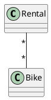
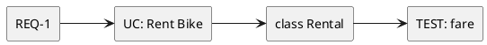

# Today's Agenda

1. Frame: the defense is the integrity check
2. Presenting an AI-mediated design
3. Live opener: ask AI to defend a design cold
4. The rubric explained: Critique, Rationale, Traceability — strong vs weak
5. What examiners look for; red flags
6. The dry run: Lab 6 this week

::: notes
You have built, critiqued, and evaluated. Today is performing it under examination: how to present an AI-mediated design and how to defend it cold against the Critique, Rationale, Traceability rubric. The payload is the rubric itself, taught through strong-vs-weak answer pairs. Open into why the defense matters.
:::

---

# Recap: Architect and Critic

- **Architect / director:** drive AI through the software development lifecycle (SDLC).
- **Critic / reviewer:** read AI's output and name what's wrong or missing.

For twelve weeks you played both roles. Today: how to **present and defend** the trail you built.

::: notes
One breath of recap. The architect-and-critic work is done; the defense is where you prove it was yours. The whole course was building toward a performance you give unaided.
:::

---

# The Defense Is the Integrity Check

- **3 of 8 project points.** Cold, unaided, no AI in the room.
- It's where the trail you built pays off — or where its absence shows.

Today's question: **can you read, justify, and trace your design without AI's help?**

::: notes
The bridge. The defense is deliberately the integrity check (spec §4): it tests the two things AI can't fake for you — that you can read/critique cold and that you own the decisions. A polished repo with no defensible owner fails here.
:::

---

# The Literacy Floor: Critique, Rationale, Traceability

From Week 1, and now the explicit subject:

- **Critique** — read & critique any AI-generated artifact on the spot.
- **Rationale** — articulate why you directed AI a certain way; what you accepted or rejected.
- **Traceability** — defend the trace: navigate your project end to end.

Today we make each one concrete — what a passing answer sounds like, and what fails.

::: notes
First of two Critique, Rationale, Traceability mentions. Every prior week trained a piece; today the rubric is the lecture. Each skill gets a strong-vs-weak pair so students hear the difference. Same wording in the close.
:::

---

# Present the Trail, Not the Artifacts

Your value was **direction and correction** — so present that, not just the final diagram.

- Show a prompt that **failed**, and how you fixed it.
- Show an output you **rejected**, and why.
- Show a defect you **caught**, and the correction.

The narrative is the star; the polished diagram is just its result.

::: notes
The core presentation principle. A student who shows only a clean final diagram has hidden exactly what is graded. The rejected output and the caught defect are the evidence of architect-and-critic work — lead with them.
:::

---

# Structure of a Good Slice Presentation

A repeatable 5-minute shape:

1. The **requirement** your slice realises.
2. How you **directed** AI to model it.
3. What AI **produced** — and what you **caught**.
4. The **correction** you made and why.
5. The **trace**: requirement to test.

::: notes
The shape mirrors the trail itself. It keeps the student on the graded material (direction, critique, traceability) and off the ungraded material (does the code run). Rehearse this shape until it's automatic.
:::

---

# Demo: Ask AI to Defend a Design

> Live: paste a design and ask AI to defend it as if in the oral exam. Watch it invent a rationale it never had — and flatter.

**Prompt to AI:** *"Defend this bike-sharing design as if in an oral exam: why these choices, and is it correct? [paste a design]"*

::: notes
Switch to Continue.dev. Run the runbook at `class/amss-2026/curs/12-presentation-skills-demo.md` for ~8 min. The point: AI fabricates confident rationale for decisions it didn't make, flatters, and flip-flops when challenged — it cannot defend YOUR design. This is why the defense is unaided. Fallback: runbook §6.
:::

---

# Critique — Read & Critique Cold

The examiner shows you **any** AI-generated diagram — possibly from another team's repo — and asks: *"What's wrong with this?"*

You must find the defect on the spot, with no preparation.

::: notes
Critique is the cold-read skill. The examiner can pull any diagram — your own or a stranger's — so memorising your slice is not enough; the skill is general. The example is the wrong-multiplicity from Week 4. Next slide: what a passing answer sounds like.
:::

---

# Your Turn: Cold Read

What's wrong with this diagram? Read the multiplicity aloud — discuss with your neighbour for 60 seconds — before we compare strong vs weak.

::: notes
Turn the cold-read into interaction before the reveal. Give them 60 seconds on the `Rental "*" -- "*" Bike` diagram from the previous slide. Most pairs will land on the many-to-many being wrong; some will only say "looks fine," which is itself the weak answer. Take one or two read-alouds, then advance to the strong-vs-weak pair so they hear their own answer graded.
:::

---

# Critique: Strong vs Weak

- **Weak:** *"It looks fine to me."* / *"The AI made it, so it should be okay."*
- **Strong:** *"Read the multiplicity aloud — many-to-many. A rental is one bike. That's wrong; it should be `Rental * -- 1 Bike`."*

The strong answer **names the defect, reads it aloud, gives the fix.**

::: notes
The contrast pair for Critique. The weak answer defers (to appearances, to AI); the strong one applies the read-order out loud. Examiners listen for the read-aloud move — it proves the skill is real, not memorised.
:::

---

# Rationale — Articulate Rationale

The examiner asks: *"Why did you direct AI this way? What did you reject?"*

This is where students who let AI drive everything fall silent — they have no rationale because they made no decisions.

::: notes
Rationale is the ownership check. It cannot be answered by someone who only accepted AI output. The architect-half of the trail (the directed-design narrative) is exactly the preparation for this question.
:::

---

# Rationale: Strong vs Weak

- **Weak:** *"The AI suggested it."* / *"That's how the tutorial did it."*
- **Strong:** *"I named the domain rule 'a rental is one bike' because the many-to-many hid that you borrow a specific bike. I rejected the `BikeShareSystem` god class because responsibilities belonged on `Rental` and `Station`."*

The strong answer ties each choice to a **reason**, not an authority.

::: notes
The contrast pair for Rationale. "The AI suggested it" is the signature failing answer — it cites authority, not reason. The strong answer names the problem and the judgement. This is the directed-design narrative spoken aloud.
:::

---

# Traceability — Defend Traceability

The examiner asks: *"Show me the test for this requirement"* or *"Which requirement needs this class?"*

You must walk the chain, either direction, on demand.

::: notes
Traceability is the trace walk from Week 10. The examiner picks a node and asks you to walk to another. The audit order (forward / backward / agreement / staleness) is the preparation. A student who ran their own trace audit answers instantly.
:::

---

# Traceability: Strong vs Weak

- **Weak:** *"I think there's a test somewhere…"* — can't connect the layers.
- **Strong:** *"REQ-1 (per-minute fare) is realised by the Rent Bike use case, the `Rental` class with a `FareStrategy`, and verified by the 60-minute fare test. I found and fixed a stale link where the test still checked a flat fare."*

The strong answer **walks the chain and names a link they repaired.**

::: notes
The contrast pair for Traceability. Naming a broken link you found and fixed is the strongest possible answer — it proves you maintained the trace, not just drew it. The weak answer reveals the trace lives only in scattered files, not in the student's head.
:::

---

# What Examiners Look For

- **Ownership** — you drove the design; you can say why.
- **Judgment** — you can read a diagram and defend your choices.
- **Honesty** — you can name what's *still* weak in your slice.

Not polish. Not "it works." Not how many patterns you used.

::: notes
The positive rubric. Examiners reward the architect-and-critic competence, not production values. Honesty about remaining weaknesses is a strength signal — it shows a working critical filter. A candid "this part is still thin because…" beats a glossy overclaim.
:::

---

# Red Flags That Fail a Defense

- *"The AI said it was good."* — you delegated judgement (see Week 11).
- Can't read your **own** diagram.
- Can't trace a requirement to its test.
- Every answer is *"AI did it"* with no rationale.

::: notes
The failing signals. Delegating evaluation to AI is the instant-fail from Week 11 — the defense is unaided precisely to catch it. Not being able to read your own artifact, or trace your own project, means the work wasn't really yours. Name these so students self-check.
:::

---

# The Dry Run: Lab 6 This Week

Lab 6 is your **cold-defense dry run**:

- The instructor picks students **at random** and asks Critique / Rationale / Traceability questions.
- Informal — but every gap surfaced must be fixed before Week 14.

Treat it as the real thing.

::: notes
The dry-run mechanics (spec §3, Lab 6). Random selection mirrors the real defense — you cannot predict the question, so the skill must be general. The gaps it surfaces are a gift: a free rehearsal before the graded Week 14 defense.
:::

---

# How to Prepare

- Run your own **trace audit** (Week 10) — fix broken links before someone finds them.
- **Re-read every AI diagram** in your slice — could you critique it cold?
- Rehearse the **"why"** for each decision.
- Know your **defect log** cold — it's your Critique and Rationale evidence.

::: notes
Concrete prep. The preparation is not memorising answers — it is doing the audit and re-reading so the answers are available. The defect log is the single best prep artifact: it already contains caught defects (Critique) with rationale (Rationale).
:::

---

# The Loop, On Yourself

present -> get critique (peer / instructor) -> fix the gaps -> re-present.

Same architect-and-critic loop as all semester — now applied to your own defense.

::: notes
The loop, turned inward. Lab 6 is one turn of it; rehearsing with teammates is more. The critic half is now your peers and the instructor, surfacing the gaps you can't see in your own preparation.
:::

---

# The Human Defends

AI built the artifacts. Only **you** can defend them cold — read them, justify them, trace them.

That's the entire point of the unaided rule: the defense measures exactly what AI cannot do for you.

::: notes
Reinforces ownership, the Week 12 form and the course's thesis. The unaided defense is not an obstacle — it is the one place where the human's irreplaceable contribution is measured directly.
:::

---

# Next Week: Workshop + Finals

- **Week 13** — open workshop / Q&A: supervised work, final adjustments.
- **Week 14** — final presentations + per-student cold defense (with Lab 7).

Bring your slice to the workshop with its gaps already mapped.

::: notes
Clean handoff. Week 13 is buffer/workshop time to close the gaps Lab 6 surfaced; Week 14 is the graded finale. Encourage students to arrive at Week 13 knowing their weak spots, so the workshop is targeted.
:::

---

# Critique, Rationale, Traceability — The Through-Line

Today you learned to perform the rubric:

- **Critique** — read and critique cold; name the defect, read it aloud, give the fix.
- **Rationale** — tie every choice to a reason, not an authority.
- **Traceability** — walk the trace either direction, and name a link you fixed.

::: notes
Second and final Critique, Rationale, Traceability mention. The rubric is now explicit and rehearsable. The strong-answer patterns (read aloud, reason-not-authority, walk-and-name-a-fix) are what students take into Lab 6 and Week 14.
:::

---

# That's It For Today

- This week's lab (Lab 6): cold-defense dry run — treat it as real.
- Next: Week 13 workshop, then Week 14 final presentations.

Questions?

::: notes
Closer. Open the floor. No trailing slide separator after this one.
:::
