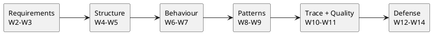

# Today: Finals + Reflection

The last session, shared with **Lab 7**:

1. A short look back at the semester.
2. **Reflection:** what AI got right and wrong.
3. **Final presentations + per-student cold defense** (Lab 7).

The defense mechanics are in the Lab 7 brief; today's lecture portion is the wrap and the reflection.

::: notes
W14 shares its slot with Lab 7. Keep the lecture portion short — a retrospective and the reflection framing — then hand the bulk of the time to the presentations and graded cold defenses run from the Lab 7 runbook.
:::

---

# The Semester in One Line

You learned to be the **architect and critic** of an AI-mediated design:

- **Architect** — drive AI through the SDLC.
- **Critic** — read its output and name what's wrong.

Every week built one piece of that.

::: notes
The one-line thesis, restated at the end. The whole course was these two roles, practised across the SDLC. This frames the recap.
:::

---

# The Arc We Walked

Each stage: drive AI, read critically, correct, trace forward.

::: notes
The SDLC journey as one flow. Requirements to defense, every stage running the same architect-critic loop. This single diagram is the course map — point out that the labs (1-7) shadowed it.
:::

---

# The Floor: F1 + F3 + F4

The literacy floor you can demonstrate **unaided**:

- **F1** — read & critique any AI artifact on the spot.
- **F3** — articulate why you directed AI a certain way.
- **F4** — defend traceability end to end.

These are what the defense grades — and what AI can't do for you.

::: notes
The literacy floor, one last time. F1+F3+F4 was the through-line of every lecture's close. Today it is the rubric of the graded defense that follows.
:::

---

# What the Course Actually Built

Not UML for its own sake. Not prompt tricks.

It built the **human evaluator** — the judgement AI is worst at: completeness, correctness, and whether the design really fits the domain (W11).

That judgement is yours, and it's the point.

::: notes
The real takeaway, callback to W11. The course's insistence on reading and critiquing was never nostalgia for diagrams — it was developing the evaluation AI provably can't be trusted with. End on the human's irreplaceable role.
:::

---

# Reflection: What AI Got Right

In your teams, name where AI **helped** most this semester:

- Where did it accelerate you?
- What did it get right that would have taken you far longer alone?

::: notes
First half of the reflection segment (spec §2 W14). Let teams speak. The honest "AI was genuinely useful here" is as important as the critique — the course is pro-AI-with-judgement, not anti-AI.
:::

---

# Reflection: What AI Got Wrong

And where it **failed** — and your critique caught it:

- A fabricated message, a wrong multiplicity, an overused pattern, a broken trace.
- One concrete example per team.
- What would you direct differently next time?

::: notes
Second half of the reflection. Concrete examples of caught defects consolidate the whole semester's critique vocabulary. The "direct differently" question turns the reflection forward. Keep it brief — the presentations need the time.
:::

---

# Now: The Defense (Lab 7)

Team presentations, back to back, then your **per-student cold defense** — graded, unaided.

Present the **trail**, not just the artifacts. Read aloud, give reasons, walk your trace. Defend the work that's yours.

::: notes
Hand-off to Lab 7. The mechanics, schedule, and barem are in the Lab 7 brief and runbook. The lecture's job is done — this slide turns the room over to the presentations and graded defenses.
:::

---

# Thank You

You drove AI through a whole system, caught what it got wrong, and can defend every choice.

That's the skill that lasts. Good luck with your defenses — and beyond.

::: notes
Course closer. Genuine and short. The architect-and-critic competence outlives any particular model or tool. No trailing slide separator after this one.
:::
