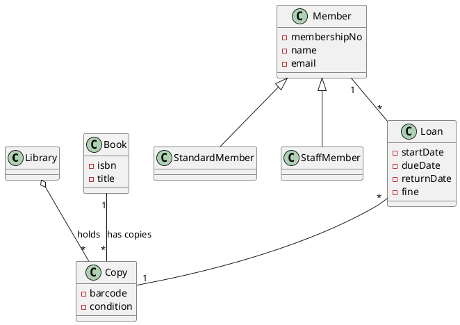

# Lab 2 Instructor Runbook — Class Diagrams from Spec

> Instructor-facing companion to `Lab02.md`. **Not** a slidy deck — the lab Makefile filters `*-instructor.md` out of the published tree. Read end-to-end before the session.
>
> Spec: `docs/superpowers/specs/2026-06-01-amss-2026-lab2-design.md`.

## Pre-class checklist

- [ ] Seed `lab02/README.md` (brief + 1-page spec) into the course lab repo (template at the end of this file).
- [ ] Assign student-ids (`s01`…`sNN`) and fill the roster table below.
- [ ] Verify the model endpoints are live; stage Gemini free-tier keys as fallback.
- [ ] Confirm every student has push access to the lab repo (most still have the Lab 1 clone).

## The authored 1-page spec (honest input artifact)

This is the canonical text — it goes into `lab02/README.md` and is on the brief's "The Domain" slide. It is **honest**: no planted contradictions. Each fact is phrased to surface a specific defect; the authoring notes say which.

| Spec fact | Defect it surfaces (W4 name) |
|---|---|
| A *title* (book) vs *several physical copies*, each with its own barcode | **wrong multiplicity** — AI collapses Book/Copy and writes `Member "*" -- "*" Book` |
| The library *owns / holds* copies; a copy stays in the catalogue when nobody borrowed it | **missing aggregation** — the holds-relationship outlives loans |
| A loan is *exactly one copy to one member* | **wrong multiplicity** — AI's M:N loan trap |
| Members are *standard* or *staff* with different limits | is-a flattened to a `type: String` attribute (should be generalization) |
| (no infrastructure mentioned) | **invented class** / **god class** — AI adds `DatabaseManager`, a `LibrarySystem` god class |

## Reference "good" diagram (instructor-only — do NOT show during the drill)

The approximate right answer, for fast adjudication. Reveal at the close if useful.



Key correct decisions: Book and Copy are distinct; `Loan` reifies the borrow (one member, one copy); `Library o-- Copy` is aggregation; member kinds are subclasses. A student diagram need not match exactly — judge whether the critique log *caught the right things*, not whether the diagram is identical.

## Phase 1 — Brief facilitation (10 min)

1. Hand out student-ids + lab-repo URL; point students at `lab02/README.md` (it has the spec).
2. Read the spec aloud once; stress it is honest — defects come from the AI.
3. Put the 4-step read-order and the five defect names back on screen.
4. Confirm each student can create `lab02/<student-id>` and push. Endpoint regressed → Gemini fallback now.

**Exit gate:** every student has read the spec, has the rubric visible, and can push.

## Phase 2 — Drill floor-walking (70 min)

What healthy looks like at ~20 min: Round 1 diagram generated and rendered, at least 2 defects logged with severity, re-prompt #1 composed.

Nudges for stuck students:

- "Can two people borrow the same book at once? Then what, exactly, is a *copy*?" (drives the title-vs-copy split)
- "Read that multiplicity aloud — can one loan really involve many copies?"
- "Does that line between Member and Library name a verb? If not, why is it there?"
- "Is `DatabaseManager` a library concept, or implementation the AI invented?"

Watch the clock: if a student is behind at ~55 min, tell them one solid re-prompt + a log naming two defects is the floor — but note the relaxation in the share-out.

## Phase 3 — Share-out facilitation (20 min)

1. **During the drill:** scan pushed logs; pre-select 3-4 students covering *different* defects (variety). Leave one volunteer slot. Flag anyone who caught title-vs-copy.
2. **0-3 min:** frame — same spec, same domain, ~100 students.
3. **3-14 min:** selected students present (~3 min each): the defect that mattered most + the move that fixed it.
4. **14-18 min:** live tally — hands up per defect: *"Whose AI wrote a wrong multiplicity? A fake association? Flattened a whole-part? Invented infrastructure? Built a god class?"* Tally on the board.
5. **18-20 min:** close — the defects you tallied are what you critique every week and in the oral defense; a wrong structure propagates downstream. Bridge to W5 + Lab 3.

## Grading guide

Apply per pushed branch. **Pass requires both:**

1. `diagram.puml` (renders) and `critique-log.md` committed by deadline.
2. Log names at least 2 distinct W4 defects (wrong multiplicity, fake association, missing aggregation, invented class, god class) **and** gives a real re-prompt rationale (F3) for at least one iteration.

**Redo (not fail):** vacuous log — no named defect, or no rationale.

**Worked PASS example (library kiosk):**

> **Round 1.** Defects: wrong multiplicity (`Member "*" -- "*" Book`, high) — there is no Copy at all; fake association (`Member -- Library`, low) — no verb.
> **Re-prompt 1 + why:** I told it "a Book is a title, a Copy is a physical item; a loan is one copy to one member" because the M:N hid that you borrow a *copy*, not a title. → It added `Copy` and a `Loan` class with the right multiplicities.
> **Re-prompt 2 + why:** I told it to drop `DatabaseManager` and model standard/staff as subclasses, because infrastructure is not domain and the `type` field hid the is-a. → Subclasses appeared; god class gone.
> **Residual risk:** it still drew `Library -- Copy` as a plain line, never the holds-aggregation.

**Worked REDO example:**

> The AI drew a class diagram. Some things were wrong so I asked again and it got better. The second one looked good. The library diagram is done.

(No named defect, no rationale → redo. Hand it back with: "name two defects from the W4 catalogue, and say *why* you chose each re-prompt.")

## Student-id ↔ roster

Fill per offering.

| student-id | student |
|---|---|
| s01 | |
| s02 | |
| … | |

## Paste-ready `lab02/README.md` (seed into the course lab repo before class)

~~~markdown
# Lab 2 — Class Diagrams from Spec

**Domain:** a library kiosk (same spec for everyone). This spec is honest — the defects come from the AI.

## The spec

A neighbourhood library runs a self-service kiosk.

- The library owns a catalogue of **titles**. A *title* (book) has an ISBN, a title, and one or more authors.
- A popular title may have several physical **copies**. A *copy* has its own barcode and a condition. A copy belongs to the library and stays in the catalogue even when nobody has borrowed it.
- A **member** has a membership number, a name, and an email. Members are **standard** (up to 3 open loans) or **staff** (up to 10).
- To borrow, a member scans a **copy**. That opens a **loan**: one member, one copy, a start date, a due date (14 days on). A copy on loan cannot be borrowed by anyone else until returned.
- A member may have many loans over time, several open at once (up to their limit). A loan always refers to exactly one copy and one member.
- On return, the member scans the copy; the loan closes with a return date, and records a fine if late.
- The kiosk shows a member their open loans and any fines owed.

**Starting prompt (Round 1):**
> "Generate a UML class diagram (as PlantUML) for this library system. [paste the spec above]"

**Structure:** bare prompt → critique with the W4 4-step read-order → re-prompt twice (name the domain rules; then drop invented infrastructure / god class). Keep your best diagram.

**Deliverable**, on branch `lab02/<your-student-id>`:
- `lab02/<student-id>/diagram.puml` — your best AI-driven class diagram (must render).
- `lab02/<student-id>/critique-log.md` — 1 page max. One block per iteration: defects found (W4 name, where, severity); the re-prompt move and why; what changed. Close with one residual risk.
- `lab02/<student-id>/transcript.md` — optional: your raw prompt/output trail.

**Submit:**
```bash
git checkout -b lab02/<student-id>
mkdir -p lab02/<student-id>
git add lab02/<student-id>
git commit -m "Lab 2: <student-id> library kiosk class diagram + critique log"
git push -u origin lab02/<student-id>
```

**Grading:** pass/redo. Pass = both files committed + log names at least two W4 defects and explains why you re-prompted.
~~~
