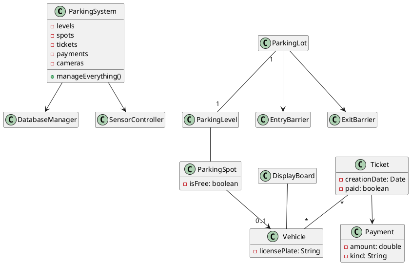
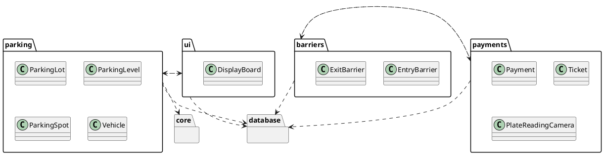
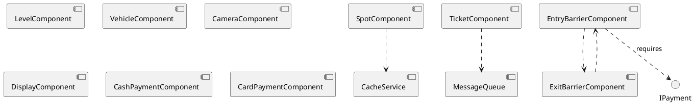
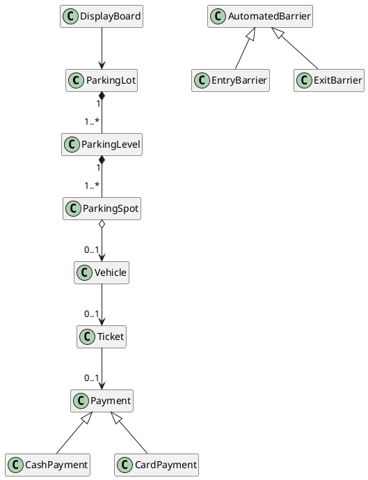

# Lab 3 Instructor Runbook — Critique Session: Structural Artifacts

> Instructor-facing companion to `Lab03.md`. **Not** a slidy deck — the lab Makefile filters `*-instructor.md` out of the published tree. Read end-to-end before the session.
>
> Design reference: the master spec's Lab 3 row (`docs/superpowers/specs/2026-05-01-amss-ai-redesign-design.md` §3). No per-lab spec file — this runbook is the working spec.
>
> **No live AI this lab.** The three artifacts are pre-built and seeded with realistic defects. The skill on trial is reading structure cold and naming defects under team/time pressure.

## Pre-class checklist

- [ ] Seed `lab03/README.md` (brief + domain + the three flawed artifacts) into the course lab repo (template at the end of this file).
- [ ] Ship the three artifacts as `.puml` files in `lab03/` so teams open them in their VS Code PlantUML preview (the same pane from W4 / Lab 2): `artifact-class.puml`, `artifact-package.puml`, `artifact-component.puml`.
- [ ] Optional fallback: pre-render each `.puml` to PNG in `lab03/` in case a team's preview pane is down.
- [ ] Assign team-ids (`t01`…`tNN`) and fill the roster table below; aim for teams of 3-4.
- [ ] Confirm every team has push access to the lab repo (most still have the Lab 1/2 clone).
- [ ] Have this runbook's **ground-truth tables** ready on your own screen (not projected) for the hunt-off.

## The honest domain spec (input artifact)

Canonical text — goes into `lab03/README.md` and the brief's "The Domain" slide. **Honest**: every defect lives in the artifacts, not here.

> An airport parking lot. Multiple **levels**; each level has many **parking spots**, each with a free/occupied sensor. Multiple **entrances** and **exits**, each with a plate-reading **camera**. The **entry barrier** prints a **ticket**; the **exit barrier** opens only if the ticket is paid. **Payment kiosks** on each level; payment is by **cash** or **card**. **Display boards** at entrances show free spots, total and per level.

Lifted from the 2025 parking-lot exercise (`../amss/lab/Lab03.md`) — a domain with a well-understood right answer, which is what lets us plant defects fairly.

## Artifact 1 — Flawed CLASS diagram (hand to students)



### Ground truth — class diagram (14 pts)

| # | Defect (catalogue name) | Where | Severity | Why |
|---|---|---|---|---|
| C1 | god class | `ParkingSystem` (holds everything + `manageEverything()`) | **high (3)** | one class owns the whole domain; nothing else has responsibility |
| C2 | wrong multiplicity | `ParkingLot "1" -- "1" ParkingLevel` | **high (3)** | a lot has many levels — should be `1 -- 1..*` |
| C3 | invented infrastructure | `DatabaseManager`, `SensorController` | med (2) | implementation, not domain — spec never asked for them (naming either or both = this one defect) |
| C4 | is-a flattened to attribute | `Payment.kind: String` | med (2) | cash/card should be subclasses (generalization), not a string field |
| C5 | missing composition | `ParkingLevel -- ParkingSpot` (plain line) | med (2) | spots are part of the level — should be composition |
| C6 | wrong multiplicity | `Ticket "*" -- "*" Vehicle` | low (1) | a ticket belongs to one vehicle/session — not many-to-many |
| C7 | fake / decorative association | `DisplayBoard -- Vehicle` | low (1) | no verb; a display board does not relate to a vehicle |

## Artifact 2 — Flawed PACKAGE diagram (hand to students)



### Ground truth — package diagram (11 pts)

| # | Defect (catalogue name) | Where | Severity | Why |
|---|---|---|---|---|
| P1 | dependency cycle | `payments ..> barriers` and `barriers ..> payments` | **high (3)** | neither package builds, tests, or reasons in isolation |
| P2 | wrong dependency direction | `parking ..> ui` | **high (3)** | inverted layering — the domain must not depend on the UI |
| P3 | invented infrastructure | `database` package (everything depends on it) | med (2) | spec mentions no database; an assumed implementation layer |
| P4 | mis-grouped class | `PlateReadingCamera` in `payments` | med (2) | the camera belongs with barriers/entry, not payments — broken cohesion |
| P5 | vague catch-all package | empty `core` package | low (1) | a "core" with no contents and one dependency names nothing real |

## Artifact 3 — Flawed COMPONENT diagram (hand to students)



### Ground truth — component diagram (11 pts)

| # | Defect (catalogue name) | Where | Severity | Why |
|---|---|---|---|---|
| K1 | over-decomposition | a component per class (`SpotComponent`, `LevelComponent`, `VehicleComponent`, `TicketComponent`, `Cash/CardPaymentComponent`, …) | **high (3)** | a component per class is ceremony, not architecture — no real boundaries |
| K2 | components with no interfaces | nearly every box (no provided/required) | **high (3)** | a component is defined by its interfaces; these are renamed classes |
| K3 | invented infrastructure | `CacheService`, `MessageQueue` | med (2) | implementation the spec never asked for |
| K4 | required interface with no provider | `EntryBarrierComponent ..> IPayment` — nothing provides `IPayment` | med (2) | a dangling requirement; the system can't satisfy it |
| K5 | dependency cycle | `EntryBarrierComponent ..> ExitBarrierComponent ..> EntryBarrierComponent` | low (1) | the two barriers are mutually dependent — collapse or invert |

**Total possible: 36 points** (class 14 + package 11 + component 11), 17 defects.

## Reference "good" artifacts (instructor-only — for fast adjudication)

Approximate right answers. A team need not have reconstructed these; judge whether they *caught the right defects*.



- **Good package:** `ui ..> parking`, `barriers ..> parking`, `payments ..> parking` — all acyclic, all toward the domain; camera in `barriers`; no `database`, no `core`.
- **Good component:** a handful — `ParkingService` (provides `ISpotStatus`), `PaymentService` (provides `IPayment`), `BarrierController` (requires `IPayment` + `ISpotStatus`), `DisplayService` (requires `ISpotStatus`). Real interfaces, right grain.

## Phase 1 — Brief facilitation (10 min)

1. Form teams of 3-4; hand out team-ids + lab-repo URL; point them at `lab03/README.md` and the three `.puml` files.
2. Read the domain aloud once; stress it is honest — defects are in the artifacts.
3. Put the combined W4+W5 read-order and the defect vocabulary on screen.
4. State the scoring rule **before** the hunt: severity-weighted, false positives cost −1. Calibrate, don't spray.

**Exit gate:** every team has the three artifacts open (preview rendering), the rubric visible, and a scribe named.

## Phase 2 — Defect-hunt floor-walking (60 min)

Healthy pace at ~20 min: first artifact swept, ~5 defects logged with severity and location.

Nudges for stuck teams (do **not** name the defect — ask the question):

- "Read that `1 -- 1` aloud — can a lot really have exactly one level?" (C2)
- "What does `ParkingSystem` actually own that the other classes don't? Is that healthy?" (C1)
- "Follow the arrows between `payments` and `barriers` — where do they end up?" (P1)
- "Should the domain package know the UI exists?" (P2)
- "Pick any component — what does it provide, what does it require? Can you say?" (K2)
- "Is one component per class buying you anything?" (K1)

Watch the clock: a team behind at ~50 min should lock in what they have and rate it — a tight 8-defect log beats a sprawling unrated one.

## Phase 3 — Defect-hunt-off facilitation (30 min)

1. **0-3 min:** frame — same artifacts, every team; reveal is artifact by artifact.
2. **3-22 min:** walk the ground truth one artifact at a time. For each planted defect: name it, point to it, give the severity. Teams self-score live:
   - true defect → its severity weight (3/2/1); severity within one band = full, off by two bands = weight − 1;
   - false positive (claim not in the table, after you adjudicate) → −1;
   - no double-counting one defect under two names.
3. **22-27 min:** each team reports its net score + nominates its **best catch** (highest-severity real defect) → +1 bonus.
4. **27-30 min:** crown the top team (ties → who caught the highest-severity defect). Close: these are the defects you critique every week and in the oral defense; flawed structure propagates. Bridge to W7 + Lab 4.

Adjudication calls you will face: a team lists C3 as two defects (DatabaseManager + SensorController) — count once. A team flags a "defect" not in the tables — decide if it's genuinely wrong (award it as a real find at your severity) or a false positive (−1). The reference good artifacts above settle most disputes fast.

## Grading guide (deliverable, team-level)

Apply per pushed team branch. **Pass requires both:**

1. `defect-log.md` committed by the deadline.
2. The log names **at least five** real defects across the three artifacts, each with a severity and a one-line reason, **including at least one high**.

**Redo (not fail):** fewer than five real defects, missing severities, or no rationales. The hunt-off score is for engagement and bragging rights — it is not the grade. A team can top the hunt and still tighten its log, or place low and pass cleanly.

**Worked PASS example (excerpt):**

> class · god class · `ParkingSystem` · high · one class owns everything.
> class · wrong multiplicity · `ParkingLot 1--1 ParkingLevel` · high · a lot has many levels.
> package · dependency cycle · payments/barriers · high · neither builds alone.
> component · no interfaces · all boxes · high · renamed classes, not components.
> component · invented infra · CacheService/MessageQueue · med · not in the spec.

**Worked REDO example:**

> The class diagram has some problems. The packages look messy. The components are too many. We think it could be better organized.

(No catalogue names, no locations, no severities → redo. Hand back: "name each defect from the W4/W5 catalogue, point to where, rate its severity, and say why in one line.")

## Team-id ↔ roster

Fill per offering.

| team-id | members |
|---|---|
| t01 | |
| t02 | |
| … | |

## Paste-ready `lab03/README.md` (seed into the course lab repo before class)

~~~markdown
# Lab 3 — Critique Session: Structural Artifacts

**Mode:** red-team, in teams of 3-4. **No AI today** — you hunt planted defects in three flawed artifacts.

**Domain (honest — defects are in the artifacts, not here):** an airport parking lot. Multiple levels; each level has many parking spots, each with a free/occupied sensor. Multiple entrances and exits, each with a plate-reading camera. The entry barrier prints a ticket; the exit barrier opens only if the ticket is paid. Payment kiosks on each level; payment is by cash or card. Display boards at entrances show free spots, total and per level.

**The three artifacts** (open each in your PlantUML preview):
- `lab03/artifact-class.puml`
- `lab03/artifact-package.puml`
- `lab03/artifact-component.puml`

**Your job:** find every planted defect; name it (W4/W5 catalogue), locate it, rate its severity (high/med/low), say why in one line.

**Scoring (hunt-off):** true defect = severity weight (high 3 / med 2 / low 1); severity must be within one band for full credit; false positive = −1; no double-counting. Calibrate — don't spray.

**Deliverable**, on branch `lab03/<team-id>`:
- `lab03/<team-id>/defect-log.md` — one table: artifact | defect (catalogue name) | where | severity | why it matters.

**Submit:**
```bash
git checkout -b lab03/<team-id>
mkdir -p lab03/<team-id>
git add lab03/<team-id>/defect-log.md
git commit -m "Lab 3: <team-id> parking-lot defect log"
git push -u origin lab03/<team-id>
```

**Grading:** pass/redo. Pass = log committed + at least five real defects across the three artifacts, each with a severity and a one-line reason, including at least one high.
~~~
