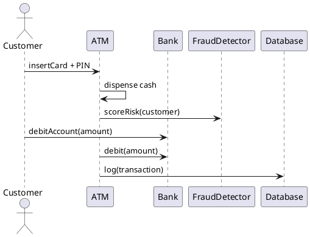
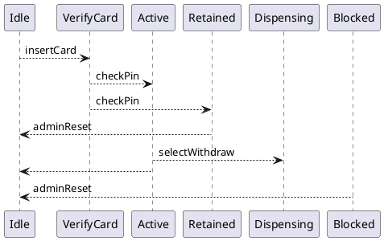
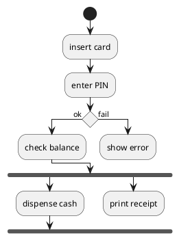
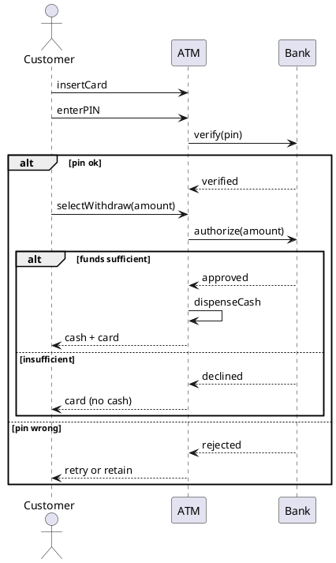
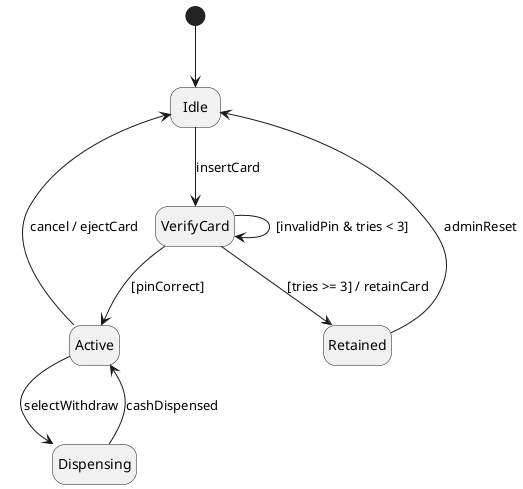
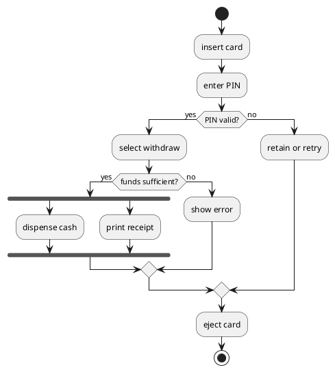

# Lab 4 Instructor Runbook — Critique Session: Behavioral Artifacts

> Instructor-facing companion to `Lab04.md`. **Not** a slidy deck — the lab Makefile filters `*-instructor.md` out of the published tree. Read end-to-end before the session.
>
> Design reference: the master spec's Lab 4 row (`docs/superpowers/specs/2026-05-01-amss-ai-redesign-design.md` §3) — "same format as Lab 3, on flawed behavioral artifacts." No per-lab spec file — this runbook is the working spec.
>
> **No live AI this lab.** Same mechanics as Lab 3; only the domain (ATM) and the artifacts (sequence, state, activity) change. The skill on trial is reading behaviour cold and naming defects under team/time pressure.

## Pre-class checklist

- [ ] Seed `lab04/README.md` (brief + domain + the three flawed artifacts) into the course lab repo (template at the end of this file).
- [ ] Ship the three artifacts as `.puml` files in `lab04/` so teams open them in their VS Code PlantUML preview: `artifact-sequence.puml`, `artifact-state.puml`, `artifact-activity.puml`.
- [ ] Optional fallback: pre-render each `.puml` to PNG in `lab04/` in case a team's preview pane is down.
- [ ] Assign team-ids (`t01`…`tNN`) and fill the roster table below; aim for teams of 3-4.
- [ ] Confirm every team has push access to the lab repo (most still have the Lab 1/2/3 clone).
- [ ] Have this runbook's **ground-truth tables** ready on your own screen (not projected) for the hunt-off.

## The honest domain spec (input artifact)

Canonical text — goes into `lab04/README.md` and the brief's "The Domain" slide. **Honest**: every defect lives in the artifacts, not here.

> An ATM. A customer inserts a card and enters a PIN; after 3 wrong PINs the card is retained. Once verified, the customer can withdraw cash: the ATM checks the balance with the bank, dispenses if funds suffice, and ejects the card. On insufficient funds or cancel, no cash is dispensed and the card is ejected. The ATM prints a receipt and returns to idle after each session (or on inactivity timeout).

Lifted from the 2025 ATM lab (`../amss/lab/Lab04.md`) — a domain with a well-understood right answer, which is what lets us plant defects fairly.

## Artifact 1 — Flawed SEQUENCE diagram (hand to students)



### Ground truth — sequence (12 pts)

| # | Defect (catalogue name) | Where | Severity | Why |
|---|---|---|---|---|
| S1 | only the happy path | no wrong-PIN / insufficient-funds branch anywhere | **high (3)** | the costly cases (declined, retained) are unmodelled |
| S2 | missing return | `ATM -> Bank : debit` — no confirmation return, yet cash already dispensed | **high (3)** | the ATM acts on an answer it never received |
| S3 | impossible order | `ATM dispense cash` happens before any authorisation/debit | med (2) | cash leaves before the bank approves — causally impossible |
| S4 | fabricated message | `ATM -> FraudDetector : scoreRisk` | med (2) | no requirement asks for fraud scoring (naming the invented FraudDetector lifeline = this defect) |
| S5 | message to a stranger | `Customer -> Bank : debitAccount` | low (1) | the customer talks to the bank directly, bypassing the ATM |
| S6 | invented lifeline | `Database` | low (1) | a logging lifeline the spec never mentions |

## Artifact 2 — Flawed STATE diagram (hand to students)



### Ground truth — state (11 pts)

| # | Defect (catalogue name) | Where | Severity | Why |
|---|---|---|---|---|
| T1 | orphan / unreachable state | `Blocked` (only an outgoing transition) | **high (3)** | nothing ever puts the card into Blocked |
| T2 | dead-end state | `Dispensing` (incoming, no outgoing) | **high (3)** | the card gets stuck — never returns to Active/Idle |
| T3 | missed guard | two `checkPin` transitions (to Active and Retained), no guards | med (2) | one event, two targets, nothing decides which fires |
| T4 | no initial pseudo-state | no `[*] --> Idle` | med (2) | where does the lifecycle begin? |
| T5 | untriggered transition | `Active --> Idle` (no event label) | low (1) | a transition with no trigger — what causes it? |

**Adjudication note:** a *missing final state* is **not** a defect here — the card lifecycle legitimately cycles back to Idle. Do not credit "no final"; do not penalise it either (it is debatable, not wrong).

## Artifact 3 — Flawed ACTIVITY diagram (hand to students)



### Ground truth — activity (10 pts)

| # | Defect (catalogue name) | Where | Severity | Why |
|---|---|---|---|---|
| A1 | fork without join | the `print receipt` branch detaches; flows never all synchronise | **high (3)** | the parallel branches never rejoin — the workflow's end is undefined |
| A2 | missing merge | the `fail` branch (`show error`) detaches, never rejoins the main flow | **high (3)** | a decision that branches must merge; this one dangles |
| A3 | no final node | no `stop` anywhere | med (2) | the workflow never formally ends |
| A4 | decision with no condition | the empty diamond (`if ()`, labelled ok/fail) | med (2) | the branch labels exist but nothing is actually being decided |

**Total possible: 33 points** (sequence 12 + state 11 + activity 10), 15 defects.

## Reference "good" artifacts (instructor-only — for fast adjudication)

Approximate right answers. A team need not have reconstructed these; judge whether they *caught the right defects*.







Key correct decisions: the sequence models both failure branches with returns; every state is reachable and escapable with guards on the branch and an initial pseudo-state; the activity's decisions merge, its fork joins, and it reaches a final.

## Phase 1 — Brief facilitation (10 min)

1. Form teams of 3-4; hand out team-ids + lab-repo URL; point them at `lab04/README.md` and the three `.puml` files.
2. Read the domain aloud once; stress it is honest — defects are in the artifacts.
3. Put the combined W6+W7 read-order and the defect vocabulary on screen.
4. State the scoring rule **before** the hunt: severity-weighted, false positives cost a point. Calibrate, don't spray.

**Exit gate:** every team has the three artifacts open (preview rendering), the rubric visible, and a scribe named.

## Phase 2 — Defect-hunt floor-walking (60 min)

Healthy pace at ~20 min: first artifact swept, ~5 defects logged with severity and location.

Nudges for stuck teams (do **not** name the defect — ask the question):

- "Trace the withdrawal — what happens if the PIN is wrong or funds are short?" (S1)
- "The ATM dispenses on line 2 — what has the bank told it by then?" (S2 / S3)
- "Who is the customer talking to here — and should they be?" (S5)
- "Can a card ever get into Blocked? Trace a path to it." (T1)
- "Once Dispensing, what's next? Is there an arrow out?" (T2)
- "Two transitions on checkPin — what decides which fires?" (T3)
- "Follow the fail branch — where does it rejoin?" (A2)
- "Do both forked branches reach the join bar?" (A1)

Watch the clock: a team behind at ~50 min should lock in what they have and rate it — a tight 8-defect log beats a sprawling unrated one.

## Phase 3 — Defect-hunt-off facilitation (30 min)

1. **0-3 min:** frame — same artifacts, every team; reveal is artifact by artifact.
2. **3-22 min:** walk the ground truth one artifact at a time. For each planted defect: name it, point to it, give the severity. Teams self-score live:
   - true defect -> its severity weight (3/2/1); severity within one band = full, off by two bands = weight − 1;
   - false positive (claim not in the table, after you adjudicate) -> minus 1;
   - no double-counting one defect under two names.
3. **22-27 min:** each team reports its net score + nominates its **best catch** (highest-severity real defect) -> +1 bonus.
4. **27-30 min:** crown the top team (ties -> who caught the highest-severity defect). Close: these are the defects you critique every week and in the oral defense; flawed behaviour propagates to tests and code. Bridge to W9 + Lab 5 (project checkpoint).

Adjudication calls you will face: a team lists S4 as two defects (fabricated message + invented FraudDetector lifeline) — count once. A team claims "no final state" on the state machine — not a defect here (see the note), neither credit nor penalise. A team flags something not in the tables — decide if it's genuinely wrong (award it) or a false positive (minus 1). The reference good artifacts settle most disputes fast.

## Grading guide (deliverable, team-level)

Apply per pushed team branch. **Pass requires both:**

1. `defect-log.md` committed by the deadline.
2. The log names **at least five** real defects across the three artifacts, each with a severity and a one-line reason, **including at least one high**.

**Redo (not fail):** fewer than five real defects, missing severities, or no rationales. The hunt-off score is for engagement, not the grade.

**Worked PASS example (excerpt):**

> sequence · only happy path · no insufficient-funds branch · high · the costly case is unmodelled.
> sequence · missing return · ATM->Bank debit · high · ATM dispenses on an answer it never got.
> state · orphan state · Blocked · high · nothing reaches it.
> state · dead-end state · Dispensing · high · no way out.
> activity · fork without join · print receipt branch · high · flows never synchronise.

**Worked REDO example:**

> The sequence diagram is missing some stuff. The state diagram has weird states. The activity diagram looks incomplete. Overall needs work.

(No catalogue names, no locations, no severities -> redo. Hand back: "name each defect from the W6/W7 catalogue, point to where, rate its severity, and say why in one line.")

## Team-id ↔ roster

Fill per offering.

| team-id | members |
|---|---|
| t01 | |
| t02 | |
| … | |

## Paste-ready `lab04/README.md` (seed into the course lab repo before class)

~~~markdown
# Lab 4 — Critique Session: Behavioral Artifacts

**Mode:** red-team, in teams of 3-4. **No AI today** — you hunt planted defects in three flawed artifacts. Same format as Lab 3.

**Domain (honest — defects are in the artifacts, not here):** an ATM. A customer inserts a card and enters a PIN; after 3 wrong PINs the card is retained. Once verified, the customer can withdraw cash: the ATM checks the balance with the bank, dispenses if funds suffice, and ejects the card. On insufficient funds or cancel, no cash is dispensed and the card is ejected. The ATM prints a receipt and returns to idle after each session (or on inactivity timeout).

**The three artifacts** (open each in your PlantUML preview):
- `lab04/artifact-sequence.puml`
- `lab04/artifact-state.puml`
- `lab04/artifact-activity.puml`

**Your job:** find every planted defect; name it (W6/W7 catalogue), locate it, rate its severity (high/med/low), say why in one line.

**Scoring (hunt-off):** true defect = severity weight (high 3 / med 2 / low 1); severity must be within one band for full credit; false positive = minus 1; no double-counting. Calibrate — don't spray.

**Deliverable**, on branch `lab04/<team-id>`:
- `lab04/<team-id>/defect-log.md` — one table: artifact | defect (catalogue name) | where | severity | why it matters.

**Submit:**
```bash
git checkout -b lab04/<team-id>
mkdir -p lab04/<team-id>
git add lab04/<team-id>/defect-log.md
git commit -m "Lab 4: <team-id> ATM defect log"
git push -u origin lab04/<team-id>
```

**Grading:** pass/redo. Pass = log committed + at least five real defects across the three artifacts, each with a severity and a one-line reason, including at least one high.
~~~
