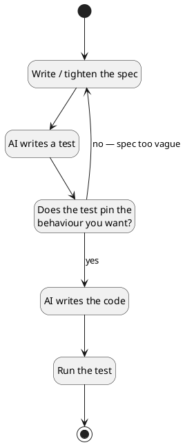

# AMSS 2026 — W3 Lecture Implementation Plan

> **For agentic workers:** REQUIRED SUB-SKILL: Use superpowers:subagent-driven-development (recommended) or superpowers:executing-plans to implement this plan task-by-task. Steps use checkbox (`- [ ]`) syntax for tracking.

**Goal:** Replace the W3 lecture stub at `class/amss-2026/curs/03-testable-specs.md` with a complete deck implementing the "testable specs & TDD-as-spec" content per spec, plus its sibling demo runbook (`03-testable-specs-demo.md`), and end-to-end build verification. The W1 Makefile filter for `*-demo.md` already covers W3's runbook; no Makefile change in this plan.

**Architecture:** One slide deck (slidy markdown, pandoc → HTML+PDF) plus one TA-readable runbook (plain markdown, not built). Both files live in `class/amss-2026/curs/`. Each segment is appended in its own task with a build check after each. The deck carries exactly one rendered diagram — the §5.6 "vague-spec loop" — authored as a plantuml block that the diagram Lua filter transcodes at build time.

**Tech Stack:** pandoc (slidy/beamer), GNU make, lualatex, plantuml. Demo artifact runtime: Python 3 + pytest. Same publishing pipeline as AMSS 2025 / W1 / W2.

**Spec reference:** `class/amss/docs/superpowers/specs/2026-05-29-amss-2026-w3-design.md`

**Branch.** Same convention as W1/W2: implement directly on `main`. The user (Traian) drives; commits are reviewable inline as they land.

**Done when:**
1. `make -C class/amss-2026/curs` produces `class/amss2026/curs/03-testable-specs.html` and `03-testable-specs.pdf` with the full deck content, including the rendered loop diagram.
2. The deck has 25-32 slides distributed across the spec §2 budget per segment (target: 28).
3. `03-testable-specs-demo.md` exists with all 10 spec-mandated sections, the verified reference `fare.py` + `test_fare.py`, and pointers to the fallback directory.
4. The W1 Makefile filter still excludes `03-testable-specs-demo.md` from the published tree (no new Makefile work; just verification).
5. Cross-references in slides resolve (every "see W*X*" or Lab/project pointer matches the parent spec §2/§3/§4 tables).
6. F1+F3+F4 appears exactly twice in the deck (frame + close), per spec verification gate 3.
7. No UML class/structural notation appears in deck slide bodies; the only diagram is the process loop, per spec verification gate 8.
8. Published artifacts (`class/amss2026/curs/03-testable-specs.{html,pdf}`) are committed to the repo.

The dry-run (verification gate §6.4 — including the **reference pytest running green**) and fallback PNG capture (gate §6.5) are post-implementation steps the instructor performs against a live model endpoint and a local Python+pytest environment. The plan ends with documented instructions for them but does not execute them (this authoring environment has neither pytest nor the plantuml/lualatex toolchain).

---

## Task 1: Author the W3 demo runbook

Write the full demo runbook per spec §4.1-§4.10. The runbook is the procedural artifact a speaker follows in W3's "Demo" segment, plus the verified reference solution the instructor confirms runs green during the dry-run. The W1 Makefile filter (`*-demo.md`) already covers it — no Makefile change in this plan, but verification confirms exclusion.

**Files:**
- Create: `class/amss-2026/curs/03-testable-specs-demo.md`

- [ ] **Step 1: Write the runbook**

Write the following content to `class/amss-2026/curs/03-testable-specs-demo.md` (verbatim — the prompts, critique questions, and reference code are spec-mandated and dry-run-verified):

`````markdown
# W3 Demo Runbook — Bike-Sharing Fare, Testable-Spec Loop

> Procedural script for the W3 lecture's live demo. **Not** a slidy deck — pandoc is configured to skip files matching `*-demo.md` (filter installed during W1). Read end-to-end before running. Estimated runtime: 12-14 minutes inside the lecture's "Demo" segment.
>
> Spec reference: `docs/superpowers/specs/2026-05-29-amss-2026-w3-design.md` §4.
>
> This demo **runs code**. The "aha" beat is *the test exposing a vague spec*, not classic red→green TDD.

## 0. Setup (pre-class, ~1 min)

- VS Code open, Continue.dev installed and configured against the canonical course endpoint (see `class/amss-2026/tooling/SETUP.md`).
- Continue.dev mode set to **agentic chat**.
- An **editor pane** showing the test file as AI writes it, and a **terminal pane visible** — students must watch pytest run; the run is the payoff.
- A scratch working directory with Python 3 and pytest installed and verified (`python3 -m pytest --version` returns a version).
- Browser tab pre-opened to `class/amss-2026/curs/03-testable-specs-demo-fallback/01-fallback-cycle1-test.png` in case the live AI fails.
- The deck's "Demo" trigger slide is on screen.

## 1. Architect prompt #1 — verbatim

Paste this into Continue.dev's chat (do **not** improvise — reproducibility outweighs naturalness):

> *"Here's a requirement from last week's bike-sharing app: 'Users are charged for renting a bike.' Write a pytest test for the fare calculation."*

The requirement is deliberately vague — no rate, no grace period, no cap. To write any concrete assertion, the AI must **invent** a pricing rule. That invention is the critique surface.

**Time:** ~0.5 min to type, ~1-2 min for AI to generate.

## 2. Critique catalogue — pick 2-3 from the menu

Read the AI-generated test aloud. The following failure modes are common; pick the **2-3 that actually appear** in the live output. Over-spec'ing this catalogue is intentional — it absorbs model variance. **#1 is near-certain given the vague prompt; anchor the walkthrough on it.**

| # | Test failure mode | What to point at | Critique question |
|---|---|---|---|
| 1 | Invented assumption | Test hard-codes a rate the spec never stated (`assert fare(60) == 6.0`) | *"Where in my spec is €0.10/min? It guessed — and a teammate's AI would guess differently."* |
| 2 | Trivially-passing test | Assertion that holds for almost any implementation (`assert fare(10) >= 0`) | *"Does this test fail for any wrong implementation? If not, it proves nothing."* |
| 3 | Tautological / circular | Expected value computed the same way the code computes it | *"If the code and the test share the same bug, the test still passes. Useless."* |
| 4 | Missing boundary | No test for 0 minutes, the grace cutoff, or a cap | *"What happens at exactly 30 minutes? The spec — and the test — are silent."* |
| 5 | Faithfully encodes a wrong spec | Test correctly encodes unbounded per-minute charging (no cap) | *"The test matches the spec exactly — and the spec is the thing that's wrong."* |
| 6 | Happy-path only | No negative-duration / invalid-input case | *"What should `fare(-5)` do? Neither the spec nor the test says."* |

If AI produces a suspiciously precise, reasonable test → jump to §7 "Make-it-fail reserve (inverted)".

## 3. Critique walkthrough (~5 min)

Walk the chosen 2-3 failures. For each, ask the room first ("does this test actually pin the price I want?") before delivering the critique. The pedagogical move gets named explicitly the first time, framed *on tests*:

> *"That's the **critic** half — reading the test AI wrote and asking 'does this pin the behaviour I want?' The answer is no, because my spec never said what the fare is. Next is the **architect** half — I tighten the spec and re-prompt."*

This is the moment students should remember from the lecture. Slow down here.

## 4. Architect prompt #2 — constructed live (tightened spec)

Type this into Continue.dev:

> *"Refine the requirement: renting is free for the first 30 minutes, then €0.10 per minute, capped at €5 per calendar day. Now write pytest tests covering: a 20-minute ride (free), a 90-minute ride, exactly 30 minutes (boundary), and a ride that hits the daily cap. Then write the `fare` function and run the tests."*

The tightened spec is *the* pedagogical pivot — the same AI now writes tests that pin the behaviour, because the requirement finally says what "charged" means. Wait for AI to produce tests + code, then run them.

**Time:** ~1 min to type, ~3-4 min for AI to generate tests + code + run pytest.

**Note for the speaker (residual ambiguity, optional aside):** the tightened spec says "capped at €5 per calendar day," but a single `fare(minutes)` function models one rental, not a day's aggregate. A 90-minute ride already reaches the cap (60 paid min × €0.10 = €6 → capped to €5). If the room is sharp, surface this: *"even my 'tightened' spec is ambiguous — is the cap per ride or per day? The test forced that question too."* This reinforces the whole lecture but is optional; skip if time is tight.

## 5. Reference solution (instructor's verified green target)

The live AI output will vary. This is the **dry-run-verified** reference the instructor confirms runs green before delivery (verification gate §6.4). Model a single rental; the cap holds that rental's charge at €5.00.

`fare.py`:

```python
def fare(minutes: int) -> float:
    """Fare in euros for a single bike rental of `minutes` minutes.

    Free for the first 30 minutes, then EUR 0.10/min, capped at EUR 5.00.
    """
    if minutes <= 30:
        return 0.0
    charge = (minutes - 30) * 0.10
    return round(min(charge, 5.00), 2)
```

`test_fare.py`:

```python
from fare import fare


def test_short_ride_is_free():
    assert fare(20) == 0.0


def test_exactly_30_minutes_is_free():
    assert fare(30) == 0.0


def test_paid_ride_charges_per_minute():
    # 60 min = 30 free + 30 paid * EUR 0.10 = EUR 3.00
    assert fare(60) == 3.00


def test_long_ride_is_capped_at_5():
    # 120 min would be EUR 9.00 uncapped; the cap holds it at EUR 5.00
    assert fare(120) == 5.00
```

Run and expected output:

```bash
python3 -m pytest -q
```

```
....                                                                     [100%]
4 passed in 0.0Ns
```

**Float-money aside (optional critique point):** `(60 - 30) * 0.10` is `3.0000000000000004` in floating point, so a naive `assert fare(60) == 3.00` against an un-rounded implementation would *fail*. The reference rounds to 2 decimals. AI-generated money code routinely ships this bug — a good live aside if it appears.

## 6. Recap (~1 min)

Verbatim closer:

> *"One architect-critic cycle on a testable spec. The first pass produced a test that looked fine but secretly invented the price — the critic half caught that the spec was too vague to test. The architect half tightened the requirement, and the second pass produced tests that actually pin the behaviour, then code that passes them. That loop — if AI can't write a passing test from your spec, your spec is too vague — is the method your project's TDD-with-AI reflection asks you to run."*

Point back at the loop diagram slide from the deck.

## 7. Make-it-fail reserve (inverted) — AI guesses a reasonable rule

For this demo the *desired* outcome is the vague-spec exposure, not a green test. The reserve handles the opposite risk: AI's first test guesses a *reasonable* pricing rule and looks correct.

> *"Notice it picked €0.10 per minute with a free first half-hour. Reasonable — but my spec never said that. Three teammates' AIs would pick three different rules, and all their tests would pass. That's exactly the problem: the test is only as precise as the spec behind it."*

The spec-precision lesson lands even without a red test — the guess *is* the evidence. If you want a visible red→green anyway, prompt #2's boundary/cap tests reliably fail against the first guess's implementation.

## 8. Fallback path — live AI fails

If the live AI fails (no response after 20s, network down, model produces unrelated garbage), don't freeze. Switch to:

- `03-testable-specs-demo-fallback/01-fallback-cycle1-test.png` — pre-recorded cycle-1 test with the invented-assumption defect.
- (walk the critique catalogue against the screenshot)
- `03-testable-specs-demo-fallback/02-fallback-cycle2-tests.png` — pre-recorded tightened tests + `fare` function.
- `03-testable-specs-demo-fallback/03-fallback-pytest-green.png` — the passing run.

The pedagogical content is identical; only the live-typing is lost. Acknowledge it briefly ("the model is having a moment — here's what I captured during dry-run") and continue.

## 9. Time budget reconciliation

| Beat | Duration |
|---|---|
| Prompt #1 typed | ~0.5 min |
| AI generates test | ~1-2 min |
| Critique walkthrough | ~5 min |
| Prompt #2 typed | ~1 min |
| AI generates tests + code + runs pytest | ~3-4 min |
| Recap | ~1 min |
| **Total** | **~12-14 min** |

If the demo runs ahead, do not pad — use the AI-generation pauses to predict aloud what the test *should* assert before it appears, then take 1-2 questions before the next segment.

## 10. Project synergy & fallback assets

This demo is the in-lecture instance of the loop each student runs for the project's required TDD-with-AI reflection (parent spec §4, per-student deliverable #4). The prompt-#2 pattern (tighten the spec with measurable rules → re-prompt for boundary-covering tests → run) is the method the reflection documents. W3 is a lecture-only week, so the synergy is to the project deliverable, not a same-week lab.

Fallback assets captured during the solo dry-run (see spec §6.4). Files live alongside this runbook in `03-testable-specs-demo-fallback/`:

- `01-fallback-cycle1-test.png` — AI's cycle-1 test from the vague prompt (invented-assumption defect visible).
- `02-fallback-cycle2-tests.png` — AI's cycle-2 tests + `fare` function from the tightened spec.
- `03-fallback-pytest-green.png` — terminal showing pytest passing.
- `04-fallback-pytest-red.png` *(optional)* — boundary/cap tests failing against the cycle-1 guess, if the speaker plans to show an explicit red state.

When the procurement decision changes the canonical endpoint, the dry-run reruns and the PNGs refresh.
`````

- [ ] **Step 2: Verify the runbook is excluded from the pandoc build**

```bash
cd class/amss-2026
make BASE=/tmp/amss2026-test 2>&1 | grep -E "03-testable-specs-demo" || echo "not referenced in build (expected)"
ls /tmp/amss2026-test/curs/ 2>/dev/null | grep -E "03-testable-specs-demo" || echo "not in published tree (expected)"
```

Expected: both lines print the "(expected)" message — the runbook is in the source tree but not in the published tree (W1's `*-demo.md` Makefile filter handles it).

```bash
ls /tmp/amss2026-test/curs/03-testable-specs.html /tmp/amss2026-test/curs/03-testable-specs.pdf 2>&1
```

Expected: both files exist (the stub lecture deck is still built; only the runbook is filtered).

- [ ] **Step 3: Clean up**

```bash
rm -rf /tmp/amss2026-test
```

- [ ] **Step 4: Commit**

```bash
git add class/amss-2026/curs/03-testable-specs-demo.md
git commit -m "Author W3 demo runbook (bike-sharing fare, testable-spec loop)

Ten-section TA-readable procedure: setup with a visible terminal,
architect prompt #1 (verbatim, deliberately vague), critique catalogue
(menu of 6 test-failure modes, pick 2-3 live), critique walkthrough,
architect prompt #2 (tightened-spec template), a dry-run-verified
reference fare.py + test_fare.py, recap, inverted make-it-fail reserve,
fallback path, time budget, and stable references to the fallback PNGs
captured during the pre-W3 dry-run."
```

---

## Task 2: Replace the stub deck — agenda

The current `03-testable-specs.md` has one stub slide. Replace the whole file with frontmatter + a single agenda slide (no separate welcome slide — W3 has no re-introduction), then a trailing `---` so subsequent tasks append cleanly.

**Files:**
- Modify: `class/amss-2026/curs/03-testable-specs.md` (replacing existing stub content)

- [ ] **Step 1: Replace the stub with the agenda slide**

Write to `class/amss-2026/curs/03-testable-specs.md`:

````markdown
---
title: "AMSS 2026 — Lecture 3: Testable Specs & TDD-as-Spec"
author: "Traian-Florin Șerbănuță"
date: "2026"
---

# Today's Agenda

1. Frame: from requirements (W2) to testable specs
2. Live demo: is your spec testable?
3. Tests as the executable form of requirements
4. How AI-written tests fail
5. The vague-spec loop
6. Traceability: use case → scenario → test

::: notes
Last week we elicited requirements; today we make them testable. No re-introduction — students saw who I am in W1/W2. Open straight into structure.

Authoring note (spec gate §6.10): this lecture is authored fresh. It does **not** draw on the 2025 testing lecture (`class/amss/curs/10-testing.md`), which is reserved for W11 (model evaluation & quality). Do not "restore" 2025 testing content here.
:::

---
````

- [ ] **Step 2: Verify the deck still builds**

```bash
make -C class/amss-2026/curs BASE=/tmp/amss2026-test 2>&1 | tail -3
test -f /tmp/amss2026-test/curs/03-testable-specs.html && echo "html: ok"
test -f /tmp/amss2026-test/curs/03-testable-specs.pdf && echo "pdf: ok"
```

Expected: `html: ok` and `pdf: ok`.

- [ ] **Step 3: Slide count check (1 slide so far)**

```bash
grep -c "^---$" class/amss-2026/curs/03-testable-specs.md
```

Expected: `3` (2 frontmatter `---` + 1 trailing separator after the agenda slide).

- [ ] **Step 4: Clean up**

```bash
rm -rf /tmp/amss2026-test
```

- [ ] **Step 5: Commit**

```bash
git add class/amss-2026/curs/03-testable-specs.md
git commit -m "W3 deck: agenda slide

Replaces the scaffolding stub. Single agenda slide — no
re-introduction. Subsequent tasks append the frame, demo trigger,
content segments, and close."
```

---

## Task 3: Frame segment — from requirements to testable specs (4 slides)

Append the frame segment per spec §5.2. Four slides: architect-critic recap, "a requirement that looks fine until you test it," four-threads preview, F1+F3+F4 anchor (1st of 2 mentions).

**Files:**
- Modify: `class/amss-2026/curs/03-testable-specs.md` (append)

- [ ] **Step 1: Append the frame segment**

Append to `class/amss-2026/curs/03-testable-specs.md`:

````markdown
# Recap: Architect + Critic

- **Architect / director (B):** drive AI through the SDLC.
- **Critic / reviewer (A):** read AI's output and name what's wrong or missing.

Last week (W2) you drove AI to produce a requirements doc — and critiqued it. Today: can you *test* what you wrote?

::: notes
W2 produced prose requirements. W3 asks the harder question: is that prose precise enough to turn into something executable? Keep the recap to one breath; the hook is the next slide.
:::

---

# A Requirement That Looks Fine — Until You Test It

From last week's bike-sharing doc:

> *"Users are charged for renting a bike."*

What would a test assert? `fare(60) == ?`

You can't fill in the blank — the spec never says the price. **That gap is invisible in prose and obvious in a test.**

::: notes
This is the whole lecture in one slide. The prose looks complete; the moment you try to write the assertion, the hole appears. Don't resolve it here — the demo resolves it live.
:::

---

# Four Threads in Today's Lecture

1. A test is the executable form of a requirement.
2. AI writes tests too — and they fail in their own ways.
3. The loop: if AI can't write a passing test from your spec, your spec is too vague.
4. Traceability: use case → scenario → test.

::: notes
Section preview. Threads 2 and 3 are the central payload. Brief — students need hooks before the demo.
:::

---

# Literacy Floor: F1 + F3 + F4

From W1: in the oral defense, *unaided*, you must demonstrate:

- **F1** — read & critique AI-generated artifacts on the spot.
- **F3** — articulate why you directed AI a certain way.
- **F4** — defend traceability across your project.

Today drills F1 on *tests*, and extends F4: the test is the new end of the trace.

::: notes
First of two F1+F3+F4 mentions today (the second lands in the close). Say it the same way each time. F4 is the anchored one this week — the trace gains an executable tail.
:::

---
````

- [ ] **Step 2: Verify the deck still builds**

```bash
make -C class/amss-2026/curs BASE=/tmp/amss2026-test 2>&1 | tail -3
test -f /tmp/amss2026-test/curs/03-testable-specs.html && echo "html: ok"
rm -rf /tmp/amss2026-test
```

Expected: `html: ok`.

- [ ] **Step 3: Slide count check (1 + 4 = 5 slides so far)**

```bash
grep -c "^---$" class/amss-2026/curs/03-testable-specs.md
```

Expected: `7` (2 frontmatter + 5 trailing separators, one after each of 5 slides).

- [ ] **Step 4: Commit**

```bash
git add class/amss-2026/curs/03-testable-specs.md
git commit -m "W3 deck: frame segment (requirements -> testable specs + F1+F3+F4 anchor)

Four slides: architect/critic recap from W2, a requirement that looks
fine until you try to test it (the lecture's hook), four-threads
preview, and the first of two F1+F3+F4 anchor mentions (F4 anchored:
the test is the new end of the trace)."
```

---

## Task 4: Demo trigger slide

A single slide that holds the screen for the ~12-14 min demo. Bullet content is minimal — the action is on screen in Continue.dev + the terminal, not on the slide.

**Files:**
- Modify: `class/amss-2026/curs/03-testable-specs.md` (append)

- [ ] **Step 1: Append the demo trigger slide**

Append:

````markdown
# Demo: Bike-Sharing Fare — Is Your Spec Testable?

> Live: drive AI to write a test for a requirement from last week. Watch what price it invents.

**Prompt to AI:** *"Here's a requirement from last week's bike-sharing app: 'Users are charged for renting a bike.' Write a pytest test for the fare calculation."*

::: notes
Switch to Continue.dev with an editor pane and a terminal pane visible. Run the runbook at `class/amss-2026/curs/03-testable-specs-demo.md` for ~12-14 min. This slide stays on screen as the lecture-side anchor. If live AI fails, the runbook §8 covers the fallback path.
:::

---
````

- [ ] **Step 2: Verify build**

```bash
make -C class/amss-2026/curs BASE=/tmp/amss2026-test 2>&1 | tail -3
test -f /tmp/amss2026-test/curs/03-testable-specs.html && echo "html: ok"
rm -rf /tmp/amss2026-test
```

Expected: `html: ok`.

- [ ] **Step 3: Slide count check (6 slides total now)**

```bash
grep -c "^---$" class/amss-2026/curs/03-testable-specs.md
```

Expected: `8` (2 frontmatter + 6 trailing separators).

- [ ] **Step 4: Commit**

```bash
git add class/amss-2026/curs/03-testable-specs.md
git commit -m "W3 deck: demo trigger slide (bike-sharing fare)

Single slide holding the deliberately-vague fare prompt visible to the
room while the speaker drives the demo runbook in Continue.dev. Stays
on screen for ~12-14 min."
```

---

## Task 5: Tests as the executable form of requirements (4 slides)

Append the segment per spec §5.4. Four slides: "a test is a requirement you can run," acceptance-criterion ↔ assertion, the contrapositive (can't write the assertion → underspecified), prose vs executable spec.

**Files:**
- Modify: `class/amss-2026/curs/03-testable-specs.md` (append)

- [ ] **Step 1: Append the segment**

Append:

`````markdown
# A Test Is a Requirement You Can Run

- A **requirement** says what the system should do.
- A **test** says it in a form the machine checks for you.

> Same intent. One is prose; the other fails loudly when violated.

::: notes
Core reframe of the segment. The test isn't a separate QA artifact — it's the requirement, made executable.
:::

---

# Acceptance Criterion ↔ Assertion

**Prose acceptance criterion:**

> "A 60-minute rental costs €3.00."

**The same thing, executable:**

```python
def test_paid_ride_charges_per_minute():
    assert fare(60) == 3.00
```

The assertion *is* the acceptance criterion — you just can't hand-wave it.

::: notes
Use the demo's fare example so students stay in one mental model. The point: writing the assertion forces you to know the exact number. Prose lets you dodge it.
:::

---

# If You Can't Write the Assertion, the Spec Is Underspecified

Try to test "users are charged for renting a bike":

```python
def test_fare():
    assert fare(60) == ???   # the spec never said
```

No number → no test → the requirement isn't done yet.

::: notes
The constructive form of the mantra. The inability to write the assertion is diagnostic — it tells you exactly where the spec is vague. This is what the demo just showed live.
:::

---

# Two Kinds of Spec: Prose and Executable

| | Prose spec | Executable spec (test) |
|---|---|---|
| Readable by | humans | humans + machine |
| Fails when violated? | silently | loudly |
| Pins exact behaviour? | optional | required |

Both are specs. The test is the one you can't fake.

::: notes
Not "tests replace requirements" — they're the same requirement at two precision levels. The executable one forces precision the prose one lets you skip.
:::

---
`````

- [ ] **Step 2: Verify build**

```bash
make -C class/amss-2026/curs BASE=/tmp/amss2026-test 2>&1 | tail -3
test -f /tmp/amss2026-test/curs/03-testable-specs.html && echo "html: ok"
rm -rf /tmp/amss2026-test
```

Expected: `html: ok`.

- [ ] **Step 3: Slide count check (6 + 4 = 10 slides)**

```bash
grep -c "^---$" class/amss-2026/curs/03-testable-specs.md
```

Expected: `12` (2 frontmatter + 10 trailing separators).

- [ ] **Step 4: Commit**

```bash
git add class/amss-2026/curs/03-testable-specs.md
git commit -m "W3 deck: tests as the executable form of requirements (4 slides)

Four slides: a test is a requirement you can run, acceptance criterion
<-> assertion (with the fare example), the contrapositive (can't write
the assertion -> spec underspecified), and prose vs executable spec."
```

---

## Task 6: How AI-written tests fail — spec-precision check (5 slides) — central payload, part 1

Append the segment per spec §5.5. Five slides: intro (AI writes tests too), three core failure modes (invented assumption, trivially-passing, tautological), one secondary-modes slide (missing boundary + faithful-to-wrong-spec) with the W11 plant in notes.

**Files:**
- Modify: `class/amss-2026/curs/03-testable-specs.md` (append)

- [ ] **Step 1: Append the segment**

Append:

`````markdown
# AI Writes Tests Too — and They Fail in Their Own Ways

You critiqued AI's *requirements* last week. Now critique AI's *tests*.

A test can be green and still be worthless. The critic question is always:

> *"Does this test fail for a wrong implementation? Does it pin the behaviour I actually want?"*

::: notes
Sets up the catalogue. This is F1 applied to tests — the same critic skill, new target.
:::

---

# Test Failure #1: Invented Assumption

**Definition:** the test hard-codes a value the spec never stated.

```python
def test_fare():
    assert fare(60) == 6.0   # where did €6 come from?
```

**Critique:** *"My spec never said €0.10/min. The AI guessed — and a teammate's AI would guess differently."*

::: notes
The anchor failure mode — it's what fired in the demo's cycle 1. The guess looks authoritative; that's the trap. Re-reference whatever value the live model actually invented.
:::

---

# Test Failure #2: Trivially-Passing Test

**Definition:** the assertion holds for almost any implementation.

```python
def test_fare():
    assert fare(10) >= 0   # true for 0, 999, anything
```

**Critique:** *"Does this fail for a wrong implementation? If not, it proves nothing."*

::: notes
Green, but tests nothing. Students should learn to ask "what wrong code would still pass this?" — if the answer is "lots," the test is trivial.
:::

---

# Test Failure #3: Tautological Test

**Definition:** the expected value is computed the same way the code computes it.

```python
def test_fare():
    assert fare(60) == (60 - 30) * 0.10   # mirrors the implementation
```

**Critique:** *"If the code and the test share the same bug, the test still passes."*

::: notes
The most seductive failure — it looks rigorous. But it can't catch a bug in the formula because it reuses the formula. Hand-compute expected values instead.
:::

---

# Two More: Missing Boundary & Faithful-to-a-Wrong-Spec

- **Missing boundary:** no test at exactly 30 min, at the cap, or at 0. The interesting bugs live at the edges.
- **Faithful to a wrong spec:** the test correctly encodes a spec that is itself wrong (e.g. no cap → unbounded charge). The test is right; the spec isn't.

::: notes
Secondary modes. The second is subtle and important: a green test against a bad spec gives false confidence. Plant for W11 — AI checking its own output against its own tests is a weak evaluator; the human stays the backstop.
:::

---
`````

- [ ] **Step 2: Verify build**

```bash
make -C class/amss-2026/curs BASE=/tmp/amss2026-test 2>&1 | tail -3
test -f /tmp/amss2026-test/curs/03-testable-specs.html && echo "html: ok"
rm -rf /tmp/amss2026-test
```

Expected: `html: ok`.

- [ ] **Step 3: Slide count check (10 + 5 = 15 slides)**

```bash
grep -c "^---$" class/amss-2026/curs/03-testable-specs.md
```

Expected: `17` (2 frontmatter + 15 trailing separators).

- [ ] **Step 4: Commit**

```bash
git add class/amss-2026/curs/03-testable-specs.md
git commit -m "W3 deck: how AI-written tests fail (5 slides) — central payload part 1

Five slides: AI writes tests too (F1 applied to tests), then three core
test-failure modes (invented assumption, trivially-passing, tautological)
each with a pytest snippet and critique question, plus a secondary-modes
slide (missing boundary, faithful-to-a-wrong-spec) and the W11 plant."
```

---

## Task 7: The vague-spec loop (5 slides) — central payload, part 2

Append the segment per spec §5.6. Five slides: the loop diagram, the mantra, the fare-spec worked example, when the loop stops, the human closes the loop. **This task introduces the deck's only rendered diagram** — authored as a plantuml block (the diagram Lua filter transcodes it; `dot`/graphviz is not available in the pipeline, so plantuml is the only option). The block uses plantuml state primitives but is a **process flowchart**, not a UML state machine.

**Files:**
- Modify: `class/amss-2026/curs/03-testable-specs.md` (append)

- [ ] **Step 1: Append the segment**

Append:

`````markdown
# The Loop



::: notes
This is a process flowchart, **not** a UML state machine (those are W7). It is drawn with plantuml's state primitives only because the build pipeline renders them reliably (graphviz `dot` is not installed). Do not teach the notation here — point at the back-edge: "no, spec too vague" → tighten the spec. That loop is the lecture.
:::

---

# The Mantra

> **If AI can't write a passing test from your spec, your spec is too vague.**

You watched it live: the vague fare spec produced a guessed test; the tightened spec produced a test that pins the behaviour.

::: notes
Say it plainly. The demo is its proof. This sentence is the bridge from requirements (W2) to everything downstream.
:::

---

# Worked Example: The Fare Spec in Two Passes

**Pass 1 (vague):** "Users are charged for renting a bike."
→ AI invents €0.10/min. The test encodes a guess.

**Pass 2 (tightened):** "Free first 30 min, then €0.10/min, capped at €5."
→ AI writes tests for 20 min, 30 min, 60 min, and the cap. Each pins a real decision.

::: notes
The tightening is the architect move; spotting the guess is the critic move. Same A+B loop as W2, now on tests. Refer back to the demo screen.
:::

---

# When Does the Loop Stop?

Not when the code is "done."

> The loop stops when the test stops *surprising* you — when every assertion is one you'd have written by hand and stand behind.

::: notes
Students will want a mechanical stopping rule. There isn't one. The signal is subjective but real: when the AI's tests no longer reveal a decision you hadn't made, the spec is precise enough.
:::

---

# The Human Closes the Loop

AI will happily generate plausible tests forever.

What it can't do: decide whether a test expresses *what you actually want*. That judgment — the architect-critic call — is yours, and it's what the oral defense checks.

::: notes
Reinforces ownership. The loop has no exit condition AI can compute for you. This is why the course grades the trail, not the green checkmark.
:::

---
`````

- [ ] **Step 2: Verify build AND that the loop diagram renders**

```bash
make -C class/amss-2026/curs BASE=/tmp/amss2026-test 2>&1 | tail -5
test -f /tmp/amss2026-test/curs/03-testable-specs.html && echo "html: ok"
grep -c "data:image" /tmp/amss2026-test/curs/03-testable-specs.html
```

Expected: `html: ok`, and the `data:image` count is `>= 1` (the loop diagram is embedded as a base64 image — proof plantuml rendered it). If the count is `0` or pandoc reports a plantuml error, the plantuml block failed to render; fix the syntax before proceeding.

```bash
rm -rf /tmp/amss2026-test
```

- [ ] **Step 3: Slide count check (15 + 5 = 20 slides)**

```bash
grep -c "^---$" class/amss-2026/curs/03-testable-specs.md
```

Expected: `22` (2 frontmatter + 20 trailing separators).

- [ ] **Step 4: Commit**

```bash
git add class/amss-2026/curs/03-testable-specs.md
git commit -m "W3 deck: the vague-spec loop (5 slides) — central payload part 2

Five slides: the loop diagram (plantuml process flowchart; the deck's
only rendered diagram), the mantra, the fare spec worked in two passes,
when the loop stops (when the test stops surprising you), and the human
closes the loop (AI can't decide what you actually want)."
```

---

## Task 8: Traceability — use case → scenario → test (4 slides)

Append the segment per spec §5.7. Four slides: the chain gains a tail, scenario = concrete instance of a use case, test = scenario made runnable, broken links (W10 preview). **Text/prose arrows only — no rendered diagram, no UML structural notation.**

**Files:**
- Modify: `class/amss-2026/curs/03-testable-specs.md` (append)

- [ ] **Step 1: Append the segment**

Append:

`````markdown
# The Chain Gains a Tail

Last week's chain:

> requirement → use case

This week it grows an executable end:

> requirement → use case → **scenario → test**

::: notes
W2 established requirement → use case. W3 extends it to the test. This is F4's structure — and the test is the first node you can *run* to check the link.
:::

---

# Scenario = A Concrete Instance of a Use Case

- **Use case:** "Rent a bike" (one user goal).
- **Scenario:** "A 60-minute rental." (one concrete path through it).
- **Test:** `test_paid_ride_charges_per_minute` (that scenario, runnable).

A use case has many scenarios; each interesting scenario becomes a test case.

::: notes
The bridge from W2's "use case = one user goal" to a testable artifact. Scenario is the missing middle term — concrete enough to assert on.
:::

---

# Test = Scenario Made Runnable

The test is the binding that makes traceability *verifiable*, not just documented.

> A documented trace says "this requirement is covered." A test *proves* it — and breaks loudly when the link rots.

::: notes
Documentation traces drift silently. An executable trace fails when reality diverges from the requirement. That's why the test is the strongest node in the chain.
:::

---

# Broken Links (a preview of W10)

A test that asserts behaviour **no requirement asked for** is an orphan — just like a fabricated requirement with no user need.

W10 makes finding broken links across the whole trace its own skill.

::: notes
Symmetry with W2's fabrication critique: fabrication adds a node with no parent; an orphan test adds a leaf with no parent. Both break traceability. W10 owns the full broken-link hunt.
:::

---
`````

- [ ] **Step 2: Verify build**

```bash
make -C class/amss-2026/curs BASE=/tmp/amss2026-test 2>&1 | tail -3
test -f /tmp/amss2026-test/curs/03-testable-specs.html && echo "html: ok"
rm -rf /tmp/amss2026-test
```

Expected: `html: ok`.

- [ ] **Step 3: Slide count check (20 + 4 = 24 slides)**

```bash
grep -c "^---$" class/amss-2026/curs/03-testable-specs.md
```

Expected: `26` (2 frontmatter + 24 trailing separators).

- [ ] **Step 4: Commit**

```bash
git add class/amss-2026/curs/03-testable-specs.md
git commit -m "W3 deck: traceability use case -> scenario -> test (4 slides)

Four slides extending W2's requirement -> use case chain with an
executable tail: the chain gains a tail, scenario = concrete instance
of a use case, test = scenario made runnable (verifiable not just
documented), and a broken-links preview of W10. Prose arrows only."
```

---

## Task 9: Bridge to W4 + Lab 2 + project TDD deliverable + close (4 slides)

Append the close per spec §5.8. Four slides: project TDD-with-AI reflection hook, W4 + Lab 2 teaser, F1+F3+F4 anchor (2nd of 2 mentions), closer. **No trailing `---` after the closer.**

**Files:**
- Modify: `class/amss-2026/curs/03-testable-specs.md` (append)

- [ ] **Step 1: Append the close**

Append:

`````markdown
# Your Project: The TDD-with-AI Reflection

The loop you saw today *is* a required project deliverable:

- Run it on **one feature** of your slice: spec → AI tests → AI code → run.
- Document what the failures revealed about your spec.
- Code is a byproduct. The **reflection** is what gets read.

::: notes
Parent spec §4, per-student deliverable #4. W3 is the method behind that deliverable. Emphasize: we never grade whether the code ships — we grade what the loop taught you about your spec.
:::

---

# Next Week: Class Diagrams (W4)

Once a requirement is pinned by a test, the next question is: *what objects realise it?*

- **W4:** class diagrams — the structure behind the behaviour.
- **Lab 2** (W4's slot): drive AI to produce a class diagram from a spec, iterate, log what changed.

::: notes
Clean handoff. W3 nailed down behaviour; W4 asks what structure delivers it. Lab 2 mechanics live in Lab 2's own brief (forthcoming).
:::

---

# F1 + F3 + F4 — The Through-Line

Today you drilled:

- **F1** — read AI-written tests and named how they fail.
- **F4** — the test is the *end* of the trace; if you can't trace a test back to a requirement, the chain is broken.

F3 (articulating *why* you directed AI a certain way) lands in your project narrative.

::: notes
Second and final F1+F3+F4 mention in W3. Same wording as the frame slide. F4 anchored here.
:::

---

# That's It For Today

- Next lecture (W4): class diagrams.
- Your project: run the spec → test → code loop on one feature; write the reflection.

Questions?

::: notes
Closer. Open the floor; don't run out the clock. No trailing slide separator after this one.
:::
`````

(Note: the file ends **without** a trailing `---` after the closer slide.)

- [ ] **Step 2: Verify build**

```bash
make -C class/amss-2026/curs BASE=/tmp/amss2026-test 2>&1 | tail -3
test -f /tmp/amss2026-test/curs/03-testable-specs.html && echo "html: ok"
test -f /tmp/amss2026-test/curs/03-testable-specs.pdf && echo "pdf: ok"
rm -rf /tmp/amss2026-test
```

Expected: `html: ok` and `pdf: ok`.

- [ ] **Step 3: Slide count check (24 + 4 = 28 slides total)**

```bash
grep -c "^---$" class/amss-2026/curs/03-testable-specs.md
```

Expected: `29` (2 frontmatter + 27 separators between 28 slides; no trailing `---`).

- [ ] **Step 4: Verify F1+F3+F4 mention count (spec verification gate 3)**

```bash
awk '/^# /{slide=$0} /F1.*F3.*F4|F1 \+ F3 \+ F4|F1\+F3\+F4/{print slide}' class/amss-2026/curs/03-testable-specs.md | sort -u
```

Expected: exactly two slide titles — the frame anchor (`# Literacy Floor: F1 + F3 + F4`) and the close anchor (`# F1 + F3 + F4 — The Through-Line`). More than two = drift; fix.

- [ ] **Step 5: Commit**

```bash
git add class/amss-2026/curs/03-testable-specs.md
git commit -m "W3 deck: bridge to W4 + Lab 2 + project TDD reflection + close (4 slides)

Closes the deck: the spec->test->code loop is the project's required
TDD-with-AI reflection deliverable, W4 (class diagrams) + Lab 2 teaser,
the second of two F1+F3+F4 anchor mentions (F4 anchored), and a closer.
Total deck size: 28 slides, within the spec §2 25-32 budget."
```

---

## Task 10: End-to-end verification, cross-reference lint, publish artifacts

The final task: clean rebuild, cross-reference check, slide-count and guardrail verification, commit the published HTML+PDF.

**Files:**
- Generates: `class/amss2026/curs/03-testable-specs.html`, `class/amss2026/curs/03-testable-specs.pdf`

- [ ] **Step 1: Clean rebuild from the project root**

```bash
rm -f class/amss2026/curs/03-testable-specs.html class/amss2026/curs/03-testable-specs.pdf
make -C class/amss-2026/curs class/amss2026/curs/03-testable-specs.html class/amss2026/curs/03-testable-specs.pdf 2>&1 | tail -10
```

Expected: build completes with exit code 0; no errors from pandoc, lualatex, or plantuml.

- [ ] **Step 2: Verify both artifacts exist, are non-trivial, and embed the diagram**

```bash
ls -lh class/amss2026/curs/03-testable-specs.html class/amss2026/curs/03-testable-specs.pdf
grep -c "data:image" class/amss2026/curs/03-testable-specs.html
```

Expected: HTML is 100KB+ (slidy embedded resources), PDF is 50KB+, and the `data:image` count is `>= 1` (the loop diagram rendered and embedded).

- [ ] **Step 3: Slide-count gate**

```bash
grep -c "^---$" class/amss-2026/curs/03-testable-specs.md
```

Expected: `29` (2 frontmatter + 27 separators between 28 slides). Within the §2 budget of 25-32 slides this count should land between 27 and 34.

- [ ] **Step 4: Per-segment slide count**

```bash
awk '/^# /{print}' class/amss-2026/curs/03-testable-specs.md
```

Expected: 28 `#`-headed slides. Eyeball that each segment falls within the spec §2 ranges:

- Welcome / agenda: 1 (`# Today's Agenda`)
- Frame: 4 (`# Recap: Architect + Critic`, `# A Requirement That Looks Fine — Until You Test It`, `# Four Threads in Today's Lecture`, `# Literacy Floor: F1 + F3 + F4`)
- Demo trigger: 1 (`# Demo: Bike-Sharing Fare — Is Your Spec Testable?`)
- Tests as executable form: 4 (`# A Test Is a Requirement You Can Run`, `# Acceptance Criterion ↔ Assertion`, `# If You Can't Write the Assertion, the Spec Is Underspecified`, `# Two Kinds of Spec: Prose and Executable`)
- Spec-precision check: 5 (`# AI Writes Tests Too …`, `# Test Failure #1 …`, `# Test Failure #2 …`, `# Test Failure #3 …`, `# Two More …`)
- Vague-spec loop: 5 (`# The Loop`, `# The Mantra`, `# Worked Example …`, `# When Does the Loop Stop?`, `# The Human Closes the Loop`)
- Traceability: 4 (`# The Chain Gains a Tail`, `# Scenario = A Concrete Instance of a Use Case`, `# Test = Scenario Made Runnable`, `# Broken Links (a preview of W10)`)
- Close: 4 (`# Your Project …`, `# Next Week: Class Diagrams (W4)`, `# F1 + F3 + F4 — The Through-Line`, `# That's It For Today`)

- [ ] **Step 5: Cross-reference linting**

```bash
grep -oE "W[0-9]+|Lab [0-9]+|Week [0-9]+" class/amss-2026/curs/03-testable-specs.md | sort -u
```

Expected output:

```
Lab 2
W1
W10
W11
W2
W4
W7
```

For each reference, cross-check against `class/amss/docs/superpowers/specs/2026-05-01-amss-ai-redesign-design.md` §2 (lecture table), §3 (lab table), and §4 (project deliverables):

- W1 = "Intro + the AI-mediated SDLC" → frame F1+F3+F4 recap. ✓
- W2 = "Requirements with AI" → frame recap + worked-example slide. ✓
- W4 = "Class diagrams in the AI loop" → close teaser. ✓
- W7 = "Behavioral II — state + activity" → loop-diagram note (the flowchart is *not* a W7 state machine). ✓
- W10 = "Cross-layer traceability" → broken-links slide. ✓
- W11 = "Model evaluation & quality" → spec-precision-check W11 plant (notes). ✓
- Lab 2 = "drive AI to produce a class diagram" → close teaser. ✓

If any reference is to a non-existent week/lab (or a week whose title doesn't match the parent spec), fix the slide.

- [ ] **Step 6: Verify the runbook is excluded from the published tree**

```bash
ls class/amss2026/curs/ | grep -E "03-testable-specs-demo" && echo "LEAKED — fix Makefile filter" || echo "runbook not published (expected)"
```

Expected: `runbook not published (expected)`. The runbook is committed in `class/amss-2026/curs/` (source tree) but not in `class/amss2026/curs/` (published tree).

- [ ] **Step 7: UML class/structural-notation guardrail (spec verification gate 8)**

```bash
grep -nE '(^|[^[:alnum:]])class [A-Z]|\*--|o--|<\|--|"[0-9.*]+" *-->|--> *"[0-9.*]+"' class/amss-2026/curs/03-testable-specs.md
```

Expected: no output. The only diagram is the process loop (plantuml `state` primitives, plain `-->` arrows with text labels — none of which match class-diagram markers: class declarations, composition/aggregation/inheritance arrows, or multiplicity-labelled associations). Any hit means structural UML crept into the deck; fix it (W4 owns class diagrams).

- [ ] **Step 8: Verify landing-page links resolve**

```bash
cd class/amss2026
python3 -c "
import os
links = ['curs/03-testable-specs.html', 'curs/03-testable-specs.pdf']
for link in links:
  exists = os.path.exists(link)
  print(f'{link}: {\"ok\" if exists else \"MISSING\"}')"
cd -
```

Expected: both `ok`. (Links pre-exist in `static/index.html` from scaffolding; if either is `MISSING` the build step failed — re-run Step 1.)

- [ ] **Step 9: Commit the published artifacts**

```bash
git add class/amss2026/curs/03-testable-specs.html class/amss2026/curs/03-testable-specs.pdf
git commit -m "Publish W3 lecture artifacts (HTML + PDF)

Generated by 'make -C class/amss-2026/curs' from the authored deck.
Replaces the scaffolding stubs published earlier. The companion runbook
(03-testable-specs-demo.md) and fallback PNGs stay source-only."
```

- [ ] **Step 10: Final sanity check**

```bash
git status
git log --oneline -12
```

Expected: working tree clean (modulo pre-existing untracked LaTeX leftovers); recent commits show Task 1-10's progression.

---

## Plan complete

After Task 10, the **Done when** milestone above is met. Next steps for the instructor (not part of this plan, but documented here for handoff):

### Pre-W3 dry-run (verification gate §6.4 — blocks delivery)

Required before the lecture is delivered:

1. Open Continue.dev pointed at the canonical course endpoint (whichever procurement option is live by then; Gemini free-tier acceptable as a stand-in).
2. Ensure a local Python 3 + pytest environment (`python3 -m pytest --version`).
3. Run `03-testable-specs-demo.md` end-to-end as if delivering the lecture.
4. **Confirm the reference `fare.py` + `test_fare.py` (runbook §5) actually run green** under pytest. This is the W3-specific hard gate — the demo's payoff is a passing run, and the reference is the instructor's safety net.
5. Capture the live AI output (cycle-1 test, cycle-2 tests+code) plus the green pytest run.
6. Save them as PNGs at:
   - `class/amss-2026/curs/03-testable-specs-demo-fallback/01-fallback-cycle1-test.png`
   - `class/amss-2026/curs/03-testable-specs-demo-fallback/02-fallback-cycle2-tests.png`
   - `class/amss-2026/curs/03-testable-specs-demo-fallback/03-fallback-pytest-green.png`
   - *(optional)* `class/amss-2026/curs/03-testable-specs-demo-fallback/04-fallback-pytest-red.png`
7. Commit the directory.
8. Confirm the critique catalogue (runbook §2) covers what the model actually produced. If the model produced *different* test-failure modes than the catalogue anticipates, add them. Reconcile the "you saw #1 in the demo" reference (deck spec-precision-check slide #2) with what actually fired.

If the dry-run reveals systemic issues (e.g., the model can't produce a coherent pytest test on the chosen endpoint), pause delivery and resolve — either change the prompt or change the endpoint.

### Per-lecture demo-card template extraction (now ripe — separate cycle)

With W1, W2, and W3 runbooks all in concrete form, the per-lecture demo-card template (deferred in the W1, W2, and W3 specs) can now be extracted from three instances. ~30-45 min of mechanical work; **not** in this plan — give it its own spec → plan cycle so the W3 deliverable stays scoped.

### What's out of scope (deferred)

Tracked in the spec §7 and parent spec §6:

- W4-W14 lectures and Labs 2-7 — each gets its own spec → plan → implement cycle.
- Procurement decision (parent spec §6/§7).
- Replacing the canonical endpoint placeholders in `tooling/.continue/config.yaml`.
- Project README rewrite (parent spec §7 step 5); W3's project-hook slide depends on per-student deliverable #4 surviving that rewrite unchanged.
