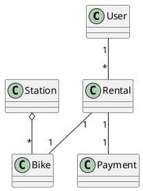
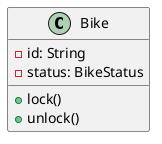
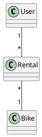
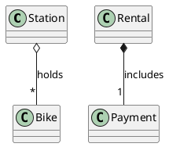
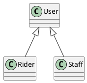
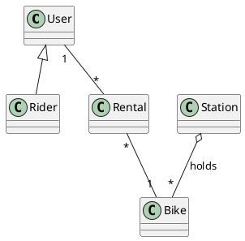
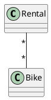
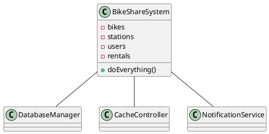

# AMSS 2026 — W4 Lecture Implementation Plan

> **For agentic workers:** REQUIRED SUB-SKILL: Use superpowers:subagent-driven-development (recommended) or superpowers:executing-plans to implement this plan task-by-task. Steps use checkbox (`- [ ]`) syntax for tracking.

**Goal:** Replace the W4 lecture stub at `class/amss-2026/curs/04-class-diagrams.md` with a complete deck implementing the "class diagrams in the AI loop" content per spec, plus its sibling demo runbook (`04-class-diagrams-demo.md`), and end-to-end build verification.

**Architecture:** One slide deck (slidy markdown, pandoc → HTML+PDF) plus one TA-readable runbook (plain markdown, not built). Both files live in `class/amss-2026/curs/`. Each segment is appended in its own task with a build check after each. Unlike W3, **the W4 deck contains rendered PlantUML class diagrams** (8 of them) — the diagram Lua filter transcodes each into an embedded base64 image; the build checks assert they render.

**Tech Stack:** pandoc (slidy/beamer), GNU make, lualatex, plantuml. Same publishing pipeline as W1-W3. The 8 PlantUML class diagrams in this plan have been pre-validated to render.

**Spec reference:** `class/amss/docs/superpowers/specs/2026-05-29-amss-2026-w4-design.md`

**Branch.** Same convention as W1-W3: implement directly on `main`.

**Done when:**
1. `make -C class/amss-2026/curs` produces `class/amss2026/curs/04-class-diagrams.html` and `.pdf` with the full deck, including all rendered class diagrams.
2. The deck has 25-32 slides (target ~26) distributed across the spec §2 budget per segment.
3. `04-class-diagrams-demo.md` exists with all 10 spec-mandated sections + a verified reference class diagram + pointers to the fallback directory.
4. The W1 Makefile filter still excludes `04-class-diagrams-demo.md` from the published tree.
5. Cross-references in slides resolve (every `W<n>` / `Lab <n>` matches parent spec §2/§3).
6. F1+F3+F4 appears exactly twice (frame + close), F1 anchored, per spec verification gate 4.
7. Class diagrams render and embed: `grep -c "data:image"` on the built HTML is `>= 4` (spec gate 2); the lualatex build is **warning-free** (no "Missing character" — spec gate 1 + 9).
8. Published artifacts (`class/amss2026/curs/04-class-diagrams.{html,pdf}`) are committed.

The dry-run (spec gate §6.5 — instructor runs the runbook against a live endpoint and confirms the AI's PlantUML renders) and fallback PNG capture are post-implementation steps documented at the end; the plan does not execute them.

**Build-invocation note (learned in W3):** the per-task build checks build into a `/tmp` tree with `BASE=/tmp/...` and a matching `/tmp/...` target path — this works. The final publish (Task 9) uses the DEFAULT base (`class/amss2026`), which the Makefile resolves to an ABSOLUTE path; a relative target like `class/amss2026/curs/04-class-diagrams.html` does NOT match the pattern rule. Task 9 therefore uses the absolute target path. Follow the commands as written.

---

## Task 1: Author the W4 demo runbook

Write the full demo runbook per spec §4.1-§4.10. The runbook is the procedure a speaker follows in W4's "Demo" segment, plus a dry-run-verified reference class diagram. The W1 `*-demo.md` filter covers it — no Makefile change.

**Files:**
- Create: `class/amss-2026/curs/04-class-diagrams-demo.md`

- [ ] **Step 1: Write the runbook**

Write the following content to `class/amss-2026/curs/04-class-diagrams-demo.md` (verbatim — prompts, critique tables, and the reference diagram are spec-mandated and dry-run-verified):

`````markdown
# W4 Demo Runbook — Bike-Sharing Class Diagram

> Procedural script for the W4 lecture's live demo. **Not** a slidy deck — pandoc skips `*-demo.md` (filter installed during W1). Read end-to-end before running. Estimated runtime: 12-14 minutes inside the lecture's "Demo" segment.
>
> Spec reference: `docs/superpowers/specs/2026-05-29-amss-2026-w4-design.md` §4.
>
> This demo's artifact is a **rendered diagram**. The "aha" beat is *reading the structure against the domain* — wrong multiplicities, meaningless associations, missing whole-part.

## 0. Setup (pre-class, ~1 min)

- VS Code open, Continue.dev installed and configured against the canonical course endpoint (see `class/amss-2026/tooling/SETUP.md`).
- Continue.dev mode set to **agentic chat**.
- A **PlantUML preview pane** open in VS Code — students must SEE the rendered diagram to critique multiplicity and associations; raw PlantUML text is not enough.
- Browser tab pre-opened to `class/amss-2026/curs/04-class-diagrams-demo-fallback/01-fallback-cycle1-diagram.png` in case the live AI fails.
- The deck's "Demo" trigger slide is on screen.

## 1. Architect prompt #1 — verbatim

Paste this into Continue.dev's chat (do **not** improvise):

> *"Generate a UML class diagram (as PlantUML) for the city bike-sharing app: users rent and return bicycles at stations across a city; payment is by app; staff rebalance bikes between stations."*

Render the result in the preview pane. **Time:** ~1 min to type, ~2-3 min for AI to generate + render.

## 2. Defect catalogue — pick 2-3 from the menu

Walk the rendered diagram aloud. Pick the **2-3 defects that actually appear**. Over-spec'ing absorbs model variance. #1 (multiplicity) is near-certain — anchor on it.

| # | Defect | What to point at | Critique question |
|---|---|---|---|
| 1 | Wrong multiplicity | `Rental "*" -- "*" Bike` or a reversed `User`/`Rental` end | *"Read the multiplicity aloud. Can one rental really involve many bikes? What's the real number?"* |
| 2 | Fake / decorative association | A line between `User` and `Station` with no label or meaning | *"What does this association mean? Name the verb. If you can't, why is the line there?"* |
| 3 | Missing aggregation/composition | `Station -- Bike` as a plain association, not a whole-part | *"A station holds bikes — is that a plain link, or a whole-part? Why isn't it an aggregation?"* |
| 4 | Invented class | `DatabaseManager`, `BikeController`, `AppManager` — implementation, not domain | *"Is this a domain concept or an implementation detail? Walk it back to the requirements."* |
| 5 | God class | One `BikeShareSystem` holding most attributes and operations | *"Why does one class do everything? What are the real responsibilities here?"* |
| 6 | Attribute that should be an association | `User.rentals: String` / `Station.bikeList: String` | *"Should this attribute be a relationship to another class? What type is it really?"* |

If the diagram is suspiciously clean → jump to §7 "Make-it-fail reserve".

## 3. Critique walkthrough (~5 min)

Walk the chosen 2-3 defects against the rendered diagram. Ask the room first ("does anything look wrong with this structure?") before delivering the critique. Name the move explicitly the first time:

> *"That's the **critic** half — reading the diagram AI drew and asking 'does this structure match the domain?' Next is the **architect** half — I re-prompt with the domain constraints it missed."*

Slow down here — this is the F1 skill in action.

## 4. Architect prompt #2 — constructed live (constraint scaffold)

Type this into Continue.dev:

> *"Revise the class diagram. A rental is exactly one bike and one user — fix the multiplicities. Make the Station–Bike relationship an aggregation (a station holds bikes). Drop any class that's an implementation detail rather than a domain concept — keep only domain classes."*

Naming the domain rules is the pivot. Re-render. **Time:** ~1 min to type, ~2-3 min for AI to revise + render.

## 5. Reference solution (instructor's verified render target)

The live AI output varies. This is the **dry-run-verified** reference the instructor confirms renders before delivery (spec gate §6.5) — the tightened domain model the critique converges toward:



Correct multiplicities (a rental is one bike, one user, one payment), Station–Bike as an aggregation, only domain classes. If the live output reaches something like this after prompt #2, the loop worked.

## 6. Recap (~1 min)

> *"One architect-critic cycle on a class diagram. The first pass drew everything plausible-looking; the critic half read the structure against the domain and found wrong multiplicities and a missing aggregation; the architect half re-prompted with the domain constraints — and the second pass tightened. Reading a diagram against its domain is exactly the F1 skill the oral defense checks, and the loop is what Lab 2 asks you to do this week."*

Point back to the F1 anchor slide.

## 7. Make-it-fail reserve — AI produces a clean diagram

If AI's first diagram is suspiciously clean (low probability — class diagrams reliably over-model), restore the critique surface:

> *"Now expand this into a complete enterprise architecture with all supporting subsystems."*

This near-certainly triggers god classes, invented infrastructure (caches, controllers, managers), and over-modeling. If even that is clean, fall back to `03-fallback-make-it-fail.png` and walk the screenshot.

## 8. Fallback path — live AI fails

If the live AI fails (no response after 20s, network down, garbage output), switch to the pre-recorded renders:

- `04-class-diagrams-demo-fallback/01-fallback-cycle1-diagram.png` — seed diagram with ≥2 visible defects.
- (walk the same defect catalogue against the screenshot)
- `04-class-diagrams-demo-fallback/02-fallback-cycle2-revised.png` — post-critique revised diagram.

Acknowledge briefly ("the model is having a moment — here's the dry-run capture") and continue. The pedagogical content is identical.

## 9. Time budget reconciliation

| Beat | Duration |
|---|---|
| Prompt #1 typed | ~1 min |
| AI generates + render | ~2-3 min |
| Critique walkthrough | ~5 min |
| Prompt #2 typed | ~1 min |
| AI revises + render | ~2-3 min |
| Recap | ~1 min |
| **Total** | **12-14 min** |

If ahead of schedule, do not pad — use generation/render pauses to predict aloud what the diagram should show before it appears, then take 1-2 questions.

## 10. Lab 2 synergy & fallback assets

This demo is the forerunner of Lab 2's drill (this week's lab): drive AI to a class diagram from a 1-page spec, iterate at least twice, keep a critique log (1 page max). The runbook's prompt #2 (domain-constraint scaffold) is the move Lab 2's critique log documents, and §2's defect catalogue is the vocabulary it uses.

Fallback assets captured during the solo dry-run (spec §6.5), in `04-class-diagrams-demo-fallback/`:

- `01-fallback-cycle1-diagram.png` — rendered cycle-1 diagram with ≥2 defects.
- `02-fallback-cycle2-revised.png` — rendered revised diagram.
- `03-fallback-make-it-fail.png` — rendered over-modeled "enterprise architecture" output.

When the procurement decision changes the canonical endpoint, the dry-run reruns and the PNGs refresh.
`````

- [ ] **Step 2: Verify the runbook is excluded from the pandoc build**

```bash
cd class/amss-2026
make BASE=/tmp/amss2026-test 2>&1 | grep -E "04-class-diagrams-demo" || echo "not referenced in build (expected)"
ls /tmp/amss2026-test/curs/ 2>/dev/null | grep -E "04-class-diagrams-demo" || echo "not in published tree (expected)"
ls /tmp/amss2026-test/curs/04-class-diagrams.html /tmp/amss2026-test/curs/04-class-diagrams.pdf 2>&1
cd ..
```

Expected: the two "(expected)" messages print; the stub deck's `04-class-diagrams.{html,pdf}` still exist.

- [ ] **Step 3: Clean up**

```bash
rm -rf /tmp/amss2026-test
```

- [ ] **Step 4: Commit**

```bash
git add class/amss-2026/curs/04-class-diagrams-demo.md
git commit -m "Author W4 demo runbook (bike-sharing class diagram)

Ten-section TA-readable procedure: setup with a PlantUML preview pane,
architect prompt #1 (verbatim), defect catalogue (menu of 6 — wrong
multiplicity, fake associations, missing aggregation, invented class,
god class, attribute-as-association), critique walkthrough, architect
prompt #2 (domain-constraint scaffold), a dry-run-verified reference
class diagram, recap, make-it-fail reserve, fallback path, time budget,
and Lab 2 synergy."
```

---

## Task 2: Replace the stub deck — agenda

Replace the whole file with frontmatter + a single agenda slide, then a trailing `---`.

**Files:**
- Modify: `class/amss-2026/curs/04-class-diagrams.md` (replacing existing stub content)

- [ ] **Step 1: Replace the stub with the agenda slide**

Write to `class/amss-2026/curs/04-class-diagrams.md`:

````markdown
---
title: "AMSS 2026 — Lecture 4: Class Diagrams in the AI Loop"
author: "Traian-Florin Șerbănuță"
date: "2026"
---

# Today's Agenda

1. Frame: from behaviour (W3) to structure
2. Live demo: drive AI to a class diagram
3. Core notation: the reading floor
4. How AI gets class diagrams wrong
5. Reading critically: the F1 drill
6. Bridge to W5 + Lab 2

::: notes
W3 pinned behaviour with tests; today we model the structure that realises it — and Lab 2 this week is your hands-on follow-through. No re-introduction; open straight into structure.

Authoring note: this lecture reshapes 2025's `class/amss/curs/02-class.md` (Book-class compartments, aggregation/composition and generalization examples, and the over-complicated -> simplified diagram pair), reframed from "here is the notation" to "here is what AI gets wrong about it."
:::

---
````

- [ ] **Step 2: Verify the deck still builds**

```bash
make -C class/amss-2026/curs BASE=/tmp/amss2026-test 2>&1 | tail -3
test -f /tmp/amss2026-test/curs/04-class-diagrams.html && echo "html: ok"
test -f /tmp/amss2026-test/curs/04-class-diagrams.pdf && echo "pdf: ok"
rm -rf /tmp/amss2026-test
```

Expected: `html: ok` and `pdf: ok`.

- [ ] **Step 3: Slide count check (1 slide so far)**

```bash
grep -c "^---$" class/amss-2026/curs/04-class-diagrams.md
```

Expected: `3` (2 frontmatter + 1 trailing).

- [ ] **Step 4: Commit**

```bash
git add class/amss-2026/curs/04-class-diagrams.md
git commit -m "W4 deck: agenda slide

Replaces the scaffolding stub. Single agenda slide + a notes-block
authoring note recording the 2025 02-class.md reuse. Subsequent tasks
append the frame, demo trigger, content segments, and close."
```

---

## Task 3: Frame segment — from behaviour to structure (4 slides)

Append the frame per spec §5.2. Four slides: architect-critic recap, behaviour→structure bridge, four-threads preview, F1+F3+F4 anchor (1st of 2, F1 anchored).

**Files:**
- Modify: `class/amss-2026/curs/04-class-diagrams.md` (append)

- [ ] **Step 1: Append the frame segment**

Append:

````markdown
# Recap: Architect + Critic

- **Architect / director (B):** drive AI through the SDLC.
- **Critic / reviewer (A):** read AI's output and name what's wrong or missing.

In W3 you critiqued AI-written tests. Today: the same loop, on a diagram.

::: notes
W3 was behaviour (tests); today is structure (classes). One breath of recap.
:::

---

# From Behaviour to Structure

- **W3 pinned what the system does** — a test says "a 60-minute rental costs €3.00."
- **Today: what objects realise it** — a `Rental`, a `Bike`, a `User`, a `Payment`, and how they relate.

The class diagram is the central structural artifact.

::: notes
The bridge from W3. The fare test implies objects: something holds the duration, something computes the charge. Today we draw that structure.
:::

---

# Four Threads Today

1. The class diagram as the central structural artifact.
2. Driving AI to produce one.
3. Reading it critically — multiplicity, fake associations, missing whole-part.
4. The literacy floor: what you must read & critique cold.

::: notes
Threads 3 and 4 are the payload. Brief preview before the demo.
:::

---

# Literacy Floor: F1 + F3 + F4

From W1: in the oral defense, *unaided*, you must demonstrate:

- **F1** — read & critique AI-generated artifacts on the spot.
- **F3** — articulate why you directed AI a certain way.
- **F4** — defend traceability across your project.

Today is F1 at its sharpest: read an AI-drawn class diagram and name what's wrong.

::: notes
First of two F1+F3+F4 mentions. F1 anchored this week — reading & critiquing a diagram cold IS the oral-defense skill. Same wording in the close.
:::

---
````

- [ ] **Step 2: Verify build**

```bash
make -C class/amss-2026/curs BASE=/tmp/amss2026-test 2>&1 | tail -3
test -f /tmp/amss2026-test/curs/04-class-diagrams.html && echo "html: ok"
rm -rf /tmp/amss2026-test
```

Expected: `html: ok`.

- [ ] **Step 3: Slide count check (5 slides)**

```bash
grep -c "^---$" class/amss-2026/curs/04-class-diagrams.md
```

Expected: `7`.

- [ ] **Step 4: Commit**

```bash
git add class/amss-2026/curs/04-class-diagrams.md
git commit -m "W4 deck: frame segment (behaviour -> structure + F1 anchor)

Four slides: architect/critic recap from W3, the behaviour-to-structure
bridge (the fare test implies objects), four-threads preview, and the
first of two F1+F3+F4 anchor mentions (F1 anchored: reading & critiquing
a diagram cold is the defense skill)."
```

---

## Task 4: Demo trigger slide

A single slide holding the screen for the ~12-14 min demo.

**Files:**
- Modify: `class/amss-2026/curs/04-class-diagrams.md` (append)

- [ ] **Step 1: Append the demo trigger slide**

Append:

````markdown
# Demo: Bike-Sharing Class Diagram

> Live: drive AI to draw the structure. Watch the multiplicities, the associations, and what's missing.

**Prompt to AI:** *"Generate a UML class diagram (as PlantUML) for the city bike-sharing app: users rent and return bicycles at stations across a city; payment is by app; staff rebalance bikes between stations."*

::: notes
Switch to Continue.dev with a PlantUML preview pane — students must SEE the rendered diagram. Run the runbook at `class/amss-2026/curs/04-class-diagrams-demo.md` for ~12-14 min. Fallback: runbook §8.
:::

---
````

- [ ] **Step 2: Verify build**

```bash
make -C class/amss-2026/curs BASE=/tmp/amss2026-test 2>&1 | tail -3
test -f /tmp/amss2026-test/curs/04-class-diagrams.html && echo "html: ok"
rm -rf /tmp/amss2026-test
```

Expected: `html: ok`.

- [ ] **Step 3: Slide count check (6 slides)**

```bash
grep -c "^---$" class/amss-2026/curs/04-class-diagrams.md
```

Expected: `8`.

- [ ] **Step 4: Commit**

```bash
git add class/amss-2026/curs/04-class-diagrams.md
git commit -m "W4 deck: demo trigger slide (bike-sharing class diagram)

Single slide holding the PlantUML class-diagram prompt visible while the
speaker drives the demo runbook in Continue.dev with a preview pane."
```

---

## Task 5: Core notation — the reading floor (6 slides, 5 rendered diagrams)

Append the notation segment per spec §5.4. Six slides; five carry pre-validated PlantUML class diagrams. This is the first task that renders structural UML — the build check asserts diagrams embed.

**Files:**
- Modify: `class/amss-2026/curs/04-class-diagrams.md` (append)

- [ ] **Step 1: Append the core-notation segment**

Append (the segment is wrapped in a 5-backtick fence because the slides contain ```plantuml blocks — reproduce the inner ```plantuml blocks exactly, including the visibility markers, multiplicity strings, and relationship arrows):

`````markdown
# A Class: Three Compartments



Name, attributes (data), operations (behaviour). `-` private, `+` public.

::: notes
Adapts 2025's Book-class compartment example to the bike-sharing domain. The three compartments are the atom of every class diagram.
:::

---

# Associations + Multiplicity



Read it aloud: *one* user has *many* rentals; *many* rentals each reference *one* bike. Multiplicity is where AI most often lies.

::: notes
The most defect-prone element. Drill reading multiplicity aloud — 1, *, 0..1, 1..*. This is correct multiplicity; the defect catalogue shows the wrong version.
:::

---

# Aggregation vs Composition



- **Aggregation** (hollow diamond): a station *holds* bikes; bikes outlive the station.
- **Composition** (filled diamond): a rental *includes* its payment; the payment dies with it.

::: notes
Reuses 2025's aggregation/composition contrast. The lifetime distinction is what AI routinely flattens into a plain line.
:::

---

# Generalization (is-a)



A `Rider` *is a* `User`; `Staff` *is a* `User`. The hollow triangle points at the parent.

::: notes
Reuses 2025's generalization example. "is-a" vs the "has-a" of association — AI sometimes models is-a as a plain association.
:::

---

# Beyond the Floor

You'll meet these reading AI output — recognise them, but they're not today's focus:

- **Interfaces** — a contract a class implements.
- **Abstract classes** — a partial parent you can't instantiate.
- **Dependency arrows** — "uses" without owning.

Today's reading floor is the four above: class, association + multiplicity, aggregation/composition, generalization.

::: notes
Deliberate scope boundary (spec §5.4). Name them so students aren't lost when AI emits them, but don't teach them today.
:::

---

# The Reading Floor, Together



One small diagram, all four elements. If you can read this, you can critique AI's.

::: notes
Consolidation. Every element of the floor in one bike-sharing diagram. This is the F1 reading target.
:::

---
`````

- [ ] **Step 2: Verify build AND that diagrams render**

```bash
make -C class/amss-2026/curs BASE=/tmp/amss2026-test 2>&1 | tail -5
test -f /tmp/amss2026-test/curs/04-class-diagrams.html && echo "html: ok"
grep -c "data:image" /tmp/amss2026-test/curs/04-class-diagrams.html
rm -rf /tmp/amss2026-test
```

Expected: `html: ok`, and the `data:image` count is `>= 5` (the five class diagrams in this segment embedded as base64 images). If `0` or pandoc reports a plantuml error, a diagram failed to render — fix before proceeding.

- [ ] **Step 3: Slide count check (12 slides)**

```bash
grep -c "^---$" class/amss-2026/curs/04-class-diagrams.md
```

Expected: `14`.

- [ ] **Step 4: Commit**

```bash
git add class/amss-2026/curs/04-class-diagrams.md
git commit -m "W4 deck: core notation — the reading floor (6 slides, 5 diagrams)

Six slides establishing the F1 reading floor with rendered PlantUML:
class compartments, associations + multiplicity, aggregation vs
composition, generalization, a name-drop slide (interfaces/abstract/
dependencies, out of scope), and a consolidation diagram with all four
elements. Adapts 2025 02-class.md examples to the bike-sharing domain."
```

---

## Task 6: How AI gets class diagrams wrong (6 slides, 3 rendered diagrams) — central payload

Append the defect catalogue per spec §5.5. Six slides; three carry pre-validated PlantUML (the wrong-multiplicity example, the over-modeled exhibit, the simplified result).

**Files:**
- Modify: `class/amss-2026/curs/04-class-diagrams.md` (append)

- [ ] **Step 1: Append the defect-catalogue segment**

Append (5-backtick fence; reproduce inner ```plantuml blocks exactly):

`````markdown
# AI Draws Plausible Structure — and Gets It Wrong

A class diagram can look professional and still misrepresent the domain. The critic question:

> *"Does this structure match the domain — or just look like a diagram?"*

::: notes
Sets up the catalogue — F1 applied to structure. The three core defects are spec-named: multiplicity, fake associations, missing aggregation.
:::

---

# Defect #1: Wrong Multiplicity



Many-to-many? One rental is *one* bike. **Critique:** *"Read it aloud — can a single rental involve many bikes? Fix the number."*

::: notes
The anchor defect — it fired in the demo's cycle 1. Wrong multiplicity is invisible until you read it aloud against the domain.
:::

---

# Defect #2: Fake / Decorative Association

A line between `User` and `Station` with no label, no verb, no meaning.

**Critique:** *"What does this association mean? Name the verb. If you can't, the line shouldn't be there."*

::: notes
AI adds lines because diagrams "should" be connected. An association with no nameable verb is decoration. Kept textual — a rendered meaningless line teaches less than the question.
:::

---

# Defect #3: Missing Aggregation

`Station -- Bike` as a plain line hides that a station *holds* bikes — a whole-part relationship.

**Critique:** *"Is this a plain link or a whole-part? Why isn't it an aggregation?"*

::: notes
The third spec-named core defect. AI flattens whole-part into plain associations because both render as lines; the ownership/lifetime meaning is lost.
:::

---

# AI Over-Models



A **god class** plus **invented infrastructure** (`DatabaseManager`, `CacheController`) — implementation, not domain.

::: notes
Reframes 2025's over-complicated diagram. AI over-models because it doesn't have to choose what matters. Defects #4 (invented class) and #5 (god class) together.
:::

---

# The Critic Simplifies


Same domain, only the classes that earn their place. **You saw defect #1 (multiplicity) live in the demo.**

::: notes
Reuses 2025's simplified diagram, reframed as the critique RESULT. The attribute-that-should-be-an-association defect (e.g. `User.rentals: String`) folds in here — the fix is the `User "1" -- "*" Rental` link. Ties the catalogue back to the demo.
:::

---
`````

- [ ] **Step 2: Verify build AND diagrams render**

```bash
make -C class/amss-2026/curs BASE=/tmp/amss2026-test 2>&1 | tail -5
test -f /tmp/amss2026-test/curs/04-class-diagrams.html && echo "html: ok"
grep -c "data:image" /tmp/amss2026-test/curs/04-class-diagrams.html
rm -rf /tmp/amss2026-test
```

Expected: `html: ok`, and the `data:image` count is `>= 8` (5 from the notation segment + 3 here). If lower, a diagram failed to render — fix before proceeding.

- [ ] **Step 3: Slide count check (18 slides)**

```bash
grep -c "^---$" class/amss-2026/curs/04-class-diagrams.md
```

Expected: `20`.

- [ ] **Step 4: Commit**

```bash
git add class/amss-2026/curs/04-class-diagrams.md
git commit -m "W4 deck: how AI gets class diagrams wrong (6 slides) — central payload

Six slides cataloguing the AI class-diagram defects: the three
spec-named core defects (wrong multiplicity with a rendered bad example,
fake/decorative association, missing aggregation) plus the 'AI
over-models' pair (god class + invented infrastructure, then the
critic's simplified domain model). Reframes 2025's over-complicated ->
simplified diagram pair; ties back to the live demo."
```

---

## Task 7: Reading critically — the F1 drill (4 slides)

Append per spec §5.6. Four slides: the read-order, the critique loop on structure, apply-it-in-Lab-2, the human decides.

**Files:**
- Modify: `class/amss-2026/curs/04-class-diagrams.md` (append)

- [ ] **Step 1: Append the segment**

Append:

````markdown
# How to Read an AI Class Diagram

A fixed order, every time:

1. Are the classes real **domain** concepts? (or invented infrastructure)
2. Are the **multiplicities** right? (read each aloud)
3. Does each **association** name a real relationship?
4. Are **whole-part** relationships captured? (aggregation/composition)

::: notes
This IS the F1 drill. A repeatable read-order beats ad-hoc staring. Students internalise it for the oral defense and Lab 2.
:::

---

# The Critique Loop on Structure

read -> name the defects -> re-prompt with domain constraints -> re-read.

Same architect-critic loop as W2 (requirements) and W3 (tests) — now on a diagram.

::: notes
The loop is the through-line of the course. The scaffold that tightens AI output here is naming the domain rules (a rental is one bike) — exactly the demo's prompt #2.
:::

---

# Apply It to Your Own Output

This week's lab (Lab 2): you drive AI to a class diagram from a 1-page spec, then run *this* read-order against what it draws.

The critique log is the evidence — what you caught and how you fixed it.

::: notes
Bridges the read-order to Lab 2's deliverable. The read-order is the rubric for the critique log.
:::

---

# The Human Decides What Matches the Domain

AI can draw plausible structure forever. Deciding whether it matches the *domain* — that's the architect-critic call.

It's what the oral defense checks, and AI can't make it for you.

::: notes
Reinforces ownership, mirroring W3's "human closes the loop." The defense grades this judgment, not the diagram's polish.
:::

---
````

- [ ] **Step 2: Verify build**

```bash
make -C class/amss-2026/curs BASE=/tmp/amss2026-test 2>&1 | tail -3
test -f /tmp/amss2026-test/curs/04-class-diagrams.html && echo "html: ok"
rm -rf /tmp/amss2026-test
```

Expected: `html: ok`.

- [ ] **Step 3: Slide count check (22 slides)**

```bash
grep -c "^---$" class/amss-2026/curs/04-class-diagrams.md
```

Expected: `24`.

- [ ] **Step 4: Commit**

```bash
git add class/amss-2026/curs/04-class-diagrams.md
git commit -m "W4 deck: reading critically — the F1 drill (4 slides)

Four slides: a fixed read-order for any AI class diagram (classes real?
multiplicities right? associations meaningful? whole-part captured?),
the critique loop on structure (same loop as W2/W3), applying it in
Lab 2, and the human's judgment as the architect-critic call."
```

---

## Task 8: Bridge to W5 + Lab 2 preview + close (4 slides)

Append the close per spec §5.7. Four slides: Lab 2 preview, W5 teaser, F1+F3+F4 anchor (2nd, F1 anchored), closer. **No trailing `---` after the closer.**

**Files:**
- Modify: `class/amss-2026/curs/04-class-diagrams.md` (append)

- [ ] **Step 1: Append the close**

Append:

````markdown
# This Week's Lab: Lab 2

- Drive AI to produce a class diagram from a 1-page spec.
- Iterate at least twice; log what changed and why.
- Deliverable: the PlantUML diagram + a critique log (1 page max).
- Commit to the course lab repo.

::: notes
Lab 2 spec is its own document (forthcoming). Keep high-level so it survives late details. "At least twice" / "1 page max" use words, not the dropped >= / <= glyphs (W3 PDF-glyph lesson).
:::

---

# Next Week: Other Structural Views (W5)

One class diagram isn't the whole structure.

**W5:** object, package, component, and deployment views — and where AI over- or under-decomposes at the architecture level.

::: notes
Clean handoff. W4 was the class diagram; W5 widens to the other structural views.
:::

---

# F1 + F3 + F4 — The Through-Line

Today you drilled:

- **F1** — read an AI class diagram and named its defects on the spot.
- **F4** — the class is a structural node in the trace: requirement -> use case -> class (the behavioural tail, the test, came in W3).

F3 (why you directed AI a certain way) lands in your project narrative.

::: notes
Second and final F1+F3+F4 mention. F1 anchored, same wording as the frame. The one-line trace touch keeps F4 continuity without a dedicated segment.
:::

---

# That's It For Today

- Next lecture (W5): other structural views.
- This week's lab (Lab 2): drive AI to a class diagram, then critique it.

Questions?

::: notes
Closer. Open the floor. No trailing slide separator after this one.
:::
````

(Note: the file ends **without** a trailing `---` after the closer slide.)

- [ ] **Step 2: Verify build (html + pdf)**

```bash
make -C class/amss-2026/curs BASE=/tmp/amss2026-test 2>&1 | tail -3
test -f /tmp/amss2026-test/curs/04-class-diagrams.html && echo "html: ok"
test -f /tmp/amss2026-test/curs/04-class-diagrams.pdf && echo "pdf: ok"
rm -rf /tmp/amss2026-test
```

Expected: `html: ok` and `pdf: ok`.

- [ ] **Step 3: Slide count check (26 slides total)**

```bash
grep -c "^---$" class/amss-2026/curs/04-class-diagrams.md
```

Expected: `27` (2 frontmatter + 25 separators between 26 slides; no trailing `---`).

- [ ] **Step 4: Verify F1+F3+F4 mention count (spec gate 4)**

```bash
awk '/^# /{slide=$0} /F1.*F3.*F4|F1 \+ F3 \+ F4|F1\+F3\+F4/{print slide}' class/amss-2026/curs/04-class-diagrams.md | sort -u
```

Expected: exactly two slide titles — `# Literacy Floor: F1 + F3 + F4` (frame) and `# F1 + F3 + F4 — The Through-Line` (close). More than two = drift; fix.

- [ ] **Step 5: Commit**

```bash
git add class/amss-2026/curs/04-class-diagrams.md
git commit -m "W4 deck: bridge to W5 + Lab 2 preview + close (4 slides)

Closes the deck: Lab 2 preview (drive AI to a class diagram, iterate
at least twice, critique log), W5 teaser (other structural views), the
second of two F1+F3+F4 anchor mentions (F1 anchored) with a one-line
trace touch, and a closer. Total deck size: 26 slides, within the
spec §2 25-32 budget. Glyph-safe (words for >= / <=)."
```

---

## Task 9: End-to-end verification, cross-reference lint, publish artifacts

Clean rebuild into the published tree, guardrail checks, commit the published HTML+PDF.

**Files:**
- Generates: `class/amss2026/curs/04-class-diagrams.html`, `class/amss2026/curs/04-class-diagrams.pdf`

- [ ] **Step 1: Clean rebuild into the published tree (ABSOLUTE target path)**

```bash
rm -f class/amss2026/curs/04-class-diagrams.html class/amss2026/curs/04-class-diagrams.pdf
make -C class/amss-2026/curs \
  /home/traian/traiansf.github.io/class/amss2026/curs/04-class-diagrams.html \
  /home/traian/traiansf.github.io/class/amss2026/curs/04-class-diagrams.pdf 2>&1 | tee /tmp/w4build.log | tail -10
```

Expected: build completes, exit 0. (The absolute target path is required — a relative `class/amss2026/...` target does NOT match the Makefile's absolute `$(BASE)` pattern rule.)

- [ ] **Step 2: Warning-free build check (spec gates 1 + 9)**

```bash
grep -i "missing character" /tmp/w4build.log && echo "GLYPH DROP — fix before publishing" || echo "no missing-character warnings (good)"
rm -f /tmp/w4build.log
```

Expected: `no missing-character warnings (good)`. If a glyph dropped, reword it (use words/ASCII) and rebuild.

- [ ] **Step 3: Artifacts exist, non-trivial, diagrams embedded (spec gate 2)**

```bash
ls -lh class/amss2026/curs/04-class-diagrams.html class/amss2026/curs/04-class-diagrams.pdf
grep -c "data:image" class/amss2026/curs/04-class-diagrams.html
```

Expected: HTML 150KB+ (eight embedded diagrams push it up), PDF 60KB+, and the `data:image` count is `>= 4` (gate; actual ~8).

- [ ] **Step 4: Slide-count gate**

```bash
grep -c "^---$" class/amss-2026/curs/04-class-diagrams.md
```

Expected: `27` (26 slides). Within the §2 budget of 25-32.

- [ ] **Step 5: Per-segment slide count**

```bash
awk '/^# /{print}' class/amss-2026/curs/04-class-diagrams.md
```

Expected: 26 `#`-headed slides, distributed: agenda 1, frame 4, demo 1, core notation 6, defects 6, reading 4, close 4.

- [ ] **Step 6: Cross-reference linting**

```bash
grep -oE "W[0-9]+|Lab [0-9]+|Week [0-9]+" class/amss-2026/curs/04-class-diagrams.md | sort -u
```

Expected output:

```
Lab 2
W1
W2
W3
W5
```

Cross-check against parent spec §2/§3:
- W1 = "Intro + the AI-mediated SDLC" → frame F1+F3+F4 recap. ✓
- W2 = "Requirements with AI" → critique-loop slide. ✓
- W3 = "Testable specs & TDD-as-spec" → frame recap + behaviour-to-structure bridge. ✓
- W5 = "Other structural views" → close teaser. ✓
- Lab 2 = "drive AI to produce a class diagram" → Lab 2 preview + reading slides. ✓

Any reference to a non-existent or mis-titled week/lab → fix the slide. (Notes-only self-references to `W4` are acceptable if present.)

- [ ] **Step 7: Verify the runbook is excluded from the published tree**

```bash
ls class/amss2026/curs/ | grep -E "04-class-diagrams-demo" && echo "LEAKED — fix Makefile filter" || echo "runbook not published (expected)"
```

Expected: `runbook not published (expected)`.

- [ ] **Step 8: Verify landing-page links resolve**

```bash
cd class/amss2026
python3 -c "
import os
for link in ['curs/04-class-diagrams.html', 'curs/04-class-diagrams.pdf']:
  print(f'{link}: {\"ok\" if os.path.exists(link) else \"MISSING\"}')"
cd -
```

Expected: both `ok`.

- [ ] **Step 9: Commit the published artifacts**

```bash
git add class/amss2026/curs/04-class-diagrams.html class/amss2026/curs/04-class-diagrams.pdf
git commit -m "Publish W4 lecture artifacts (HTML + PDF)

Generated by 'make -C class/amss-2026/curs' from the authored deck.
Replaces the scaffolding stubs. The companion runbook
(04-class-diagrams-demo.md) and fallback PNGs stay source-only."
```

- [ ] **Step 10: Final sanity check**

```bash
git status
git log --oneline -12
```

Expected: working tree clean (modulo pre-existing untracked LaTeX leftovers); commits show Task 1-9's progression.

---

## Plan complete

After Task 9, the **Done when** milestone is met. Next steps for the instructor (not part of this plan):

### Pre-W4 dry-run (spec gate §6.5 — blocks delivery)

1. Open Continue.dev pointed at the canonical course endpoint (Gemini free-tier acceptable as a stand-in).
2. Run `04-class-diagrams-demo.md` end-to-end as if delivering the lecture.
3. **Confirm the AI's generated PlantUML actually renders** in the preview pane (both cycles). Confirm the reference diagram (runbook §5) renders.
4. Capture the live renders as fallback PNGs:
   - `class/amss-2026/curs/04-class-diagrams-demo-fallback/01-fallback-cycle1-diagram.png`
   - `.../02-fallback-cycle2-revised.png`
   - `.../03-fallback-make-it-fail.png`
5. Commit the directory.
6. Confirm the defect catalogue (runbook §2) matches what the model produced. Reconcile the "you saw defect #1 in the demo" reference (defects slide #6) with what actually fired.

If the model produces malformed PlantUML that won't render on the chosen endpoint, pause delivery and resolve (adjust the prompt or endpoint).

### Per-lecture demo-card template extraction (now four runbooks — ripe; separate cycle)

W1-W4 runbooks are all concrete. The per-lecture demo-card template (deferred in every spec so far) can be extracted from four instances. ~30-45 min; **not** in this plan — own spec → plan cycle.

### What's out of scope (deferred)

- Lab 2 spec → plan → implement cycle (the lecture references Lab 2 deliberately vaguely).
- W5-W14 lectures and Labs 3-7 — each its own cycle.
- Procurement decision (parent spec §6/§7).
- Project README rewrite (parent spec §7 step 5); W4's Lab 2 preview depends on Lab 2's deliverable surviving it.
