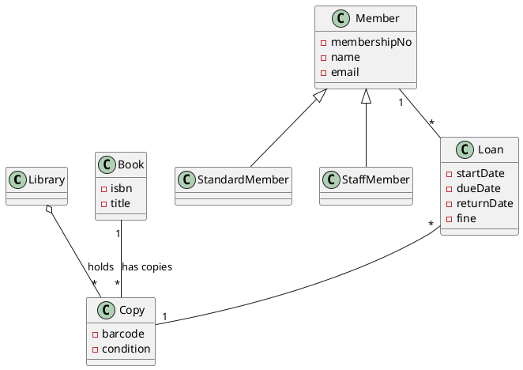

# AMSS 2026 — Lab 2 Implementation Plan

> **For agentic workers:** REQUIRED SUB-SKILL: Use superpowers:subagent-driven-development (recommended) or superpowers:executing-plans to implement this plan task-by-task. Steps use checkbox (`- [ ]`) syntax for tracking.

**Goal:** Replace the Lab 2 stub at `class/amss-2026/lab/Lab02.md` with a complete, self-contained student brief (slidy → HTML+PDF), author the unpublished instructor runbook `Lab02-instructor.md` (carrying the honest 1-page library-kiosk spec + a reference diagram + paste-ready `lab02/README.md`), and verify + publish the built artifacts.

**Architecture:** One slidy markdown deck (the student brief, built by pandoc → HTML+PDF) plus one plain-markdown instructor runbook (not built — filtered out by the existing `%-instructor.md` rule). Both live in `class/amss-2026/lab/`. The deck is appended segment-by-segment with a build check after each. **No Makefile change** — the `%-instructor.md` filter already exists (added in Lab 1). The deck is text-only (no rendered PlantUML) so it carries no diagram-build risk; the reference diagram is a code block inside the unbuilt instructor runbook.

**Tech Stack:** pandoc (slidy/beamer), GNU make, lualatex, plantuml (Lua filter, unused by this deck). Same pipeline as AMSS 2025 / W1–W4 / Lab 1.

**Spec reference:** `class/amss/docs/superpowers/specs/2026-06-01-amss-2026-lab2-design.md`

**Branch.** Same convention as W1–W4 / Lab 1: implement directly on `main`. Commits are reviewable inline as they land.

**Slidy authoring discipline (lesson from W2/Lab 1).** `---` is both the YAML frontmatter delimiter and the slide separator. When appending a new slide after a file that ends in `---`, there **must** be a blank line between the trailing `---` and the next `#` heading. `---\n# Heading` is misparsed by pandoc as a YAML document opener and breaks the build. Every append block below begins with a leading blank line for exactly this reason.

**PDF-glyph discipline (lesson from W3, recorded in auto-memory).** The beamer/lualatex PDF font drops `≥` / `≤` / `↔` and similar glyphs silently — the HTML hides the bug. Write **"at least"**, **"two", "1 page max"** in words. No `≥`/`≤` anywhere in `Lab02.md`. Gate checked in Task 7.

**Done when:**
1. `make -C class/amss-2026/lab` produces `class/amss2026/lab/Lab02.html` and `Lab02.pdf` with the full brief content (spec §12 gate 1).
2. The brief is self-contained: a student reading only `Lab02.html` knows the domain + the 1-page spec, the seed prompt, the two-re-prompt structure, the W4 4-step read-order, the five defect names, the deliverable files + log structure, the git submission commands, and the grading gate (spec §12 gate 3).
3. `Lab02-instructor.md` exists with all spec §11 sections (pre-class checklist, the authored 1-page spec with authoring notes, the instructor-only reference diagram, brief/drill/share-out facilitation, grading guide with worked pass/redo logs, roster table, paste-ready `lab02/README.md`).
4. The existing `%-instructor.md` Makefile filter excludes `Lab02-instructor.md` from the published tree; the `%-demo.md` exclusion still holds (spec §12 gate 2).
5. The deliverable matches W4's three preview slides verbatim (PlantUML class diagram + critique log ≤1 page, 10/70/20 split, "iterate at least twice") — spec §12 gate 4.
6. The brief names the five W4 defects + the 4-step read-order; it does not introduce un-taught defect names (spec §12 gate 5); no `≥`/`≤` glyphs (gate 6); domain is library kiosk, no reserved domain in drill content (gate 7).
7. The git submission recipe runs clean against a scratch repo (spec §12 gate 10 — blocks delivery).
8. `static/index.html` links resolve to `lab/Lab02.html` and `lab/Lab02.pdf` (spec §12 gate 9 — link already present, verify).
9. Published artifacts (`class/amss2026/lab/Lab02.{html,pdf}`) are committed.

The external course lab repo (creating it, seeding `lab02/README.md`, push permissions) is instructor-side runtime setup — out of scope for this plan (spec §13). This plan provides the paste-ready template; it does not create the live repo.

---

## Task 1: Replace the stub — overview, prerequisites, the domain spec (3 slides)

Replace the whole stub with the frontmatter and the first three slides: the lab overview (the 10/70/20 shape, individual, deliverable), prerequisites, and the honest 1-page library-kiosk spec.

**Files:**
- Modify: `class/amss-2026/lab/Lab02.md` (replacing existing stub content)

- [ ] **Step 1: Replace the stub**

Write to `class/amss-2026/lab/Lab02.md`:

````markdown
---
title: "AMSS 2026 — Lab 2: Class Diagrams from Spec"
author: "Traian-Florin Șerbănuță"
date: "2026"
---

# Lab 2: Class Diagrams from AI

Three phases, 100 minutes — **you work solo this time.**

1. **Brief + spec** (~10 min) — read the 1-page spec; recall the read-order.
2. **Drive-and-critique drill** (~70 min) — drive AI to a class diagram, critique it, re-prompt twice.
3. **Share-out** (~20 min) — compare which defects the AI produced across the room.

Deliverable: a PlantUML class diagram + a critique log (1 page max), committed to the course lab repo.

::: notes
The hands-on follow-through of the W4 lecture. In W4 you watched the architect-critic loop on a bike-sharing class diagram; today you run it yourself, alone, on a different domain. Solo — because the oral defense is individual and cold.
:::

---

# Before You Start

- Continue.dev already working from Lab 1 — same endpoint, same config.
- You receive at lab start: your **student-id**, the lab-repo URL, and the **1-page spec** (also in `lab02/README.md` on clone).
- This is an **individual** lab. You play both roles — architect *and* critic — yourself.

::: notes
No tooling onboarding this week; the endpoint was activated in Lab 1. Anyone whose endpoint regressed switches to the Gemini free-tier config now (tooling/SETUP.md).
:::

---

# The Domain: Library Kiosk

A neighbourhood library runs a self-service kiosk. This spec is **honest — no planted tricks.** The defects you will catch come from the AI, not the spec.

- The library owns a **catalogue of titles**. A *title* (book) has an ISBN, a title, and one or more authors.
- A popular title may have **several physical copies**. A *copy* has its own barcode and a condition. A copy belongs to the library and stays in the catalogue even when nobody has borrowed it.
- A **member** has a membership number, a name, and an email. Members come in two kinds: **standard** (up to 3 open loans) and **staff** (up to 10).
- To borrow, a member scans a **copy**. That opens a **loan**: one member, one copy, a start date, a due date (14 days on). A copy on loan cannot be borrowed by anyone else until returned.
- A member may have many loans over time, and several open at once (up to their limit). A loan always refers to **exactly one copy and one member**.
- On return, the member scans the copy; the loan closes with a return date, and records a **fine** if late.
- The kiosk shows a member their open loans and any fines owed.

::: notes
The full spec is also seeded in lab02/README.md. The traps are natural: title-vs-copy (multiplicity), the library *holds* copies that outlive loans (aggregation), loan = one copy + one member (M:N trap), standard-vs-staff (is-a). Read it once and start driving.
:::

---
````

- [ ] **Step 2: Verify the deck builds**

```bash
make -C class/amss-2026/lab BASE=/tmp/amss2026-test 2>&1 | tail -3
test -f /tmp/amss2026-test/lab/Lab02.html && echo "html: ok"
test -f /tmp/amss2026-test/lab/Lab02.pdf && echo "pdf: ok"
rm -rf /tmp/amss2026-test
```

Expected: `html: ok` and `pdf: ok`.

- [ ] **Step 3: Slide count check (3 slides so far)**

```bash
grep -c "^---$" class/amss-2026/lab/Lab02.md
```

Expected: `5` (2 frontmatter + 3 trailing separators).

- [ ] **Step 4: Commit**

```bash
git add class/amss-2026/lab/Lab02.md
git commit -m "Lab 2 brief: overview + prerequisites + library-kiosk spec (3 slides)

Replaces the stub. Opens with the 10/70/20 individual phase shape,
the prerequisites (Continue.dev from Lab 1, student-id/spec handed
out at start), and the honest 1-page library-kiosk spec with its
natural class-diagram traps (title vs copy, holds-aggregation,
loan = one copy + one member, standard vs staff)."
```

---

## Task 2: The loop, Round 1, the read-order, the five defects (4 slides)

Append the drill core: the architect-critic loop restated for solo work, Round 1 (bare prompt + first read), the W4 4-step read-order (the rubric), and the five named defects.

**Files:**
- Modify: `class/amss-2026/lab/Lab02.md` (append)

- [ ] **Step 1: Append the segment**

Append to `class/amss-2026/lab/Lab02.md` (note the leading blank line — the file currently ends with `---`):

````markdown

# Your Job — the Loop

The same architect-critic loop from W4, run solo:

**drive AI → read with the 4-step order → name the defects → re-prompt with domain rules → re-read.**

- Bare first prompt, then **two required re-prompts** — iterate at least twice.
- Keep the **best** diagram, not the first draft.
- Log what you caught and why you re-prompted as you go — that log is the deliverable.

::: notes
Two iterations is the W4 mandate ("iterate at least twice"). The student is both architect and critic — no partner to swap with. The running log is the F1/F3 evidence; don't reconstruct it afterward.
:::

---

# Round 1 — Bare Prompt + First Read

Send a deliberately bare prompt, pasting the spec:

> *"Generate a UML class diagram (as PlantUML) for this library system. [paste the 1-page spec]"*

Render it, then run the **4-step read-order** (next slide) against it. Log every defect: its name, where it is, how bad it is.

::: notes
The bare prompt is on purpose — against an honest spec it reliably collapses title/copy, flattens the holds-aggregation, and over-models with infrastructure. If the draft looks suspiciously clean, use the defect card.
:::

---

# The Read-Order (from W4)

A fixed order, every time:

1. Are the classes real **domain** concepts? (or invented infrastructure)
2. Are the **multiplicities** right? (read each one aloud)
3. Does each **association** name a real relationship? (a verb)
4. Are **whole-part** relationships captured? (aggregation / composition)

This is your critique-log rubric.

::: notes
Identical to W4's "How to Read an AI Class Diagram" slide. A repeatable read-order beats ad-hoc staring — it is also exactly what the oral defense drills.
:::

---

# The Five Defects (from W4)

Name them with this vocabulary:

- **Wrong multiplicity** — `*--*` where it should be one (read it aloud).
- **Fake / decorative association** — a line with no nameable verb.
- **Missing aggregation** — a whole-part relationship drawn as a plain line.
- **Invented class / infrastructure** — `DatabaseManager`, `CacheController` — implementation, not domain.
- **God class** — one class that holds everything and does everything.

::: notes
The W4 catalogue, verbatim. The critique log must use these names; the grading gate checks for at least two of them, correctly applied.
:::

---
````

- [ ] **Step 2: Verify build**

```bash
make -C class/amss-2026/lab BASE=/tmp/amss2026-test 2>&1 | tail -3
test -f /tmp/amss2026-test/lab/Lab02.html && echo "html: ok"
rm -rf /tmp/amss2026-test
```

Expected: `html: ok`.

- [ ] **Step 3: Slide count check (3 + 4 = 7 slides)**

```bash
grep -c "^---$" class/amss-2026/lab/Lab02.md
```

Expected: `9` (2 frontmatter + 7 trailing separators).

- [ ] **Step 4: Commit**

```bash
git add class/amss-2026/lab/Lab02.md
git commit -m "Lab 2 brief: the loop, Round 1, read-order, five defects (4 slides)

The solo architect-critic loop, the bare Round 1 seed prompt, the
W4 4-step read-order (the critique-log rubric), and the five named
W4 defects (wrong multiplicity, fake association, missing
aggregation, invented class, god class)."
```

---

## Task 3: The two re-prompts + the defect card (3 slides)

Append the two mandated re-prompts (domain-rule scaffold, then residue cleanup) and the library-kiosk defect card (the critic's safety net).

**Files:**
- Modify: `class/amss-2026/lab/Lab02.md` (append)

- [ ] **Step 1: Append the segment**

Append to `class/amss-2026/lab/Lab02.md`:

````markdown

# Re-prompt #1 — Name the Domain Rules

Fix the worst defects by stating the rules the AI got wrong. For this domain, that is almost always:

> *"A Book is a title; a Copy is a physical item — model both. A loan is exactly one copy to one member. The library holds many copies that outlive any loan (aggregation)."*

Regenerate, re-read with the 4-step order, log what changed. **This is iteration 1.**

::: notes
Naming the domain rules is the scaffold move from W4's demo prompt #2. The title-vs-copy split is the signature fix — it converts the wrong many-to-many into Member–Loan–Copy.
:::

---

# Re-prompt #2 — Kill the Residue

Second pass targets what the first usually leaves:

> *"Drop any class that isn't a library-domain concept (no DatabaseManager, no god 'LibrarySystem'). Model member kinds as subclasses (standard / staff), not a type field."*

Regenerate, re-read, log. **This is iteration 2.** Then keep your best diagram.

::: notes
Residual catalogue entries: invented infrastructure, the god class, and is-a-as-attribute. Two iterations is the floor, not the ceiling — but the gate wants both logged.
:::

---

# Defect Card — Library Kiosk

If the draft looks complete, stress these. Each maps to a W4 defect:

- `Member "*" -- "*" Book` — **wrong multiplicity** (a loan is one copy to one member).
- Book and Copy as one class — collapses title vs physical item.
- `Library -- Copy` as a plain line — **missing aggregation** (the library *holds* copies).
- A line to `Member` with no verb — **fake association**.
- `LibrarySystem` with all the data + `doEverything()` — **god class**.
- `DatabaseManager`, `NotificationService` — **invented infrastructure**.
- Member kind as `type: String` — is-a flattened to an attribute.

::: notes
The signature catch is title-vs-copy: AI models one `Book` class and then cannot express "two members each borrow a copy of the same title", producing the bogus many-to-many. Surfacing that is the lab's payoff.
:::

---
````

- [ ] **Step 2: Verify build**

```bash
make -C class/amss-2026/lab BASE=/tmp/amss2026-test 2>&1 | tail -3
test -f /tmp/amss2026-test/lab/Lab02.html && echo "html: ok"
rm -rf /tmp/amss2026-test
```

Expected: `html: ok`.

- [ ] **Step 3: Slide count check (7 + 3 = 10 slides)**

```bash
grep -c "^---$" class/amss-2026/lab/Lab02.md
```

Expected: `12` (2 frontmatter + 10 trailing separators).

- [ ] **Step 4: Commit**

```bash
git add class/amss-2026/lab/Lab02.md
git commit -m "Lab 2 brief: the two re-prompts + defect card (3 slides)

Re-prompt #1 (name the domain rules: title vs copy, loan = one
copy, holds-aggregation), re-prompt #2 (kill invented
infrastructure / god class / is-a-as-attribute), and the
library-kiosk defect card with the signature title-vs-copy catch."
```

---

## Task 4: Deliverable, critique log, submission, grading (4 slides)

Append the deliverable plumbing: the files to commit, the critique-log structure, the git submission recipe, and the grading gate.

**Files:**
- Modify: `class/amss-2026/lab/Lab02.md` (append)

- [ ] **Step 1: Append the segment**

Append to `class/amss-2026/lab/Lab02.md`:

````markdown

# Deliverable

On branch `lab02/<student-id>`, commit:

- `lab02/<student-id>/diagram.puml` — your best AI-driven PlantUML class diagram (must render).
- `lab02/<student-id>/critique-log.md` — 1 page max (next slide).
- `lab02/<student-id>/transcript.md` — optional but recommended: your raw prompt/output trail.

::: notes
The transcript is your raw F3 evidence; optional for the gate, but it is what we look at if a log is borderline. Keep the best diagram, not the first.
:::

---

# The Critique Log (1 page max)

Structured by the read-order. One short block per iteration (Round 1, re-prompt 1, re-prompt 2):

- **Defects found** — each: W4 name, where, severity.
- **Re-prompt move and why** — which domain rule you named and the reason. *(F3 — graded.)*
- **What changed** after regenerating.

Close with **one residual risk** — a defect the AI never got right.

::: notes
The "why" line is the graded one. "The diagram was wrong, I asked again" is not a rationale. The residual-risk line seeds F4: a wrong structure propagates to the tests and the code.
:::

---

# How to Submit

```bash
git checkout -b lab02/<student-id>
mkdir -p lab02/<student-id>
# write diagram.puml and critique-log.md inside lab02/<student-id>/
git add lab02/<student-id>
git commit -m "Lab 2: <student-id> library kiosk class diagram + critique log"
git push -u origin lab02/<student-id>
```

Push fails? Paste both files into the shared doc / email the instructor, then fix git after class.

::: notes
Substitute your real student-id everywhere `<student-id>` appears. You likely already have the clone from Lab 1; this is branch + commit + push.
:::

---

# Grading — Pass / Redo

Pass needs both:

1. `diagram.puml` (renders) and `critique-log.md` both committed by the deadline.
2. Your log names **at least two** distinct W4 defects correctly **and** gives a real reason for at least one re-prompt (not just what you typed).

A vacuous log ("the diagram was wrong, I fixed it") is a redo, not a fail. We grade your critique and reasoning — not the diagram's polish.

::: notes
Low-stakes literacy gate. The bar is on F1 (naming defects) and F3 (rationale), not on diagram quality. Grading the diagram would reward the AI's output over the student's critique.
:::

---
````

- [ ] **Step 2: Verify build**

```bash
make -C class/amss-2026/lab BASE=/tmp/amss2026-test 2>&1 | tail -3
test -f /tmp/amss2026-test/lab/Lab02.html && echo "html: ok"
rm -rf /tmp/amss2026-test
```

Expected: `html: ok`.

- [ ] **Step 3: Slide count check (10 + 4 = 14 slides)**

```bash
grep -c "^---$" class/amss-2026/lab/Lab02.md
```

Expected: `16` (2 frontmatter + 14 trailing separators).

- [ ] **Step 4: Verify the git submission recipe runs clean (spec §12 gate 10 — blocks delivery)**

```bash
TMP=$(mktemp -d); ( cd "$TMP" && git init -q origin.git --bare && git clone -q origin.git work && cd work \
  && git config user.email t@example.com && git config user.name t \
  && git checkout -q -b lab02/s99 && mkdir -p lab02/s99 \
  && printf '@startuml\nclass Member\n@enduml\n' > lab02/s99/diagram.puml && printf '# log\n' > lab02/s99/critique-log.md \
  && git add lab02/s99 && git commit -qm "Lab 2: s99 library kiosk class diagram + critique log" \
  && git push -q -u origin lab02/s99 && echo "submission recipe: ok" ); rm -rf "$TMP"
```

Expected: `submission recipe: ok`. This proves the exact command sequence on the slide works end-to-end (branch → mkdir → add → commit → push).

- [ ] **Step 5: Commit**

```bash
git add class/amss-2026/lab/Lab02.md
git commit -m "Lab 2 brief: deliverable, critique log, submission, grading (4 slides)

The two required files (diagram.puml + critique-log.md) plus
optional transcript, the per-iteration critique-log structure
mapped to F1/F3 with a residual-risk line for F4, the verified git
submission recipe, and the completion + critique-log grading gate."
```

---

## Task 5: Share-out + close (2 slides)

Append the final two slides: the share-out phase and the closer. **The last slide has no trailing `---`.**

**Files:**
- Modify: `class/amss-2026/lab/Lab02.md` (append)

- [ ] **Step 1: Append the close**

Append to `class/amss-2026/lab/Lab02.md`:

````markdown

# Share-out (20 min)

- A few students present the defect they caught that mattered most + the re-prompt move that fixed it.
- We tally, live, which defects the AI produced across the room.
- Same spec, same domain, ~100 of us → a real structural-defect map.

The defects you tally are exactly what you critique every week — and in the oral defense.

::: notes
Instructor pre-selects presenters by scanning pushed logs during the drill, aiming for variety across the five defects. The title-vs-copy catch is worth surfacing if anyone found it.
:::

---

# Why This Matters

A wrong class structure does not stay contained — it propagates to the sequence diagrams (W6), the tests, and the code.

Today you drilled **F1** (read & critique a diagram) and **F3** (say *why* you re-prompted). Next: **W5** widens to the other structural views; **Lab 3** flips you to red-team — hunting *planted* defects in artifacts we prepare.

::: notes
Closer. Tie back to the literacy floor and forward to W5 (other structural views) and Lab 3 (the critique/red-team lab). F4 is seeded by the residual-risk line: a wrong structure propagates downstream.
:::
````

(Note: the file ends **without** a trailing `---` after the closer slide.)

- [ ] **Step 2: Verify build (both HTML and PDF)**

```bash
make -C class/amss-2026/lab BASE=/tmp/amss2026-test 2>&1 | tail -3
test -f /tmp/amss2026-test/lab/Lab02.html && echo "html: ok"
test -f /tmp/amss2026-test/lab/Lab02.pdf && echo "pdf: ok"
rm -rf /tmp/amss2026-test
```

Expected: `html: ok` and `pdf: ok`.

- [ ] **Step 3: Slide count check (16 slides total)**

```bash
grep -c "^---$" class/amss-2026/lab/Lab02.md
```

Expected: `17` (2 frontmatter + 15 between-slide separators; no trailing `---` after the closer).

- [ ] **Step 4: Verify domain guardrail (spec §12 gate 7)**

```bash
grep -niE "parking|atm|drone|vending" class/amss-2026/lab/Lab02.md
```

Expected: **no output**. The drill domain is the library kiosk; reserved domains (parking lot, ATM, drone CAS) and the Lab 1 vending machine must not appear. (A backward "bike-sharing" reference to the W4 demo is allowed; this grep does not flag it.)

- [ ] **Step 5: Commit**

```bash
git add class/amss-2026/lab/Lab02.md
git commit -m "Lab 2 brief: share-out + close (2 slides)

Share-out (students present, live defect tally) and the closer
tying the drill to F1/F3 and forward to W5 (other structural
views) and Lab 3 (red-team). Completes the 16-slide student brief."
```

---

## Task 6: Author the instructor runbook

Write the unpublished instructor runbook with all spec §11 sections. It is plain markdown (read on GitHub / in an editor), not a slidy deck — the existing `%-instructor.md` Makefile filter keeps it out of the published tree.

**Files:**
- Create: `class/amss-2026/lab/Lab02-instructor.md`

- [ ] **Step 1: Write the runbook**

Write to `class/amss-2026/lab/Lab02-instructor.md` (the paste-ready `lab02/README.md` is wrapped in a `~~~markdown` tilde fence so its inner ```` ``` ```` bash block nests cleanly):

````markdown
# Lab 2 Instructor Runbook — Class Diagrams from Spec

> Instructor-facing companion to `Lab02.md`. **Not** a slidy deck — the lab Makefile filters `*-instructor.md` out of the published tree. Read end-to-end before the session.
>
> Spec: `docs/superpowers/specs/2026-06-01-amss-2026-lab2-design.md`.

## Pre-class checklist

- [ ] Seed `lab02/README.md` (brief + 1-page spec) into the course lab repo (template at the end of this file).
- [ ] Assign student-ids (`s01`…`sNN`) and fill the roster table below.
- [ ] Verify the model endpoints are live; stage Gemini free-tier keys as fallback.
- [ ] Confirm every student has push access to the lab repo (most still have the Lab 1 clone).

## The authored 1-page spec (honest input artifact)

This is the canonical text — it goes into `lab02/README.md` and is on the brief's "The Domain" slide. It is **honest**: no planted contradictions. Each fact is phrased to surface a specific defect; the authoring notes say which.

| Spec fact | Defect it surfaces (W4 name) |
|---|---|
| A *title* (book) vs *several physical copies*, each with its own barcode | **wrong multiplicity** — AI collapses Book/Copy and writes `Member "*" -- "*" Book` |
| The library *owns / holds* copies; a copy stays in the catalogue when nobody borrowed it | **missing aggregation** — the holds-relationship outlives loans |
| A loan is *exactly one copy to one member* | **wrong multiplicity** — AI's M:N loan trap |
| Members are *standard* or *staff* with different limits | is-a flattened to a `type: String` attribute (should be generalization) |
| (no infrastructure mentioned) | **invented class** / **god class** — AI adds `DatabaseManager`, a `LibrarySystem` god class |

## Reference "good" diagram (instructor-only — do NOT show during the drill)

The approximate right answer, for fast adjudication. Reveal at the close if useful.



Key correct decisions: Book and Copy are distinct; `Loan` reifies the borrow (one member, one copy); `Library o-- Copy` is aggregation; member kinds are subclasses. A student diagram need not match exactly — judge whether the critique log *caught the right things*, not whether the diagram is identical.

## Phase 1 — Brief facilitation (10 min)

1. Hand out student-ids + lab-repo URL; point students at `lab02/README.md` (it has the spec).
2. Read the spec aloud once; stress it is honest — defects come from the AI.
3. Put the 4-step read-order and the five defect names back on screen.
4. Confirm each student can create `lab02/<student-id>` and push. Endpoint regressed → Gemini fallback now.

**Exit gate:** every student has read the spec, has the rubric visible, and can push.

## Phase 2 — Drill floor-walking (70 min)

What healthy looks like at ~20 min: Round 1 diagram generated and rendered, ≥2 defects logged with severity, re-prompt #1 composed.

Nudges for stuck students:

- "Can two people borrow the same book at once? Then what, exactly, is a *copy*?" (drives the title-vs-copy split)
- "Read that multiplicity aloud — can one loan really involve many copies?"
- "Does that line between Member and Library name a verb? If not, why is it there?"
- "Is `DatabaseManager` a library concept, or implementation the AI invented?"

Watch the clock: if a student is behind at ~55 min, tell them one solid re-prompt + a log naming two defects is the floor — but note the relaxation in the share-out.

## Phase 3 — Share-out facilitation (20 min)

1. **During the drill:** scan pushed logs; pre-select 3-4 students covering *different* defects (variety). Leave one volunteer slot. Flag anyone who caught title-vs-copy.
2. **0-3 min:** frame — same spec, same domain, ~100 students.
3. **3-14 min:** selected students present (~3 min each): the defect that mattered most + the move that fixed it.
4. **14-18 min:** live tally — hands up per defect: *"Whose AI wrote a wrong multiplicity? A fake association? Flattened a whole-part? Invented infrastructure? Built a god class?"* Tally on the board.
5. **18-20 min:** close — the defects you tallied are what you critique every week and in the oral defense; a wrong structure propagates downstream. Bridge to W5 + Lab 3.

## Grading guide

Apply per pushed branch. **Pass requires both:**

1. `diagram.puml` (renders) and `critique-log.md` committed by deadline.
2. Log names ≥2 distinct W4 defects (wrong multiplicity, fake association, missing aggregation, invented class, god class) **and** gives a real re-prompt rationale (F3) for at least one iteration.

**Redo (not fail):** vacuous log — no named defect, or no rationale.

**Worked PASS example (library kiosk):**

> **Round 1.** Defects: wrong multiplicity (`Member "*" -- "*" Book`, high) — there is no Copy at all; fake association (`Member -- Library`, low) — no verb.
> **Re-prompt 1 + why:** I told it "a Book is a title, a Copy is a physical item; a loan is one copy to one member" because the M:N hid that you borrow a *copy*, not a title. → It added `Copy` and a `Loan` class with the right multiplicities.
> **Re-prompt 2 + why:** I told it to drop `DatabaseManager` and model standard/staff as subclasses, because infrastructure is not domain and the `type` field hid the is-a. → Subclasses appeared; god class gone.
> **Residual risk:** it still drew `Library -- Copy` as a plain line, never the holds-aggregation.

**Worked REDO example:**

> The AI drew a class diagram. Some things were wrong so I asked again and it got better. The second one looked good. The library diagram is done.

(No named defect, no rationale → redo. Hand it back with: "name two defects from the W4 catalogue, and say *why* you chose each re-prompt.")

## Student-id ↔ roster

Fill per offering.

| student-id | student |
|---|---|
| s01 | |
| s02 | |
| … | |

## Paste-ready `lab02/README.md` (seed into the course lab repo before class)

~~~markdown
# Lab 2 — Class Diagrams from Spec

**Domain:** a library kiosk (same spec for everyone). This spec is honest — the defects come from the AI.

## The spec

A neighbourhood library runs a self-service kiosk.

- The library owns a catalogue of **titles**. A *title* (book) has an ISBN, a title, and one or more authors.
- A popular title may have several physical **copies**. A *copy* has its own barcode and a condition. A copy belongs to the library and stays in the catalogue even when nobody has borrowed it.
- A **member** has a membership number, a name, and an email. Members are **standard** (up to 3 open loans) or **staff** (up to 10).
- To borrow, a member scans a **copy**. That opens a **loan**: one member, one copy, a start date, a due date (14 days on). A copy on loan cannot be borrowed by anyone else until returned.
- A member may have many loans over time, several open at once (up to their limit). A loan always refers to exactly one copy and one member.
- On return, the member scans the copy; the loan closes with a return date, and records a fine if late.
- The kiosk shows a member their open loans and any fines owed.

**Starting prompt (Round 1):**
> "Generate a UML class diagram (as PlantUML) for this library system. [paste the spec above]"

**Structure:** bare prompt → critique with the W4 4-step read-order → re-prompt twice (name the domain rules; then drop invented infrastructure / god class). Keep your best diagram.

**Deliverable**, on branch `lab02/<your-student-id>`:
- `lab02/<student-id>/diagram.puml` — your best AI-driven class diagram (must render).
- `lab02/<student-id>/critique-log.md` — 1 page max. One block per iteration: defects found (W4 name, where, severity); the re-prompt move and why; what changed. Close with one residual risk.
- `lab02/<student-id>/transcript.md` — optional: your raw prompt/output trail.

**Submit:**
```bash
git checkout -b lab02/<student-id>
mkdir -p lab02/<student-id>
git add lab02/<student-id>
git commit -m "Lab 2: <student-id> library kiosk class diagram + critique log"
git push -u origin lab02/<student-id>
```

**Grading:** pass/redo. Pass = both files committed + log names at least two W4 defects and explains why you re-prompted.
~~~
````

- [ ] **Step 2: Verify the runbook is excluded from the build (spec §12 gate 2)**

```bash
make -C class/amss-2026/lab BASE=/tmp/amss2026-test 2>&1 | tail -3
ls /tmp/amss2026-test/lab/ | grep -E "Lab02-instructor" && echo "LEAK" || echo "instructor excluded: ok"
test -f /tmp/amss2026-test/lab/Lab02.html && echo "student brief still built: ok"
rm -rf /tmp/amss2026-test
```

Expected: `instructor excluded: ok` and `student brief still built: ok` (no `LEAK`).

- [ ] **Step 3: Commit**

```bash
git add class/amss-2026/lab/Lab02-instructor.md
git commit -m "Lab 2: instructor runbook (unpublished)

Pre-class checklist, the honest 1-page spec with per-fact defect
authoring notes, an instructor-only reference diagram, brief/drill/
share-out facilitation, grading guide with worked pass/redo logs,
roster table, and a paste-ready lab02/README.md for the course lab
repo. Filtered out of the published tree by the %-instructor.md rule."
```

---

## Task 7: End-to-end verification + publish

Final task: clean rebuild, run the spec §12 verification gates, confirm the static-index links, and commit the published HTML+PDF.

**Files:**
- Generates: `class/amss2026/lab/Lab02.html`, `class/amss2026/lab/Lab02.pdf`

- [ ] **Step 1: Clean rebuild**

```bash
rm -f class/amss2026/lab/Lab02.html class/amss2026/lab/Lab02.pdf
make -C class/amss-2026/lab class/amss2026/lab/Lab02.html class/amss2026/lab/Lab02.pdf 2>&1 | tail -10
```

Expected: build completes with exit code 0; no pandoc/lualatex errors.

- [ ] **Step 2: Verify artifacts exist and are non-trivial**

```bash
ls -lh class/amss2026/lab/Lab02.html class/amss2026/lab/Lab02.pdf
```

Expected: HTML is 50KB+ (slidy embedded resources), PDF is 30KB+ (real content).

- [ ] **Step 3: Confirm the instructor runbook is not in the published tree (spec §12 gate 2)**

```bash
ls class/amss2026/lab/ | grep -E "Lab02-instructor" && echo "LEAK" || echo "instructor excluded: ok"
```

Expected: `instructor excluded: ok`.

- [ ] **Step 4: Self-contained-brief check (spec §12 gate 3)**

```bash
grep -qi "library" class/amss-2026/lab/Lab02.md && echo "domain: ok"
grep -qi "Generate a UML class diagram" class/amss-2026/lab/Lab02.md && echo "seed prompt: ok"
grep -qi "git push -u origin lab02" class/amss-2026/lab/Lab02.md && echo "submission: ok"
grep -qiE "Critique Log|critique-log" class/amss-2026/lab/Lab02.md && echo "log structure: ok"
grep -qiE "Pass / Redo|Pass needs both" class/amss-2026/lab/Lab02.md && echo "grading: ok"
grep -qiE "read-order|Read-Order" class/amss-2026/lab/Lab02.md && echo "rubric: ok"
```

Expected: all six `ok` lines. A student reading only the brief has the domain + spec, seed prompt, submission recipe, log structure, grading gate, and the read-order rubric.

- [ ] **Step 5: Deliverable-contract match with W4 (spec §12 gate 4)**

```bash
grep -niE "10 min|~10|70 min|~70|20 min|~20" class/amss-2026/lab/Lab02.md | head
grep -ni "1 page max" class/amss-2026/lab/Lab02.md
grep -niE "at least twice|two required re-prompts|iterate" class/amss-2026/lab/Lab02.md
```

Expected: the 10/70/20 split, the "1 page max" log bound, and the "iterate at least twice" mandate appear, matching W4's "This Week's Lab: Lab 2" slide (`class/amss-2026/curs/04-class-diagrams.md`). Eyeball both decks agree; any divergence is a spec error — fix the brief, or if the deliverable genuinely must change, update W4's three preview slides in the same change set.

- [ ] **Step 6: Vocabulary + PDF-glyph + domain guardrails (spec §12 gates 5-7)**

```bash
grep -niE "wrong multiplicity|fake|decorative|missing aggregation|invented (class|infrastructure)|god class" class/amss-2026/lab/Lab02.md | wc -l
grep -nP '[≥≤]' class/amss-2026/lab/Lab02.md || echo "no dropped glyphs: ok"
grep -niE "parking|atm|drone|vending" class/amss-2026/lab/Lab02.md || echo "no reserved domain: ok"
```

Expected: first count is 5+ (the five defects named), `no dropped glyphs: ok` (PDF-glyph gate 6), `no reserved domain: ok` (gate 7).

- [ ] **Step 7: Cross-reference linting (spec §12 gate 8)**

```bash
grep -oE "W[0-9]+|Lab [0-9]+|Week [0-9]+" class/amss-2026/lab/Lab02.md | sort -u
```

Expected output is a subset of:

```
Lab 1
Lab 2
Lab 3
W4
W5
W6
```

Cross-check against `class/amss/docs/superpowers/specs/2026-05-01-amss-ai-redesign-design.md` §2 (lectures) / §3 (labs): W4 = class diagrams, W5 = other structural views, W6 = behavioral I, Lab 1 = requirements, Lab 3 = structural critique. Any reference to a non-existent session is a bug — fix the slide.

- [ ] **Step 8: Static-index links resolve (spec §12 gate 9)**

```bash
grep -n "Lab02" class/amss-2026/static/index.html
cd class/amss2026 && python3 -c "
import os
for link in ['lab/Lab02.html', 'lab/Lab02.pdf']:
    print(f'{link}: {\"ok\" if os.path.exists(link) else \"MISSING\"}')"; cd - >/dev/null
```

Expected: the index already links `lab/Lab02.html` + `lab/Lab02.pdf` (no edit needed), and both files report `ok`.

- [ ] **Step 9: Commit the published artifacts**

```bash
git add class/amss2026/lab/Lab02.html class/amss2026/lab/Lab02.pdf
git commit -m "Publish Lab 2 artifacts (HTML + PDF)

Generated by 'make -C class/amss-2026/lab' from the authored brief.
Replaces the scaffolding stub. The instructor runbook
(Lab02-instructor.md) stays source-only via the %-instructor.md filter."
```

- [ ] **Step 10: Final sanity check**

```bash
git status
git log --oneline -10
```

Expected: working tree clean (modulo pre-existing untracked LaTeX leftovers); recent commits show Task 1-7's progression.

---

## Plan complete

After Task 7, the **Done when** milestone is met. Instructor-side follow-ups (not part of this plan, per spec §13):

### Course lab repo setup (runtime, instructor-side)

Before the lab session:

1. Reuse (or create) the course-managed lab repo and confirm push access for all students.
2. Commit `lab02/README.md` using the paste-ready template in `Lab02-instructor.md`.
3. Substitute the real lab-repo URL where `Lab02.md` / the README say `<lab-repo-url>`; confirm endpoints (or Gemini fallback keys) are live.
4. Assign student-ids and fill the roster table in `Lab02-instructor.md`.

### Out of scope (deferred)

Tracked in spec §13 and parent spec §6:

- The external course lab repo itself (this plan provides only the template).
- Procurement / credential issuance (Gemini free-tier is an acceptable stand-in).
- Labs 3-7 — each gets its own spec → plan → implement cycle. Lab 3 (W6) reuses the 2025 parking-lot scenario as a *planted-defect* structural artifact — the red-team counterpart to this drill.
- Per-lab runbook-card template extraction — revisit once the lab runbooks stabilize.
````
