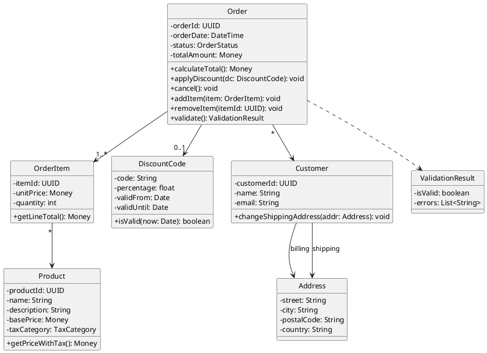
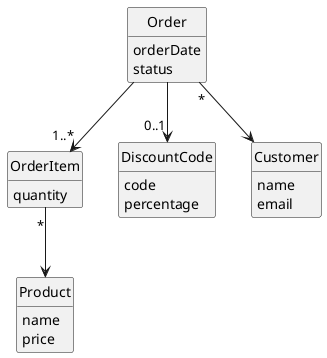

# Agenda

1. Quick recap
1. What are class diagrams?
1. Core elements of class diagrams
1. Associations, multiplicity & composition
1. Advanced concepts (generalization, interfaces, dependencies)
1. **Interactive exercise 1:** Identify model elements
1. Design heuristics and good practices
1. **Interactive exercise 2:** Build a small class model
1. Wrap-up & next steps

::: notes
Mention the break time (around 50 minutes in). Emphasize there will be both conceptual and hands-on parts.
:::

---

# Recap from Last Class

- Why modeling is crucial
- How abstraction helps communication
- First exposure to diagrams (morning routine exercise)

**Today:** move from informal to formal models.

::: notes
Use this as a transition slide. Ask students: what do they remember from last time?
:::

---

# What is a Class Diagram?

- **Purpose:** describes the *static structure* of a system
- **Main elements:** classes, attributes, operations, relationships
- **Used for:**
  - Domain modeling
  - Design-level documentation
  - Communication between stakeholders

::: notes
Show a simple example of a class diagram and explain each symbol intuitively.
:::

---

# Sample class diagram


---

# Core Elements

| Concept | Description | Example |
|----------|--------------|----------|
| **Class** | Blueprint for objects | `Book`, `Student` |
| **Attribute** | Property of a class | `title: String`, `age: Integer` |
| **Operation** | Behavior of a class | `borrowBook()`, `calculateFine()` |
| **Visibility** | Access modifier | `+ public` |
|                |                 | `- private`|
|                |                 | `# protected` |
|                |                 | `~ package` |

Attribute ::= visibility name: type multiplicity = default {props}

Operation ::= visibility name(parameter-list): return-type {props}

Parameter ::= direction name: type = default_value

::: notes
Explain that classes in UML represent both data and behavior. Show how visibility affects encapsulation.
:::

<!-- ---

# Example – Book class

```plantuml
'| label: fig-book
'| class: important
'| caption: Library System - Book Class Diagram
'| filename: book
'| height: 70%
@startuml

'''' Declarations to stylize the diagram ''''
hide circle

skinparam classFontStyle bold

skinparam classAttributeIconSize 0

' Core class: Book
class Book {
    - isbn : String
    - title : String
    - author : String
    - publisher : String
    - publicationYear : int
    - genre : String
    - availableCopies : int

    + getDetails() : String
    + borrowBook() : boolean
    + calculateFine() : int
    + returnBook() : void
    - updateAvailability(change: int) : void
    # validateBookCondition() : boolean
}
@enduml
``` -->

---

# Associations

- Represent *relationships* between classes
- Can have:
  - **Roles**: names describing relationship ends
  - **Multiplicity**: number of instances
  - **Navigability**: direction of the relationship

**Properties vs Associations:**

:::::::::::::: {.columns}
::: {.column width="30%"}
![Properties](images/order-using-attrs.png)
:::
::: {.column width="70%"}
![Associations](images/order-using-associations.png)
:::
::::::::::::::


<!--
```plantuml
'| label: fig-borrow
'| class: important
'| caption: Library System - Book Class Diagram
'| filename: borrow
'| height: 50%
@startuml

'''' Declarations to stylize the diagram ''''
hide circle
hide empty members

skinparam classFontStyle bold

skinparam classAttributeIconSize 0

' Core class: Book

Student "1" -- "0..5" Book : borrows

@enduml
``` -->

::: notes
Draw live on board or with diagram tool. Highlight how multiplicities guide implementation.
:::

---

# Bidirectional Associations

- Pair of properties which are linked together as inverses

![A bidirectional association](images/bidirectional.png)

If I start with a car, take its `owner`, then take the `cars` property of the owner,
then I should find the original car among those cars.

![Another way to show a bidirectional association](images/bidirectional-2.png)

---

# Aggregation vs Composition

- **Aggregation ($\Diamond$)**: “has-a” relationship, but parts can exist independently

  ```plantuml
  '| label: fig-dept
  '| class: important
  '| filename: dept
  '| height: 25%
  @startuml

  hide empty members
  '''' Declarations to stylize the diagram ''''
  hide circle

  skinparam classFontStyle bold

  skinparam classAttributeIconSize 0

  ' Core class: Book
  left to right direction


  Department "1" o--> "0..*" Professor

  @enduml
  ```

- **Composition ($\blacklozenge$)**: “owns-a” relationship, parts die with the whole

  ```plantuml
  '| label: fig-car
  '| class: important
  '| filename: car
  '| height: 25%
  @startuml

  hide empty members
  '''' Declarations to stylize the diagram ''''
  hide circle

  skinparam classFontStyle bold

  skinparam classAttributeIconSize 0

  ' Core class: Book
  left to right direction


  Car *--> Engine

  @enduml
  ```

::: notes
Ask students for more examples. Stress lifetime dependency difference.
:::

---

# Generalization and Interfaces

- **Generalization:** inheritance between classes

  ```plantuml
  '| height: 30%
  @startuml
  hide circle
  hide empty members
  class User
  class Student
  class Professor

  User <|-- Student
  User <|-- Professor
  @enduml
  ```

- **Implementation** of an interface

  ```plantuml
  '| height: 30%
  @startuml
  hide circle
  skinparam classAttributeIconSize 0
  interface Borrowable {
    + borrow()
  }
  class Book {
    + borrow()
  }
  class DVD {
    + borrow()
  }

  Borrowable <|.. Book
  Borrowable <|.. DVD
  @enduml
  ```

::: notes
Discuss how generalization promotes reuse, but should be used carefully to avoid deep hierarchies.
:::

---

# Dependencies

- A dependency exists between two elements if
  - changes to the definition of one element (the supplier or target)
  - may cause changes to the other (the client or source).
- Indicated with a dashed arrow

```plantuml
'| width: 80%
@startuml
hide empty members
hide circle
left to right direction
class LibraryService
class EmailNotifier

LibraryService ..> EmailNotifier
@enduml
```



::: notes
Point out how dependencies reflect code coupling and design maintainability.
:::

---

# Example – Interfaces and abstract classes in Java


{height=15%}


---

# Interactive Exercise 1: Spot the Elements

```UML
Class: Library
 - name: String
 - books: List<Book>
 + addBook(b: Book)
 + findBook(title: String): Book

Class: Book
 - title: String
 - author: String
 + borrow()
 + return()
```

**Task (5 minutes):** Identify classes, attributes, operations, and their relationships.

::: notes
Discuss as a group afterward—students should recognize an association between `Library` and `Book`.
:::

---

# Design Heuristics & Good Practices

- Favor composition over inheritance
- Keep diagrams readable (<20 classes per diagram)
- Use consistent naming conventions
- Model only what’s necessary
- Document assumptions and constraints

::: notes
Provide examples of overcomplicated class diagrams and simplified ones. Emphasize clarity.
:::

---

# Example – over-complicated diagram



---

# Example – Simplified (conceptual) diagram




---

# Interactive Exercise 2: Build a Class Diagram

**Scenario:** Online food delivery system.

- Entities: `Customer`, `Restaurant`, `Order`, `MenuItem`, `DeliveryDriver`
- Operations: place order, assign driver, calculate total

**Task (15 minutes):**

- Form small groups
- Sketch a class diagram
- Show associations, multiplicities, and at least one inheritance relationship

**Then:** Present and discuss different design choices.

::: notes
Walk around as they work, guide them gently, and discuss design trade-offs when presenting results.
:::

---

# Wrap-Up

**Today’s takeaways:**

- Class diagrams model the structure of systems
- Associations and multiplicities matter
- Composition, inheritance, and dependencies define relationships
- Modeling requires balance: detail vs. clarity

**Next class:** requirements analysis

::: notes
End with encouragement. Suggest reading or exploring the corresponding section in the GitHub repo.
:::
